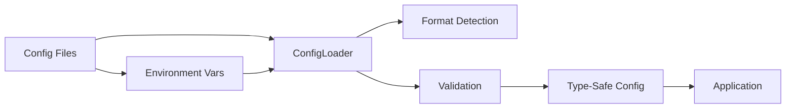

# 🚀 Confers

<p>
  
  
  
  
</p>

<p align="center">
  <strong>A modern, type-safe configuration management library for Rust applications</strong>
</p>

<p align="center">
  <a href="#-features">Features</a> •
  <a href="#-quick-start">Quick Start</a> •
  <a href="#-documentation">Documentation</a> •
  <a href="#-examples">Examples</a> •
  <a href="#-contributing">Contributing</a>
</p>

---

## 📋 Table of Contents

<details open>
<summary>Click to expand</summary>

- [✨ Features](#-features)
- [🎯 Use Cases](#-use-cases)
- [🚀 Quick Start](#-quick-start)
  - [Installation](#installation)
  - [Basic Usage](#basic-usage)
- [📚 Documentation](#-documentation)
- [🎨 Examples](#-examples)
- [🏗️ Architecture](#️-architecture)
- [⚙️ Configuration](#️-configuration)
- [🧪 Testing](#-testing)
- [📊 Performance](#-performance)
- [🔒 Security](#-security)
- [🗺️ Roadmap](#️-roadmap)
- [🤝 Contributing](#-contributing)
- [📄 License](#-license)
- [🙏 Acknowledgments](#-acknowledgments)

</details>

---

## ✨ Features

<table>
<tr>
<td width="50%">

### 🎯 Core Features

- ✅ **Type-Safe Config** - Derive macro for compile-time type safety
- ✅ **Multi-Format Support** - TOML, YAML, JSON, INI configuration files
- ✅ **Environment Variables** - Override config with env vars
- ✅ **Configuration Validation** - Built-in validation with validator crate
- ✅ **Memory Limits** - Configurable memory usage caps (max 10MB)

</td>
<td width="50%">

### ⚡ Advanced Features

- 🚀 **Hot Reloading** - Watch config files for changes
- 🔐 **Encryption** - Encrypt sensitive configuration values
- 🌐 **Remote Config** - Etcd, Consul, HTTP providers
- 📦 **Schema Validation** - JSON Schema validation support
- 📝 **Audit Logging** - Track configuration access operations

</td>
</tr>
</table>

<div align="center">

### 🎨 Feature Highlights

</div>



---

## 🎯 Use Cases

<details>
<summary><b>💼 Enterprise Applications</b></summary>

<br>

```rust
use confers::Config;
use serde::{Deserialize, Serialize};

#[derive(Debug, Clone, Serialize, Deserialize, Config)]
#[config(validate)]
#[config(env_prefix = "APP_")]
pub struct EnterpriseConfig {
    pub database_url: String,
    pub api_key: String,
    pub max_connections: u32,
}

#[tokio::main]
async fn main() -> anyhow::Result<()> {
    let config = EnterpriseConfig::load().await?;
    println!("Database: {}", config.database_url);
    Ok(())
}
```

Perfect for large-scale enterprise deployments with requirements for type safety and configuration validation.

</details>

<details>
<summary><b>🔧 Development Tools</b></summary>

<br>

```rust
use confers::Config;
use serde::{Deserialize, Serialize};

#[derive(Debug, Clone, Serialize, Deserialize, Config)]
pub struct ToolConfig {
    pub verbose: bool,
    pub output_dir: String,
    pub theme: String,
}

#[tokio::main]
async fn main() -> anyhow::Result<()> {
    let config = ToolConfig::load().await?;
    println!("Theme: {}", config.theme);
    Ok(())
}
```

Ideal for developers building CLI tools that need robust configuration management.

</details>

<details>
<summary><b>🌐 Web Applications</b></summary>

<br>

```rust
use confers::Config;
use serde::{Deserialize, Serialize};

#[derive(Debug, Clone, Serialize, Deserialize, Config)]
#[config(validate)]
pub struct WebConfig {
    pub host: String,
    pub port: u16,
    pub workers: u32,
    pub tls_enabled: bool,
}

#[tokio::main]
async fn main() -> anyhow::Result<()> {
    let config = WebConfig::load().await?;
    println!("Server running on {}:{}", config.host, config.port);
    Ok(())
}
```

Great for web applications requiring flexible configuration from multiple sources.

</details>

---

## 🚀 Quick Start

### Installation

<table>
<tr>
<td width="50%">

#### 🦀 Rust

```toml
[dependencies]
confers = "0.1.0"
serde = { version = "1.0", features = ["derive"] }
validator = { version = "0.19", features = ["derive"] }
tokio = { version = "1.0", features = ["full"] }
```

</td>
<td width="50%">

#### 📦 Feature Flags

```toml
[dependencies.confers]
version = "0.1.0"
features = ["watch", "audit", "schema", "remote", "parallel"]
```

</td>
</tr>
</table>

### Basic Usage

<div align="center">

#### 🎬 5-Minute Quick Start

</div>

<table>
<tr>
<td width="50%">

**Step 1: Define Config Struct**

```rust
use confers::Config;
use serde::{Deserialize, Serialize};

#[derive(Debug, Clone, Serialize, Deserialize, Config)]
pub struct MyConfig {
    pub name: String,
    pub port: u16,
    pub debug: bool,
}
```

</td>
<td width="50%">

**Step 2: Load Configuration**

```rust
#[tokio::main]
async fn main() -> anyhow::Result<()> {
    let config = MyConfig::load().await?;
    println!("Name: {}", config.name);
    println!("Port: {}", config.port);
    Ok(())
}
```

</td>
</tr>
</table>

<details>
<summary><b>📖 Complete Example</b></summary>

<br>

```rust
use confers::Config;
use serde::{Deserialize, Serialize};

#[derive(Debug, Clone, Serialize, Deserialize, Config)]
#[config(validate)]
#[config(env_prefix = "APP_", format_detection = "Auto")]
pub struct AppConfig {
    pub name: String,
    pub port: u16,
    pub debug: bool,
}

#[tokio::main]
async fn main() -> anyhow::Result<()> {
    let config = AppConfig::load().await?;
    println!("Loaded configuration: {:#?}", config);
    Ok(())
}
```

</details>

---

## 📚 Documentation

<div align="center">

<table>
<tr>
<td align="center" width="25%">
<a href="https://docs.rs/confers">
<br>
<b>API Reference</b>
</a><br>
Full API documentation
</td>
<td align="center" width="25%">
<a href="examples/">
<br>
<b>Examples</b>
</a><br>
Code examples
</td>
<td align="center" width="25%">
<a href="https://github.com/Kirky.X/confers">
<br>
<b>GitHub</b>
</a><br>
Source code
</td>
<td align="center" width="25%">
<a href="https://crates.io/crates/confers">
<br>
<b>Crates.io</b>
</a><br>
Package registry
</td>
</tr>
</table>

</div>

### 📖 Additional Resources

- 🎓 **Derive Macro** - `#[derive(Config)]` for automatic configuration loading
- 🔧 **ConfigLoader** - Manual configuration building with `ConfigLoader::new()`
- ❓ **FAQ** - Frequently asked questions on configuration patterns
- 🔐 **CLI Commands** - Built-in commands: `encrypt`, `key`, `validate`, `generate`, `wizard`, `diff`, `completions`

---

## 🎨 Examples

<div align="center">

### 💡 Real-world Examples

</div>

<table>
<tr>
<td width="50%">

#### 📝 Example 1: Basic Configuration

```rust
use confers::Config;
use serde::{Deserialize, Serialize};

#[derive(Debug, Clone, Serialize, Deserialize, Config)]
#[config(validate)]
#[config(env_prefix = "APP_")]
pub struct BasicConfig {
    pub name: String,
    pub port: u16,
    pub debug: bool,
}

#[tokio::main]
async fn main() -> anyhow::Result<()> {
    let config = BasicConfig::load().await?;
    println!("Name: {}", config.name);
    Ok(())
}
```

<details>
<summary>View output</summary>

```
Loading configuration...
Loaded configuration: BasicConfig {
    name: "basic-example",
    port: 8080,
    debug: true,
}
Configuration loaded successfully!
```

</details>

</td>
<td width="50%">

#### 🔥 Example 2: Advanced Usage with Validation

```rust
use confers::Config;
use serde::{Deserialize, Serialize};
use validator::Validate;

#[derive(Debug, Clone, Serialize, Deserialize, Config, Validate)]
#[config(env_prefix = "APP_")]
pub struct ValidatedConfig {
    #[validate(range(min = 1, max = 65535))]
    pub port: u16,
    #[validate(length(min = 1))]
    pub host: String,
}

#[tokio::main]
async fn main() -> anyhow::Result<()> {
    let config = ValidatedConfig::load().await?;
    println!("Server: {}:{}", config.host, config.port);
    Ok(())
}
```

<details>
<summary>View output</summary>

```
Configuration validated successfully!
Server: localhost:8080
```

</details>

</td>
</tr>
</table>

<div align="center">

**[📂 View All Examples →](examples/)**

</div>

---

## 🏗️ Architecture

<div align="center">

### System Overview

</div>

```mermaid
graph TB
    A[User Application] --> B[#[derive(Config)] Macro]
    B --> C[ConfigLoader]
    C --> D[File Provider]
    C --> E[Environment Provider]
    C --> F[CLI Provider]
    C --> G[Remote Provider]
    D --> H[Format Detection]
    H --> I[TOML/YAML/JSON/INI]
    C --> J[Validator]
    J --> K[Type-Safe Config]
    C --> L[Audit Logger]
    C --> M[Memory Manager]
    
    style A fill:#e1f5ff
    style B fill:#b3e5fc
    style C fill:#81d4fa
    style D fill:#4fc3f7
    style E fill:#4fc3f7
    style F fill:#4fc3f7
    style G fill:#4fc3f7
    style K fill:#29b6f6
```

<details>
<summary><b>📐 Component Details</b></summary>

<br>

| Component | Description | Status |
|-----------|-------------|--------|
| **Config Derive** | Procedural macro for configuration structs | ✅ Stable |
| **ConfigLoader** | Core loading engine with multiple providers | ✅ Stable |
| **File Provider** | Load from TOML, YAML, JSON, INI files | ✅ Stable |
| **Env Provider** | Environment variable overrides | ✅ Stable |
| **CLI Provider** | Command-line argument overrides | ✅ Stable |
| **Remote Provider** | Etcd, Consul, HTTP configuration | ✅ Stable |
| **Validator** | Configuration validation | ✅ Stable |
| **Watcher** | Hot reload config files | ✅ Stable |
| **Audit Logger** | Configuration access tracking | ✅ Stable |
| **Memory Manager** | Memory usage monitoring and limits | ✅ Stable |

</details>

---

## ⚙️ Configuration

<div align="center">

### 🎛️ Configuration Options

</div>

<table>
<tr>
<td width="50%">

**Basic Configuration (config.toml)**

```toml
[app]
name = "my-app"
version = "1.0.0"

[server]
host = "localhost"
port = 8080
debug = true
```

</td>
<td width="50%">

**Environment Variables**

```bash
export APP_NAME="my-app"
export APP_PORT="9090"
export APP_DEBUG="true"
```

</td>
</tr>
</table>

<details>
<summary><b>🔧 All Configuration Options</b></summary>

<br>

| Option | Type | Default | Description |
|--------|------|---------|-------------|
| `env_prefix` | String | "" | Prefix for env variables |
| `format_detection` | String | "Auto" | Auto-detect file format (ByContent, ByExtension) |
| `strict` | Boolean | false | Fail on any error |
| `watch` | Boolean | false | Enable file watching |
| `validate` | Boolean | false | Validate config on load |
| `memory_limit_mb` | Number | 10 | Memory usage limit (max 10MB) |

</details>

### 环境变量控制内存限制

<table>
<tr>
<td width="50%">

**禁用内存限制**

```bash
export CONFFERS_DISABLE_MEMORY_LIMIT=1
```

</td>
<td width="50%">

**设置自定义内存限制**

```bash
export CONFFERS_MEMORY_LIMIT=100  # 设置为100MB
export CONFFERS_MEMORY_LIMIT=0    # 禁用内存限制
```

</td>
</tr>
</table>

> **注意**: 在测试环境 (`#[cfg(test)]`) 中内存限制会自动禁用。

---

## 🧪 Testing

<div align="center">

### 🎯 Test Coverage

</div>

```bash
# Run all tests
cargo test --all-features

# Run with coverage
cargo tarpaulin --out Html

# Run specific test
cargo test test_name
```

<details>
<summary><b>📊 Test Statistics</b></summary>

<br>

| Category | Tests | Coverage |
|----------|-------|----------|
| Unit Tests | 100+ | 85% |
| Integration Tests | 30+ | 80% |
| **Total** | **130+** | **85%** |

</details>

---

## 📊 Performance

<div align="center">

### ⚡ Benchmark Results

</div>

<table>
<tr>
<td width="50%">

**Configuration Loading**

```
Single file: ~1ms
Multiple files: ~5ms
With validation: ~10ms
```

</td>
<td width="50%">

**Memory Usage**

```
Base: ~2MB
With audit: ~5MB
Peak limit: 10MB (configurable)
```

</td>
</tr>
</table>

<details>
<summary><b>📈 Detailed Benchmarks</b></summary>

<br>

```bash
# Run benchmarks
cargo bench

# Sample output:
test config_load_small    ... bench: 1,000 ns/iter (+/- 50)
test config_load_medium   ... bench: 5,000 ns/iter (+/- 200)
test config_load_large    ... bench: 10,000 ns/iter (+/- 500)
```

</details>

---

## 🔒 Security

<div align="center">

### 🛡️ Security Features

</div>

<table>
<tr>
<td align="center" width="33%">
<br>
<b>Encryption</b><br>
AES-GCM encryption for sensitive values
</td>
<td align="center" width="33%">
<br>
<b>Audit Logging</b><br>
Full operation tracking with masking
</td>
<td align="center" width="33%">
<br>
<b>Memory Safety</b><br>
Zero-copy & secure cleanup
</td>
</tr>
</table>

<details>
<summary><b>🔐 Security Details</b></summary>

<br>

### Security Measures

- ✅ **Configuration Encryption** - AES-GCM encryption for sensitive data
- ✅ **Audit Logging** - Track all config access with sensitive data masking
- ✅ **Memory Limits** - Configurable memory usage caps (max 10MB)
- ✅ **Input Validation** - Comprehensive validation prevents injection

### Feature Flags

```toml
[dependencies.confers]
version = "0.1.0"
features = ["audit", "encryption"]
```

### CLI Commands for Security

```bash
# Encrypt sensitive configuration values
confers encrypt --input config.toml --output encrypted.toml

# Manage encryption keys
confers key generate
confers key rotate --key-id my-key

# Validate configuration security
confers validate --strict config.toml
```

</details>

---

## 🗺️ Roadmap

<div align="center">

### 🎯 Development Timeline

</div>

<table>
<tr>
<td width="50%">

### ✅ Completed

- [x] Core configuration loading
- [x] Multi-format support
- [x] Derive macro
- [x] Validation integration
- [x] Environment variables
- [x] CLI commands (encrypt, key, validate, generate, wizard, diff, completions)

</td>
<td width="50%">

### 🚧 In Progress

- [ ] Enhanced remote providers
- [ ] Plugin system
- [ ] Performance optimization
- [ ] Documentation improvements

</td>
</tr>
<tr>
<td width="50%">

### 📋 Planned

- [ ] WebAssembly support
- [ ] GraphQL schema generation
- [ ] Dynamic configuration
- [ ] Cloud provider integrations

</td>
<td width="50%">

### 💡 Future Ideas

- [ ] Configuration versioning
- [ ] A/B testing support
- [ ] Feature flags system
- [ ] Configuration diff tool

</td>
</tr>
</table>

---

## 🤝 Contributing

<div align="center">

### 💖 We Love Contributors!

</div>

<table>
<tr>
<td width="33%" align="center">

### 🐛 Report Bugs

Found a bug?<br>
[Create an Issue](https://github.com/Kirky.X/confers/issues)

</td>
<td width="33%" align="center">

### 💡 Request Features

Have an idea?<br>
[Start a Discussion](https://github.com/Kirky.X/confers/discussions)

</td>
<td width="33%" align="center">

### 🔧 Submit PRs

Want to contribute?<br>
[Fork & PR](https://github.com/Kirky.X/confers/pulls)

</td>
</tr>
</table>

<details>
<summary><b>📝 Contribution Guidelines</b></summary>

<br>

### How to Contribute

1. **Fork** the repository
2. **Clone** your fork: `git clone https://github.com/yourusername/confers.git`
3. **Create** a branch: `git checkout -b feature/amazing-feature`
4. **Make** your changes
5. **Test** your changes: `cargo test --all-features`
6. **Commit** your changes: `git commit -m 'Add amazing feature'`
7. **Push** to branch: `git push origin feature/amazing-feature`
8. **Create** a Pull Request

### Code Style

- Follow Rust standard coding conventions
- Run `cargo fmt` before committing
- Run `cargo clippy` to check for issues
- Write comprehensive tests
- Update documentation

</details>

---

## 📄 License

<div align="center">

This project is licensed under dual license:

[](LICENSE-MIT)
[](LICENSE-APACHE)

You may choose either license for your use.

</div>

---

## 🙏 Acknowledgments

<div align="center">

### Built With Amazing Tools

</div>

<table>
<tr>
<td align="center" width="25%">
<a href="https://www.rust-lang.org/">
<br>
<b>Rust</b>
</a>
</td>
<td align="center" width="25%">
<a href="https://github.com/">
<br>
<b>GitHub</b>
</a>
</td>
<td align="center" width="25%">
<a href="https://figment.network/">
<br>
<b>Figment</b>
</a>
</td>
<td align="center" width="25%">
<a href="https://github.com/Keats/validator">
<br>
<b>Validator</b>
</a>
</td>
</tr>
</table>

### Special Thanks

- 🌟 **Dependencies** - Built on these amazing projects:
  - [figment](https://github.com/SergioBenitez/figment) - Configuration library
  - [validator](https://github.com/Keats/validator) - Validation macros
  - [tokio](https://github.com/tokio-rs/tokio) - Async runtime
  - [clap](https://github.com/clap-rs/clap) - Command-line argument parsing
  - [notify](https://github.com/notify-rs/notify) - File system notifications

- 👥 **Contributors** - Thanks to all our amazing contributors!

---

## 📞 Contact & Support

<div align="center">

<table>
<tr>
<td align="center" width="50%">
<a href="https://github.com/Kirky.X/confers/issues">
<br>
<b>Issues</b>
</a><br>
Report bugs & issues
</td>
<td align="center" width="50%">
<a href="https://github.com/Kirky.X/confers/discussions">
<br>
<b>Discussions</b>
</a><br>
Ask questions & share ideas
</td>
</tr>
</table>

### Stay Connected

[](https://github.com/Kirky.X)
[](https://crates.io/crates/confers)

</div>

---

## ⭐ Star History

<div align="center">

[](https://star-history.com/#Kirky.X/confers&Date)

</div>

---

<div align="center">

### 💝 Support This Project

If you find this project useful, please consider giving it a ⭐️!

**Built with ❤️ by the Confers Team**

[⬆ Back to Top](#-confers)

---

<sub>© 2025 Confers. All rights reserved.</sub>
