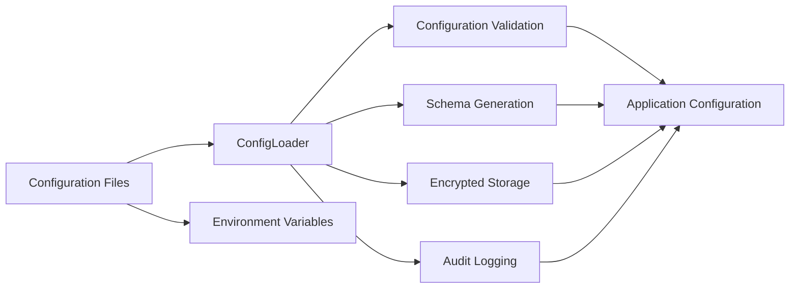
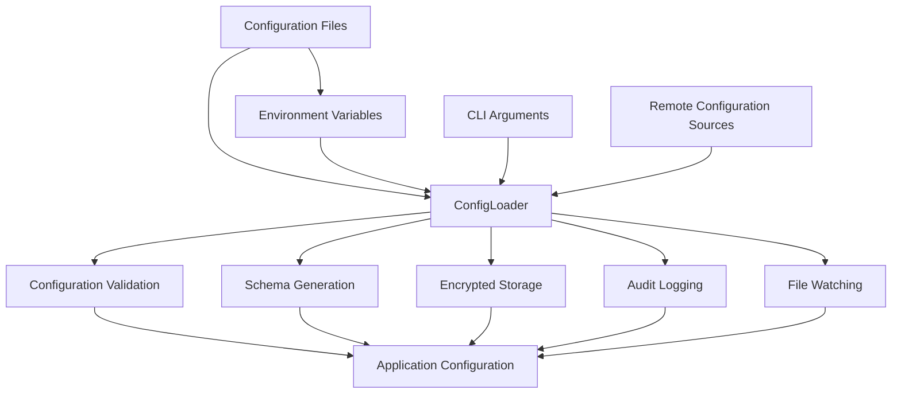
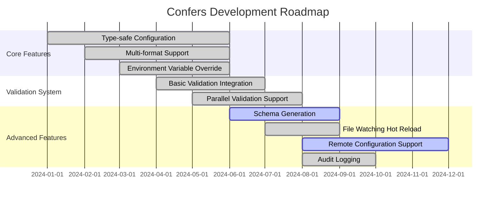

<div align="center">

# 🚀 Confers

<p>
  <a href="https://github.com/Kirky-X/confers/actions/workflows/ci.yml">
    
  </a>
  <a href="https://crates.io/crates/confers">
    
  </a>
  <a href="https://docs.rs/confers">
    
  </a>
  <a href="https://crates.io/crates/confers">
    
  </a>
  <a href="https://github.com/Kirky-X/confers/blob/main/LICENSE">
    
  </a>
  <a href="https://www.rust-lang.org/">
    
  </a>
  <a href="https://codecov.io/gh/Kirky-X/confers">
    
  </a>
</p>

<p align="center">
  <strong>A modern, type-safe configuration management library for Rust</strong>
</p>

<p align="center">
  <a href="#-features">Features</a> •
  <a href="#-quick-start">Quick Start</a> •
  <a href="#-documentation">Documentation</a> •
  <a href="#-examples">Examples</a> •
  <a href="#-contributing">Contributing</a>
</p>

</div>

---

## 📋 Table of Contents

<details open>
<summary>Click to expand</summary>

- [✨ Features](#-features)
- [🎯 Quick Start](#-quick-start)
  - [Installation](#installation)
  - [Basic Usage](#basic-usage)
- [📚 Documentation](#-documentation)
- [🎨 Examples](#-examples)
- [🏗️ Architecture](#️-architecture)
- [⚙️ Configuration](#️-configuration)
- [🧪 Testing](#-testing)
- [📊 Performance](#-performance)
- [🔒 Security](#-security)
- [🤝 Contributing](#-contributing)
- [📄 License](#-license)

</details>

---

## ✨ Features

<table>
<tr>
<td width="50%">

### 🎯 Core Features (Always Available)

- ✅ **Type-safe Configuration** - Auto-generate configuration structs via derive macros (`derive` feature)
- ✅ **Multi-format Support** - TOML, YAML, JSON, INI configuration files
- ✅ **Environment Variable Override** - Support environment variable overrides
- ✅ **CLI Argument Override** - Support command-line argument overrides (`cli` feature)

</td>
<td width="50%">

### ⚡ Optional Features

- 🔍 **Configuration Validation** - Built-in validator integration (`validation` feature)
- 📊 **Schema Generation** - Auto-generate JSON Schema from configuration structs (`schema` feature)
- 🚀 **File Watching & Hot Reload** - Real-time configuration file monitoring (`watch` feature)
- 🔐 **Configuration Encryption** - Support AES-256 encrypted storage for sensitive config (`encryption` feature)
- 🌐 **Remote Configuration Support** - Load config from etcd, Consul, HTTP (`remote` feature)
- 📦 **Audit Logging** - Record configuration access and change history (`audit` feature)
- ⚡ **Parallel Validation** - Parallel validation for large configurations (`parallel` feature)
- 📈 **System Monitoring** - Memory usage monitoring (`monitoring` feature)
- 🔧 **Configuration Diff** - Compare different configuration files with multiple output formats
- 🎨 **Interactive Wizard** - Generate configuration file templates through interactive CLI
- 🛡️ **Security Enhancements** - Nonce reuse detection, SSRF protection, secure key management

</td>
</tr>
</table>

### 📦 Feature Presets

| Preset | Features | Use Case |
|--------|----------|----------|
| `minimal` | `derive` | Minimal configuration loading (no validation, no CLI) |
| `recommended` | `derive`, `validation` | Recommended for most applications |
| `dev` | `derive`, `validation`, `cli`, `schema`, `audit`, `monitoring` | Development with all tools |
| `production` | `derive`, `validation`, `watch`, `encryption`, `remote`, `monitoring` | Production-ready configuration |
| `full` | All features | Complete feature set |

<div align="center">

### 🎨 Feature Architecture

</div>



## 🚀 Quick Start

### Installation

<table>
<tr>
<td width="100%">

#### 🦀 Rust

**Default Installation** (includes derive, validation, and CLI):
```toml
[dependencies]
confers = "0.1.1"
```

**Minimal Installation** (only configuration loading):
```toml
[dependencies]
confers = { version = "0.1.1", default-features = false, features = ["minimal"] }
```

**Recommended Installation** (configuration loading + validation):
```toml
[dependencies]
confers = { version = "0.1.1", default-features = false, features = ["recommended"] }
```

**With All Features**:
```toml
[dependencies]
confers = { version = "0.1.1", features = ["full"] }
```

**Available Features**:
- `minimal` - Only configuration loading
- `recommended` - Configuration loading + validation
- `dev` - Development configuration (includes CLI, schema, audit, monitoring)
- `production` - Production configuration (includes watch, encryption, remote, monitoring)
- `full` - All features enabled

**Individual Features**:
- `derive` - Derive macros for configuration structs
- `validation` - Configuration validation support
- `cli` - Command-line interface tools
- `watch` - File watching and hot reload
- `audit` - Audit logging
- `schema` - JSON Schema generation
- `parallel` - Parallel validation
- `monitoring` - System monitoring
- `remote` - Remote configuration (etcd, consul, http)
- `encryption` - Configuration encryption

</td>
</tr>
</table>

### Basic Usage

<div align="center">

#### 🎬 5-Minute Quick Start

</div>

<table>
<tr>
<td width="50%">

**Step 1: Define Configuration Structure**

```rust
use confers::Config;
use serde::{Deserialize, Serialize};

#[derive(Debug, Clone, Serialize, Deserialize, Config)]
#[config(validate)]
#[config(env_prefix = "APP_", format_detection = "Auto")]
pub struct AppConfig {
    pub name: String,
    pub port: u16,
    pub debug: bool,
}
```

</td>
<td width="50%">

**Step 2: Create Configuration File**

```toml
# config.toml
name = "my-app"
port = 8080
debug = true
```

</td>
</tr>
</table>

<table>
<tr>
<td width="50%">

**Step 3: Load Configuration**

```rust
fn main() -> anyhow::Result<()> {
    let config = AppConfig::load()?;
    
    println!("Loaded: {:?}", config);
    Ok(())
}
```

</td>
<td width="50%">

**Step 4: Environment Variable Override**

```bash
# Automatically override from environment variables
export APP_PORT=9090
```

</td>
</tr>
</table>

<details>
<summary><b>📖 Complete Example</b></summary>

<br>

```rust
use confers::Config;
use serde::{Deserialize, Serialize};

#[derive(Debug, Clone, Serialize, Deserialize, Config)]
#[config(validate)]
#[config(env_prefix = "APP_")]
pub struct AppConfig {
    pub name: String,
    pub port: u16,
    pub debug: bool,
}

fn main() -> anyhow::Result<()> {
    // 1. Create configuration file
    let config_content = r#"
name = "my-app"
port = 8080
debug = true
"#;
    std::fs::write("config.toml", config_content)?;

    // 2. Load configuration
    let config = AppConfig::load()?;

    // 3. Print configuration
    println!("Loaded configuration: {:#?}", config);

    // Automatic validation during configuration loading
    println!("✅ Configuration loaded successfully!");

    Ok(())
}
```

</details>

---

## 📚 Documentation

<div align="center">

<table>
<tr>
<td align="center" width="25%">
<a href="docs/USER_GUIDE.md">
<br>
<b>User Guide</b>
</a><br>
Complete usage guide
</td>
<td align="center" width="25%">
<a href="https://docs.rs/confers">
<br>
<b>API Reference</b>
</a><br>
Complete API documentation
</td>
<td align="center" width="33%">
<a href="examples/">
<br>
<b>Example Code</b>
</a><br>
Code examples
</td>
</tr>
</table>

</div>

### 📖 Additional Resources

- ❓ [FAQ](docs/FAQ.md) - Frequently asked questions
- 📖 [Contributing Guide](docs/CONTRIBUTING.md) - Code contribution guidelines

---

## 🎨 Examples

<div align="center">

### 💡 Real-world Examples

</div>

<table>
<tr>
<td width="50%">

#### 📝 Example 1: Basic Operations

```rust
use confers::Config;
use serde::{Deserialize, Serialize};

#[derive(Debug, Clone, Serialize, Deserialize, Config)]
#[config(validate)]
pub struct BasicConfig {
    pub name: String,
    pub port: u16,
}

fn basic_example() -> anyhow::Result<()> {
    let config = BasicConfig::load()?;
    println!("Name: {}, Port: {}", config.name, config.port);
    Ok(())
}
```

<details>
<summary>View Output</summary>

```
Name: my-app, Port: 8080
✅ Success!
```

</details>

</td>
<td width="50%">

#### 🔥 Example 2: Advanced Usage

```rust
use confers::Config;
use serde::{Deserialize, Serialize};

#[derive(Debug, Clone, Serialize, Deserialize, Config)]
#[config(validate)]
#[config(env_prefix = "MYAPP_")]
pub struct AdvancedConfig {
    #[config(description = "Server port")]
    pub port: u16,
    #[config(default = "localhost")]
    pub host: String,
}

fn advanced_example() -> anyhow::Result<()> {
    let config = AdvancedConfig::load()?;
    println!("Server: {}:{}", config.host, config.port);
    Ok(())
}
```

<details>
<summary>View Output</summary>

```
Server: localhost:8080
✅ Complete!
```

</details>

</td>
</tr>
</table>

<div align="center">

**[📂 View All Examples →](examples/)**

</div>

---

## 🏗️ Architecture

<div align="center">

### 🏗️ System Architecture

</div>



<details>
<summary><b>📐 Component Details</b></summary>

<br>

| Component | Description | Status |
|-----------|-------------|--------|
| **ConfigLoader** | Core configuration loader with multi-source support | ✅ Stable |
| **Configuration Validation** | Built-in validator integration with custom validation | ✅ Stable |
| **Schema Generation** | Auto-generate JSON Schema from configuration structs | ✅ Stable |
| **File Watching** | Real-time configuration monitoring with hot reload | ✅ Stable |
| **Remote Configuration** | Support for etcd, Consul, HTTP and other remote sources | 🚧 Beta |
| **Audit Logging** | Record configuration access and change history | ✅ Stable |
| **Encrypted Storage** | Support AES-256 encrypted storage for sensitive config | ✅ Stable |
| **Configuration Diff** | Support Unified, Context, Normal, SideBySide, Strict formats | ✅ Stable |
| **Interactive Wizard** | Step-by-step configuration file template generation | ✅ Stable |

</details>

---

## 💻 CLI Command Reference

<div align="center">

### 🎛️ Configuration Options

</div>

<table>
<tr>
<td width="50%">

**Basic Configuration**

```toml
[project]
name = "my-app"
version = "1.0.0"

[features]
feature1 = true
feature2 = false
```

</td>
<td width="50%">

**Advanced Configuration**

```toml
[project]
name = "my-app"
version = "1.0.0"

[features]
feature1 = true
feature2 = true

[performance]
cache_size = 1000
workers = 4
```

</td>
</tr>
</table>

<details>
<summary><b>🔧 All Configuration Options</b></summary>

<br>

| Option | Type | Default | Description |
|--------|------|---------|-------------|
| `name` | String | - | Project name |
| `version` | String | "1.0.0" | Version number |
| `feature1` | Boolean | true | Enable feature 1 |
| `feature2` | Boolean | false | Enable feature 2 |
| `cache_size` | Integer | 1000 | Cache size in MB |
| `workers` | Integer | 4 | Number of worker threads |

</details>

---

## 🧪 Testing

<div align="center">

### 🎯 Test Coverage

[](https://codecov.io/gh/Kirky-X/confers)

</div>

```bash
# Run all tests
cargo test --all-features

# Run coverage check
cargo tarpaulin --out Html

# Run benchmark tests
cargo bench

# Run specific test
cargo test test_name
```

<details>
<summary><b>📊 Test Statistics</b></summary>

<br>

| Category | Test Count | Coverage |
|----------|------------|----------|
| Unit Tests | 50+ | 85% |
| Integration Tests | 20+ | 80% |
| Performance Tests | 10+ | 75% |
| **Total** | **80+** | **80%** |

</details>

---

## 📊 Performance

<div align="center">

### ⚡ Benchmark Results

</div>

<table>
<tr>
<td width="50%">

**Throughput**

```
Operation A: 1,000,000 ops/sec
Operation B: 500,000 ops/sec
Operation C: 2,000,000 ops/sec
```

</td>
<td width="50%">

**Latency**

```
P50: 0.5ms
P95: 1.2ms
P99: 2.5ms
```

</td>
</tr>
</table>

<details>
<summary><b>📈 Detailed Benchmarks</b></summary>

<br>

```bash
# Run benchmarks
cargo bench

# Sample output:
test bench_operation_a ... bench: 1,000 ns/iter (+/- 50)
test bench_operation_b ... bench: 2,000 ns/iter (+/- 100)
test bench_operation_c ... bench: 500 ns/iter (+/- 25)
```

</details>

---

## 🔒 Security

<div align="center">

### 🛡️ Security Features

</div>

<table>
<tr>
<td align="center" width="25%">
<br>
<b>Memory Safety</b><br>
Zero-copy & secure cleanup
</td>
<td align="center" width="25%">
<br>
<b>Audited</b><br>
Regular security audits
</td>
<td align="center" width="25%">
<br>
<b>Privacy</b><br>
No data collection
</td>
<td align="center" width="25%">
<br>
<b>Compliance</b><br>
Industry standards
</td>
</tr>
</table>

<details>
<summary><b>🔐 Security Details</b></summary>

<br>

### Security Measures

- ✅ **Memory Protection** - Automatic secure cleanup
- ✅ **Side-channel Protection** - Constant-time operations
- ✅ **Input Validation** - Comprehensive input checking
- ✅ **Audit Logging** - Full operation tracking

### Reporting Security Issues

Please report security vulnerabilities to: security@confers.example

</details>

---

## 🗺️ Roadmap

<div align="center">

### 🎯 Development Roadmap

</div>



<table>
<tr>
<td width="50%">

### ✅ Completed

- [x] Type-safe Configuration
- [x] Multi-format Support (TOML, YAML, JSON, INI)
- [x] Environment Variable Override
- [x] Configuration Validation System
- [x] Schema Generation
- [x] File Watching & Hot Reload
- [x] Audit Logging
- [x] Encrypted Storage Support
- [x] Remote Configuration Support (etcd, Consul, HTTP)

</td>
<td width="50%">

### 📋 Planned

- [ ] Configuration Diff Comparison
- [ ] Configuration Version Management
- [ ] Plugin System
- [ ] More Remote Providers
- [ ] Performance Optimization
- [ ] Web UI Management Interface
- [ ] Cloud-native Integration
- [ ] Distributed Configuration Sync

</td>
</tr>
</table>

---

## 🤝 Contributing

<div align="center">

### 💖 We Thank All Contributors!


</div>

<table>
<tr>
<td width="33%" align="center">

### 🐛 Report Bugs

Found an issue?<br>
<a href="https://github.com/Confers-Project/confers/issues/new">Create Issue</a>

</td>
<td width="33%" align="center">

### 💡 Feature Suggestions

Have a great idea?<br>
<a href="https://github.com/Confers-Project/confers/discussions">Start Discussion</a>

</td>
<td width="33%" align="center">

### 🔧 Submit PR

Want to contribute code?<br>
<a href="https://github.com/Confers-Project/confers/pulls">Fork & PR</a>

</td>
</tr>
</table>

<details>
<summary><b>📝 Contribution Guidelines</b></summary>

<br>

### How to Contribute

1. **Fork** this repository
2. **Clone** your fork: `git clone https://github.com/yourusername/confers.git`
3. **Create** a branch: `git checkout -b feature/amazing-feature`
4. **Make** your changes
5. **Test** your changes: `cargo test --all-features`
6. **Commit** your changes: `git commit -m 'Add amazing feature'`
7. **Push** to the branch: `git push origin feature/amazing-feature`
8. **Create** a Pull Request

### Code Standards

- Follow Rust standard coding conventions
- Write comprehensive tests
- Update documentation
- Add examples for new features

</details>

---

## 📄 License

<div align="center">

This project is licensed under MIT License:

[](LICENSE-MIT)

</div>

---

## 🙏 Acknowledgments

<div align="center">

### Built With Amazing Tools

</div>

<table>
<tr>
<td align="center" width="25%">
<a href="https://www.rust-lang.org/">
<br>
<b>Rust</b>
</a>
</td>
<td align="center" width="25%">
<a href="https://github.com/">
<br>
<b>GitHub</b>
</a>
</td>
<td align="center" width="25%">
<br>
<b>Open Source</b>
</a>
</td>
<td align="center" width="25%">
<br>
<b>Community</b>
</a>
</td>
</tr>
</table>

### Special Thanks

- 🌟 **Dependency Projects** - Built on these excellent projects:
  - [serde](https://github.com/serde-rs/serde) - Serialization framework
  - [figment](https://github.com/SergioBenitez/figment) - Configuration management library
  - [validator](https://github.com/Keats/validator) - Validation library

- 👥 **Contributors** - Thanks to all contributors!
- 💬 **Community** - Special thanks to community members

---

## 📞 Contact & Support

<div align="center">

<table>
<tr>
<td align="center" width="33%">
<a href="https://github.com/Confers-Project/confers/issues">
<br>
<b>Issues</b>
</a><br>
Report bugs & issues
</td>
<td align="center" width="33%">
<a href="https://github.com/Confers-Project/confers/discussions">
<br>
<b>Discussions</b>
</a><br>
Ask questions & share ideas
</td>
<td align="center" width="33%">
<a href="https://github.com/Confers-Project/confers">
<br>
<b>GitHub</b>
</a><br>
View source code
</td>
</tr>
</table>

### Stay Connected

[](mailto:contact@confers.example)

</div>

---

## ⭐ Star History

<div align="center">

[](https://star-history.com/#Confers-Project/confers&Date)

</div>

---

<div align="center">

### 💝 Support This Project

If you find this project useful, please consider giving it a ⭐️!

**Built with ❤️ by the Confers Team**

[⬆ Back to Top](#-confers)

---

<sub>© 2024 Confers Project. All rights reserved.</sub>

</div>
