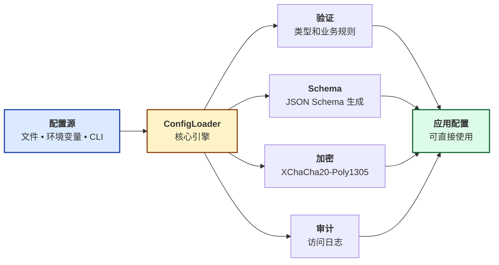
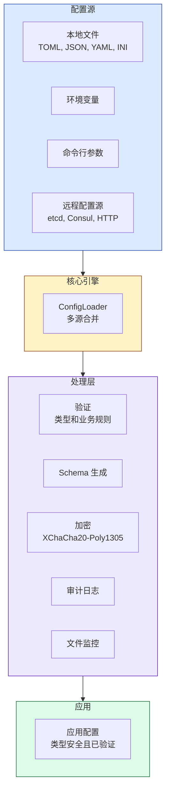
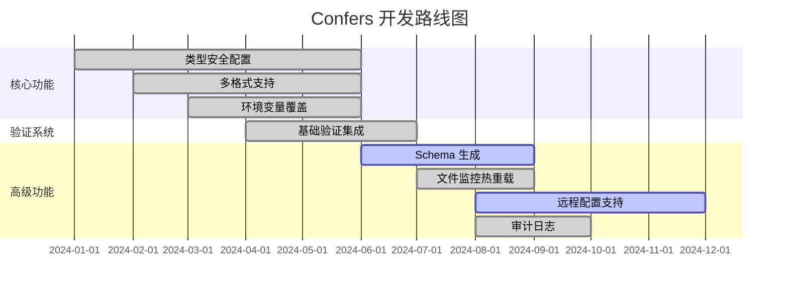

<div align="center">


[](https://github.com/Kirky-X/confers/actions/workflows/ci.yml) [](https://crates.io/crates/confers) [](https://docs.rs/confers) [](https://crates.io/crates/confers) [](LICENSE) [](https://www.rust-lang.org/) [](https://codecov.io/gh/Kirky-X/confers)

**中文** | [English](README_EN.md)

**生产级 Rust 配置库，零样板代码**

[✨ 功能特性](#-功能特性) • [🚀 快速开始](#-快速开始) • [📚 文档](#-文档) • [💻 示例](#-示例) • [🤝 参与贡献](#-参与贡献)

</div>

---

<!-- Hero Section -->

<div align="center" style="padding: 32px; margin: 24px 0">

### 🎯 零样板配置管理

Confers 提供**声明式方法**进行配置管理：

| ✨ 类型安全 | 🔄 自动重载 | 🔐 XChaCha20-Poly1305 加密 | 🌐 远程配置源 |
|:-------------:|:--------------:|:---------------------:|:-----------------:|
| 编译时检查 | 热重载支持 | 敏感数据保护 | etcd、Consul、HTTP |

</div>

---

## 📋 目录

<details open style="padding:16px">
<summary style="cursor:pointer; font-weight:600; color:#1E293B">📑 目录（点击展开）</summary>

- [📋 目录](#-目录)
- [✨ 功能特性](#-功能特性)
- [🚀 快速开始](#-快速开始)
  - [📦 安装](#-安装)
  - [💡 基本用法](#-基本用法)
- [🎨 特性标志](#-特性标志)
- [📚 文档](#-文档)
- [💻 示例](#-示例)
- [🏗️ 架构](#️-架构)
- [🤖 CLI 工具](#-cli-工具)
- [🧪 测试](#-测试)
- [📊 性能](#-性能)
- [🔒 安全](#-安全)
- [🗺️ 开发路线图](#️-开发路线图)
- [🤝 参与贡献](#-参与贡献)
- [📋 更新日志](#-更新日志)
- [📄 许可证](#-许可证)
- [🙏 致谢](#-致谢)
- [📞 联系与支持](#-联系与支持)
- [⭐ Star 历史](#-star-历史)

</details>

---

## ✨ 功能特性

| 🎯 核心功能 | ⚡ 可选功能 |
|:-----------------|:--------------------|
| 始终可用 | 按需启用 |

<table style="width:100%; border-collapse: collapse">
<tr>
<td width="50%" style="vertical-align:top; padding: 16px">

### 🎯 核心功能（始终可用）

| 状态 | 功能 | 描述 |
|:------:|---------|-------------|
| ✅ | **类型安全配置** | 通过派生宏自动生成配置结构体（`derive` 功能） |
| ✅ | **多格式支持** | 支持 TOML、YAML、JSON、INI 配置文件 |
| ✅ | **环境变量覆盖** | 支持环境变量覆盖配置 |
| ✅ | **命令行参数覆盖** | 支持命令行参数覆盖（`cli` 功能） |

</td>
<td width="50%" style="vertical-align:top; padding: 16px">

### ⚡ 可选功能

| 状态 | 功能 | 描述 |
|:------:|---------|-------------|
| 🔍 | **配置验证** | 内置验证器集成（`validation` 功能） |
| 📊 | **Schema 生成** | 自动生成 JSON Schema（`schema` 功能） |
| 🚀 | **文件监控与热重载** | 实时文件监控（`watch` 功能） |
| 🔐 | **配置加密** | XChaCha20-Poly1305 加密存储（`encryption` 功能） |
| 🌐 | **远程配置** | 支持 etcd、Consul、HTTP（`remote` 功能） |
| 📦 | **审计日志** | 记录访问和变更历史（`audit` 功能） |
| 🔧 | **配置对比** | 多种输出格式的配置比较 |
| 🛡️ | **安全增强** | Nonce 重用检测、SSRF 防护 |
| 🔑 | **密钥管理** | 内置密钥生成和轮换 |

</td>
</tr>
</table>

---

## 🚀 快速开始

### 📦 安装

#### 🦀 Rust 安装

| 安装方式 | 配置方式 | 使用场景 |
|-------------------|---------------|----------|
| **默认** | `confers = "0.6.0-rc.2"` | 包含 `toml`、`json`、`env`（默认特性） |
| **最小化** | `confers = { version = "0.6.0-rc.2", default-features = false, features = ["minimal"] }` | 环境变量 + JSON |
| **推荐** | `confers = { version = "0.6.0-rc.2", default-features = false, features = ["recommended"] }` | TOML + JSON + Env + 验证 |
| **CLI 工具** | `confers = { version = "0.6.0-rc.2", features = ["cli"] }` | CLI 工具（不含验证/加密） |
| **完整** | `confers = { version = "0.6.0-rc.2", features = ["full"] }` | 所有功能 |

### 💡 基本用法

#### 🎬 5 分钟快速入门

**必需功能**：`toml`、`env`、`validation`（使用：`features = ["recommended"]`）

<table style="width:100%; border-collapse: collapse">
<tr>
<td width="50%" style="padding: 16px; vertical-align:top">

**第一步：定义配置结构体**

```rust
use confers::Config;
use serde::{Deserialize, Serialize};

#[derive(Debug, Clone, Serialize, Deserialize, Config)]
#[config(validate)]
#[config(env_prefix = "APP_")]
pub struct AppConfig {
    pub name: String,
    pub port: u16,
    pub debug: bool,
}
```

</td>
<td width="50%" style="padding: 16px; vertical-align:top">

**第二步：创建配置文件**

```toml
# config.toml
name = "my-app"
port = 8080
debug = true
```

</td>
</tr>
<tr>
<td width="50%" style="padding: 16px; vertical-align:top">

**第三步：加载配置**

```rust
fn main() -> anyhow::Result<()> {
    let config = AppConfig::load_sync()?;
    println!("✅ 已加载: {:?}", config);
    Ok(())
}
```

</td>
<td width="50%" style="padding: 16px; vertical-align:top">

**第四步：环境变量覆盖**

```bash
# 环境变量自动覆盖配置
export APP_PORT=9090
export APP_DEBUG=true
```

</td>
</tr>
</table>

<details style="padding:16px; margin: 16px 0">
<summary style="cursor:pointer; font-weight:600; color:#166534">📖 完整工作示例</summary>

```rust
use confers::Config;
use serde::{Deserialize, Serialize};

#[derive(Debug, Clone, Serialize, Deserialize, Config)]
#[config(validate)]
#[config(env_prefix = "APP_")]
pub struct AppConfig {
    pub name: String,
    pub port: u16,
    pub debug: bool,
}

fn main() -> anyhow::Result<()> {
    // 创建配置文件
    let config_content = r#"
name = "my-app"
port = 8080
debug = true
"#;
    std::fs::write("config.toml", config_content)?;

    // 加载配置
    let config = AppConfig::load_sync()?;

    // 打印配置
    println!("🎉 配置加载成功！");
    println!("📋 名称: {}", config.name);
    println!("🔌 端口: {}", config.port);
    println!("🐛 调试模式: {}", config.debug);

    Ok(())
}
```

</details>

#### 🎨 三种使用模式

Confers 提供三种灵活的使用模式以满足不同需求：

**1️⃣ 简单模式（推荐）**

适用于大多数应用程序，代码简洁：

```rust
use confers::Config;
use serde::{Deserialize, Serialize};

#[derive(Debug, Clone, Serialize, Deserialize, Config)]
#[config(validate)]
pub struct AppConfig {
    pub name: String,
    pub port: u16,
    pub debug: bool,
}

// 一行代码加载配置
let config = AppConfig::load_sync()?;
```

**2️⃣ 构建器模式**

更好地控制配置来源：

```rust
use confers::{ConfigBuilder, ConfigProviderExt};

let config = ConfigBuilder::<serde_json::Value>::new()
    .file("config.toml")
    .file("local.toml")  // 更高优先级
    .env()
    .build()?;

let name = config.get_string("app.name");
let port = config.get_int("app.port");
```

**3️⃣ 依赖注入模式**

便于集成到框架中，支持运行时灵活性：

```rust
use std::sync::Arc;
use confers::{ConfigBuilder, ConfigProviderExt};

#[derive(Debug, Clone, serde::Deserialize)]
pub struct MyConfig {
    pub name: String,
    pub port: u16,
}

let config = ConfigBuilder::<MyConfig>::new()
    .file("config.toml")
    .env()
    .build()?;

let shared_config = Arc::new(config);

let service = MyService::new(shared_config);
```

---

## 🎨 特性标志

### 📦 功能预设

| 预设 | 包含功能 | 使用场景 |
|--------|----------|----------|
| <span style="color:#166534; padding:4px 8px">minimal</span> | `env`, `json` | 最小化配置加载（无验证、无 CLI） |
| <span style="color:#1E40AF; padding:4px 8px">recommended</span> | `toml`, `json`, `env`, `validation` | **推荐大多数应用程序使用** |
| <span style="color:#92400E; padding:4px 8px">dev</span> | `toml`, `json`, `yaml`, `env`, `cli`, `validation`, `schema`, `audit`, `watch`, `migration`, `snapshot`, `dynamic` | 开发环境，包含所有工具 |
| <span style="color:#991B1B; padding:4px 8px">production</span> | `toml`, `env`, `watch`, `encryption`, `validation`, `audit`, `schema`, `cli`, `migration`, `dynamic`, `progressive-reload`, `snapshot` | 生产环境配置 |
| <span style="color:#7C3AED; padding:4px 8px">distributed</span> | `toml`, `env`, `watch`, `validation`, `config-bus`, `progressive-reload`, `audit` | 分布式系统 |
| <span style="color:#5B21B6; padding:4px 8px">full</span>        | 所有功能 | 完整功能集 |

**说明**：默认特性包含 `toml`、`json`、`env`。

### 🎨 功能架构


```mermaid
graph LR
    A["<b>配置源</b><br/>文件 • 环境变量 • CLI"] --> B["<b>ConfigLoader</b><br/>核心引擎"]
    B --> C["<b>验证</b><br/>类型和业务规则"]
    B --> D["<b>Schema</b><br/>JSON Schema 生成"]
    B --> E["<b>加密</b><br/>XChaCha20-Poly1305"]
    B --> F["<b>审计</b><br/>访问日志"]
    C --> H["<b>应用配置</b><br/>可直接使用"]
    D --> H
    E --> H
    F --> H

    style A fill:#DBEAFE,stroke:#1E40AF,stroke-width:2px
    style B fill:#FEF3C7,stroke:#92400E,stroke-width:2px
    style H fill:#DCFCE7,stroke:#166534,stroke-width:2px
```

### 📋 功能矩阵

| 功能 | 默认 | 说明 | 稳定性 |
| :-------------------- | :-----: | :--------------------------------------------------- | :-------- |
| **格式支持** |         |                                                      |           |
| `toml`                |   ✅    | TOML 配置文件                             | 稳定    |
| `json`                |   ✅    | JSON 配置文件                             | 稳定    |
| `yaml`                |   ❌    | YAML 配置文件                             | 稳定    |
| `ini`                 |   ❌    | INI 配置文件                              | 稳定    |
| `env`                 |   ✅    | 环境变量支持                         | 稳定    |
| `dotenv`              |   ❌    | `.env` 文件支持（`env` 的别名）                 | 稳定    |
| **核心功能**     |         |                                                      |           |
| `validation`          |   ❌    | 配置验证（garde）                     | 稳定    |
| `watch`               |   ❌    | 文件监控和热重载                         | 稳定    |
| `encryption`          |   ❌    | XChaCha20-Poly1305 加密                        | 稳定    |
| `cli`                 |   ❌    | 命令行工具（含子命令）                              | 稳定    |
| `schema`              |   ❌    | JSON Schema 生成                               | 稳定    |
| `typescript-schema`   |   ❌    | TypeScript 类型生成（`schema` 的别名）       | 稳定    |
| **高级功能** |         |                                                      |           |
| `audit`               |   ❌    | 审计日志                                        | 稳定    |
| `dynamic`             |   ❌    | 动态字段                                       | 稳定    |
| `progressive-reload`  |   ❌    | 金丝雀/线性渐进发布                                | 稳定    |
| `migration`           |   ❌    | 配置迁移                              | 稳定    |
| `snapshot`            |   ❌    | 快照回滚                                    | 稳定    |
| `interpolation`       |   ❌    | 变量插值                               | 稳定    |
| **远程源**    |         |                                                      |           |
| `remote`              |   ❌    | HTTP 轮询                                         | 测试版      |
| `etcd`                |   ❌    | Etcd v3 集成                             | 测试版      |
| `consul`              |   ❌    | Consul 集成                             | 测试版      |
| **消息总线**    |         |                                                      |           |
| `config-bus`          |   ❌    | 配置事件总线                                     | 稳定    |
| `nats-bus`            |   ❌    | NATS 集成                                     | 稳定    |
| `redis-bus`           |   ❌    | Redis Pub/Sub                                        | 稳定    |
| **安全**    |         |                                                      |           |
| `security`            |   ❌    | 安全模块（环境变量验证、错误信息清理） | 稳定    |
| `key`                 |   ❌    | 密钥管理与轮换                          | 稳定    |
| **上下文与模块** |         |                                                      |           |
| `context-aware`       |   ❌    | 租户感知配置                           | 稳定    |
| `modules`             |   ❌    | 模块化配置                                | 稳定    |

### 🧩 单独功能说明

| 功能 | 描述 | 默认启用 |
|---------|-------------|---------|
| **格式支持** |||
| `toml` | TOML 格式支持 | ✅ |
| `json` | JSON 格式支持 | ✅ |
| `yaml` | YAML 格式支持 | ❌ |
| `ini` | INI 格式支持 | ❌ |
| `env` | 环境变量支持 | ✅ |
| `dotenv` | `.env` 文件支持（`env` 的别名） | ❌ |
| **核心功能** |||
| `validation` | 配置验证（garde） | ❌ |
| `watch` | 文件监控和热重载 | ❌ |
| `encryption` | XChaCha20-Poly1305 加密 | ❌ |
| `cli` | 命令行工具 | ❌ |
| `schema` | JSON Schema 生成 | ❌ |
| `typescript-schema` | TypeScript 类型生成（`schema` 的别名） | ❌ |
| **高级功能** |||
| `audit` | 审计日志 | ❌ |
| `dynamic` | 动态字段 | ❌ |
| `progressive-reload` | 渐进式重载 | ❌ |
| `migration` | 配置迁移 | ❌ |
| `snapshot` | 快照回滚 | ❌ |
| `interpolation` | 变量插值 | ❌ |
| **远程源** |||
| `remote` | HTTP 轮询 | ❌ |
| `etcd` | Etcd 集成 | ❌ |
| `consul` | Consul 集成 | ❌ |
| **消息总线** |||
| `config-bus` | 配置事件总线 | ❌ |
| `nats-bus` | NATS 消息总线 | ❌ |
| `redis-bus` | Redis 消息总线 | ❌ |
| **其他** |||
| `security` | 安全模块 | ❌ |
| `key` | 密钥管理系统 | ❌ |
| `modules` | 模块化配置 | ❌ |
| `context-aware` | 上下文感知配置 | ❌ |

### 🔧 CLI 命令功能依赖

| 命令 | 必需功能 | 可选功能 | 描述 |
|---------|------------------|------------------|-------------|
| `inspect` | `cli` | - | 查看配置键及来源 |
| `validate` | `cli` | - | 验证配置文件 |
| `diff` | `cli` | - | 比较配置文件 |
| `export` | `cli` | - | 导出合并后的配置 |
| `snapshot` | `cli` | `snapshot` | 管理配置快照 |

**注意**：`cli` 功能提供用于配置管理的命令行工具。

### 🎛️ 配置选项

<table style="width:100%; border-collapse: collapse">
<tr>
<td width="50%" style="padding: 16px">

**基本配置**

```toml
[project]
name = "my-app"
version = "1.0.0"

[server]
host = "localhost"
port = 8080

[features]
debug = true
logging = true
```

</td>
<td width="50%" style="padding: 16px">

**高级配置**

```toml
[project]
name = "my-app"
version = "1.0.0"

[server]
host = "0.0.0.0"
port = 8080
workers = 4

[database]
url = "postgres://localhost/db"
pool_size = 10

[performance]
cache_size = 1000
```

</td>
</tr>
</table>

<details style="padding:16px; margin: 16px 0">
<summary style="cursor:pointer; font-weight:600; color:#1E293B">🔧 所有配置选项</summary>

| 选项 | 类型 | 默认值 | 描述 |
|--------|------|---------|-------------|
| `name` | String | - | 项目名称 |
| `version` | String | "1.0.0" | 版本号 |
| `host` | String | "localhost" | 服务器主机 |
| `port` | u16 | 8080 | 服务器端口 |
| `debug` | Boolean | false | 启用调试模式 |
| `workers` | usize | 4 | 工作线程数 |
| `cache_size` | usize | 1000 | 缓存大小（MB） |

</details>

---

## 📚 文档

| 文档 | 说明 |
|------|------|
| [📖 用户指南](docs/USER_GUIDE.md) | 从安装到进阶的完整使用教程 |
| [📘 API 参考](docs/API_REFERENCE.md) | 全部公开 API 的详细说明 |
| [🏗️ 架构文档](docs/ARCHITECTURE.md) | 设计理念与内部实现 |
| [🔒 安全文档](docs/SECURITY.md) | 安全设计与最佳实践 |
| [❓ FAQ](docs/FAQ.md) | 常见问题解答 |
| [📈 性能优化指南](docs/PERFORMANCE.md) | 基准测试说明与性能优化建议 |
| [🧭 宏配置指南](docs/CONFIG_MACRO_GUIDE.md) | `Config` 派生宏与属性的完整用法 |
| [📚 库集成指南](docs/LIBRARY_INTEGRATION.md) | 如何将 confers CLI 集成到您的项目中 |
| [📋 更新日志](docs/CHANGELOG.md) | 每个版本的变更记录 |
| [🤝 贡献指南](docs/CONTRIBUTING.md) | 如何参与项目开发 |
| [📦 在线 API 文档](https://docs.rs/confers) | docs.rs 自动生成的最新文档 |

---

## 💻 示例

### 🗂️ 示例目录

完整可运行的示例展示所有主要功能。所有示例可在 [`examples/`](examples/) 目录中找到。

| 示例                | 文件                                           | 所需功能            | 描述                                       |
| :------------------- | :--------------------------------------------- | :------------------- | :----------------------------------------- |
| **basic_usage**      | `examples/src/examples/basic_usage.rs`         | `toml`, `env`        | 从 TOML 和环境变量加载基本配置             |
| **hot_reload**       | `examples/src/examples/hot_reload.rs`          | `watch`              | 实时文件监控与自动重载                     |
| **encryption**       | `examples/src/examples/encryption.rs`          | `encryption`         | 使用 XChaCha20-Poly1305 加密敏感字段       |
| **key_rotation**     | `examples/src/examples/key_rotation.rs`        | `key`                | 密钥生命周期管理与轮换                     |
| **migration**        | `examples/src/examples/migration.rs`           | `migration`          | 配置版本迁移                               |
| **dynamic_fields**   | `examples/src/examples/dynamic_fields.rs`      | `dynamic`            | 无锁动态字段更新与回调                     |
| **config_groups**    | `examples/src/examples/config_groups.rs`       | `modules`            | 模块化配置分组                             |
| **progressive_reload** | `examples/src/examples/progressive_reload.rs` | `progressive-reload` | 金丝雀部署与基于健康检查的滚动发布         |
| **config_bus**       | `examples/src/examples/config_bus.rs`          | `config-bus`         | 通过 NATS/Redis 多实例配置广播             |
| **snapshot**         | `examples/src/examples/snapshot.rs`            | `snapshot`           | 配置快照与 diff、回滚                      |
| **remote_consul**    | `examples/src/examples/remote_consul.rs`       | `consul`             | 从 HashiCorp Consul 获取远程配置           |
| **remote_etcd**      | `examples/src/examples/remote_etcd.rs`         | `etcd`               | 从 etcd v3 获取远程配置                    |
| **validation**       | `examples/src/examples/validation.rs`          | `validation`         | 使用 garde 进行配置验证                    |
| **json_schema**      | `examples/src/examples/json_schema.rs`         | `schema`             | JSON Schema 和 TypeScript 类型生成         |
| **interpolation**    | `examples/src/examples/interpolation.rs`      | `interpolation`      | 配置字符串插值，支持 ${VAR} 语法          |
| **audit**            | `examples/src/examples/audit.rs`              | `audit`              | 审计日志，AuditWriter 和 AuditEvent       |
| **context_aware**    | `examples/src/examples/context_aware.rs`      | `context-aware`      | 上下文感知配置，ContextAwareField         |
| **security**         | `examples/src/examples/security.rs`           | `security`           | 安全功能：加密前缀检测、环境变量验证      |
| **modules_demo**     | `examples/src/examples/modules_demo.rs`       | `modules`            | 模块注册表，按特性加载配置                |
| **cli_integration**  | `examples/src/examples/cli_integration.rs`     | `cli`                | CLI 工具集成与使用                         |
| **full_stack**       | `examples/src/examples/full_stack.rs`          | `full`               | 完整功能展示                               |

```bash
# 从 examples 目录运行任意示例
cd examples && cargo run --bin basic_usage
cd examples && cargo run --bin encryption
cd examples && cargo run --bin full_stack

# 验证所有示例可编译
cd examples && ./verify_examples.sh
```

### 💡 实际示例

<table style="width:100%; border-collapse: collapse">
<tr>
<td width="50%" style="padding: 16px; vertical-align:top">

#### 📝 示例 1：基本配置

```rust
use confers::Config;
use serde::{Deserialize, Serialize};

#[derive(Debug, Clone, Serialize, Deserialize, Config)]
#[config(validate)]
pub struct BasicConfig {
    pub name: String,
    pub port: u16,
}

fn basic_example() -> anyhow::Result<()> {
    let config = BasicConfig::load_sync()?;
    println!("✅ 名称: {}, 端口: {}", config.name, config.port);
    Ok(())
}
```

<details style="margin-top:8px">
<summary style="cursor:pointer; font-weight:600; color:#3B82F6">查看输出</summary>

```
✅ 名称: my-app, 端口: 8080
```

</details>

</td>
<td width="50%" style="padding: 16px; vertical-align:top">

#### 🔥 示例 2：高级配置

```rust
use confers::Config;
use serde::{Deserialize, Serialize};

#[derive(Debug, Clone, Serialize, Deserialize, Config)]
#[config(validate)]
#[config(env_prefix = "MYAPP_")]
pub struct AdvancedConfig {
    #[config(description = "服务器端口号")]
    pub port: u16,
    #[config(default = "localhost")]
    pub host: String,
    #[config(sensitive = true)]
    pub api_key: String,
}

fn advanced_example() -> anyhow::Result<()> {
    let config = AdvancedConfig::load_sync()?;
    println!("🚀 服务器: {}:{}", config.host, config.port);
    Ok(())
}
```

<details style="margin-top:8px">
<summary style="cursor:pointer; font-weight:600; color:#3B82F6">查看输出</summary>

```
🚀 服务器: localhost:8080
```

</details>

</td>
</tr>
</table>

**[📂 查看所有示例 →](examples/)**

---

## 🏗️ 架构

> 完整的架构设计说明见 [🏗️ 架构文档](docs/ARCHITECTURE.md)。

### 🏗️ 系统架构


```mermaid
graph TB
    subgraph Sources ["配置源"]
        A["本地文件<br/>TOML, JSON, YAML, INI"]
        B["环境变量"]
        C["命令行参数"]
        D["远程配置源<br/>etcd, Consul, HTTP"]
    end

    subgraph Core ["核心引擎"]
        E["ConfigLoader<br/>多源合并"]
    end

    subgraph Processing ["处理层"]
        F["验证<br/>类型和业务规则"]
        G["Schema 生成"]
        H["加密<br/>XChaCha20-Poly1305"]
        I["审计日志"]
        J["文件监控"]
    end

    subgraph Output ["应用"]
        L["应用配置<br/>类型安全且已验证"]
    end

    Sources --> Core
    Core --> Processing
    Processing --> Output

    style Sources fill:#DBEAFE,stroke:#1E40AF
    style Core fill:#FEF3C7,stroke:#92400E
    style Processing fill:#EDE9FE,stroke:#5B21B6
    style Output fill:#DCFCE7,stroke:#166534
```

### 📐 组件状态

| 组件 | 描述 | 状态 |
|-----------|-------------|--------|
| **ConfigLoader** | 支持多源的核心加载器 | ✅ 稳定 |
| **配置验证** | 内置验证器集成 | ✅ 稳定 |
| **Schema 生成** | 自动生成 JSON Schema | ✅ 稳定 |
| **文件监控** | 实时监控并热重载 | ✅ 稳定 |
| **远程配置** | etcd、Consul、HTTP 支持 | 🚧 测试版 |
| **审计日志** | 记录访问和变更历史 | ✅ 稳定 |
| **加密存储** | XChaCha20-Poly1305 加密存储 | ✅ 稳定 |
| **配置对比** | 多种输出格式 | ✅ 稳定 |

### 🔄 BrickArchitecture 迁移指南

Confers 遵循 **BrickArchitecture** 错误分离模式：

| 错误类型           | 阶段     | 出现时机     | 示例                                        |
| ------------------ | -------- | ------------ | ------------------------------------------- |
| `ConfigConfigError` | 配置阶段 | 初始化时     | 缺失字段、解析错误、验证失败                |
| `ConfersError`     | 运行时   | 使用时       | 超时、远程不可用、解密失败                  |

**向后兼容：** 现有的 `ConfigError` 和 `ConfigResult<T>` 别名仍然可用。

<details style="padding:16px; margin: 16px 0">
<summary style="cursor:pointer; font-weight:600; color:#166534">📖 迁移示例</summary>

```rust
// 旧：所有错误都用 ConfigError
use confers::ConfigError;

// 新：使用 BrickArchitecture 错误分离
use confers::{ConfigConfigError, ConfersError};

// 配置阶段 - 使用 ConfigConfigError
fn init_config() -> Result<impl confers::interface::ConfigConnector, ConfigConfigError> {
    use confers::impl_::memory::InMemoryConfig;
    let config = InMemoryConfig::new_validated(1000)?; // 返回 ConfigConfigError
    Ok(config)
}

// 运行时阶段 - 使用 ConfersError
async fn use_config(config: &impl ConfigReader) -> Result<(), ConfersError> {
    let value = config.get_string("key").await?;  // 返回 ConfersError
    Ok(())
}
```

</details>

---

## 🤖 CLI 工具

Confers 提供独立的命令行工具 `confers` 用于配置管理：

### 安装 CLI 工具

```bash
cargo install confers
```

### 基本命令

```bash
# 查看帮助
confers --help

# 查看配置 - 列出所有配置键及其来源
confers --config config.toml inspect

# 验证配置文件
confers --config config.toml validate

# 比较配置文件
confers diff --base config1.toml --overlay config2.toml

# 导出合并后的配置
confers --config config.toml export --format json

# 管理配置快照
confers --config config.toml snapshot list
confers --config config.toml snapshot diff --latest 2
```

**注意**：CLI 工具需要启用 `cli` 特性。

---

## 🧪 测试

### 🎯 测试覆盖率

```bash
# 🧪 运行所有测试
cargo test --features full

# 📊 生成覆盖率报告
cargo llvm-cov --features full

# ⚡ 运行基准测试
cargo bench

# 🎯 运行特定测试
cargo test test_name
```

<details style="padding:16px; margin: 16px 0">
<summary style="cursor:pointer; font-weight:600; color:#166534">📊 测试统计</summary>

> 数据来源：`cargo test --features full`（截至 2026-07）。数字随代码演进增长，可重新运行命令验证。

| 类别 | 测试数量 | 说明 |
|----------|------------|----------|
| 🧪 单元测试 | 1700+ | 跨所有 feature gate 的 lib 测试 |
| 🔗 集成测试 | 多套件 | `tests/integration_*.rs` 按 feature 组织 |
| 📚 文档测试 | 32 | rustdoc 示例 |
| ⚡ 性能测试 | 10 个 bench 文件 | `benches/*.rs`（criterion） |
| **📈 总计** | **1700+** | 运行 `cargo test --features full` |

**覆盖率目标**：≥ 80%（CI 通过 `cargo llvm-cov` 强制执行）。

</details>

---

## 📊 性能

### ⚡ 基准测试结果

> 实际性能取决于配置复杂度和硬件环境。请运行 `cargo bench` 获取针对您硬件的实测数据。

```bash
# 运行全部基准测试
cargo bench

# 运行特定基准测试
cargo bench --bench merge_bench --features interpolation
cargo bench --bench load_bench
cargo bench --bench concurrent_access_bench
```

<details style="padding:16px; margin: 16px 0">
<summary style="cursor:pointer; font-weight:600; color:#92400E">📈 可用基准测试列表</summary>

| 基准测试 | 描述 |
|-----------|------|
| `merge_bench` | 配置合并性能（含 COW 优化、深层嵌套、大规模 Map） |
| `load_bench` | 配置加载性能 |
| `concurrent_access_bench` | 并发访问性能 |
| `concurrent_rw_bench` | 并发读写性能 |
| `dynamic_field_bench` | 动态字段性能 |
| `hot_path_bench` | 热路径性能 |
| `interpolation_bench` | 插值计算性能 |
| `value_path_bench` | 值路径访问性能 |

</details>

更详细的基准测试说明与性能优化建议，请参阅 [📈 性能优化指南](docs/PERFORMANCE.md)。

---

## 🔒 安全

### 🛡️ 安全特性

完整的安全政策、漏洞报告流程与安全最佳实践，请参阅 [🔒 安全文档](docs/SECURITY.md)。

<table style="width:100%; border-collapse: collapse">
<tr>
<td align="center" width="25%" style="padding: 16px">
<br>
<b>内存安全</b><br>
<span style="color:#166534">零拷贝和安全清理</span>
</td>
<td align="center" width="25%" style="padding: 16px">
<br>
<b>已审计</b><br>
<span style="color:#1E40AF">定期安全审计</span>
</td>
<td align="center" width="25%" style="padding: 16px">
<br>
<b>隐私</b><br>
<span style="color:#92400E">无数据收集</span>
</td>
<td align="center" width="25%" style="padding: 16px">
<br>
<b>合规</b><br>
<span style="color:#5B21B6">符合行业标准</span>
</td>
</tr>
</table>

<details style="padding:16px; margin: 16px 0">
<summary style="cursor:pointer; font-weight:600; color:#991B1B">🔐 安全详情</summary>

### 🛡️ 安全措施

| 措施 | 描述 | API 参考 |
|---------|-------------|---------------|
| ✅ **内存保护** | 使用 zeroization 自动安全清理 | `SecretString`、`zeroize` crate |
| ✅ **侧信道保护** | 常量时间加密操作 | XChaCha20-Poly1305 加密 |
| ✅ **输入验证** | 全面的输入清理 | `Validate` trait、`garde` crate |
| ✅ **审计日志** | 完整的操作追踪 | `AuditConfig`、审计追踪 |
| ✅ **SSRF 防护** | 内置的服务端请求伪造防护 | `HttpPolledSource`、`is_ip_blocked()` |
| ✅ **敏感数据检测** | 自动检测敏感字段 | `#[config(sensitive = true)]` 派生宏 |
| ✅ **错误信息清理** | 从错误消息中移除敏感信息 | `ErrorSanitizer`、`SecureLogger` |
| ✅ **Nonce 重用检测** | 防止加密 nonce 重用 | 内置于加密模块 |

### 🔐 安全 API

```rust,ignore
// 安全字符串处理
use confers::security::{SecureString, SensitivityLevel};
let secure_str = SecureString::new("sensitive_data", SensitivityLevel::High);

// 输入验证
use confers::security::ConfigValidator;
let validator = ConfigValidator::builder()
    .max_string_length(1024)
    .strict_mode()
    .build();
let data: std::collections::HashMap<String, String> = std::collections::HashMap::new();
let result = validator.validate(&data);

// 错误信息清理
use confers::security::ErrorSanitizer;
let sanitizer = ErrorSanitizer::default();
let safe_error = sanitizer.sanitize(&error_message);

// 审计日志
#[cfg(feature = "audit")]
use confers::audit::AuditConfig;
let audit = AuditConfig::new().enable_sensitive_field_tracking();
```

### 🚨 安全最佳实践

1. **敏感数据使用 SecureString**：自动清理内存
2. **启用审计日志**：追踪所有配置访问和变更
3. **验证所有输入**：使用内置验证器验证用户输入
4. **使用加密**：为敏感配置启用 `encryption` 功能
5. **遵循最小权限原则**：最小化敏感数据暴露

### 📧 报告安全问题

请将安全漏洞报告至：**Kirky-X@outlook.com**

</details>

---

## 🗺️ 开发路线图

### 🎯 开发路线图


```mermaid
gantt
    title Confers 开发路线图
    dateFormat  YYYY-MM
    section 核心功能
    类型安全配置     :done, 2024-01, 2024-06
    多格式支持       :done, 2024-02, 2024-06
    环境变量覆盖     :done, 2024-03, 2024-06
    section 验证系统
    基础验证集成     :done, 2024-04, 2024-07
    section 高级功能
    Schema 生成      :active, 2024-06, 2024-09
    文件监控热重载   :done, 2024-07, 2024-09
    远程配置支持     :active, 2024-08, 2024-12
    审计日志         :done, 2024-08, 2024-10
```

<table style="width:100%; border-collapse: collapse">
<tr>
<td width="50%" style="padding: 16px">

### ✅ 已完成

**核心功能**
- [x] 类型安全配置
- [x] 多格式支持（TOML、YAML、JSON、INI）
- [x] 环境变量覆盖
- [x] 命令行参数覆盖

**验证系统**
- [x] 配置验证系统（garde）

**高级特性**
- [x] Schema 生成（JSON Schema + TypeScript 类型）
- [x] 文件监控与热重载
- [x] 审计日志
- [x] 加密存储支持（XChaCha20-Poly1305）
- [x] 动态字段（无锁）
- [x] 模块化配置（modules）
- [x] 上下文感知配置（租户感知）
- [x] 配置迁移
- [x] 快照与回滚
- [x] 变量插值
- [x] 渐进式重载（金丝雀发布）

**远程与总线**
- [x] 远程配置支持（etcd、Consul、HTTP）
- [x] HTTP 轮询
- [x] 配置事件总线（NATS / Redis Pub-Sub）

**安全**
- [x] 安全模块（环境变量验证、错误信息清理、SSRF 防护）
- [x] 密钥管理与轮换
- [x] Nonce 重用检测

</td>
<td width="50%" style="padding: 16px">

### 📋 计划中

**性能优化**
- [ ] 基准测试套件完善（criterion 基线）
- [ ] 大型配置的内存占用优化
- [ ] 高频读取的零拷贝热路径

**云原生集成增强**
- [ ] Kubernetes ConfigMap 集成
- [ ] 服务网格支持（Istio/Linkerd）
- [ ] 分布式追踪集成

</td>
</tr>
</table>

---

## 🤝 参与贡献

详细的贡献流程、开发环境准备与代码规范，请参阅 [🤝 贡献指南](docs/CONTRIBUTING.md)。

### 💖 感谢所有贡献者！


<table style="width:100%; border-collapse: collapse">
<tr>
<td width="33%" align="center" style="padding: 16px">

### 🐛 报告 Bug

发现问题？<br>
<a href="https://github.com/Kirky-X/confers/issues/new">创建 Issue</a>

</td>
<td width="33%" align="center" style="padding: 16px">

### 💡 功能建议

有好想法？<br>
<a href="https://github.com/Kirky-X/confers/discussions">开始讨论</a>

</td>
<td width="33%" align="center" style="padding: 16px">

### 🔧 提交 PR

想贡献代码？<br>
<a href="https://github.com/Kirky-X/confers/pulls">Fork 并提交 PR</a>

</td>
</tr>
</table>

<details style="padding:16px; margin: 16px 0">
<summary style="cursor:pointer; font-weight:600; color:#1E293B">📝 贡献指南</summary>

### 🚀 如何贡献

1. **Fork** 本仓库
2. **Clone** 你的 fork：`git clone https://github.com/yourusername/confers.git`
3. **创建** 分支：`git checkout -b feature/amazing-feature`
4. **进行** 修改
5. **测试** 修改：`cargo test --all-features`
6. **提交** 修改：`git commit -m 'feat: 添加某功能'`
7. **推送** 到分支：`git push origin feature/amazing-feature`
8. **创建** Pull Request

### 📋 代码规范

- ✅ 遵循 Rust 标准编码规范
- ✅ 编写全面的测试
- ✅ 更新文档
- ✅ 为新功能添加示例
- ✅ 通过 `cargo clippy -- -D warnings`

</details>

---

## 📋 更新日志

完整版本历史请参阅 [📋 更新日志](docs/CHANGELOG.md)（遵循 [Keep a Changelog](https://keepachangelog.com/en/1.0.0/) 格式）。

### 🕘 最近版本

| 版本 | 发布日期 | 主要变更 |
|------|----------|----------|
| v0.5.1 | 2026-08-06 | 新增 `SecurityValidator` 安全规则与 `FeatureToggleRegistry` 运行时特性开关；修复 SSRF 白名单绕过、TLS 版本比较等多项问题 |
| v0.5.0 | 2026-08-04 | 精简 `ConfigBuilder`（移除 6 个无效方法）；新增熔断器（Circuit Breaker）；增强密钥熵值校验与错误信息清理 |
| v0.4.0 | 2026-07-03 | 错误类型分离（`ConfigConfigError` / `ConfersError`）；`SecureString` 不再实现 `Clone`；修复插值嵌套默认值解析等问题 |

---

## 📄 许可证

本项目基于 MIT + Commons Clause 许可证发布，商业使用需单独授权。详见 [LICENSE](LICENSE)。

---

## 🙏 致谢

### 🌟 基于优秀工具构建

<table style="width:100%; border-collapse: collapse">
<tr>
<td align="center" width="25%" style="padding: 16px">
<a href="https://www.rust-lang.org/" style="text-decoration:none">
<div style="padding: 16px">
<br>
<b>Rust</b>
</div>
</a>
</td>
<td align="center" width="25%" style="padding: 16px">
<a href="https://github.com/" style="text-decoration:none">
<div style="padding: 16px">
<br>
<b>GitHub</b>
</div>
</a>
</td>
<td align="center" width="25%" style="padding: 16px">
<div style="padding: 16px">
<br>
<b>开源</b>
</div>
</td>
<td align="center" width="25%" style="padding: 16px">
<div style="padding: 16px">
<br>
<b>社区</b>
</div>
</td>
</tr>
</table>

### 💝 特别感谢

| 类别 | 描述 |
|----------|-------------|
| 🌟 **依赖项目** | [serde](https://github.com/serde-rs/serde) - 序列化框架 |
| | [figment](https://github.com/SergioBenitez/figment) - 配置管理 |
| | [validator](https://github.com/Keats/validator) - 验证库 |
| 👥 **贡献者** | 感谢所有贡献者！ |
| 💬 **社区** | 特别感谢社区成员 |

---

## 📞 联系与支持

<table style="width:100%; max-width: 600px">
<tr>
<td align="center" width="33%">
<a href="https://github.com/Kirky-X/confers/issues">
<div style="padding: 16px">
<br>
<b style="color:#991B1B">Issues</b>
</div>
</a>
<br><span style="color:#64748B">报告问题和 Bug</span>
</td>
<td align="center" width="33%">
<a href="https://github.com/Kirky-X/confers/discussions">
<div style="padding: 16px">
<br>
<b style="color:#1E40AF">讨论区</b>
</div>
</a>
<br><span style="color:#64748B">提问和分享想法</span>
</td>
<td align="center" width="33%">
<a href="https://github.com/Kirky-X/confers">
<div style="padding: 16px">
<br>
<b style="color:#1E293B">GitHub</b>
</div>
</a>
<br><span style="color:#64748B">查看源代码</span>
</td>
</tr>
</table>

---

## ⭐ Star 历史

[](https://star-history.com/#Kirky-X/confers&Date)

### 💝 支持本项目

如果您觉得这个项目有用，请考虑给它一个 ⭐️！

**由 Kirky.X 用 ❤️ 构建**

---

<sub>© 2026 Kirky.X. 保留所有权利。</sub>
