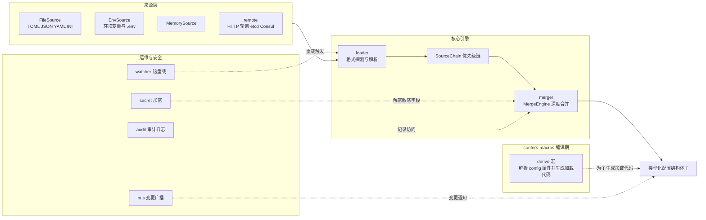
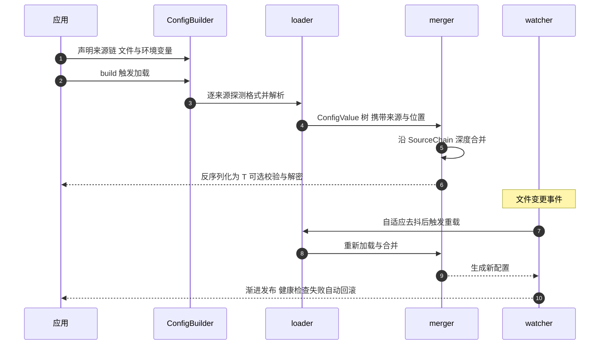

<div align="center">


[](https://github.com/Kirky-X/confers/actions/workflows/ci.yml) [](https://crates.io/crates/confers) [](https://docs.rs/confers) [](https://crates.io/crates/confers) [](LICENSE) [](https://www.rust-lang.org/) [](https://codecov.io/gh/Kirky-X/confers)

**中文** | [English](README_EN.md)

**生产级 Rust 配置库，零样板代码**

[✨ 功能特性](#-功能特性) • [🚀 快速开始](#-快速开始) • [📚 文档](#-文档) • [💻 示例](#-示例) • [🤝 参与贡献](#-参与贡献)

</div>

---

<div align="center" style="padding: 32px; margin: 24px 0">

### 🎯 声明式配置管理

通过 `#[derive(Config)]` 派生宏声明配置结构，库负责剩下的工作：

<table style="width:100%; border-collapse: collapse">
<tr>
<td align="center" width="25%" style="padding: 12px">🧩<br><b>派生宏驱动</b><br><span style="color:#64748B">编译期生成加载代码</span></td>
<td align="center" width="25%" style="padding: 12px">🛡️<br><b>类型安全</b><br><span style="color:#64748B">多来源合并 强类型输出</span></td>
<td align="center" width="25%" style="padding: 12px">🔄<br><b>热重载</b><br><span style="color:#64748B">渐进发布 健康检查回滚</span></td>
<td align="center" width="25%" style="padding: 12px">🔐<br><b>端到端加密</b><br><span style="color:#64748B">XChaCha20-Poly1305</span></td>
</tr>
</table>

</div>

---

## 📋 目录

<details open style="padding:16px">
<summary style="cursor:pointer; font-weight:600; color:#1E293B">📑 目录（点击展开）</summary>

- [📋 目录](#-目录)
- [✨ 功能特性](#-功能特性)
- [🚀 快速开始](#-快速开始)
- [🎨 特性标志](#-特性标志)
- [📚 文档](#-文档)
- [💻 示例](#-示例)
- [🏗️ 架构](#️-架构)
- [🤖 CLI 工具](#-cli-工具)
- [🔄 核心流程](#-核心流程)
- [🧪 测试](#-测试)
- [📊 性能](#-性能)
- [🔒 安全](#-安全)
- [🗺️ 开发路线图](#️-开发路线图)
- [🤝 参与贡献](#-参与贡献)
- [📋 更新日志](#-更新日志)
- [📄 许可证](#-许可证)
- [🙏 致谢](#-致谢)
- [📞 联系与支持](#-联系与支持)
- [⭐ Star 历史](#-star-历史)

</details>

---

## ✨ 功能特性

<table style="width:100%; border-collapse: collapse">
<tr>
<td width="50%" style="vertical-align:top; padding: 12px">🧩 <b>派生宏驱动</b><br><span style="color:#64748B"><code>#[derive(Config)]</code> 与 <code>#[config(...)]</code> 属性在编译期生成加载、默认值与环境变量覆盖代码</span></td>
<td width="50%" style="vertical-align:top; padding: 12px">🗂️ <b>多格式支持</b><br><span style="color:#64748B">TOML、JSON、YAML、INI 与 <code>.env</code>，支持按内容自动探测格式</span></td>
</tr>
<tr>
<td width="50%" style="vertical-align:top; padding: 12px">🔗 <b>多来源优先级链</b><br><span style="color:#64748B">文件、环境变量、内存与远程来源按声明顺序合并，每个值携带来源与位置元数据</span></td>
<td width="50%" style="vertical-align:top; padding: 12px">🛡️ <b>类型安全与校验</b><br><span style="color:#64748B">合并结果反序列化为强类型结构体，可选 garde 规则校验</span></td>
</tr>
<tr>
<td width="50%" style="vertical-align:top; padding: 12px">🔄 <b>热重载</b><br><span style="color:#64748B">文件监听与自适应去抖，支持渐进发布与健康检查自动回滚</span></td>
<td width="50%" style="vertical-align:top; padding: 12px">⚡ <b>动态字段</b><br><span style="color:#64748B">基于 arc-swap 的无锁运行时更新，支持回调与字段监听</span></td>
</tr>
<tr>
<td width="50%" style="vertical-align:top; padding: 12px">🔐 <b>配置加密</b><br><span style="color:#64748B">XChaCha20-Poly1305 认证加密，HKDF-SHA256 按字段派生子密钥</span></td>
<td width="50%" style="vertical-align:top; padding: 12px">🌐 <b>远程配置</b><br><span style="color:#64748B">HTTP 轮询、etcd v3、Consul、Nacos、Kubernetes，内置熔断器与 SSRF 防护</span></td>
</tr>
<tr>
<td width="50%" style="vertical-align:top; padding: 12px">📢 <b>变更广播</b><br><span style="color:#64748B">NATS / Redis Pub-Sub 消息总线，多实例配置同步</span></td>
<td width="50%" style="vertical-align:top; padding: 12px">📊 <b>Schema 生成</b><br><span style="color:#64748B">自动生成 JSON Schema 与 TypeScript 类型定义</span></td>
</tr>
<tr>
<td width="50%" style="vertical-align:top; padding: 12px">🧾 <b>审计日志</b><br><span style="color:#64748B">HMAC 签名保护完整性，敏感字段自动脱敏</span></td>
<td width="50%" style="vertical-align:top; padding: 12px">🧰 <b>CLI 诊断工具</b><br><span style="color:#64748B">inspect、validate、diff、export、snapshot、schema、doctor 等子命令</span></td>
</tr>
</table>

<details style="padding:16px; margin: 16px 0">
<summary style="cursor:pointer; font-weight:600; color:#1E293B">🧩 更多能力</summary>

| 能力 | 特性标志 | 说明 |
|---------|---------|------|
| 配置版本迁移 | `migration` | 结构升级时的数据迁移 |
| 快照与回滚 | `snapshot` | 配置快照持久化、diff 与回滚 |
| 变量插值 | `interpolation` | `${VAR}` 与 `${VAR:-default}` 引用 |
| 模块化配置 | `modules` | 按特性注册配置分组 |
| 上下文感知 | `context-aware` | 租户等上下文维度的取值规则 |
| 运行时特性开关 | `feature-toggle` | 线程安全的开关注册表 |
| OpenFeature 风格评估 | `openfeature` | 特性评估 API |
| 安全规则校验器 | `security-rules` | JWT、CORS、SSRF、TLS 内置校验器与注册表 |
| 密钥管理与轮换 | `key` | 密钥版本、状态与定时轮换 |
| 密钥存储后端 | `keyring` | 文件、MasterKey、secret-tool 等存储 |
| 云 KMS 密钥提供方 | `cloud-kms` | Vault Transit 等后端 |
| 惰性分段解析 | `lazy` | 超大文档按需解析 |
| 统一变更流 | `change-stream` | 跨传输的变更事件端口 |

</details>

---

## 🚀 快速开始

### 📦 安装

```bash
cargo add confers
```

要求 Rust 1.97.1 及以上（MSRV，与仓库 `rust-toolchain.toml` 一致）。默认特性包含 `toml`、`json`、`env`。

| 预设 | 安装方式 | 适用场景 |
|------|----------|----------|
| 默认 | `cargo add confers` | TOML、JSON、环境变量 |
| 最小化 | `cargo add confers --no-default-features --features minimal` | 仅环境变量与 JSON |
| 推荐 | `cargo add confers --no-default-features --features recommended` | 默认格式加校验与安全规则 |
| 完整 | `cargo add confers --features full` | 全部能力 |

### 💡 最小示例

以下示例改编自 [`examples/src/examples/basic_usage.rs`](examples/src/examples/basic_usage.rs)：

```rust
use confers::Config;
use serde::Deserialize;

#[derive(Config, Deserialize, Debug, Clone)]
pub struct AppConfig {
    /// 服务器监听地址
    #[config(default = "127.0.0.1".to_string())]
    pub host: String,

    /// 服务器监听端口
    #[config(default = 8080u16)]
    pub port: u16,

    /// 日志级别
    #[config(default = "info".to_string())]
    pub log_level: String,
}

fn main() -> Result<(), Box<dyn std::error::Error>> {
    // 读取字段默认值，环境变量 HOST、PORT、LOG_LEVEL 可覆盖
    let config = AppConfig::load_sync()?;

    println!("监听地址: {}:{}", config.host, config.port);
    Ok(())
}
```

```bash
# 环境变量覆盖默认值
export PORT=9000
cargo run    # 输出: 监听地址: 127.0.0.1:9000
```

### 🧭 核心概念

- **来源链**：通过 `ConfigBuilder` / `SourceChainBuilder` 声明 `FileSource`、`EnvSource`、`MemorySource` 与远程来源，声明顺序即优先级，后加入者覆盖先加入者。
- **注解值**：每个配置值包装为 `AnnotatedValue`，携带 `SourceId` 与 `SourceLocation`（精确到行列），冲突可溯源。
- **双阶段错误**：初始化期失败返回 `ConfigConfigError`，运行期失败返回 `ConfersError`，两类问题分开处理。
- **特性门控**：全部可选能力均为独立 feature，编译产物只包含启用的部分，最小可只用 `env` + `json`。

---

## 🎨 特性标志

### 📦 功能预设

| 预设 | 包含特性 | 适用场景 |
|------|----------|----------|
| `minimal` | `env`、`json` | 最小化加载 |
| `recommended` | `toml`、`env`、`validation`、`json`、`security-rules` | 大多数应用 |
| `dev` | `toml`、`json`、`yaml`、`env`、`cli`、`validation`、`schema`、`audit`、`watch`、`migration`、`snapshot`、`dynamic` | 开发环境全套工具 |
| `production` | `toml`、`env`、`watch`、`encryption`、`validation`、`audit`、`schema`、`cli`、`migration`、`dynamic`、`progressive-reload`、`snapshot`、`security-rules`、`feature-toggle` | 生产环境 |
| `distributed` | `toml`、`json`、`env`、`watch`、`validation`、`config-bus`、`progressive-reload`、`audit` | 分布式系统 |
| `full` | 全部特性 | 完整能力集 |

### 📋 功能矩阵

下表逐项对应 `Cargo.toml` 的 `[features]` 定义，`default = ["toml", "json", "env"]`。

<table style="width:100%; border-collapse: collapse">
<tr><th style="text-align:left">特性</th><th style="text-align:center">默认</th><th style="text-align:left">说明</th></tr>
<tr><td colspan="3" style="background:#F8FAFC"><b>格式支持</b></td></tr>
<tr><td><code>toml</code></td><td align="center">✅</td><td>TOML 配置文件</td></tr>
<tr><td><code>json</code></td><td align="center">✅</td><td>JSON 配置文件</td></tr>
<tr><td><code>yaml</code></td><td align="center">❌</td><td>YAML 配置文件</td></tr>
<tr><td><code>ini</code></td><td align="center">❌</td><td>INI 配置文件</td></tr>
<tr><td><code>env</code></td><td align="center">✅</td><td>环境变量加载与 <code>.env</code> 文件</td></tr>
<tr><td><code>dotenv</code></td><td align="center">❌</td><td><code>env</code> 的别名</td></tr>
<tr><td colspan="3" style="background:#F8FAFC"><b>核心能力</b></td></tr>
<tr><td><code>validation</code></td><td align="center">❌</td><td>基于 garde 的配置校验</td></tr>
<tr><td><code>watch</code></td><td align="center">❌</td><td>文件监听与热重载，自适应去抖</td></tr>
<tr><td><code>encryption</code></td><td align="center">❌</td><td>XChaCha20-Poly1305 加密与 HKDF 字段密钥派生</td></tr>
<tr><td><code>cli</code></td><td align="center">❌</td><td>confers 命令行诊断工具</td></tr>
<tr><td><code>schema</code></td><td align="center">❌</td><td>JSON Schema 生成</td></tr>
<tr><td><code>typescript-schema</code></td><td align="center">❌</td><td>TypeScript 类型生成（<code>schema</code> 的别名）</td></tr>
<tr><td><code>dynamic</code></td><td align="center">❌</td><td>动态字段，arc-swap 无锁读取</td></tr>
<tr><td><code>progressive-reload</code></td><td align="center">❌</td><td>渐进式重载，金丝雀发布与健康检查回滚（含 <code>watch</code>）</td></tr>
<tr><td><code>audit</code></td><td align="center">❌</td><td>审计日志，HMAC 完整性与敏感字段脱敏</td></tr>
<tr><td><code>migration</code></td><td align="center">❌</td><td>配置版本迁移</td></tr>
<tr><td><code>snapshot</code></td><td align="center">❌</td><td>快照与回滚</td></tr>
<tr><td><code>interpolation</code></td><td align="center">❌</td><td><code>${VAR}</code> 变量插值，支持嵌套默认值</td></tr>
<tr><td><code>tracing</code></td><td align="center">❌</td><td>启用内部 tracing 门面（未启用时为 no-op）</td></tr>
<tr><td colspan="3" style="background:#F8FAFC"><b>安全</b></td></tr>
<tr><td><code>security</code></td><td align="center">❌</td><td>安全模块：加密集成、错误脱敏、环境变量校验（含 <code>encryption</code>）</td></tr>
<tr><td><code>security-rules</code></td><td align="center">❌</td><td>内置 JWT、CORS、SSRF、TLS 校验器与注册表</td></tr>
<tr><td><code>key</code></td><td align="center">❌</td><td>密钥生命周期管理与轮换（含 <code>encryption</code>）</td></tr>
<tr><td><code>keyring</code></td><td align="center">❌</td><td>密钥存储后端（文件、MasterKey、secret-tool）</td></tr>
<tr><td><code>cloud-kms</code></td><td align="center">❌</td><td>云 KMS 密钥提供方，含 Vault Transit（依赖 <code>remote</code>）</td></tr>
<tr><td colspan="3" style="background:#F8FAFC"><b>远程来源</b></td></tr>
<tr><td><code>remote</code></td><td align="center">❌</td><td>HTTP 轮询来源，含 SSRF 防护与熔断器</td></tr>
<tr><td><code>etcd</code></td><td align="center">❌</td><td>etcd v3 集成（含 <code>remote</code>）</td></tr>
<tr><td><code>etcd-watch</code></td><td align="center">❌</td><td>etcd watch 监听（含 <code>etcd</code>）</td></tr>
<tr><td><code>consul</code></td><td align="center">❌</td><td>HashiCorp Consul 集成（含 <code>remote</code>）</td></tr>
<tr><td><code>nacos</code></td><td align="center">❌</td><td>Nacos 配置中心集成（含 <code>remote</code>）</td></tr>
<tr><td><code>k8s</code></td><td align="center">❌</td><td>Kubernetes ConfigMap / Secret 来源，挂载卷与 API 两种方式（含 <code>remote</code>）</td></tr>
<tr><td colspan="3" style="background:#F8FAFC"><b>消息总线与变更流</b></td></tr>
<tr><td><code>config-bus</code></td><td align="center">❌</td><td>配置变更事件总线，基于 tokio broadcast</td></tr>
<tr><td><code>nats-bus</code></td><td align="center">❌</td><td>NATS 总线后端（含 <code>config-bus</code>）</td></tr>
<tr><td><code>redis-bus</code></td><td align="center">❌</td><td>Redis Pub/Sub 总线后端（含 <code>config-bus</code>）</td></tr>
<tr><td><code>change-stream</code></td><td align="center">❌</td><td>统一变更流端口，复用 config-bus 传输（含 <code>watch</code>）</td></tr>
<tr><td colspan="3" style="background:#F8FAFC"><b>组织与扩展</b></td></tr>
<tr><td><code>modules</code></td><td align="center">❌</td><td>模块化配置分组与注册表</td></tr>
<tr><td><code>context-aware</code></td><td align="center">❌</td><td>上下文感知（租户维度）配置</td></tr>
<tr><td><code>feature-toggle</code></td><td align="center">❌</td><td>运行时特性开关注册表</td></tr>
<tr><td><code>openfeature</code></td><td align="center">❌</td><td>OpenFeature 风格特性评估（含 <code>feature-toggle</code>、<code>context-aware</code>）</td></tr>
<tr><td><code>lazy</code></td><td align="center">❌</td><td>超大文档惰性分段解析</td></tr>
</table>

---

## 📚 文档

| 文档 | 说明 |
|------|------|
| [📖 用户指南](docs/USER_GUIDE.md) | 从安装到进阶的完整使用教程 |
| [📘 API 参考](docs/API_REFERENCE.md) | 全部公开 API 的详细说明 |
| [🏗️ 架构文档](docs/ARCHITECTURE.md) | 设计原则、模块划分与数据流 |
| [🧭 宏配置指南](docs/CONFIG_MACRO_GUIDE.md) | `Config` 派生宏与 `#[config(...)]` 属性的完整用法 |
| [📈 性能优化指南](docs/PERFORMANCE.md) | 基准数据、性能口径与优化建议 |
| [🔒 安全文档](docs/SECURITY.md) | 安全设计、最佳实践与漏洞处理记录 |
| [❓ FAQ](docs/FAQ.md) | 常见问题解答 |
| [📚 库集成指南](docs/LIBRARY_INTEGRATION.md) | 如何将 confers CLI 集成到您的项目 |
| [🧪 测试场景矩阵](docs/TEST_SCENARIOS.md) | E2E 验收场景穷举矩阵 |
| [📋 更新日志](docs/CHANGELOG.md) | 每个版本的变更记录 |
| [🤝 贡献指南](docs/CONTRIBUTING.md) | 如何参与项目开发 |
| [📦 在线 API 文档](https://docs.rs/confers) | docs.rs 自动生成的最新文档 |
| [📦 crates.io](https://crates.io/crates/confers) | 发布页面 |

---

## 💻 示例

全部 21 个可运行示例位于 [`examples/`](examples/) 目录，每个示例对应一个 `cargo run --bin` 目标。

| 示例 | 文件 | 所需特性 | 描述 |
|------|------|----------|------|
| basic_usage | `examples/src/examples/basic_usage.rs` | `toml`、`env` | 从默认值与环境变量加载基础配置 |
| hot_reload | `examples/src/examples/hot_reload.rs` | `watch` | 配置文件变更监听与自动重载 |
| encryption | `examples/src/examples/encryption.rs` | `encryption` | XChaCha20-Poly1305 加密保护敏感字段 |
| key_rotation | `examples/src/examples/key_rotation.rs` | `key` | 加密密钥的安全轮转 |
| migration | `examples/src/examples/migration.rs` | `migration` | 配置版本迁移 |
| dynamic_fields | `examples/src/examples/dynamic_fields.rs` | `dynamic` | DynamicField 运行时配置更新与回调 |
| config_groups | `examples/src/examples/config_groups.rs` | `modules` | 配置分组管理 |
| progressive_reload | `examples/src/examples/progressive_reload.rs` | `progressive-reload` | ProgressiveReloader 渐进式热更新 |
| config_bus | `examples/src/examples/config_bus.rs` | `config-bus` | ConfigBus 配置变更事件广播 |
| snapshot | `examples/src/examples/snapshot.rs` | `snapshot` | SnapshotManager 配置快照持久化 |
| remote_consul | `examples/src/examples/remote_consul.rs` | `consul` | 从 Consul KV Store 加载配置 |
| remote_etcd | `examples/src/examples/remote_etcd.rs` | `etcd` | 从 etcd KV Store 加载配置 |
| validation | `examples/src/examples/validation.rs` | `validation` | 使用 garde 进行配置校验 |
| json_schema | `examples/src/examples/json_schema.rs` | `schema` | ConfigSchema 派生宏生成 JSON Schema |
| interpolation | `examples/src/examples/interpolation.rs` | `interpolation` | `${VAR}` 变量插值与默认值 |
| audit | `examples/src/examples/audit.rs` | `audit` | AuditConfig 与 AuditWriter 审计日志 |
| context_aware | `examples/src/examples/context_aware.rs` | `context-aware` | ContextAwareField 上下文取值规则 |
| security | `examples/src/examples/security.rs` | `security` | EncryptionPrefix 加密值识别与处理 |
| modules_demo | `examples/src/examples/modules_demo.rs` | `modules` | ModuleRegistry 模块系统 |
| cli_integration | `examples/src/examples/cli_integration.rs` | `cli` | ConfigClap 派生宏与 CLI 集成 |
| full_stack | `examples/src/examples/full_stack.rs` | `full` | 完整功能集展示 |

```bash
# 运行单个示例（在 examples/ 目录下）
cd examples && cargo run --bin basic_usage
cd examples && cargo run --bin encryption

# 验证全部示例可编译
cd examples && ./verify_examples.sh
```

---

## 🏗️ 架构

Confers 采用门面与内部实现分离的分层设计：`src/` 下的公开模块（`config`、`loader`、`merger`、`format`、`types`、`interface`、`error`、`lifecycle`）只做转发动机，真正实现位于 `src/impl_/` 内部模块；可选能力（`validator`、`watcher`、`secret`、`remote`、`bus`、`cli` 等）按 feature 独立门控。派生宏由 workspace 内的 `confers-macros` 过程宏 crate 提供，`macros/src/parse.rs` 解析 `#[config(...)]` 属性，codegen 生成加载与校验代码。核心数据通路为：来源链注册、loader 格式探测与解析（错误精确到行列）、`MergeEngine` 沿来源链深度合并、serde 反序列化为用户类型并可选执行 garde 校验与敏感字段解密。接口层遵循接口隔离原则，拆分为 `ConfigReader`、`ConfigWriter`、`ConfigConnector`、`ConfigProvider` 等独立 trait。


```mermaid
flowchart LR
    subgraph MACROS["confers-macros 编译期"]
        DM["derive 宏<br/>解析 config 属性并生成加载代码"]
    end

    subgraph SOURCES["来源层"]
        FS["FileSource<br/>TOML JSON YAML INI"]
        ES["EnvSource<br/>环境变量与 .env"]
        MS["MemorySource"]
        RS["remote<br/>HTTP 轮询 etcd Consul"]
    end

    subgraph CORE["核心引擎"]
        LD["loader<br/>格式探测与解析"]
        SC["SourceChain 优先级链"]
        MG["merger<br/>MergeEngine 深度合并"]
    end

    subgraph OPS["运维与安全"]
        WT["watcher 热重载"]
        BUS["bus 变更广播"]
        AU["audit 审计日志"]
        SE["secret 加密"]
    end

    APP["类型化配置结构体 T"]

    SOURCES --> LD
    LD --> SC
    SC --> MG
    MG --> APP
    DM -.为 T 生成加载代码.-> APP
    WT -.重载触发.-> LD
    BUS -.变更通知.-> APP
    SE -.解密敏感字段.-> MG
    AU -.记录访问.-> MG
```

> 完整的模块划分与数据流说明见 [🏗️ 架构文档](docs/ARCHITECTURE.md)。

---

## 🤖 CLI 工具

`confers` 二进制（`src/cli/main.rs`，需启用 `cli` 特性）提供配置诊断能力：

```bash
cargo install confers --features cli
```

| 命令 | 描述 |
|------|------|
| `inspect` | 列出全部配置键及其来源，支持冲突展示与 JSON 输出 |
| `validate` | 校验配置，`--strict` 模式将警告视为错误 |
| `export` | 导出合并后配置（json、toml、yaml），默认脱敏敏感值 |
| `diff` | 对比 base 与 overlay 两份配置 |
| `snapshot` | 快照管理：`list`、`diff`、`prune` |
| `schema` | 输出配置类型的 JSON Schema，支持从实例反推 |
| `get` | 按键路径读取单个配置值 |
| `doctor` | 配置健康诊断，输出单行 JSON 报告 |
| `docs --agent` | 输出面向代理的机器可读知识包 |

```bash
# 常用命令
confers --config config.toml inspect
confers --config config.toml validate --strict
confers --config config.toml export --format json
confers diff --base config1.toml --overlay config2.toml
```

全局选项：`--config <文件>`（可多次）、`--env-file <文件>`、`--fields <点路径列表>`。退出码约定：0 成功、1 配置错误、2 I/O 错误。

---

## 🔄 核心流程

以下时序图展示配置加载与热重载的真实执行路径（对照 `docs/ARCHITECTURE.md` 数据流一节与 `src/watcher` 实现）：


```mermaid
sequenceDiagram
    autonumber
    participant App as 应用
    participant Bld as ConfigBuilder
    participant Ldr as loader
    participant Mrg as merger
    participant Wtr as watcher

    App->>Bld: 声明来源链 文件与环境变量
    App->>Bld: build 触发加载
    Bld->>Ldr: 逐来源探测格式并解析
    Ldr->>Mrg: ConfigValue 树 携带来源与位置
    Mrg->>Mrg: 沿 SourceChain 深度合并
    Mrg-->>App: 反序列化为 T 可选校验与解密

    Note over Wtr: 文件变更事件
    Wtr->>Ldr: 自适应去抖后触发重载
    Ldr->>Mrg: 重新加载与合并
    Mrg-->>Wtr: 生成新配置
    Wtr-->>App: 渐进发布 健康检查失败自动回滚
```

启用 `progressive-reload` 后，新配置按批次切换实例；健康检查失败时自动回滚（`ReloadRolledBack`）。启用 `dynamic` 时，字段级更新经 `arc-swap` 快照原子换入，读者无锁。

---

## 🧪 测试

### 🎯 测试策略

| 层级 | 位置 | 说明 |
|------|------|------|
| 单元测试 | `src/` 内联 `#[cfg(test)]` 模块 | 覆盖各特性门控下的核心逻辑 |
| 集成测试 | `tests/core`、`tests/security`、`tests/remote`、`tests/watcher`、`tests/cli` | 按功能域组织的门控套件 |
| 端到端测试 | `tests/e2e`（24 个套件，经 `[[test]]` 显式注册） | 覆盖格式、构建器、加密、总线、渐进发布等场景，场景矩阵见 [测试场景文档](docs/TEST_SCENARIOS.md) |
| 宏测试 | `macros/tests` | trybuild 编译失败用例与属性校验 |
| 模糊测试 | `fuzz/` | cargo-fuzz 目标：`parser`、`merger`、`interpolation` |
| 基准测试 | `benches/` | 9 组 Criterion 基准 |
| 文档测试 | 公开 API rustdoc 示例 | 随 `cargo test` 执行 |

### ▶️ 运行命令（与 CI 一致）

```bash
# 全量测试（CI 矩阵按 default / recommended / full 三档运行）
cargo test --workspace --features full

# Lint 与格式门禁
cargo clippy --workspace --all-targets --all-features -- -D warnings
cargo fmt --all -- --check

# 覆盖率门禁：行覆盖率不低于 80%
cargo llvm-cov --workspace --all-features --fail-under-lines 80

# 基准测试
cargo bench --features dev --benches

# 模糊测试（在 fuzz/ 目录下）
cargo fuzz run parser
```

总线相关的集成测试需要本地 NATS 服务，CI 使用 `nats:2.10 -js` 容器（见 `docker-compose.test.yml`）。

### 📊 测试规模

> 规模为 `#[test]` / `#[tokio::test]` 函数的 grep 统计，截至 v0.6.0-rc.3。

| 类别 | 数量 |
|------|------|
| 单元测试（`src/` 内联） | 约 2100+ |
| 集成与 E2E（`tests/`） | 600（53 个文件） |
| 模糊测试目标 | 3 |
| Criterion 基准 | 9 组 |

覆盖率门禁为行覆盖率不低于 80%，CI 与 pre-push 钩子双重执行。

---

## 📊 性能

> 口径沿用 [📈 性能优化指南](docs/PERFORMANCE.md)：基线在开发机（WSL2、linux 6.6、16 线程）本地采集，数值为 criterion 区间估计的 estimate（中位数口径），非默认参数运行使用 `--warm-up-time 1 --measurement-time 2 --sample-size 20`。实际性能取决于配置复杂度与硬件，可运行 `cargo bench` 复现。

<table style="width:100%; border-collapse: collapse">
<tr><th style="text-align:left">路径</th><th style="text-align:left">用例</th><th style="text-align:left">耗时</th></tr>
<tr><td>加载</td><td><code>load / 50 fields</code></td><td>约 691 ns</td></tr>
<tr><td>加载</td><td><code>load / 200 fields</code></td><td>约 713 ns</td></tr>
<tr><td>合并</td><td><code>merge_shallow / size 10</code></td><td>约 263 ns</td></tr>
<tr><td>合并</td><td><code>merge_shallow / size 1000</code></td><td>约 20.9 µs</td></tr>
<tr><td>变更流</td><td><code>change_stream_roundtrip / 1 订阅者</code></td><td>约 1.98 µs</td></tr>
<tr><td>变更流</td><td><code>change_stream_roundtrip / 8 订阅者</code></td><td>约 3.72 µs</td></tr>
<tr><td>大值读取</td><td><code>get_shared</code>（Arc 句柄）对比 <code>get_raw</code>（深拷贝）</td><td>约 161 ns 对比约 337 ns，约 2.1 倍提升</td></tr>
</table>

性能设计要点：动态字段基于 `arc-swap` 无锁读取；`ConfigValue` 树使用 `IndexMap` 保持键序、短字符串经 `compact_str` 驻留；watcher 自适应去抖抑制重载风暴；全部可选能力特性门控以控制编译时间与二进制体积。更多优化建议见 [📈 性能优化指南](docs/PERFORMANCE.md)。

---

## 🔒 安全

### 🛡️ 安全设计

| 要点 | 说明 |
|------|------|
| 认证加密 | XChaCha20-Poly1305 AEAD，每次加密生成随机 nonce，密文附带 Poly1305 认证标签 |
| 字段级密钥派生 | HKDF-SHA256 从主密钥按字段路径与密钥版本派生子密钥（`derive_field_key`） |
| 内存安全 | `SecretBytes` / `ZeroizingBytes` 丢弃即清零，`secrecy` 防止敏感值进入日志，`SecureString` 禁止 `Clone` |
| 密钥治理 | `KeyManager` 与 `KeyRegistry` 管理密钥版本、状态与轮换，含熵值校验 |
| 输入防护 | `EnvSecurityValidator` 环境变量注入防护；内置 JWT、CORS、SSRF、TLS 校验器，SSRF 覆盖 18 个封锁网段并做 URL 边界匹配 |
| 输出脱敏 | `ErrorSanitizer` 错误信息脱敏，`#[config(sensitive = true)]` 字段在日志与 debug 输出中自动遮蔽 |
| 审计追踪 | 审计日志带 HMAC 签名保护完整性，支持敏感字段追踪 |
| 远程来源防护 | SSRF 校验与熔断器，避免内网地址探测与故障扩散 |

### ⛓️ 供应链与门禁

- `cargo deny check`：漏洞、许可证、禁用依赖与来源校验（`deny.toml`）。
- `cargo audit`：RustSec 安全公告扫描，CI 与 pre-push 钩子执行。
- pre-commit 私钥扫描（lefthook `no-private-key`）。

### 🚨 报告安全漏洞

请勿通过公开 issue 报告安全漏洞。请使用 GitHub [Security Advisories](https://github.com/Kirky-X/confers/security/advisories/new) 私密披露通道提交报告。项目承诺 48 小时内确认、7 天内给出初步评估。完整政策见 [SECURITY.md](SECURITY.md) 与 [安全文档](docs/SECURITY.md)。

---

## 🗺️ 开发路线图

<table style="width:100%; border-collapse: collapse">
<tr><th style="text-align:center">状态</th><th style="text-align:left">方向</th><th style="text-align:left">条目</th></tr>
<tr><td align="center">✅</td><td>核心引擎</td><td>派生宏、多格式支持、来源链合并、环境变量与 CLI 覆盖</td></tr>
<tr><td align="center">✅</td><td>校验与 Schema</td><td>garde 校验、JSON Schema 生成、TypeScript 类型生成</td></tr>
<tr><td align="center">✅</td><td>热更新</td><td>文件监听热重载、渐进式发布、动态字段、快照回滚、配置迁移、变量插值</td></tr>
<tr><td align="center">✅</td><td>安全与审计</td><td>XChaCha20-Poly1305 加密、密钥管理与轮换、审计日志、安全规则校验器</td></tr>
<tr><td align="center">✅</td><td>远程与总线</td><td>HTTP 轮询、etcd、Consul、Nacos、Kubernetes ConfigMap / Secret、NATS 与 Redis 总线</td></tr>
<tr><td align="center">🚧</td><td>远程来源成熟度</td><td><code>remote</code>、<code>etcd</code>、<code>consul</code> 处于测试期（Beta），接口可能调整</td></tr>
<tr><td align="center">📋</td><td>性能优化</td><td>基准套件完善（criterion 基线）、大型配置内存占用优化、高频读取零拷贝热路径</td></tr>
<tr><td align="center">📋</td><td>云原生集成</td><td>服务网格支持、分布式追踪集成</td></tr>
</table>

---

## 🤝 参与贡献

详细的贡献流程与代码规范请参阅 [🤝 贡献指南](docs/CONTRIBUTING.md)。

### 🛠️ 开发环境

| 项 | 要求 |
|----|------|
| 工具链 | Rust 1.97.1（`rust-toolchain.toml` 锁定） |
| 格式与 Lint | `cargo fmt --all -- --check`、`cargo clippy --all-targets --all-features -- -D warnings` |
| Git 钩子 | [lefthook](https://github.com/evilmartians/lefthook)：pre-commit 运行 rustfmt、clippy、`cargo deny check` 与私钥扫描；pre-push 运行 `cargo audit` 与覆盖率门禁 |
| 提交信息 | Conventional Commits（`feat`、`fix`、`docs` 等，由 commit-msg 钩子校验） |

### 💖 贡献方式

<table style="width:100%; border-collapse: collapse">
<tr>
<td width="33%" align="center" style="padding: 16px">

### 🐛 报告 Bug

发现问题？<br>
<a href="https://github.com/Kirky-X/confers/issues/new">创建 Issue</a>

</td>
<td width="33%" align="center" style="padding: 16px">

### 💡 功能建议

有好想法？<br>
<a href="https://github.com/Kirky-X/confers/discussions">开始讨论</a>

</td>
<td width="33%" align="center" style="padding: 16px">

### 🔧 提交 PR

想贡献代码？<br>
<a href="https://github.com/Kirky-X/confers/pulls">Fork 并提交 PR</a>

</td>
</tr>
</table>


---

## 📋 更新日志

完整版本历史见 [📋 更新日志](docs/CHANGELOG.md)（遵循 [Keep a Changelog](https://keepachangelog.com/en/1.0.0/) 格式，语义化版本）。

| 版本 | 日期 | 要点 |
|------|------|------|
| 0.6.0-rc.2 | 2026-09-07 | 12 项以上 0.x 依赖刷新（async-nats 0.50、chacha20poly1305 0.11、garde 0.23 等）；测试金字塔固化，补齐 7 个 E2E 套件并注册 |
| 0.5.1 | 2026-08-06 | 新增 `SecurityValidator` 安全规则与 `FeatureToggleRegistry` 运行时开关；修复 SSRF 白名单绕过与 TLS 版本比较等问题 |
| 0.5.0 | 2026-08-04 | 精简 `ConfigBuilder`（移除 6 个无效方法）；新增熔断器；增强密钥熵值校验与错误信息脱敏 |

---

## 📄 许可证

本项目采用 MIT 许可证，附加 [Commons Clause](LICENSE) v1.0 条件：未经单独授权不得销售本软件。详见 [LICENSE](LICENSE)。

---

## 🙏 致谢

### 🌟 核心依赖

Confers 站在以下优秀开源项目的肩膀上：

| 依赖 | 用途 |
|------|------|
| [serde](https://github.com/serde-rs/serde) | 序列化与反序列化框架 |
| [tokio](https://github.com/tokio-rs/tokio) | 异步运行时 |
| [garde](https://github.com/jprochazk/garde) | 配置校验 |
| [arc-swap](https://github.com/vorner/arc-swap) | 无锁并发快照 |
| [chacha20poly1305](https://github.com/RustCrypto/AEADs) | 认证加密 |
| [notify-debouncer-full](https://github.com/notify-rs/notify) | 文件监听与去抖 |
| [clap](https://github.com/clap-rs/clap) | CLI 框架 |
| [schemars](https://github.com/GREsau/schemars) | JSON Schema 生成 |
| [criterion](https://github.com/bheisler/criterion.rs) | 基准测试 |

### 💝 特别感谢

感谢 Rust 社区与所有 [贡献者](https://github.com/Kirky-X/confers/graphs/contributors)。

---

## 📞 联系与支持

<table style="width:100%; max-width: 600px">
<tr>
<td align="center" width="33%">
<a href="https://github.com/Kirky-X/confers/issues"><b style="color:#991B1B">Issues</b></a><br>
<span style="color:#64748B">报告问题和 Bug</span>
</td>
<td align="center" width="33%">
<a href="https://github.com/Kirky-X/confers/discussions"><b style="color:#1E40AF">讨论区</b></a><br>
<span style="color:#64748B">提问和分享想法</span>
</td>
<td align="center" width="33%">
<a href="https://github.com/Kirky-X/confers"><b style="color:#1E293B">GitHub</b></a><br>
<span style="color:#64748B">查看源代码</span>
</td>
</tr>
</table>

---

## ⭐ Star 历史

[](https://star-history.com/#Kirky-X/confers&Date)

如果这个项目对您有帮助，请考虑给它一个 ⭐️！

**由 Kirky.X 构建**

---

<sub>© 2026 Kirky.X. 保留所有权利。</sub>
