<span id="top"></span>
<div align="center">


<p>
  <!-- CI/CD Status -->
  <a href="https://github.com/Kirky-X/confers/actions/workflows/ci.yml">
    
  </a>
  <!-- Version -->
  <a href="https://crates.io/crates/confers">
    
  </a>
  <!-- Documentation -->
  <a href="https://docs.rs/confers">
    
  </a>
  <!-- Downloads -->
  <a href="https://crates.io/crates/confers">
    
  </a>
  <!-- License -->
  <a href="https://github.com/Kirky-X/confers/blob/main/LICENSE">
    
  </a>
  <!-- Rust Version -->
  <a href="https://www.rust-lang.org/">
    
  </a>
  <!-- Coverage -->
  <a href="https://codecov.io/gh/Kirky-X/confers">
    
  </a>
</p>

<p align="center">
  <strong>A modern, type-safe configuration management library for Rust</strong>
</p>

<p align="center">
  <a href="#features" style="color:#3B82F6;">✨ Features</a> •
  <a href="#quick-start" style="color:#3B82F6;">🚀 Quick Start</a> •
  <a href="#documentation" style="color:#3B82F6;">📚 Documentation</a> •
  <a href="#examples" style="color:#3B82F6;">💻 Examples</a> •
  <a href="#contributing" style="color:#3B82F6;">🤝 Contributing</a>
</p>

</div>

---

<!-- Hero Section -->
<div align="center" style="border-radius: 12px; padding: 32px; margin: 24px 0;">

### 🎯 Zero-Boilerplate Configuration Management

Confers provides a **declarative approach** to configuration management with:

| ✨ Type Safety | 🔄 Auto Reload | 🔐 AES-256 Encryption | 🌐 Remote Sources |
|:-------------:|:--------------:|:---------------------:|:-----------------:|
| Compile-time checks | Hot reload support | Sensitive data protection | etcd, Consul, HTTP |

```rust
use confers::Config;
use serde::{Deserialize, Serialize};

#[derive(Debug, Clone, Serialize, Deserialize, Config)]
#[config(validate)]
pub struct AppConfig {
    pub name: String,
    pub port: u16,
    pub debug: bool,
}

// Configuration loads automatically from files, env vars, and CLI args
let config = AppConfig::load()?;
```

</div>

---

## 📋 Table of Contents

<details open style="border-radius:8px; padding:16px; border:1px solid #E2E8F0;">
<summary style="cursor:pointer; font-weight:600; color:#1E293B;">📑 Table of Contents (Click to expand)</summary>

- [✨ Features](#features)
- [🚀 Quick Start](#quick-start)
  - [📦 Installation](#installation)
  - [💡 Basic Usage](#basic-usage)
- [📚 Documentation](#documentation)
- [💻 Examples](#examples)
- [🏗️ Architecture](#architecture)
- [⚙️ Configuration](#configuration)
- [🧪 Testing](#testing)
- [📊 Performance](#performance)
- [🔒 Security](#security)
- [🗺️ Roadmap](#roadmap)
- [🤝 Contributing](#contributing)
- [📄 License](#license)
- [🙏 Acknowledgments](#acknowledgments)

</details>

---

## <span id="features">✨ Features</span>

<div align="center" style="margin: 24px 0;">

| 🎯 Core Features | ⚡ Optional Features |
|:-----------------|:--------------------|
| Always available | Enable as needed |

</div>

<table style="width:100%; border-collapse: collapse;">
<tr>
<td width="50%" style="vertical-align:top; padding: 16px; border-radius:8px; border:1px solid #E2E8F0;">

### 🎯 Core Features (Always Available)

| Status | Feature | Description |
|:------:|---------|-------------|
| ✅ | **Type-safe Configuration** | Auto-generate config structs via derive macros (`derive` feature) |
| ✅ | **Multi-format Support** | TOML, YAML, JSON, INI configuration files |
| ✅ | **Environment Variable Override** | Support environment variable overrides |
| ✅ | **CLI Argument Override** | Support command-line argument overrides (`cli` feature) |

</td>
<td width="50%" style="vertical-align:top; padding: 16px; border-radius:8px; border:1px solid #E2E8F0;">

### ⚡ Optional Features

| Status | Feature | Description |
|:------:|---------|-------------|
| 🔍 | **Configuration Validation** | Built-in validator integration (`validation` feature) |
| 📊 | **Schema Generation** | Auto-generate JSON Schema (`schema` feature) |
| 🚀 | **File Watching & Hot Reload** | Real-time file monitoring (`watch` feature) |
| 🔐 | **Configuration Encryption** | AES-256 encrypted storage (`encryption` feature) |
| 🌐 | **Remote Configuration** | etcd, Consul, HTTP support (`remote` feature) |
| 📦 | **Audit Logging** | Record access & change history (`audit` feature) |
| ⚡ | **Parallel Validation** | Parallel validation for large configs (`parallel` feature) |
| 📈 | **System Monitoring** | Memory usage monitoring (`monitoring` feature) |
| 🔧 | **Configuration Diff** | Compare configs with multiple output formats |
| 🎨 | **Interactive Wizard** | Generate config templates via CLI |
| 🛡️ | **Security Enhancements** | Nonce reuse detection, SSRF protection |

</td>
</tr>
</table>

### 📦 Feature Presets

| Preset | Features | Use Case |
|--------|----------|----------|
| <span style="color:#166534; padding:4px 8px; border-radius:4px;">minimal</span> | `derive` | Minimal config loading (no validation, no CLI) |
| <span style="color:#1E40AF; padding:4px 8px; border-radius:4px;">recommended</span> | `derive`, `validation` | **Recommended for most applications** |
| <span style="color:#92400E; padding:4px 8px; border-radius:4px;">dev</span> | `derive`, `validation`, `cli`, `schema`, `audit`, `monitoring` | Development with all tools |
| <span style="color:#991B1B; padding:4px 8px; border-radius:4px;">production</span> | `derive`, `validation`, `watch`, `encryption`, `remote`, `monitoring` | Production-ready configuration |
| <span style="color:#5B21B6; padding:4px 8px; border-radius:4px;">full</span> | All features | Complete feature set |

<div align="center" style="margin: 24px 0;">

### 🎨 Feature Architecture

```mermaid
graph LR
    A[<b>Configuration Sources</b><br/>📁 Files • 🌐 Env • 💻 CLI] --> B[<b>ConfigLoader</b><br/>🔧 Core Engine]
    B --> C[<b>Validation</b><br/>✅ Type & Business Rules]
    B --> D[<b>Schema</b><br/>📄 JSON Schema Gen]
    B --> E[<b>Encryption</b><br/>🔐 AES-256-GCM]
    B --> F[<b>Audit</b><br/>📋 Access Logs]
    B --> G[<b>Monitoring</b><br/>📊 Memory Watch]
    C --> H[<b>Application Config</b><br/>🚀 Ready to Use]
    D --> H
    E --> H
    F --> H
    G --> H
    
    style A fill:#DBEAFE,stroke:#1E40AF,stroke-width:2px
    style B fill:#FEF3C7,stroke:#92400E,stroke-width:2px
    style H fill:#DCFCE7,stroke:#166534,stroke-width:2px
```

</div>



---

## <span id="quick-start">🚀 Quick Start</span>

### <span id="installation">📦 Installation</span>

<table style="width:100%; border-collapse: collapse;">
<tr>
<td width="100%" style="padding: 16px; border-radius:8px; border:1px solid #E2E8F0;">

#### 🦀 Rust Installation

| Installation Type | Configuration | Use Case |
|-------------------|---------------|----------|
| **Default** | `confers = "0.1.1"` | Includes derive, validation, and CLI |
| **Minimal** | `confers = { version = "0.1.1", default-features = false, features = ["minimal"] }` | Only config loading |
| **Recommended** | `confers = { version = "0.1.1", default-features = false, features = ["recommended"] }` | Config + validation |
| **Full** | `confers = { version = "0.1.1", features = ["full"] }` | All features |

**Individual Features:**

| Feature | Description | Default |
|---------|-------------|---------|
| `derive` | Derive macros for config structs | ✅ |
| `validation` | Config validation support | ✅ |
| `cli` | Command-line interface tools | ❌ |
| `watch` | File watching and hot reload | ❌ |
| `audit` | Audit logging | ❌ |
| `schema` | JSON Schema generation | ❌ |
| `parallel` | Parallel validation | ❌ |
| `monitoring` | System monitoring | ❌ |
| `remote` | Remote config (etcd, consul, http) | ❌ |
| `encryption` | Config encryption | ❌ |

</td>
</tr>
</table>

### <span id="basic-usage">💡 Basic Usage</span>

<div align="center" style="margin: 24px 0;">

#### 🎬 5-Minute Quick Start

</div>

<table style="width:100%; border-collapse: collapse;">
<tr>
<td width="50%" style="padding: 16px; vertical-align:top;">

**Step 1: Define Config Structure**

```rust
use confers::Config;
use serde::{Deserialize, Serialize};

#[derive(Debug, Clone, Serialize, Deserialize, Config)]
#[config(validate)]
#[config(env_prefix = "APP_")]
pub struct AppConfig {
    pub name: String,
    pub port: u16,
    pub debug: bool,
}
```

</td>
<td width="50%" style="padding: 16px; vertical-align:top;">

**Step 2: Create Config File**

```toml
# config.toml
name = "my-app"
port = 8080
debug = true
```

</td>
</tr>
<tr>
<td width="50%" style="padding: 16px; vertical-align:top;">

**Step 3: Load Config**

```rust
fn main() -> anyhow::Result<()> {
    let config = AppConfig::load()?;
    println!("✅ Loaded: {:?}", config);
    Ok(())
}
```

</td>
<td width="50%" style="padding: 16px; vertical-align:top;">

**Step 4: Environment Override**

```bash
# Environment variables automatically override
export APP_PORT=9090
export APP_DEBUG=true
```

</td>
</tr>
</table>

<details style="border-radius:8px; padding:16px; border:1px solid #86EFAC; margin: 16px 0;">
<summary style="cursor:pointer; font-weight:600; color:#166534;">📖 Complete Working Example</summary>

```rust
use confers::Config;
use serde::{Deserialize, Serialize};

#[derive(Debug, Clone, Serialize, Deserialize, Config)]
#[config(validate)]
#[config(env_prefix = "APP_")]
pub struct AppConfig {
    pub name: String,
    pub port: u16,
    pub debug: bool,
}

fn main() -> anyhow::Result<()> {
    // Create config file
    let config_content = r#"
name = "my-app"
port = 8080
debug = true
"#;
    std::fs::write("config.toml", config_content)?;

    // Load configuration
    let config = AppConfig::load()?;

    // Print configuration
    println!("🎉 Configuration loaded successfully!");
    println!("📋 Name: {}", config.name);
    println!("🔌 Port: {}", config.port);
    println!("🐛 Debug: {}", config.debug);

    Ok(())
}
```

</details>

---

## <span id="documentation">📚 Documentation</span>

<div align="center" style="margin: 24px 0;">

<table style="width:100%; max-width: 800px;">
<tr>
<td align="center" width="33%" style="padding: 16px;">
<a href="docs/USER_GUIDE.md" style="text-decoration:none;">
<div style="padding: 24px; border-radius:12px; transition: transform 0.2s;">
<br>
<b style="color:#1E293B;">User Guide</b>
</div>
</a>
<br><span style="color:#64748B;">Complete usage guide</span>
</td>
<td align="center" width="33%" style="padding: 16px;">
<a href="https://docs.rs/confers" style="text-decoration:none;">
<div style="padding: 24px; border-radius:12px; transition: transform 0.2s;">
<br>
<b style="color:#1E293B;">API Reference</b>
</div>
</a>
<br><span style="color:#64748B;">Complete API docs</span>
</td>
<td align="center" width="33%" style="padding: 16px;">
<a href="examples/" style="text-decoration:none;">
<div style="padding: 24px; border-radius:12px; transition: transform 0.2s;">
<br>
<b style="color:#1E293B;">Examples</b>
</div>
</a>
<br><span style="color:#64748B;">Code examples</span>
</td>
</tr>
</table>

</div>

### 📖 Additional Resources

| Resource | Description |
|----------|-------------|
| ❓ [FAQ](docs/FAQ.md) | Frequently asked questions |
| 📖 [Contributing Guide](docs/CONTRIBUTING.md) | Code contribution guidelines |
| 📘 [API Reference](docs/API_REFERENCE.md) | Complete API documentation |
| 🏗️ [Architecture Decisions](docs/architecture_decisions.md) | ADR documentation |

---

## <span id="examples">💻 Examples</span>

<div align="center" style="margin: 24px 0;">

### 💡 Real-World Examples

</div>

<table style="width:100%; border-collapse: collapse;">
<tr>
<td width="50%" style="padding: 16px; border-radius:8px; border:1px solid #E2E8F0; vertical-align:top;">

#### 📝 Example 1: Basic Configuration

```rust
use confers::Config;
use serde::{Deserialize, Serialize};

#[derive(Debug, Clone, Serialize, Deserialize, Config)]
#[config(validate)]
pub struct BasicConfig {
    pub name: String,
    pub port: u16,
}

fn basic_example() -> anyhow::Result<()> {
    let config = BasicConfig::load()?;
    println!("✅ Name: {}, Port: {}", config.name, config.port);
    Ok(())
}
```

<details style="margin-top:8px;">
<summary style="cursor:pointer; font-weight:600; color:#3B82F6;">View Output</summary>

```
✅ Name: my-app, Port: 8080
```

</details>

</td>
<td width="50%" style="padding: 16px; border-radius:8px; border:1px solid #E2E8F0; vertical-align:top;">

#### 🔥 Example 2: Advanced Configuration

```rust
use confers::Config;
use serde::{Deserialize, Serialize};

#[derive(Debug, Clone, Serialize, Deserialize, Config)]
#[config(validate)]
#[config(env_prefix = "MYAPP_")]
pub struct AdvancedConfig {
    #[config(description = "Server port number")]
    pub port: u16,
    #[config(default = "localhost")]
    pub host: String,
    #[config(sensitive = true)]
    pub api_key: String,
}

fn advanced_example() -> anyhow::Result<()> {
    let config = AdvancedConfig::load()?;
    println!("🚀 Server: {}:{}", config.host, config.port);
    Ok(())
}
```

<details style="margin-top:8px;">
<summary style="cursor:pointer; font-weight:600; color:#3B82F6;">View Output</summary>

```
🚀 Server: localhost:8080
```

</details>

</td>
</tr>
</table>

<div align="center" style="margin: 24px 0;">

**[📂 Explore All Examples →](examples/)**

</div>

---

## <span id="architecture">🏗️ Architecture</span>

<div align="center" style="margin: 24px 0;">

### 🏗️ System Architecture

```mermaid
graph TB
    subgraph Sources ["📥 Configuration Sources"]
        A[📁 Local Files<br/>TOML, JSON, YAML, INI]
        B[🌐 Environment Variables]
        C[💻 CLI Arguments]
        D[☁️ Remote Sources<br/>etcd, Consul, HTTP]
    end
    
    subgraph Core ["🔧 Core Engine"]
        E[⚡ ConfigLoader<br/>Multi-source Merge]
    end
    
    subgraph Processing ["🔨 Processing Layer"]
        F[✅ Validation<br/>Type & Business Rules]
        G[📄 Schema Generation]
        H[🔐 Encryption<br/>AES-256-GCM]
        I[📋 Audit Logging]
        J[👁️ File Watching]
        K[📊 Memory Monitoring]
    end
    
    subgraph Output ["📤 Application"]
        L[🚀 Application Configuration<br/>Type-Safe & Validated]
    end
    
    Sources --> Core
    Core --> Processing
    Processing --> Output
    
    style Sources fill:#DBEAFE,stroke:#1E40AF
    style Core fill:#FEF3C7,stroke:#92400E
    style Processing fill:#EDE9FE,stroke:#5B21B6
    style Output fill:#DCFCE7,stroke:#166534
```

</div>



### 📐 Component Status

| Component | Description | Status |
|-----------|-------------|--------|
| **ConfigLoader** | Core loader with multi-source support | ✅ Stable |
| **Configuration Validation** | Built-in validator integration | ✅ Stable |
| **Schema Generation** | Auto-generate JSON Schema | ✅ Stable |
| **File Watching** | Real-time monitoring with hot reload | ✅ Stable |
| **Remote Configuration** | etcd, Consul, HTTP support | 🚧 Beta |
| **Audit Logging** | Record access and change history | ✅ Stable |
| **Encrypted Storage** | AES-256 encrypted storage | ✅ Stable |
| **Configuration Diff** | Multiple output formats | ✅ Stable |
| **Interactive Wizard** | Template generation | ✅ Stable |

---

## <span id="configuration">⚙️ Configuration</span>

<div align="center" style="margin: 24px 0;">

### 🎛️ Configuration Options

</div>

<table style="width:100%; border-collapse: collapse;">
<tr>
<td width="50%" style="padding: 16px; border-radius:8px; border:1px solid #E2E8F0;">

**Basic Configuration**

```toml
[project]
name = "my-app"
version = "1.0.0"

[server]
host = "localhost"
port = 8080

[features]
debug = true
logging = true
```

</td>
<td width="50%" style="padding: 16px; border-radius:8px; border:1px solid #E2E8F0;">

**Advanced Configuration**

```toml
[project]
name = "my-app"
version = "1.0.0"

[server]
host = "0.0.0.0"
port = 8080
workers = 4

[database]
url = "postgres://localhost/db"
pool_size = 10

[performance]
cache_size = 1000
```

</td>
</tr>
</table>

<details style="border-radius:8px; padding:16px; border:1px solid #E2E8F0; margin: 16px 0;">
<summary style="cursor:pointer; font-weight:600; color:#1E293B;">🔧 All Configuration Options</summary>

| Option | Type | Default | Description |
|--------|------|---------|-------------|
| `name` | String | - | Project name |
| `version` | String | "1.0.0" | Version number |
| `host` | String | "localhost" | Server host |
| `port` | u16 | 8080 | Server port |
| `debug` | Boolean | false | Enable debug mode |
| `workers` | usize | 4 | Number of worker threads |
| `cache_size` | usize | 1000 | Cache size in MB |

</details>

---

## <span id="testing">🧪 Testing</span>

<div align="center" style="margin: 24px 0;">

### 🎯 Test Coverage

[](https://codecov.io/gh/Kirky-X/confers)

</div>

```bash
# 🧪 Run all tests
cargo test --all-features

# 📊 Generate coverage report
cargo tarpaulin --out Html

# ⚡ Run benchmarks
cargo bench

# 🎯 Run specific test
cargo test test_name
```

<details style="border-radius:8px; padding:16px; border:1px solid #86EFAC; margin: 16px 0;">
<summary style="cursor:pointer; font-weight:600; color:#166534;">📊 Test Statistics</summary>

| Category | Test Count | Coverage |
|----------|------------|----------|
| 🧪 Unit Tests | 50+ | 85% |
| 🔗 Integration Tests | 20+ | 80% |
| ⚡ Performance Tests | 10+ | 75% |
| **📈 Total** | **80+** | **80%** |

</details>

---

## <span id="performance">📊 Performance</span>

<div align="center" style="margin: 24px 0;">

### ⚡ Benchmark Results

</div>

<table style="width:100%; border-collapse: collapse;">
<tr>
<td width="50%" style="padding: 16px; border-radius:8px; border:1px solid #E2E8F0; text-align:center;">

**📊 Throughput**

| Operation | Performance |
|-----------|-------------|
| Config Load | 1,000,000 ops/sec |
| Validation | 500,000 ops/sec |
| Schema Gen | 2,000,000 ops/sec |

</td>
<td width="50%" style="padding: 16px; border-radius:8px; border:1px solid #E2E8F0; text-align:center;">

**⏱️ Latency**

| Percentile | Latency |
|------------|---------|
| P50 | 0.5ms |
| P95 | 1.2ms |
| P99 | 2.5ms |

</td>
</tr>
</table>

<details style="border-radius:8px; padding:16px; border:1px solid #FCD34D; margin: 16px 0;">
<summary style="cursor:pointer; font-weight:600; color:#92400E;">📈 Detailed Benchmarks</summary>

```bash
# Run benchmarks
cargo bench

# Sample output:
test bench_config_load  ... bench: 1,000 ns/iter (+/- 50)
test bench_validate     ... bench: 2,000 ns/iter (+/- 100)
test bench_schema_gen   ... bench: 500 ns/iter (+/- 25)
```

</details>

---

## <span id="security">🔒 Security</span>

<div align="center" style="margin: 24px 0;">

### 🛡️ Security Features

</div>

<table style="width:100%; border-collapse: collapse;">
<tr>
<td align="center" width="25%" style="padding: 16px; border-radius:8px;">
<br>
<b>Memory Safety</b><br>
<span style="color:#166534;">Zero-copy & secure cleanup</span>
</td>
<td align="center" width="25%" style="padding: 16px; border-radius:8px;">
<br>
<b>Audited</b><br>
<span style="color:#1E40AF;">Regular security audits</span>
</td>
<td align="center" width="25%" style="padding: 16px; border-radius:8px;">
<br>
<b>Privacy</b><br>
<span style="color:#92400E;">No data collection</span>
</td>
<td align="center" width="25%" style="padding: 16px; border-radius:8px;">
<br>
<b>Compliance</b><br>
<span style="color:#5B21B6;">Industry standards</span>
</td>
</tr>
</table>

<details style="border-radius:8px; padding:16px; border:1px solid #FCA5A5; margin: 16px 0;">
<summary style="cursor:pointer; font-weight:600; color:#991B1B;">🔐 Security Details</summary>

### 🛡️ Security Measures

| Measure | Description |
|---------|-------------|
| ✅ **Memory Protection** | Automatic secure cleanup with zeroization |
| ✅ **Side-channel Protection** | Constant-time cryptographic operations |
| ✅ **Input Validation** | Comprehensive input sanitization |
| ✅ **Audit Logging** | Full operation tracking |

### 📧 Reporting Security Issues

Please report security vulnerabilities to: **security@confers.example**

</details>

---

## <span id="roadmap">🗺️ Roadmap</span>

<div align="center" style="margin: 24px 0;">

### 🎯 Development Roadmap

```mermaid
gantt
    title Confers Development Roadmap
    dateFormat  YYYY-MM
    section Core Features ✅
    Type-safe Configuration     :done, 2024-01, 2024-06
    Multi-format Support       :done, 2024-02, 2024-06
    Environment Variable Override     :done, 2024-03, 2024-06
    section Validation System ✅
    Basic Validation Integration     :done, 2024-04, 2024-07
    Parallel Validation Support     :done, 2024-05, 2024-08
    section Advanced Features 🚧
    Schema Generation      :active, 2024-06, 2024-09
    File Watching Hot Reload   :done, 2024-07, 2024-09
    Remote Configuration Support     :active, 2024-08, 2024-12
    Audit Logging         :done, 2024-08, 2024-10
```

</div>



<table style="width:100%; border-collapse: collapse;">
<tr>
<td width="50%" style="padding: 16px; border-radius:8px;">

### ✅ Completed

- [x] Type-safe Configuration
- [x] Multi-format Support (TOML, YAML, JSON, INI)
- [x] Environment Variable Override
- [x] Configuration Validation System
- [x] Schema Generation
- [x] File Watching & Hot Reload
- [x] Audit Logging
- [x] Encrypted Storage Support
- [x] Remote Configuration Support (etcd, Consul, HTTP)

</td>
<td width="50%" style="padding: 16px; border-radius:8px;">

### 📋 Planned

- [ ] Configuration Diff Comparison
- [ ] Configuration Version Management
- [ ] Plugin System
- [ ] More Remote Providers
- [ ] Performance Optimization
- [ ] Web UI Management Interface
- [ ] Cloud-native Integration
- [ ] Distributed Configuration Sync

</td>
</tr>
</table>

---

## <span id="contributing">🤝 Contributing</span>

<div align="center" style="margin: 24px 0;">

### 💖 Thank You to All Contributors!


</div>

<table style="width:100%; border-collapse: collapse;">
<tr>
<td width="33%" align="center" style="padding: 16px; border-radius:8px;">

### 🐛 Report Bugs

Found an issue?<br>
<a href="https://github.com/Kirky-X/confers/issues/new">Create Issue</a>

</td>
<td width="33%" align="center" style="padding: 16px; border-radius:8px;">

### 💡 Feature Suggestions

Have a great idea?<br>
<a href="https://github.com/Kirky-X/confers/discussions">Start Discussion</a>

</td>
<td width="33%" align="center" style="padding: 16px; border-radius:8px;">

### 🔧 Submit PR

Want to contribute code?<br>
<a href="https://github.com/Kirky-X/confers/pulls">Fork & PR</a>

</td>
</tr>
</table>

<details style="border-radius:8px; padding:16px; border:1px solid #E2E8F0; margin: 16px 0;">
<summary style="cursor:pointer; font-weight:600; color:#1E293B;">📝 Contribution Guidelines</summary>

### 🚀 How to Contribute

1. **Fork** this repository
2. **Clone** your fork: `git clone https://github.com/yourusername/confers.git`
3. **Create** a branch: `git checkout -b feature/amazing-feature`
4. **Make** your changes
5. **Test** your changes: `cargo test --all-features`
6. **Commit** your changes: `git commit -m 'feat: Add amazing feature'`
7. **Push** to the branch: `git push origin feature/amazing-feature`
8. **Create** a Pull Request

### 📋 Code Standards

- ✅ Follow Rust standard coding conventions
- ✅ Write comprehensive tests
- ✅ Update documentation
- ✅ Add examples for new features
- ✅ Pass `cargo clippy -- -D warnings`

</details>

---

## <span id="license">📄 License</span>

<div align="center" style="margin: 24px 0;">

This project is licensed under **MIT License**:

[](LICENSE-MIT)

</div>

---

## <span id="acknowledgments">🙏 Acknowledgments</span>

<div align="center" style="margin: 24px 0;">

### 🌟 Built With Amazing Tools

</div>

<table style="width:100%; border-collapse: collapse;">
<tr>
<td align="center" width="25%" style="padding: 16px;">
<a href="https://www.rust-lang.org/" style="text-decoration:none;">
<div style="padding: 16px; border-radius:8px;">
<br>
<b>Rust</b>
</div>
</a>
</td>
<td align="center" width="25%" style="padding: 16px;">
<a href="https://github.com/" style="text-decoration:none;">
<div style="padding: 16px; border-radius:8px;">
<br>
<b>GitHub</b>
</div>
</a>
</td>
<td align="center" width="25%" style="padding: 16px;">
<div style="padding: 16px; border-radius:8px;">
<br>
<b>Open Source</b>
</div>
</td>
<td align="center" width="25%" style="padding: 16px;">
<div style="padding: 16px; border-radius:8px;">
<br>
<b>Community</b>
</div>
</td>
</tr>
</table>

### 💝 Special Thanks

| Category | Description |
|----------|-------------|
| 🌟 **Dependency Projects** | [serde](https://github.com/serde-rs/serde) - Serialization framework |
| | [figment](https://github.com/SergioBenitez/figment) - Configuration management |
| | [validator](https://github.com/Keats/validator) - Validation library |
| 👥 **Contributors** | Thanks to all contributors! |
| 💬 **Community** | Special thanks to community members |

---

## 📞 Contact & Support

<div align="center" style="margin: 24px 0;">

<table style="width:100%; max-width: 600px;">
<tr>
<td align="center" width="33%">
<a href="https://github.com/Kirky-X/confers/issues">
<div style="padding: 16px; border-radius:8px;">
<br>
<b style="color:#991B1B;">Issues</b>
</div>
</a>
<br><span style="color:#64748B;">Report bugs & issues</span>
</td>
<td align="center" width="33%">
<a href="https://github.com/Kirky-X/confers/discussions">
<div style="padding: 16px; border-radius:8px;">
<br>
<b style="color:#1E40AF;">Discussions</b>
</div>
</a>
<br><span style="color:#64748B;">Ask questions & share ideas</span>
</td>
<td align="center" width="33%">
<a href="https://github.com/Kirky-X/confers">
<div style="padding: 16px; border-radius:8px;">
<br>
<b style="color:#1E293B;">GitHub</b>
</div>
</a>
<br><span style="color:#64748B;">View source code</span>
</td>
</tr>
</table>

</div>

---

## ⭐ Star History

<div align="center">

[](https://star-history.com/#Kirky-X/confers&Date)

</div>

---

<div align="center" style="margin: 32px 0; padding: 24px; border-radius: 12px;">

### 💝 Support This Project

If you find this project useful, please consider giving it a ⭐️!

**Built with ❤️ by Kirky.X**

---

**[⬆ Back to Top](#top)**

---

<sub>© 2026 Kirky.X. All rights reserved.</sub>

</div>