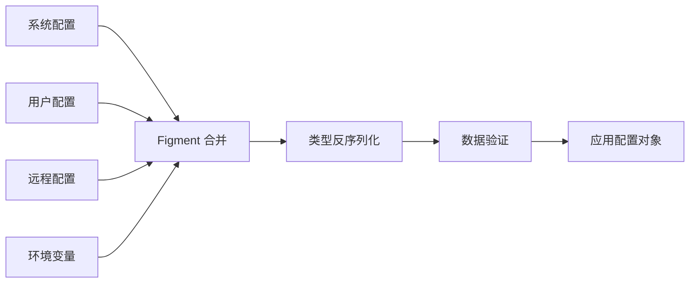
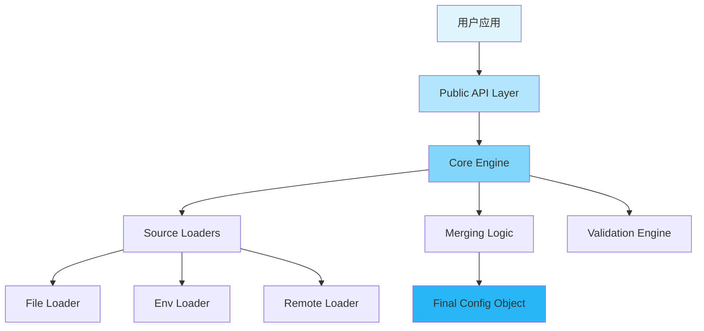

<div align="center">

# 🚀 Confers

<p>
  
  
  
  
</p>

<p align="center">
  <strong>现代化的 Rust 配置管理库：零样板代码 · 类型安全 · 生产就绪</strong>
</p>

<p align="center">
  <a href="#✨-特性">特性</a> •
  <a href="#🚀-快速开始">快速开始</a> •
  <a href="#📚-文档">文档</a> •
  <a href="#🎨-示例">示例</a> •
  <a href="#🤝-贡献">贡献</a>
</p>


</div>

---

## 📋 目录

<details open>
<summary>点击展开</summary>

- [✨ 特性](#-特性)
- [🎯 使用场景](#-使用场景)
- [🚀 快速开始](#-快速开始)
  - [安装](#安装)
  - [基础用法](#基础用法)
- [📚 文档](#-文档)
  - [核心概念](#核心概念)
  - [宏属性详解](#宏属性详解)
- [🎨 示例](#-示例)
- [🏗️ 架构设计](#️-架构设计)
- [🛠️ CLI 工具](#️-cli-工具)
- [⚙️ 高级配置](#️-高级配置)
- [🧪 测试与验证](#-测试与验证)
- [📊 性能优化](#-性能优化)
- [🔒 安全实践](#-安全实践)
- [🗺️ 路线图](#️-路线图)
- [🤝 贡献指南](#-贡献指南)
- [📄 许可证](#-许可证)
- [🙏 致谢](#-致谢)

</details>

---

## ✨ 特性

<table>
<tr>
<td width="50%">

### 🎯 核心特性

- ✅ **零样板代码** - 通过 `#[derive(Config)]` 一行搞定
- 🔄 **智能合并** - 自动合并多种配置源（Env/File/Remote）
- 🛡️ **类型安全** - 编译时类型检查，告别运行时错误
- 🔥 **热重载** - 配置文件修改后自动生效，无需重启
- ✅ **配置验证** - 集成 validator，支持丰富的验证规则

</td>
<td width="50%">

### ⚡ 进阶功能

- 📊 **审计日志** - 完整记录加载过程，敏感字段自动脱敏
- 🌐 **多格式支持** - TOML / JSON / YAML / INI
- ☁️ **远程配置** - 支持 Etcd / Consul / HTTP 配置中心
- 🔒 **加密支持** - 敏感字段加密存储，安全无忧
- 🛠️ **CLI 工具** - 模板生成、验证、差异对比

</td>
</tr>
</table>

<div align="center">

### 🎨 配置加载流程

</div>



---

## 🎯 使用场景

<details>
<summary><b>💼 微服务架构</b></summary>

<br>

对于分布式微服务，Confers 支持从 Etcd 或 Consul 动态获取配置，并支持热重载，确保服务在不停机的情况下更新配置。

```rust
use confers::{Config, ConfigLoader};

#[derive(Debug, Clone, Serialize, Deserialize, Config)]
pub struct ServiceConfig {
    pub port: u16,
    pub log_level: String,
}

#[tokio::main]
async fn main() -> Result<(), Box<dyn std::error::Error>> {
    let config: ServiceConfig = ConfigLoader::new()
        .with_etcd(
            confers::providers::EtcdConfigProvider::new(
                vec!["localhost:2379".to_string()],
                "/services/user-api"
            )
        )
        .with_file("config/local.toml")
        .load_async()
        .await?;

    println!("Service running on port {}", config.port);
    Ok(())
}
```

</details>

<details>
<summary><b>🔧 命令行工具 (CLI)</b></summary>

<br>

Confers 能够自动将配置字段映射到命令行参数，非常适合开发复杂的 CLI 工具，支持配置文件与命令行参数的完美融合。

</details>

<details>
<summary><b>🌐 云原生应用</b></summary>

<br>

完美支持环境变量覆盖，符合 12-Factor 应用原则，轻松适配 Docker 和 Kubernetes 环境。

</details>

---

## 🚀 快速开始

### 安装

<table>
<tr>
<td width="50%">

#### 🦀 Cargo.toml

```toml
[dependencies]
confers = "0.1.0"
serde = { version = "1.0", features = ["derive"] }
```

</td>
<td width="50%">

#### 🛠️ 可选特性

```toml
[dependencies]
confers = { version = "0.1.0", 
  features = ["watch", "remote", "audit", "schema", "parallel"] }
```

</td>
</tr>
</table>

**特性标志说明**:

- `watch`: 启用配置热重载（基于 notify）
- `remote`: 启用远程配置中心支持（Etcd / HTTP）
- `audit`: 启用审计日志与敏感字段脱敏
- `schema`: 启用 JSON Schema 生成支持
- `parallel`: 启用并行配置验证（基于 rayon）

### 基础用法

<table>
<tr>
<td width="50%">

**第 1 步：定义配置结构体**

```rust
use confers::Config;
use serde::{Deserialize, Serialize};

#[derive(Config, Serialize, Deserialize, Debug)]
#[config(env_prefix = "MYAPP_")]
struct AppConfig {
    #[config(default = "\"localhost\".to_string()")]
    host: String,
    
    #[config(default = "8080")]
    port: u16,
    
    debug: Option<bool>,
}
```

</td>
<td width="50%">

**第 2 步：加载并使用**

```rust
fn main() -> Result<(), Box<dyn std::error::Error>> {
    // 自动从多种来源加载配置
    let config = AppConfig::load()?;
    
    println!("服务器将在 {}:{} 启动", 
        config.host, config.port);
    
    Ok(())
}
```

</td>
</tr>
</table>

<details>
<summary><b>📄 查看配置文件示例 (config.toml)</b></summary>

<br>

```toml
# 服务器主机地址
host = "0.0.0.0"

# 服务器端口
port = 8080

# 启用调试模式
debug = true
```

</details>

<details>
<summary><b>🌍 环境变量覆盖</b></summary>

<br>

```bash
# 环境变量优先级高于配置文件
export MYAPP_PORT=9000
export MYAPP_DEBUG=false

# 运行应用
cargo run
```

</details>

<details>
<summary><b>⌨️ 命令行参数覆盖</b></summary>

<br>

```bash
# 命令行参数优先级最高
cargo run -- --port 3000 --host 127.0.0.1
```

</details>

---

---

## 📚 文档

<div align="center">

<table>
<tr>
<td align="center" width="25%">
<a href="https://docs.rs/confers">
<br>
<b>用户指南</b>
</a><br>
完整使用手册
</td>
<td align="center" width="25%">
<a href="https://docs.rs/confers">
<br>
<b>API 参考</b>
</a><br>
Rustdoc 自动文档
</td>
<td align="center" width="25%">
<a href="#🏗️-架构设计">
<br>
<b>架构设计</b>
</a><br>
系统设计与原理
</td>
<td align="center" width="25%">
<a href="#🎨-示例">
<br>
<b>代码示例</b>
</a><br>
实战代码展示
</td>
</tr>
</table>

</div>

### 核心概念

#### 配置源优先级

Confers 按以下优先级自动合并配置（从低到高）：

1.  **系统配置文件** - `/etc/{app_name}/config.*`
2.  **用户配置文件** - `~/.config/{app_name}/config.*`
3.  **远程配置中心** - Etcd / Consul / HTTP
4.  **指定配置文件** - `--config path/to/config.toml`
5.  **环境变量** - `{PREFIX}_KEY=value`
6.  **命令行参数** - `--key value` (最高优先级)

> **部分覆盖策略**：高优先级配置源只覆盖显式指定的字段，其他字段从低优先级获取。

### 宏属性详解

<details>
<summary><b>🏗️ 结构体级别属性 (Struct Attributes)</b></summary>

<br>

```rust
#[derive(Config)]
#[config(
    env_prefix = "MYAPP_",              // 环境变量前缀
    strict = false,                     // 严格模式（验证失败时报错）
    watch = true,                       // 启用热重载（需开启 watch 特性）
    format_detection = "ByContent",     // 格式检测方式 ("ByExtension" | "ByContent")
    audit_log = true,                   // 启用审计日志（需开启 audit 特性）
    audit_log_path = "./config.log",    // 审计日志路径
    
    // 远程配置（需开启 remote 特性）
    remote = "etcd://localhost:2379/app", // 远程配置地址
    remote_timeout = "5s",               // 远程请求超时
    remote_fallback = true,              // 远程加载失败时是否回退到本地配置
    remote_username = "user",            // 认证用户名
    remote_password = "pass",            // 认证密码
    remote_token = "token",              // 认证 Token（如用于 Consul/HTTP）
    remote_ca_cert = "ca.pem",           // TLS CA 证书路径
    remote_client_cert = "cert.pem",     // TLS 客户端证书路径
    remote_client_key = "key.pem"        // TLS 客户端私钥路径
)]
struct AppConfig { }
```

</details>

<details>
<summary><b>🧬 字段级别属性 (Field Attributes)</b></summary>

<br>

```rust
#[derive(Config)]
struct AppConfig {
    #[config(
        // 基础属性
        description = "字段描述",           // 用于生成文档和模板
        default = "8080",                  // 默认值（Rust 表达式）
        
        // 命名配置
        name_config = "server_port",       // 覆盖配置文件中的键名
        name_env = "SERVER_PORT",          // 覆盖默认环境变量名
        name_clap_long = "port",           // CLI 长选项名 (--port)
        name_clap_short = 'p',             // CLI 短选项 (-p)
        
        // 验证规则（内置支持，详见下方“配置验证”）
        validate = "range(min = 1, max = 65535)", 
        custom_validate = "my_validator",         // 自定义验证函数路径
        
        // 安全配置
        sensitive = true,                   // 敏感字段（审计日志脱敏，需开启 audit 特性）
        
        // 特殊标记
        flatten,                            // 展平嵌套结构
        skip                                // 跳过此字段（不从任何源加载）
    )]
    port: u16,
}
```

</details>

---

## 🎨 示例

<div align="center">

### 💡 核心功能展示

</div>

<table>
<tr>
<td width="50%">

#### 🛡️ 配置验证

```rust
#[derive(Config, Serialize, Deserialize)]
struct Config {
    #[config(validate = "range(min = 1, max = 65535)")]
    port: u16,
}
```

</td>
<td width="50%">

#### 🔥 热重载 (Watch)

```rust
use confers::{Config, ConfigWatcher};

#[derive(Config, Serialize, Deserialize, Clone)]
struct Config {
    port: u16,
}

// 使用 ConfigWatcher 实现热重载
let watcher = ConfigWatcher::new()?;
let config = watcher.load()?;

if watcher.is_enabled() {
    println!("热重载已启用，配置文件修改后将自动更新");
}
```

</td>
</tr>
<tr>
<td width="50%">

#### ☁️ 远程配置 (Etcd)

```rust
use confers::{Config, ConfigLoader};

#[derive(Config, Serialize, Deserialize)]
pub struct Config {
    pub database_url: String,
}

#[tokio::main]
async fn main() -> Result<(), Box<dyn std::error::Error>> {
    let config: Config = ConfigLoader::new()
        .with_etcd(
            confers::providers::EtcdConfigProvider::new(
                vec!["localhost:2379".to_string()],
                "/myapp/config"
            )
        )
        .load_async()
        .await?;

    println!("Database URL: {}", config.database_url);
    Ok(())
}
```

</td>
<td width="50%">

#### 🔒 敏感字段脱敏

```rust
#[derive(Config, Serialize, Deserialize)]
struct Config {
    #[config(sensitive = true)]
    api_key: String,
}
// 开启 audit 特性后，审计日志中自动显示为 "******"
```

</td>
</tr>
</table>

<div align="center">

**[📂 查看所有详细示例 →](examples/)**

</div>

### ⌨️ 命令行集成 (CLI Integration)

Confers 为配置结构体自动生成配套的 Clap 结构体（名称为 `[结构体名]ClapShadow`），这使得你可以轻松地将配置项暴露为命令行参数。

```rust
#[derive(Config)]
struct AppConfig {
    #[config(name_clap_long = "port", name_clap_short = 'p')]
    port: u16,
}

// 在你的 CLI 处理逻辑中
#[derive(Parser)]
struct Cli {
    #[command(flatten)]
    config_overrides: AppConfigClapShadow,
}
```

---

## 🏗️ 架构设计

<div align="center">

### 系统概览

</div>



<details>
<summary><b>📐 组件详情</b></summary>

<br>

| 组件 | 描述 | 状态 |
|-----------|-------------|--------|
| **API Layer** | 提供 `#[derive(Config)]` 和 `load()` 接口 | ✅ 稳定 |
| **Core Engine** | 协调加载、合并、验证的流水线 | ✅ 稳定 |
| **Loaders** | 处理不同数据源（文件、环境、远程）的加载 | ✅ 稳定 |
| **Merging** | 基于 Figment 实现的高级合并算法 | ✅ 稳定 |
| **Validation** | 基于 validator 的数据完整性检查 | ✅ 稳定 |

</details>

---

## 🛠️ CLI 工具

<div align="center">

### 命令行辅助开发

</div>

```bash
# 安装 CLI 工具
cargo install confers-cli

# 生成配置模板
confers generate --output config.toml

# 验证配置文件
confers validate --config config.toml

# 对比配置差异
confers diff production.toml staging.toml

# 导出 JSON Schema
confers schema --output schema.json
```

---

## ⚙️ 高级配置

<details>
<summary><b>🔥 配置热重载 (Hot Reload)</b></summary>

<br>

Confers 支持多种热重载模式：

```rust
// 方式 1: 异步订阅 (推荐)
let mut rx = watcher.subscribe();
tokio::spawn(async move {
    while rx.changed().await.is_ok() {
        let new_config = rx.borrow().clone();
        println!("配置已更新: {:?}", new_config);
    }
});

// 方式 2: 回调函数
watcher.on_change(|config| {
    println!("配置变更: {:?}", config);
});
```

</details>

<details>
<summary><b>☁️ 远程配置中心支持</b></summary>

<br>

支持以下远程配置中心：
- **Etcd**: `etcd://host:port/key`
- **Consul**: `consul://host:port/key`
- **HTTP/HTTPS**: `http://api.example.com/config`

</details>

<details>
<summary><b>📊 审计日志 (Audit Log)</b></summary>

<br>

Confers 会自动生成详细的审计日志，记录每个字段的来源和合并过程，同时自动脱敏敏感信息。

</details>

---

## 🧪 测试与验证

<div align="center">

### 🎯 测试覆盖率


</div>

```bash
# 运行所有测试
cargo test --all-features

# 运行性能基准测试
cargo bench

# 验证特定配置文件
confers validate --config config.toml
```

---

## 📊 性能优化

<table>
<tr>
<td width="50%">

#### 🚀 配置缓存

使用 `once_cell` 或 `lazy_static` 缓存配置对象，实现零开销访问。

```rust
static CONFIG: OnceCell<AppConfig> = OnceCell::new();
let config = CONFIG.get_or_init(|| AppConfig::load().unwrap());
```

</td>
<td width="50%">

#### 📉 延迟加载

通过 `Option<T>` 和 `skip` 属性实现大对象或复杂子配置的按需加载。

</td>
</tr>
</table>

---

## 🔒 安全实践

<div align="center">

### 🛡️ 安全特性

</div>

<table>
<tr>
<td align="center" width="25%">
<br>
<b>敏感字段脱敏</b><br>
自动过滤审计日志
</td>
<td align="center" width="25%">
<br>
<b>路径遍历防护</b><br>
严格限制访问路径
</td>
<td align="center" width="25%">
<br>
<b>静态加密</b><br>
敏感字段加密存储
</td>
<td align="center" width="25%">
<br>
<b>类型安全</b><br>
Rust 内存安全保障
</td>
</tr>
</table>

---

## 🤝 贡献指南

<div align="center">

### 💖 欢迎加入我们的社区！


</div>

<table>
<tr>
<td width="33%" align="center">

### 🐛 报告问题

发现 Bug？<br>
[提交 Issue](../../issues)

</td>
<td width="33%" align="center">

### 💡 建议功能

有好主意？<br>
[发起讨论](../../discussions)

</td>
<td width="33%" align="center">

### 🔧 提交 PR

想要贡献代码？<br>
[Fork & PR](../../pulls)

</td>
</tr>
</table>

---

## 📄 许可证

<div align="center">

本项目采用双重许可：

[](LICENSE-MIT)
[](LICENSE-APACHE)

您可以根据需要选择其中之一。

</div>

---

## 🙏 致谢

<div align="center">

### 基于以下优秀的开源项目构建

</div>

<table>
<tr>
<td align="center" width="25%">
<a href="https://github.com/serde-rs/serde">
<br>
<b>Serde</b>
</a>
</td>
<td align="center" width="25%">
<a href="https://github.com/SergioBenitez/Figment">
<br>
<b>Figment</b>
</a>
</td>
<td align="center" width="25%">
<a href="https://github.com/clap-rs/clap">
<br>
<b>Clap</b>
</a>
</td>
<td align="center" width="25%">
<a href="https://github.com/Keats/validator">
<br>
<b>Validator</b>
</a>
</td>
</tr>
</table>

---

<div align="center">

### 💝 支持本项目

如果你觉得 Confers 对你有帮助，请给一个 ⭐️ Star！

**由 Confers 团队用 ❤️ 构建**

[⬆ 返回顶部](#-confers)

---

<sub>© 2024 Confers Project. All rights reserved.</sub>

</div>