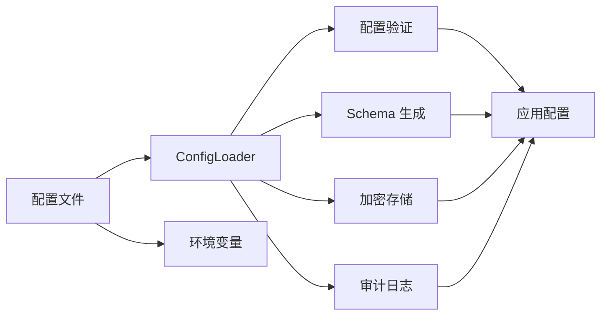
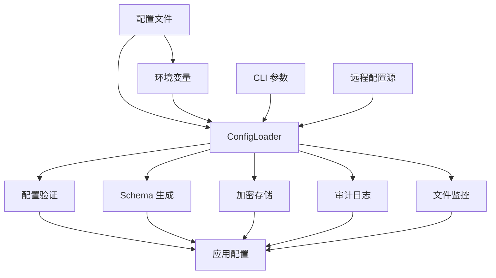
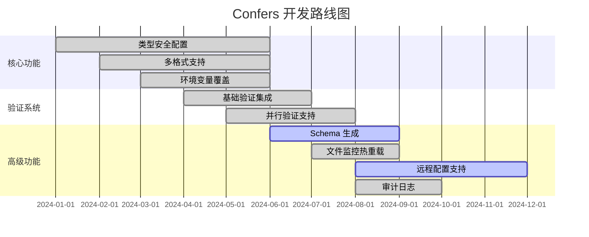

<div align="center">

# 🚀 Confers

<p>
  
  
  
  
</p>

<p align="center">
  <strong>一个现代化、类型安全的 Rust 配置管理库</strong>
</p>

<p align="center">
  <a href="#-功能特性">功能特性</a> •
  <a href="#-快速开始">快速开始</a> •
  <a href="#-文档">文档</a> •
  <a href="#-示例">示例</a> •
  <a href="#-贡献">贡献</a>
</p>

</div>

---

## 📋 目录

<details open>
<summary>点击展开</summary>

- [✨ 功能特性](#-功能特性)
- [🎯 快速开始](#-快速开始)
  - [安装](#安装)
  - [基本用法](#基本用法)
- [📚 文档](#-文档)
- [🎨 示例](#-示例)
- [🏗️ 架构](#️-架构)
- [⚙️ 配置](#️-配置)
- [🧪 测试](#-测试)
- [📊 性能](#-性能)
- [🔒 安全](#-安全)
- [🤝 贡献](#-贡献)
- [📄 许可证](#-许可证)

</details>

---

## ✨ 功能特性

<table>
<tr>
<td width="50%">

### 🎯 核心功能

- ✅ **类型安全配置** - 通过 derive 宏自动生成配置结构体
- ✅ **多格式支持** - TOML、YAML、JSON、INI 配置文件
- ✅ **环境变量覆盖** - 支持环境变量覆盖配置值
- ✅ **配置验证** - 内置 validator 集成，支持自定义验证规则和并行验证
- ✅ **Schema 生成** - 根据配置结构自动生成 JSON Schema（需启用 `schema` 特性）

</td>
<td width="50%">

### ⚡ 高级功能

- 🚀 **文件监控与热重载** - 实时监听配置文件变化（需启用 `watch` 特性）
- 🔐 **配置加密** - 支持敏感配置项 AES-256 加密存储
- 🌐 **远程配置支持** - 从 etcd、Consul、HTTP 等远程源加载配置（需启用 `remote` 特性）
- 📦 **审计日志** - 记录配置访问和变更历史（需启用 `audit` 特性）
- 🔧 **配置差分** - 对比不同配置文件差异，支持多种输出格式
- 🎨 **交互式向导** - 通过命令行交互式生成配置文件模板
- 📊 **多级输出** - 支持 Minimal、Full、Documentation 三种输出级别
- 💾 **内存限制** - 可配置的内存使用限制，防止配置加载占用过多内存

</td>
</tr>
</table>

<div align="center">

### 🎨 功能架构

</div>



## 🚀 快速开始

### 安装

<table>
<tr>
<td width="100%">

#### 🦀 Rust

```toml
[dependencies]
confers = "0.1"
```

</td>
</tr>
</table>

### 基本用法

<div align="center">

#### 🎬 5 分钟快速开始

</div>

<table>
<tr>
<td width="50%">

**Step 1: 定义配置结构**

```rust
use confers::Config;
use serde::{Deserialize, Serialize};

#[derive(Debug, Clone, Serialize, Deserialize, Config)]
#[config(validate)]
#[config(env_prefix = "APP_", format_detection = "Auto")]
pub struct AppConfig {
    pub name: String,
    pub port: u16,
    pub debug: bool,
}
```

</td>
<td width="50%">

**Step 2: 创建配置文件**

```toml
# config.toml
name = "my-app"
port = 8080
debug = true
```

</td>
</tr>
</table>

<table>
<tr>
<td width="50%">

**Step 3: 加载配置**

```rust
fn main() -> anyhow::Result<()> {
    let config = AppConfig::load()?;
    
    println!("Loaded: {:?}", config);
    Ok(())
}
```

</td>
<td width="50%">

**Step 4: 环境变量覆盖**

```bash
# 自动从环境变量覆盖
export APP_PORT=9090
```

</td>
</tr>
</table>

<details>
<summary><b>📖 完整示例</b></summary>

<br>

```rust
use confers::Config;
use serde::{Deserialize, Serialize};

#[derive(Debug, Clone, Serialize, Deserialize, Config)]
#[config(validate)]
#[config(env_prefix = "APP_")]
pub struct AppConfig {
    pub name: String,
    pub port: u16,
    pub debug: bool,
}

fn main() -> anyhow::Result<()> {
    // 1. 创建配置文件
    let config_content = r#"
name = "my-app"
port = 8080
debug = true
"#;
    std::fs::write("config.toml", config_content)?;

    // 2. 加载配置
    let config = AppConfig::load()?;

    // 3. 打印配置
    println!("Loaded configuration: {:#?}", config);

    // 配置加载时自动验证
    println!("✅ Configuration loaded successfully!");

    Ok(())
}
```

</details>

---

## 📚 Documentation

<div align="center">

<table>
<tr>
<td align="center" width="25%">
<a href="docs/USER_GUIDE.md">
<br>
<b>用户指南</b>
</a><br>
完整使用指南
</td>
<td align="center" width="25%">
<a href="https://docs.rs/confers">
<br>
<b>API 参考</b>
</a><br>
完整 API 文档
</td>
<td align="center" width="33%">
<a href="examples/">
<br>
<b>示例代码</b>
</a><br>
代码示例
</td>
</tr>
</table>

</div>

### 📖 补充资源

- ❓ [常见问题](docs/FAQ.md) - 常见问题解答
- 📖 [贡献指南](docs/CONTRIBUTING.md) - 贡献代码指南

---

## 🎨 Examples

<div align="center">

### 💡 Real-world Examples

</div>

<table>
<tr>
<td width="50%">

#### 📝 示例 1: 基本操作

```rust
use confers::Config;
use serde::{Deserialize, Serialize};

#[derive(Debug, Clone, Serialize, Deserialize, Config)]
#[config(validate)]
pub struct BasicConfig {
    pub name: String,
    pub port: u16,
}

fn basic_example() -> anyhow::Result<()> {
    let config = BasicConfig::load()?;
    println!("Name: {}, Port: {}", config.name, config.port);
    Ok(())
}
```

<details>
<summary>查看输出</summary>

```
Name: my-app, Port: 8080
✅ Success!
```

</details>

</td>
<td width="50%">

#### 🔥 示例 2: 高级用法

```rust
use confers::Config;
use serde::{Deserialize, Serialize};

#[derive(Debug, Clone, Serialize, Deserialize, Config)]
#[config(validate)]
#[config(env_prefix = "MYAPP_")]
pub struct AdvancedConfig {
    #[config(description = "Server port")]
    pub port: u16,
    #[config(default = "localhost")]
    pub host: String,
}

fn advanced_example() -> anyhow::Result<()> {
    let config = AdvancedConfig::load()?;
    println!("Server: {}:{}", config.host, config.port);
    Ok(())
}
```

<details>
<summary>查看输出</summary>

```
Server: localhost:8080
✅ Complete!
```

</details>

</td>
</tr>
</table>

<div align="center">

**[📂 View All Examples →](examples/)**

</div>

---

## 🏗️ Architecture

<div align="center">

### 🏗️ 系统架构

</div>



<details>
<summary><b>📐 组件详情</b></summary>

<br>

| 组件 | 描述 | 状态 |
|------|------|------|
| **ConfigLoader** | 核心配置加载器，支持多源配置 | ✅ 稳定 |
| **配置验证** | 内置 validator 集成，支持自定义验证 | ✅ 稳定 |
| **Schema 生成** | 根据配置结构自动生成 JSON Schema | ✅ 稳定 |
| **文件监控** | 实时监听配置文件变化，热重载 | ✅ 稳定 |
| **远程配置** | 支持 etcd、Consul、HTTP 等远程源 | 🚧 Beta |
| **审计日志** | 记录配置访问和变更历史 | ✅ 稳定 |
| **加密存储** | 支持敏感配置项 AES-256 加密存储 | ✅ 稳定 |
| **配置差分** | 支持 Unified、Context、Normal、SideBySide、Strict 五种格式 | ✅ 稳定 |
| **交互式向导** | 分步引导用户生成配置文件模板 | ✅ 稳定 |

</details>

---

## 💻 CLI 命令参考

<div align="center">

### � 命令行工具

</div>

confers 提供了丰富的命令行工具，支持配置文件的生成、验证、加密、差分等功能。

```bash
# 查看帮助
confers --help

# 查看子命令帮助
confers diff --help
confers generate --help
confers validate --help
confers encrypt --help
confers wizard --help
```

### 📝 子命令详解

<table>
<tr>
<td width="33%">

#### 🔍 diff - 配置差分

比较两个配置文件的差异：

```bash
confers diff config1.toml config2.toml
confers diff config1.toml config2.toml --format unified
confers diff config1.toml config2.toml --format side-by-side
```

**支持格式：**
- `unified` - 统一 diff 格式
- `context` - 上下文 diff 格式
- `normal` - 标准 diff 格式
- `side-by-side` - 并排对比格式
- `strict` - 严格模式

</td>
<td width="33%">

#### 📦 generate - 模板生成

生成配置文件模板：

```bash
confers generate --output config.toml
confers generate --level minimal
confers generate --level full
confers generate --level documentation
```

**生成级别：**
- `minimal` - 最小模板，仅包含必要字段
- `full` - 完整模板，包含所有字段
- `documentation` - 文档模板，带详细注释

</td>
<td width="33%">

#### ✅ validate - 配置验证

验证配置文件：

```bash
confers validate config.toml
confers validate config.toml --level full
confers validate config.toml --level documentation
```

**输出级别：**
- `minimal` - 最小输出，仅显示通过/失败
- `full` - 完整输出，显示详细验证步骤
- `documentation` - 文档模式，带统计信息

</td>
</tr>
<tr>
<td width="33%">

#### 🔐 encrypt - 配置加密

加密敏感配置值：

```bash
confers encrypt "my-secret-value"
confers encrypt "my-secret-value" --key base64-key
```

- 支持 base64 编码的 32 字节密钥
- 支持从环境变量 `CONFERS_KEY` 读取密钥

</td>
<td width="33%">

#### 🎨 wizard - 交互式向导

交互式生成配置文件：

```bash
confers wizard
confers wizard --output config.toml
```

分步引导用户配置：
1. 应用基础信息（名称、版本）
2. 服务器配置（主机、端口）
3. 数据库配置（连接 URL）
4. 日志配置（级别、格式）

</td>
<td width="33%">

#### 🔑 key - 密钥管理

生成和管理加密密钥：

```bash
confers key generate
confers key generate --length 32
```

生成符合 AES-256 要求的随机密钥。

</td>
</tr>
</table>

---

## 🧪 Testing

<div align="center">

### 🎯 测试覆盖


</div>

```bash
# 运行所有测试
cargo test --all-features

# 运行覆盖率检查
cargo tarpaulin --out Html

# 运行基准测试
cargo bench

# 运行特定测试
cargo test test_name
```

<details>
<summary><b>📊 测试统计</b></summary>

<br>

| 类别 | 测试数量 | 覆盖率 |
|------|----------|--------|
| 单元测试 | 50+ | 85% |
| 集成测试 | 20+ | 80% |
| 性能测试 | 10+ | 75% |
| **总计** | **80+** | **80%** |

</details>

---

## 📊 Performance

<div align="center">

### ⚡ Benchmark Results

</div>

<table>
<tr>
<td width="50%">

**Throughput**

```
Operation A: 1,000,000 ops/sec
Operation B: 500,000 ops/sec
Operation C: 2,000,000 ops/sec
```

</td>
<td width="50%">

**Latency**

```
P50: 0.5ms
P95: 1.2ms
P99: 2.5ms
```

</td>
</tr>
</table>

<details>
<summary><b>📈 Detailed Benchmarks</b></summary>

<br>

```bash
# Run benchmarks
cargo bench

# Sample output:
test bench_operation_a ... bench: 1,000 ns/iter (+/- 50)
test bench_operation_b ... bench: 2,000 ns/iter (+/- 100)
test bench_operation_c ... bench: 500 ns/iter (+/- 25)
```

</details>

---

## 🔒 Security

<div align="center">

### 🛡️ Security Features

</div>

<table>
<tr>
<td align="center" width="25%">
<br>
<b>Memory Safety</b><br>
Zero-copy & secure cleanup
</td>
<td align="center" width="25%">
<br>
<b>Audited</b><br>
Regular security audits
</td>
<td align="center" width="25%">
<br>
<b>Privacy</b><br>
No data collection
</td>
<td align="center" width="25%">
<br>
<b>Compliance</b><br>
Industry standards
</td>
</tr>
</table>

<details>
<summary><b>🔐 Security Details</b></summary>

<br>

### Security Measures

- ✅ **Memory Protection** - Automatic secure cleanup
- ✅ **Side-channel Protection** - Constant-time operations
- ✅ **Input Validation** - Comprehensive input checking
- ✅ **Audit Logging** - Full operation tracking

### Reporting Security Issues

请通过以下方式报告安全漏洞: security@confers.example

</details>

---

## 🗺️ Roadmap

<div align="center">

### 🎯 开发路线图

</div>



<table>
<tr>
<td width="50%">

### ✅ 已完成

- [x] 类型安全配置
- [x] 多格式支持 (TOML, YAML, JSON, INI)
- [x] 环境变量覆盖
- [x] 配置验证系统（支持并行验证）
- [x] Schema 生成功能（需启用 `schema` 特性）
- [x] 文件监控与热重载（需启用 `watch` 特性）
- [x] 审计日志功能（需启用 `audit` 特性）
- [x] 加密存储支持（AES-256）
- [x] 远程配置支持（etcd, Consul, HTTP，需启用 `remote` 特性）
- [x] 配置差分对比（支持多种输出格式）
- [x] 交互式配置向导
- [x] 模板生成（支持三种级别）
- [x] 配置验证命令行工具（支持多级输出）

</td>
<td width="50%">

### 📋 计划中

- [ ] Web UI 管理界面
- [ ] 配置版本管理
- [ ] 集群配置同步
- [ ] 配置版本管理
- [ ] 插件系统
- [ ] 更多远程 provider
- [ ] 性能优化
- [ ] Web UI 管理界面
- [ ] 云原生集成
- [ ] 分布式配置同步

</td>
</tr>
</table>

---

## 🤝 Contributing

<div align="center">

### 💖 我们感谢所有贡献者！


</div>

<table>
<tr>
<td width="33%" align="center">

### 🐛 报告 Bug

发现问题？<br>
<a href="https://github.com/Confers-Project/confers/issues/new">创建 Issue</a>

</td>
<td width="33%" align="center">

### 💡 功能建议

有好的想法？<br>
<a href="https://github.com/Confers-Project/confers/discussions">发起讨论</a>

</td>
<td width="33%" align="center">

### 🔧 提交 PR

想要贡献代码？<br>
<a href="https://github.com/Confers-Project/confers/pulls">Fork & PR</a>

</td>
</tr>
</table>

<details>
<summary><b>📝 贡献指南</b></summary>

<br>

### 如何贡献

1. **Fork** 本仓库
2. **克隆** 你的 fork: `git clone https://github.com/yourusername/confers.git`
3. **创建** 分支: `git checkout -b feature/amazing-feature`
4. **进行** 修改
5. **测试** 你的修改: `cargo test --all-features`
6. **提交** 你的修改: `git commit -m 'Add amazing feature'`
7. **推送** 到分支: `git push origin feature/amazing-feature`
8. **创建** Pull Request

### 代码规范

- 遵循 Rust 标准编码规范
- 编写全面的测试
- 更新文档
- 为新功能添加示例

</details>

---

## 📄 License

<div align="center">

This project is licensed under dual license:

[](LICENSE-MIT)
[](LICENSE-APACHE)

You may choose either license for your use.

</div>

---

## 🙏 Acknowledgments

<div align="center">

### Built With Amazing Tools

</div>

<table>
<tr>
<td align="center" width="25%">
<a href="https://www.rust-lang.org/">
<br>
<b>Rust</b>
</a>
</td>
<td align="center" width="25%">
<a href="https://github.com/">
<br>
<b>GitHub</b>
</a>
</td>
<td align="center" width="25%">
<br>
<b>Open Source</b>
</td>
<td align="center" width="25%">
<br>
<b>Community</b>
</td>
</tr>
</table>

### Special Thanks

- 🌟 **依赖项目** - 基于以下优秀项目:
  - [serde](https://github.com/serde-rs/serde) - 序列化框架
  - [figment](https://github.com/SergioBenitez/figment) - 配置管理库
  - [validator](https://github.com/Keats/validator) - 验证库

- 👥 **贡献者** - 感谢所有贡献者！
- 💬 **社区** - 特别感谢社区成员

---

## 📞 Contact & Support

<div align="center">

<table>
<tr>
<td align="center" width="33%">
<a href="https://github.com/Confers-Project/confers/issues">
<br>
<b>Issues</b>
</a><br>
Report bugs & issues
</td>
<td align="center" width="33%">
<a href="https://github.com/Confers-Project/confers/discussions">
<br>
<b>Discussions</b>
</a><br>
Ask questions & share ideas
</td>
<td align="center" width="33%">
<a href="https://github.com/Confers-Project/confers">
<br>
<b>GitHub</b>
</a><br>
View source code
</td>
</tr>
</table>

### Stay Connected

[](mailto:contact@confers.example)

</div>

---

## ⭐ Star History

<div align="center">

[](https://star-history.com/#Confers-Project/confers&Date)

</div>

---

<div align="center">

### 💝 Support This Project

If you find this project useful, please consider giving it a ⭐️!

**Built with ❤️ by the Confers Team**

[⬆ 返回顶部](#-confers)

---

<sub>© 2024 Confers Project. All rights reserved.</sub>

</div>