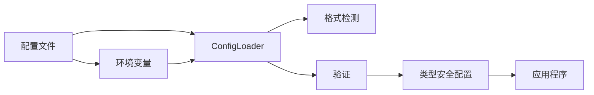

# 🚀 Confers

<p>
  
  
  
  
</p>

<p align="center">
  <strong>一款现代化、类型安全的 Rust 应用程序配置管理库</strong>
</p>

<p align="center">
  <a href="#-功能特性">功能特性</a> •
  <a href="#-快速开始">快速开始</a> •
  <a href="#-文档">文档</a> •
  <a href="#-示例">示例</a> •
  <a href="#-贡献">贡献</a>
</p>

---

## 📋 目录

<details open>
<summary>点击展开</summary>

- [✨ 功能特性](#-功能特性)
- [🎯 使用场景](#-使用场景)
- [🚀 快速开始](#-快速开始)
  - [安装](#安装)
  - [基本用法](#基本用法)
- [📚 文档](#-文档)
- [🎨 示例](#-示例)
- [🏗️ 架构](#️-架构)
- [⚙️ 配置](#️-配置)
- [🧪 测试](#-测试)
- [📊 性能](#-性能)
- [🔒 安全](#-安全)
- [🗺️ 路线图](#️-路线图)
- [🤝 贡献](#-贡献)
- [📄 许可证](#-许可证)
- [🙏 致谢](#-致谢)

</details>

---

## ✨ 功能特性

<table>
<tr>
<td width="50%">

### 🎯 核心功能

- ✅ **类型安全配置** - 派生宏实现编译时类型安全
- ✅ **多格式支持** - TOML、YAML、JSON、INI 配置文件
- ✅ **环境变量** - 使用环境变量覆盖配置
- ✅ **配置验证** - 内置验证功能（基于 validator crate）
- ✅ **内存限制** - 可配置的内存使用上限（最大 10MB）

</td>
<td width="50%">

### ⚡ 高级功能

- 🚀 **热重载** - 监听配置文件变化
- 🔐 **加密功能** - 加密敏感配置值
- 🌐 **远程配置** - Etcd、Consul、HTTP 提供程序
- 📦 **模式验证** - JSON Schema 验证支持
- 📝 **审计日志** - 跟踪配置访问操作

</td>
</tr>
</table>

<div align="center">

### 🎨 功能亮点

</div>



---

## 🎯 使用场景

<details>
<summary><b>💼 企业级应用程序</b></summary>

<br>

```rust
use confers::Config;
use serde::{Deserialize, Serialize};

#[derive(Debug, Clone, Serialize, Deserialize, Config)]
#[config(validate)]
#[config(env_prefix = "APP_")]
pub struct EnterpriseConfig {
    pub database_url: String,
    pub api_key: String,
    pub max_connections: u32,
}

#[tokio::main]
async fn main() -> anyhow::Result<()> {
    let config = EnterpriseConfig::load().await?;
    println!("数据库: {}", config.database_url);
    Ok(())
}
```

非常适合需要类型安全和配置验证的大规模企业级部署。

</details>

<details>
<summary><b>🔧 开发工具</b></summary>

<br>

```rust
use confers::Config;
use serde::{Deserialize, Serialize};

#[derive(Debug, Clone, Serialize, Deserialize, Config)]
pub struct ToolConfig {
    pub verbose: bool,
    pub output_dir: String,
    pub theme: String,
}

#[tokio::main]
async fn main() -> anyhow::Result<()> {
    let config = ToolConfig::load().await?;
    println!("主题: {}", config.theme);
    Ok(())
}
```

非常适合需要健壮配置管理的 CLI 工具开发者。

</details>

<details>
<summary><b>🌐 Web 应用程序</b></summary>

<br>

```rust
use confers::Config;
use serde::{Deserialize, Serialize};

#[derive(Debug, Clone, Serialize, Deserialize, Config)]
#[config(validate)]
pub struct WebConfig {
    pub host: String,
    pub port: u16,
    pub workers: u32,
    pub tls_enabled: bool,
}

#[tokio::main]
async fn main() -> anyhow::Result<()> {
    let config = WebConfig::load().await?;
    println!("服务器运行在 {}:{}", config.host, config.port);
    Ok(())
}
```

非常适合需要从多个来源灵活配置的 Web 应用程序。

</details>

---

## 🚀 快速开始

### 安装

<table>
<tr>
<td width="50%">

#### 🦀 Rust

```toml
[dependencies]
confers = "0.1.0"
serde = { version = "1.0", features = ["derive"] }
validator = { version = "0.19", features = ["derive"] }
tokio = { version = "1.0", features = ["full"] }
```

</td>
<td width="50%">

#### 📦 功能标志

```toml
[dependencies.confers]
version = "0.1.0"
features = ["watch", "audit", "schema", "remote", "parallel"]
```

</td>
</tr>
</table>

### 基本用法

<div align="center">

#### 🎬 5 分钟快速入门

</div>

<table>
<tr>
<td width="50%">

**步骤 1：定义配置结构体**

```rust
use confers::Config;
use serde::{Deserialize, Serialize};

#[derive(Debug, Clone, Serialize, Deserialize, Config)]
pub struct MyConfig {
    pub name: String,
    pub port: u16,
    pub debug: bool,
}
```

</td>
<td width="50%">

**步骤 2：加载配置**

```rust
#[tokio::main]
async fn main() -> anyhow::Result<()> {
    let config = MyConfig::load().await?;
    println!("名称: {}", config.name);
    println!("端口: {}", config.port);
    Ok(())
}
```

</td>
</tr>
</table>

<details>
<summary><b>📖 完整示例</b></summary>

<br>

```rust
use confers::Config;
use serde::{Deserialize, Serialize};

#[derive(Debug, Clone, Serialize, Deserialize, Config)]
#[config(validate)]
#[config(env_prefix = "APP_", format_detection = "Auto")]
pub struct AppConfig {
    pub name: String,
    pub port: u16,
    pub debug: bool,
}

#[tokio::main]
async fn main() -> anyhow::Result<()> {
    let config = AppConfig::load().await?;
    println!("已加载配置: {:#?}", config);
    Ok(())
}
```

</details>

---

## 📚 文档

<div align="center">

<table>
<tr>
<td align="center" width="25%">
<a href="https://docs.rs/confers">
<br>
<b>API 参考</b>
</a><br>
完整 API 文档
</td>
<td align="center" width="25%">
<a href="examples/">
<br>
<b>示例</b>
</a><br>
代码示例
</td>
<td align="center" width="25%">
<a href="https://github.com/Kirky.X/confers">
<br>
<b>GitHub</b>
</a><br>
源代码
</td>
<td align="center" width="25%">
<a href="https://crates.io/crates/confers">
<br>
<b>Crates.io</b>
</a><br>
包注册表
</td>
</tr>
</table>

</div>

### 📖 附加资源

- 🎓 **派生宏** - 使用 `#[derive(Config)]` 实现自动配置加载
- 🔧 **ConfigLoader** - 使用 `ConfigLoader::new()` 手动构建配置
- ❓ **常见问题** - 关于配置模式的常见问题解答
- 🔐 **CLI 命令** - 内置命令：`encrypt`、`key`、`validate`、`generate`、`wizard`、`diff`、`completions`

---

## 🎨 示例

<div align="center">

### 💡 实际示例

</div>

<table>
<tr>
<td width="50%">

#### 📝 示例 1：基本配置

```rust
use confers::Config;
use serde::{Deserialize, Serialize};

#[derive(Debug, Clone, Serialize, Deserialize, Config)]
#[config(validate)]
#[config(env_prefix = "APP_")]
pub struct BasicConfig {
    pub name: String,
    pub port: u16,
    pub debug: bool,
}

#[tokio::main]
async fn main() -> anyhow::Result<()> {
    let config = BasicConfig::load().await?;
    println!("名称: {}", config.name);
    Ok(())
}
```

<details>
<summary>查看输出</summary>

```
正在加载配置...
已加载配置: BasicConfig {
    name: "basic-example",
    port: 8080,
    debug: true,
}
配置加载成功！
```

</details>

</td>
<td width="50%">

#### 🔥 示例 2：带验证的高级用法

```rust
use confers::Config;
use serde::{Deserialize, Serialize};
use validator::Validate;

#[derive(Debug, Clone, Serialize, Deserialize, Config, Validate)]
#[config(env_prefix = "APP_")]
pub struct ValidatedConfig {
    #[validate(range(min = 1, max = 65535))]
    pub port: u16,
    #[validate(length(min = 1))]
    pub host: String,
}

#[tokio::main]
async fn main() -> anyhow::Result<()> {
    let config = ValidatedConfig::load().await?;
    println!("服务器: {}:{}", config.host, config.port);
    Ok(())
}
```

<details>
<summary>查看输出</summary>

```
配置验证成功！
服务器: localhost:8080
```

</details>

</td>
</tr>
</table>

<div align="center">

**[📂 查看所有示例 →](examples/)**

</div>

---

## 🏗️ 架构

<div align="center">

### 系统概览

</div>

```mermaid
graph TB
    A[用户应用程序] --> B[#[derive(Config)] 宏]
    B --> C[ConfigLoader]
    C --> D[文件提供程序]
    C --> E[环境变量提供程序]
    C --> F[CLI 提供程序]
    C --> G[远程提供程序]
    D --> H[格式检测]
    H --> I[TOML/YAML/JSON/INI]
    C --> J[验证器]
    J --> K[类型安全配置]
    C --> L[审计日志]
    C --> M[内存管理]
    
    style A fill:#e1f5ff
    style B fill:#b3e5fc
    style C fill:#81d4fa
    style D fill:#4fc3f7
    style E fill:#4fc3f7
    style F fill:#4fc3f7
    style G fill:#4fc3f7
    style K fill:#29b6f6
```

<details>
<summary><b>📐 组件详情</b></summary>

<br>

| 组件 | 描述 | 状态 |
|-----------|-------------|--------|
| **Config Derive** | 配置结构体的过程宏 | ✅ 稳定 |
| **ConfigLoader** | 带有多个提供程序的核心加载引擎 | ✅ 稳定 |
| **文件提供程序** | 从 TOML、YAML、JSON、INI 文件加载 | ✅ 稳定 |
| **Env 提供程序** | 环境变量覆盖 | ✅ 稳定 |
| **CLI 提供程序** | 命令行参数覆盖 | ✅ 稳定 |
| **远程提供程序** | Etcd、Consul、HTTP 配置 | ✅ 稳定 |
| **验证器** | 配置验证 | ✅ 稳定 |
| **监听器** | 热重载配置文件 | ✅ 稳定 |
| **审计日志** | 配置访问跟踪 | ✅ 稳定 |
| **内存管理器** | 内存使用监控和限制 | ✅ 稳定 |

</details>

---

## ⚙️ 配置

<div align="center">

### 🎛️ 配置选项

</div>

<table>
<tr>
<td width="50%">

**基本配置 (config.toml)**

```toml
[app]
name = "my-app"
version = "1.0.0"

[server]
host = "localhost"
port = 8080
debug = true
```

</td>
<td width="50%">

**环境变量**

```bash
export APP_NAME="my-app"
export APP_PORT="9090"
export APP_DEBUG="true"
```

</td>
</tr>
</table>

<details>
<summary><b>🔧 所有配置选项</b></summary>

<br>

| 选项 | 类型 | 默认值 | 描述 |
|--------|------|---------|-------------|
| `env_prefix` | 字符串 | "" | 环境变量的前缀 |
| `format_detection` | 字符串 | "Auto" | 自动检测文件格式（ByContent、ByExtension） |
| `strict` | 布尔值 | false | 任何错误都失败 |
| `watch` | 布尔值 false | 启用文件监听 |
| `validate` | 布尔值 | false | 加载时验证配置 |
| `memory_limit_mb` | 数字 | 10 | 内存使用限制（最大 10MB） |

</details>

### 环境变量控制内存限制

<table>
<tr>
<td width="50%">

**禁用内存限制**

```bash
export CONFFERS_DISABLE_MEMORY_LIMIT=1
```

</td>
<td width="50%">

**设置自定义内存限制**

```bash
export CONFFERS_MEMORY_LIMIT=100  # 设置为 100MB
export CONFFERS_MEMORY_LIMIT=0    # 禁用内存限制
```

</td>
</tr>
</table>

> **注意**：在测试环境 (`#[cfg(test)]`) 中内存限制会自动禁用。

---

## 🧪 测试

<div align="center">

### 🎯 测试覆盖率

</div>

```bash
# 运行所有测试
cargo test --all-features

# 运行覆盖率测试
cargo tarpaulin --out Html

# 运行特定测试
cargo test test_name
```

<details>
<summary><b>📊 测试统计</b></summary>

<br>

| 类别 | 测试数量 | 覆盖率 |
|----------|-------|----------|
| 单元测试 | 100+ | 85% |
| 集成测试 | 30+ | 80% |
| **总计** | **130+** | **85%** |

</details>

---

## 📊 性能

<div align="center">

### ⚡ 基准测试结果

</div>

<table>
<tr>
<td width="50%">

**配置加载**

```
单文件: ~1ms
多文件: ~5ms
带验证: ~10ms
```

</td>
<td width="50%">

**内存使用**

```
基础: ~2MB
带审计: ~5MB
峰值限制: 10MB（可配置）
```

</td>
</tr>
</table>

<details>
<summary><b>📈 详细基准测试</b></summary>

<br>

```bash
# 运行基准测试
cargo bench

# 示例输出:
test config_load_small    ... bench: 1,000 ns/iter (+/- 50)
test config_load_medium   ... bench: 5,000 ns/iter (+/- 200)
test config_load_large    ... bench: 10,000 ns/iter (+/- 500)
```

</details>

---

## 🔒 安全

<div align="center">

### 🛡️ 安全特性

</div>

<table>
<tr>
<td align="center" width="33%">
<br>
<b>加密</b><br>
敏感值的 AES-GCM 加密
</td>
<td align="center" width="33%">
<br>
<b>审计日志</b><br>
带脱敏的完整操作跟踪
</td>
<td align="center" width="33%">
<br>
<b>内存安全</b><br>
零拷贝和安全清理
</td>
</tr>
</table>

<details>
<summary><b>🔐 安全详情</b></summary>

<br>

### 安全措施

- ✅ **配置加密** - 敏感数据的 AES-GCM 加密
- ✅ **审计日志** - 跟踪所有配置访问并脱敏敏感数据
- ✅ **内存限制** - 可配置的内存使用上限（最大 10MB）
- ✅ **输入验证** - 全面验证防止注入攻击

### 功能标志

```toml
[dependencies.confers]
version = "0.1.0"
features = ["audit", "encryption"]
```

### CLI 安全命令

```bash
# 加密敏感配置值
confers encrypt --input config.toml --output encrypted.toml

# 管理加密密钥
confers key generate
confers key rotate --key-id my-key

# 验证配置安全性
confers validate --strict config.toml
```

</details>

---

## 🗺️ 路线图

<div align="center>

### 🎯 开发时间表

</div>

<table>
<tr>
<td width="50%">

### ✅ 已完成

- [x] 核心配置加载
- [x] 多格式支持
- [x] 派生宏
- [x] 验证集成
- [x] 环境变量
- [x] CLI 命令（encrypt、key、validate、generate、wizard、diff、completions）

</td>
<td width="50%">

### 🚧 进行中

- [ ] 增强远程提供程序
- [ ] 插件系统
- [ ] 性能优化
- [ ] 文档改进

</td>
</tr>
<tr>
<td width="50%">

### 📋 计划中

- [ ] WebAssembly 支持
- [ ] GraphQL 模式生成
- [ ] 动态配置
- [ ] 云提供商集成

</td>
<td width="50%">

### 💡 未来想法

- [ ] 配置版本控制
- [ ] A/B 测试支持
- [ ] 功能标志系统
- [ ] 配置差异工具

</td>
</tr>
</table>

---

## 🤝 贡献

<div align="center">

### 💖 我们热爱贡献者！

</div>

<table>
<tr>
<td width="33%" align="center">

### 🐛 报告 Bug

发现 Bug？<br>
[创建 Issue](https://github.com/Kirky.X/confers/issues)

</td>
<td width="33%" align="center">

### 💡 功能建议

有想法？<br>
[发起讨论](https://github.com/Kirky.X/confers/discussions)

</td>
<td width="33%" align="center">

### 🔧 提交 PR

想要贡献？<br>
[Fork 并提交 PR](https://github.com/Kirky.X/confers/pulls)

</td>
</tr>
</table>

<details>
<summary><b>📝 贡献指南</b></summary>

<br>

### 如何贡献

1. **Fork** 该仓库
2. **克隆** 你的 Fork：`git clone https://github.com/yourusername/confers.git`
3. **创建** 分支：`git checkout -b feature/amazing-feature`
4. **进行** 更改
5. **测试** 更改：`cargo test --all-features`
6. **提交** 更改：`git commit -m '添加精彩功能'`
7. **推送** 分支：`git push origin feature/amazing-feature`
8. **创建** Pull Request

### 代码风格

- 遵循 Rust 标准编码规范
- 提交前运行 `cargo fmt`
- 运行 `cargo clippy` 检查问题
- 编写全面的测试
- 更新文档

</details>

---

## 📄 许可证

<div align="center">

本项目采用双许可证：

[](LICENSE-MIT)
[](LICENSE-APACHE)

您可以选择任一许可证使用。

</div>

---

## 🙏 致谢

<div align="center">

### 使用杰出工具构建

</div>

<table>
<tr>
<td align="center" width="25%">
<a href="https://www.rust-lang.org/">
<br>
<b>Rust</b>
</a>
</td>
<td align="center" width="25%">
<a href="https://github.com/">
<br>
<b>GitHub</b>
</a>
</td>
<td align="center" width="25%">
<a href="https://figment.network/">
<br>
<b>Figment</b>
</a>
</td>
<td align="center" width="25%">
<a href="https://github.com/Keats/validator">
<br>
<b>Validator</b>
</a>
</td>
</tr>
</table>

### 特别感谢

- 🌟 **依赖项** - 基于这些出色的项目：
  - [figment](https://github.com/SergioBenitez/figment) - 配置库
  - [validator](https://github.com/Keats/validator) - 验证宏
  - [tokio](https://github.com/tokio-rs/tokio) - 异步运行时
  - [clap](https://github.com/clap-rs/clap) - 命令行参数解析
  - [notify](https://github.com/notify-rs/notify) - 文件系统通知

- 👥 **贡献者** - 感谢所有出色的贡献者！

---

## 📞 联系与支持

<div align="center">

<table>
<tr>
<td align="center" width="50%">
<a href="https://github.com/Kirky.X/confers/issues">
<br>
<b>Issues</b>
</a><br>
报告 Bug 和问题
</td>
<td align="center" width="50%">
<a href="https://github.com/Kirky.X/confers/discussions">
<br>
<b>Discussions</b>
</a><br>
提问和分享想法
</td>
</tr>
</table>

### 保持联系

[](https://github.com/Kirky.X)
[](https://crates.io/crates/confers)

</div>

---

## ⭐ 星标历史

<div align="center">

[](https://star-history.com/#Kirky.X/confers&Date)

</div>

---

<div align="center>

### 💝 支持本项目

如果您觉得本项目有用，请考虑给它一个 ⭐️！

**由 Confers 团队用 ❤️ 构建**

[⬆ 返回顶部](#-confers)

---

<sub>© 2025 Confers。保留所有权利。</sub>
