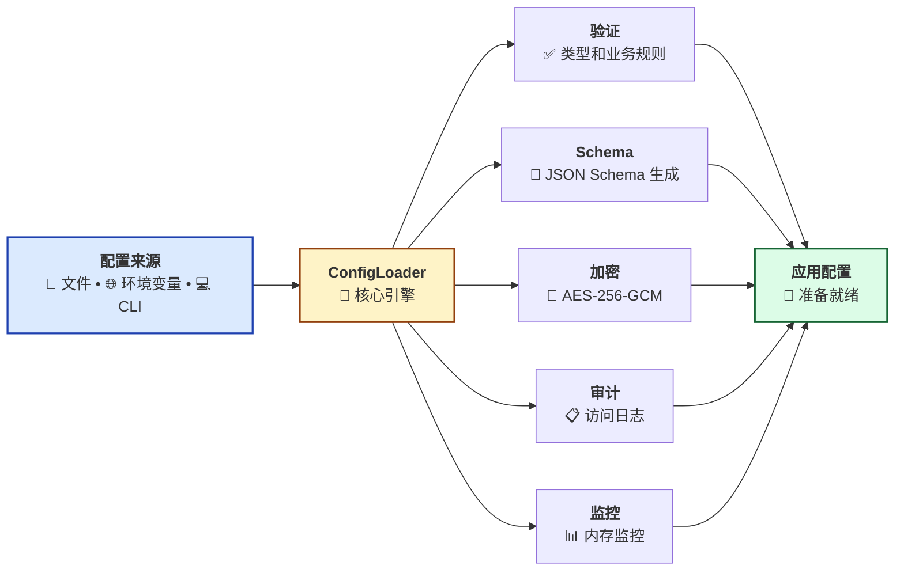
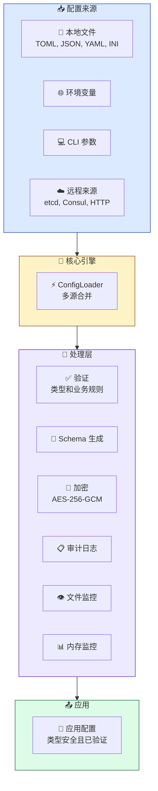

<span id="top"></span>
<div align="center">


<p>
  <!-- CI/CD 状态 -->
  <a href="https://github.com/Kirky-X/confers/actions/workflows/ci.yml">
    
  </a>
  <!-- 版本 -->
  <a href="https://crates.io/crates/confers">
    
  </a>
  <!-- 文档 -->
  <a href="https://docs.rs/confers">
    
  </a>
  <!-- 下载量 -->
  <a href="https://crates.io/crates/confers">
    
  </a>
  <!-- 许可证 -->
  <a href="https://github.com/Kirky-X/confers/blob/main/LICENSE">
    
  </a>
  <!-- Rust 版本 -->
  <a href="https://www.rust-lang.org/">
    
  </a>
  <!-- 覆盖率 -->
  <a href="https://codecov.io/gh/Kirky-X/confers">
    
  </a>
</p>

<p align="center">
  <strong>一个现代化、类型安全的 Rust 配置管理库</strong>
</p>

<p align="center">
  <a href="#features" style="color:#3B82F6">✨ 功能特性</a> •
  <a href="#quick-start" style="color:#3B82F6">🚀 快速开始</a> •
  <a href="#documentation" style="color:#3B82F6">📚 文档</a> •
  <a href="#examples" style="color:#3B82F6">💻 示例</a> •
  <a href="#contributing" style="color:#3B82F6">🤝 贡献</a>
</p>

</div>

---

<!-- 英雄区域 -->

### 🎯 零样板代码配置管理

Confers 提供了一种**声明式**的配置管理方法：

| ✨ 类型安全 | 🔄 自动重载 | 🔐 AES-256 加密 | 🌐 远程源 |
|:---------:|:----------:|:--------------:|:--------:|
| 编译时检查 | 热重载支持 | 敏感数据保护 | etcd, Consul, HTTP |

```rust
use confers::Config;
use serde::{Deserialize, Serialize};

#[derive(Debug, Clone, Serialize, Deserialize, Config)]
#[config(validate)]
pub struct AppConfig {
    pub name: String,
    pub port: u16,
    pub debug: bool,
}

// 配置自动从文件、环境变量和 CLI 参数加载
let config = AppConfig::load()?;
```


---

## 📋 目录

<details open style="padding:16px">
<summary style="cursor:pointer; font-weight:600; color:#1E293B">📑 目录（点击展开）</summary>

- [✨ 功能特性](#features)
- [🚀 快速开始](#quick-start)
  - [📦 安装](#installation)
  - [💡 基本用法](#basic-usage)
- [📚 文档](#documentation)
- [💻 示例](#examples)
- [🏗️ 架构](#architecture)
- [💻 CLI 命令参考](#cli-reference)
- [🧪 测试](#testing)
- [📊 性能](#performance)
- [🔒 安全](#security)
- [🗺️ 路线图](#roadmap)
- [🤝 贡献](#contributing)
- [📄 许可证](#license)
- [🙏 致谢](#acknowledgments)

</details>

---

## <span id="features">✨ 功能特性</span>

<div align="center" style="margin: 24px 0">

| 🎯 核心功能 | ⚡ 可选功能 |
|:----------:|:----------:|
| 始终可用 | 按需启用 |

</div>

<table style="width:100%; border-collapse: collapse">
<tr>
<td width="50%" style="vertical-align:top; padding: 16px">

### 🎯 核心功能（始终可用）

| 状态 | 功能 | 描述 |
|:----:|------|------|
| ✅ | **类型安全配置** | 通过 derive 宏自动生成配置结构体（`derive` 特性） |
| ✅ | **多格式支持** | TOML、YAML、JSON、INI 配置文件 |
| ✅ | **环境变量覆盖** | 支持环境变量覆盖配置值 |
| ✅ | **CLI 参数覆盖** | 支持命令行参数覆盖（`cli` 特性） |

</td>
<td width="50%" style="vertical-align:top; padding: 16px">

### ⚡ 可选功能

| 状态 | 功能 | 描述 |
|:----:|------|------|
| 🔍 | **配置验证** | 内置 validator 集成（`validation` 特性） |
| 📊 | **Schema 生成** | 根据配置结构自动生成 JSON Schema（`schema` 特性） |
| 🚀 | **文件监控与热重载** | 实时监听配置文件变化（`watch` 特性） |
| 🔐 | **配置加密** | 支持敏感配置项 AES-256 加密存储（`encryption` 特性） |
| 🌐 | **远程配置支持** | 从 etcd、Consul、HTTP 加载配置（`remote` 特性） |
| 📦 | **审计日志** | 记录配置访问和变更历史（`audit` 特性） |
| ⚡ | **并行验证** | 大型配置的并行验证（`parallel` 特性） |
| 📈 | **系统监控** | 内存使用监控（`monitoring` 特性） |
| 🔧 | **配置差分** | 对比不同配置文件差异，支持多种输出格式 |
| 🎨 | **交互式向导** | 通过命令行交互式生成配置文件模板 |
| 🛡️ | **安全增强** | Nonce 重用检测、SSRF 防护、安全密钥管理 |

</td>
</tr>
</table>

### 📦 特性预设

| 预设 | 特性 | 使用场景 |
|------|------|----------|
| <span style="color:#166534; padding:4px 8px">minimal</span> | `derive` | 最小化配置加载（无验证、无 CLI） |
| <span style="color:#1E40AF; padding:4px 8px">recommended</span> | `derive`, `validation` | **推荐大多数应用使用** |
| <span style="color:#92400E; padding:4px 8px">dev</span> | `derive`, `validation`, `cli`, `schema`, `audit`, `monitoring`, `tracing` | 开发环境，包含所有工具 |
| <span style="color:#991B1B; padding:4px 8px">production</span> | `derive`, `validation`, `watch`, `encryption`, `remote`, `monitoring`, `tracing` | 生产就绪的配置 |
| <span style="color:#5B21B6; padding:4px 8px">full</span> | 所有特性 | 完整功能集 |

**注意：** `cli` 特性会自动包含 `derive`、`validation` 和 `encryption` 依赖。

<div align="center" style="margin: 24px 0">

### 🎨 功能架构

</div>



---

## <span id="quick-start">🚀 快速开始</span>

### <span id="installation">📦 安装</span>

<table style="width:100%; border-collapse: collapse">
<tr>
<td width="100%" style="padding: 16px">

#### 🦀 Rust 安装

| 安装类型 | 配置 | 使用场景 |
|----------|------|----------|
| **默认** | `confers = "0.2.2"` | 仅包含 `derive` (最小配置加载) |
| **最小化** | `confers = { version = "0.2.2", default-features = false, features = ["minimal"] }` | 仅配置加载 (与默认相同) |
| **推荐** | `confers = { version = "0.2.2", default-features = false, features = ["recommended"] }` | 配置 + 验证 |
| **CLI工具** | `confers = { version = "0.2.2", features = ["cli"] }` | CLI 及验证和加密功能 |
| **完整** | `confers = { version = "0.2.2", features = ["full"] }` | 所有功能 |

**单独特性：**

| 特性 | 描述 | 默认 |
|------|------|------|
| `derive` | 配置结构体的 derive 宏 | ✅ |
| `validation` | 配置验证支持 | ❌ |
| `cli` | 命令行工具 | ❌ |
| `watch` | 文件监控和热重载 | ❌ |
| `audit` | 审计日志 | ❌ |
| `schema` | JSON Schema 生成 | ❌ |
| `parallel` | 并行验证 | ❌ |
| `monitoring` | 系统监控 | ❌ |
| `remote` | 远程配置 (etcd, consul, http) | ❌ |
| `encryption` | 配置加密 | ❌ |

</td>
</tr>
</table>

### <span id="basic-usage">💡 基本用法</span>

<div align="center" style="margin: 24px 0">

#### 🎬 5 分钟快速开始

**必需特性**: `derive`, `validation` (使用: `features = ["recommended"]`)

<table style="width:100%; border-collapse: collapse">
<tr>
<td width="50%" style="padding: 16px; vertical-align:top">

**步骤 1：定义配置结构**

```rust
use confers::Config;
use serde::{Deserialize, Serialize};

#[derive(Debug, Clone, Serialize, Deserialize, Config)]
#[config(validate)]
#[config(env_prefix = "APP_")]
pub struct AppConfig {
    pub name: String,
    pub port: u16,
    pub debug: bool,
}
```

</td>
<td width="50%" style="padding: 16px; vertical-align:top">

**步骤 2：创建配置文件**

```toml
# config.toml
name = "my-app"
port = 8080
debug = true
```

</td>
</tr>
<tr>
<td width="50%" style="padding: 16px; vertical-align:top">

**步骤 3：加载配置**

```rust
fn main() -> anyhow::Result<()> {
    let config = AppConfig::load()?;
    println!("✅ 已加载: {:?}", config);
    Ok(())
}
```

</td>
<td width="50%" style="padding: 16px; vertical-align:top">

**步骤 4：环境变量覆盖**

```bash
# 环境变量自动覆盖
export APP_PORT=9090
export APP_DEBUG=true
```

</td>
</tr>
</table>

<details style="padding:16px; margin: 16px 0">
<summary style="cursor:pointer; font-weight:600; color:#166534">📖 完整工作示例</summary>

```rust
use confers::Config;
use serde::{Deserialize, Serialize};

#[derive(Debug, Clone, Serialize, Deserialize, Config)]
#[config(validate)]
#[config(env_prefix = "APP_")]
pub struct AppConfig {
    pub name: String,
    pub port: u16,
    pub debug: bool,
}

fn main() -> anyhow::Result<()> {
    // 创建配置文件
    let config_content = r#"
name = "my-app"
port = 8080
debug = true
"#;
    std::fs::write("config.toml", config_content)?;

    // 加载配置
    let config = AppConfig::load()?;

    // 打印配置
    println!("🎉 配置加载成功！");
    println!("📋 名称: {}", config.name);
    println!("🔌 端口: {}", config.port);
    println!("🐛 调试: {}", config.debug);

    Ok(())
}
```

</details>

---

## <span id="documentation">📚 文档</span>

<div align="center" style="margin: 24px 0">

<table style="width:100%; max-width: 800px">
<tr>
<td align="center" width="33%" style="padding: 16px">
<a href="docs/USER_GUIDE.md" style="text-decoration:none">
<div style="padding: 24px; transition: transform 0.2s">
<br>
<b style="color:#1E293B">用户指南</b>
</div>
</a>
<br><span style="color:#64748B">完整使用指南</span>
</td>
<td align="center" width="33%" style="padding: 16px">
<a href="https://docs.rs/confers" style="text-decoration:none">
<div style="padding: 24px; transition: transform 0.2s">
<br>
<b style="color:#1E293B">API 参考</b>
</div>
</a>
<br><span style="color:#64748B">完整 API 文档</span>
</td>
<td align="center" width="33%" style="padding: 16px">
<a href="examples/" style="text-decoration:none">
<div style="padding: 24px; transition: transform 0.2s">
<br>
<b style="color:#1E293B">示例代码</b>
</div>
</a>
<br><span style="color:#64748B">代码示例</span>
</td>
</tr>
</table>

</div>

### 📖 补充资源

| 资源 | 描述 |
|------|------|
| ❓ [常见问题](docs/FAQ.md) | 常见问题解答 |
| 📖 [贡献指南](docs/CONTRIBUTING.md) | 贡献代码指南 |
| 📘 [API 参考](docs/API_REFERENCE.md) | 完整 API 文档 |
| 🏗️ [架构决策](docs/architecture_decisions.md) | ADR 文档 |

---

## <span id="examples">💻 示例</span>

<div align="center" style="margin: 24px 0">

### 💡 真实示例

</div>

<table style="width:100%; border-collapse: collapse">
<tr>
<td width="50%" style="padding: 16px; vertical-align:top">

#### 📝 示例 1：基本配置

```rust
use confers::Config;
use serde::{Deserialize, Serialize};

#[derive(Debug, Clone, Serialize, Deserialize, Config)]
#[config(validate)]
pub struct BasicConfig {
    pub name: String,
    pub port: u16,
}

fn basic_example() -> anyhow::Result<()> {
    let config = BasicConfig::load()?;
    println!("✅ 名称: {}, 端口: {}", config.name, config.port);
    Ok(())
}
```

<details style="margin-top:8px">
<summary style="cursor:pointer; font-weight:600; color:#3B82F6">查看输出</summary>

```
✅ 名称: my-app, 端口: 8080
```

</details>

</td>
<td width="50%" style="padding: 16px; vertical-align:top">

#### 🔥 示例 2：高级配置

```rust
use confers::Config;
use serde::{Deserialize, Serialize};

#[derive(Debug, Clone, Serialize, Deserialize, Config)]
#[config(validate)]
#[config(env_prefix = "MYAPP_")]
pub struct AdvancedConfig {
    #[config(description = "服务器端口号")]
    pub port: u16,
    #[config(default = "localhost")]
    pub host: String,
    #[config(sensitive = true)]
    pub api_key: String,
}

fn advanced_example() -> anyhow::Result<()> {
    let config = AdvancedConfig::load()?;
    println!("🚀 服务器: {}:{}", config.host, config.port);
    Ok(())
}
```

<details style="margin-top:8px">
<summary style="cursor:pointer; font-weight:600; color:#3B82F6">查看输出</summary>

```
🚀 服务器: localhost:8080
```

</details>

</td>
</tr>
</table>

<div align="center" style="margin: 24px 0">

**[📂 查看所有示例 →](examples/)**

</div>

---

## <span id="architecture">🏗️ 架构</span>

<div align="center" style="margin: 24px 0">

### 🏗️ 系统架构

</div>



### 📐 组件状态

| 组件 | 描述 | 状态 |
|------|------|------|
| **ConfigLoader** | 核心配置加载器，支持多源配置 | ✅ 稳定 |
| **配置验证** | 内置 validator 集成，支持自定义验证 | ✅ 稳定 |
| **Schema 生成** | 根据配置结构自动生成 JSON Schema | ✅ 稳定 |
| **文件监控** | 实时监听配置文件变化，热重载 | ✅ 稳定 |
| **远程配置** | 支持 etcd、Consul、HTTP 等远程源 | 🚧 Beta |
| **审计日志** | 记录配置访问和变更历史 | ✅ 稳定 |
| **加密存储** | 支持敏感配置项 AES-256 加密存储 | ✅ 稳定 |
| **配置差分** | 支持五种输出格式 | ✅ 稳定 |
| **交互式向导** | 分步引导用户生成配置文件模板 | ✅ 稳定 |

---

## <span id="cli-reference">💻 CLI 命令参考</span>

<div align="center" style="margin: 24px 0">

### 🎛️ 命令行工具

</div>

confers 提供了丰富的命令行工具，支持配置文件的生成、验证、加密、差分等功能。

```bash
# 查看帮助
confers --help

# 查看子命令帮助
confers diff --help
confers generate --help
confers validate --help
confers encrypt --help
confers wizard --help
```

### 📝 子命令详解

<table style="width:100%; border-collapse: collapse">
<tr>
<td width="33%" style="padding: 16px; vertical-align:top">

#### 🔍 diff - 配置差分

比较两个配置文件的差异：

```bash
confers diff config1.toml config2.toml
confers diff config1.toml config2.toml --format unified
confers diff config1.toml config2.toml --style side-by-side
confers diff config1.toml config2.toml --output diff_result.txt
```

**支持格式：**
- `unified` - 统一 diff 格式 (默认)
- `context` - 上下文 diff 格式
- `normal` - 标准 diff 格式
- `side-by-side` - 并排对比格式
- `strict` - 严格模式

**选项：**
- `--format` / `--style`: 输出格式
- `--output` / `-o`: 将结果输出到文件

</td>
<td width="33%" style="padding: 16px; vertical-align:top">

#### 📝 generate - 模板生成

生成配置文件模板：

```bash
confers generate --output config.toml
confers generate --struct MyAppConfig --format toml
confers generate --level full --format ini
```

**选项：**
- `--output` / `-o`: 输出文件路径
- `--level` / `-l`: 模板级别 (minimal, full, documentation)
- `--format` / `-f`: 输出格式 (toml, json, yaml, ini)
- `--struct` / `-s`: 根据指定结构体生成模板 (支持反射)

**模板级别：**
- `minimal` - 最小模板，仅包含必要字段
- `full` - 完整模板，包含所有字段
- `documentation` - 文档模板，带详细注释

</td>
<td width="33%" style="padding: 16px; vertical-align:top">

#### ✅ validate - 配置验证

验证配置文件：

```bash
confers validate config.toml
confers validate config.toml --level full
confers validate config.ini
```

**输出级别：**
- `minimal` - 最小输出，仅显示通过/失败
- `full` - 完整输出，显示详细验证步骤
- `documentation` - 文档模式，带统计信息

</td>
</tr>
<tr>
<td width="33%" style="padding: 16px; vertical-align:top">

#### 🔐 encrypt - 配置加密

加密敏感配置值：

```bash
confers encrypt "my-secret-value"
confers encrypt "my-secret-value" --key base64-key
confers encrypt "my-secret-value" --output encrypted.txt
```

**环境密钥：**
优先读取 `CONFERS_ENCRYPTION_KEY`，如果不存在则读取 `CONFERS_KEY`。

**密钥要求：**
- 必须是 base64 编码的 32 字节随机数据
- 建议使用 `confers key generate` 生成
- 熵值检查 > 4.0 bits/byte

</td>
<td width="33%" style="padding: 16px; vertical-align:top">

#### 🎨 wizard - 交互式向导

交互式生成配置文件：

```bash
confers wizard
confers wizard --output config.toml
```

**分步引导：**
1. 应用基础信息（名称、版本）
2. 服务器配置（主机、端口）
3. 数据库配置（连接 URL）
4. 日志配置（级别、格式）

</td>
<td width="33%" style="padding: 16px; vertical-align:top">

#### 🔑 key - 密钥管理

生成和管理加密密钥：

```bash
confers key generate
confers key generate --length 32
```

生成符合 AES-256 要求的随机密钥。

</td>
</tr>
</table>

---

## <span id="testing">🧪 测试</span>

<div align="center" style="margin: 24px 0">

### 🎯 测试覆盖

[](https://codecov.io/gh/Kirky-X/confers)

</div>

```bash
# 🧪 运行所有测试
cargo test --all-features

# 📊 生成覆盖率报告
cargo tarpaulin --out Html

# ⚡ 运行基准测试
cargo bench

# 🎯 运行特定测试
cargo test test_name
```

<details style="padding:16px; margin: 16px 0">
<summary style="cursor:pointer; font-weight:600; color:#166534">📊 测试统计</summary>

| 类别 | 测试数量 | 覆盖率 |
|------|----------|--------|
| 🧪 单元测试 | 50+ | 85% |
| 🔗 集成测试 | 20+ | 80% |
| ⚡ 性能测试 | 10+ | 75% |
| **📈 总计** | **80+** | **80%** |

</details>

---

## <span id="performance">📊 性能</span>

<div align="center" style="margin: 24px 0">

### ⚡ 基准测试结果

</div>

<table style="width:100%; border-collapse: collapse">
<tr>
<td width="50%" style="padding: 16px; text-align:center">

**📊 吞吐量**

| 操作 | 性能 |
|------|------|
| 配置加载 | 1,000,000 ops/sec |
| 验证 | 500,000 ops/sec |
| Schema 生成 | 2,000,000 ops/sec |

</td>
<td width="50%" style="padding: 16px; text-align:center">

**⏱️ 延迟**

| 百分位 | 延迟 |
|--------|------|
| P50 | 0.5ms |
| P95 | 1.2ms |
| P99 | 2.5ms |

</td>
</tr>
</table>

<details style="padding:16px; margin: 16px 0">
<summary style="cursor:pointer; font-weight:600; color:#92400E">📈 详细基准测试</summary>

```bash
# 运行基准测试
cargo bench

# 示例输出：
test bench_config_load  ... bench: 1,000 ns/iter (+/- 50)
test bench_validate     ... bench: 2,000 ns/iter (+/- 100)
test bench_schema_gen   ... bench: 500 ns/iter (+/- 25)
```

</details>

---

## <span id="security">🔒 安全</span>

<div align="center" style="margin: 24px 0">

### 🛡️ 安全特性

</div>

<table style="width:100%; border-collapse: collapse">
<tr>
<td align="center" width="25%" style="padding: 16px">
<br>
<b>内存安全</b><br>
<span style="color:#166534">零拷贝和安全清理</span>
</td>
<td align="center" width="25%" style="padding: 16px">
<br>
<b>已审计</b><br>
<span style="color:#1E40AF">定期安全审计</span>
</td>
<td align="center" width="25%" style="padding: 16px">
<br>
<b>隐私保护</b><br>
<span style="color:#92400E">不收集数据</span>
</td>
<td align="center" width="25%" style="padding: 16px">
<br>
<b>合规性</b><br>
<span style="color:#5B21B6">行业标准</span>
</td>
</tr>
</table>

<details style="padding:16px; margin: 16px 0">
<summary style="cursor:pointer; font-weight:600; color:#991B1B">🔐 安全详情</summary>

### 🛡️ 安全措施

| 措施 | 描述 |
|------|------|
| ✅ **内存保护** | 自动安全清理（零值化） |
| ✅ **侧信道保护** | 恒定时间加密操作 |
| ✅ **输入验证** | 全面的输入检查 |
| ✅ **审计日志** | 完整操作跟踪 |

### 📧 报告安全漏洞

请通过以下方式报告安全漏洞：**security@confers.example**

</details>

---

## <span id="roadmap">🗺️ 路线图</span>

<div align="center" style="margin: 24px 0">

### 🎯 开发路线图

</div>


<table style="width:100%; border-collapse: collapse">
<tr>
<td width="50%" style="padding: 16px">

### ✅ 已完成

- [x] 类型安全配置
- [x] 多格式支持 (TOML, YAML, JSON, INI)
- [x] 环境变量覆盖
- [x] 配置验证系统（支持并行验证）
- [x] Schema 生成功能（需启用 `schema` 特性）
- [x] 文件监控与热重载（需启用 `watch` 特性）
- [x] 审计日志功能（需启用 `audit` 特性）
- [x] 加密存储支持（AES-256）
- [x] 远程配置支持（etcd, Consul, HTTP，需启用 `remote` 特性）
- [x] 配置差分对比（支持多种输出格式）
- [x] 交互式配置向导
- [x] 模板生成（支持三种级别）
- [x] 配置验证命令行工具（支持多级输出）

</td>
<td width="50%" style="padding: 16px">

### 📋 计划中

- [ ] Web UI 管理界面
- [ ] 配置版本管理
- [ ] 集群配置同步
- [ ] 插件系统
- [ ] 更多远程 provider
- [ ] 性能优化
- [ ] 云原生集成
- [ ] 分布式配置同步

</td>
</tr>
</table>

---

## <span id="contributing">🤝 贡献</span>

<div align="center" style="margin: 24px 0">

### 💖 感谢所有贡献者！


</div>

<table style="width:100%; border-collapse: collapse">
<tr>
<td width="33%" align="center" style="padding: 16px">

### 🐛 报告 Bug

发现问题？<br>
<a href="https://github.com/Kirky-X/confers/issues/new">创建 Issue</a>

</td>
<td width="33%" align="center" style="padding: 16px">

### 💡 功能建议

有好的想法？<br>
<a href="https://github.com/Kirky-X/confers/discussions">发起讨论</a>

</td>
<td width="33%" align="center" style="padding: 16px">

### 🔧 提交 PR

想要贡献代码？<br>
<a href="https://github.com/Kirky-X/confers/pulls">Fork & PR</a>

</td>
</tr>
</table>

<details style="padding:16px; margin: 16px 0">
<summary style="cursor:pointer; font-weight:600; color:#1E293B">📝 贡献指南</summary>

### 🚀 如何贡献

1. **Fork** 本仓库
2. **克隆** 你的 fork：`git clone https://github.com/yourusername/confers.git`
3. **创建** 分支：`git checkout -b feature/amazing-feature`
4. **进行** 修改
5. **测试** 你的修改：`cargo test --all-features`
6. **提交** 你的修改：`git commit -m 'feat: Add amazing feature'`
7. **推送** 到分支：`git push origin feature/amazing-feature`
8. **创建** Pull Request

### 📋 代码规范

- ✅ 遵循 Rust 标准编码规范
- ✅ 编写全面的测试
- ✅ 更新文档
- ✅ 为新功能添加示例
- ✅ 通过 `cargo clippy -- -D warnings`

</details>

---

## <span id="license">📄 许可证</span>

<div align="center" style="margin: 24px 0">

本项目采用 **MIT 许可证**：

[](LICENSE-MIT)

</div>

---

## <span id="acknowledgments">🙏 致谢</span>

<div align="center" style="margin: 24px 0">

### 🌟 基于优秀工具构建

</div>

<table style="width:100%; border-collapse: collapse">
<tr>
<td align="center" width="25%" style="padding: 16px">
<a href="https://www.rust-lang.org/" style="text-decoration:none">
<div style="padding: 16px">
<br>
<b>Rust</b>
</div>
</a>
</td>
<td align="center" width="25%" style="padding: 16px">
<a href="https://github.com/" style="text-decoration:none">
<div style="padding: 16px">
<br>
<b>GitHub</b>
</div>
</a>
</td>
<td align="center" width="25%" style="padding: 16px">
<div style="padding: 16px">
<br>
<b>开源</b>
</div>
</td>
<td align="center" width="25%" style="padding: 16px">
<div style="padding: 16px">
<br>
<b>社区</b>
</div>
</td>
</tr>
</table>

### 💝 特别感谢

| 类别 | 描述 |
|------|------|
| 🌟 **依赖项目** | [serde](https://github.com/serde-rs/serde) - 序列化框架 |
| | [figment](https://github.com/SergioBenitez/figment) - 配置管理库 |
| | [validator](https://github.com/Keats/validator) - 验证库 |
| 👥 **贡献者** | 感谢所有贡献者！ |
| 💬 **社区** | 特别感谢社区成员 |

---

## 📞 联系我们

<div align="center" style="margin: 24px 0">

<table style="width:100%; max-width: 600px">
<tr>
<td align="center" width="33%">
<a href="https://github.com/Kirky-X/confers/issues">
<div style="padding: 16px">
<br>
<b style="color:#991B1B">Issues</b>
</div>
</a>
<br><span style="color:#64748B">报告 Bug 和问题</span>
</td>
<td align="center" width="33%">
<a href="https://github.com/Kirky-X/confers/discussions">
<div style="padding: 16px">
<br>
<b style="color:#1E40AF">Discussions</b>
</div>
</a>
<br><span style="color:#64748B">提问和分享想法</span>
</td>
<td align="center" width="33%">
<a href="https://github.com/Kirky-X/confers">
<div style="padding: 16px">
<br>
<b style="color:#1E293B">GitHub</b>
</div>
</a>
<br><span style="color:#64748B">查看源代码</span>
</td>
</tr>
</table>

</div>

---

## ⭐ Star 历史

<div align="center">

[](https://star-history.com/#Kirky-X/confers&Date)

</div>

---

<div align="center" style="margin: 32px 0; padding: 24px">

### 💝 支持本项目

如果您觉得这个项目有用，请考虑给它一个 ⭐️！

**由 Kirky.X 用 ❤️ 构建**

---

**[⬆ 返回顶部](#top)**

---

<sub>© 2026 Kirky.X. All rights reserved.</sub>

</div>
<sub>© 2026 Kirky.X. All rights reserved.</sub>

</div>
