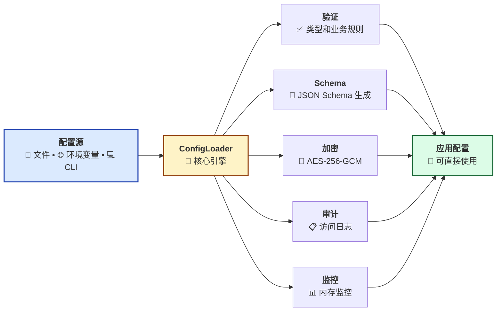
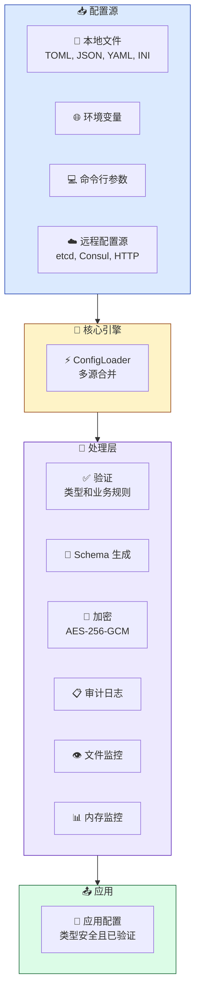
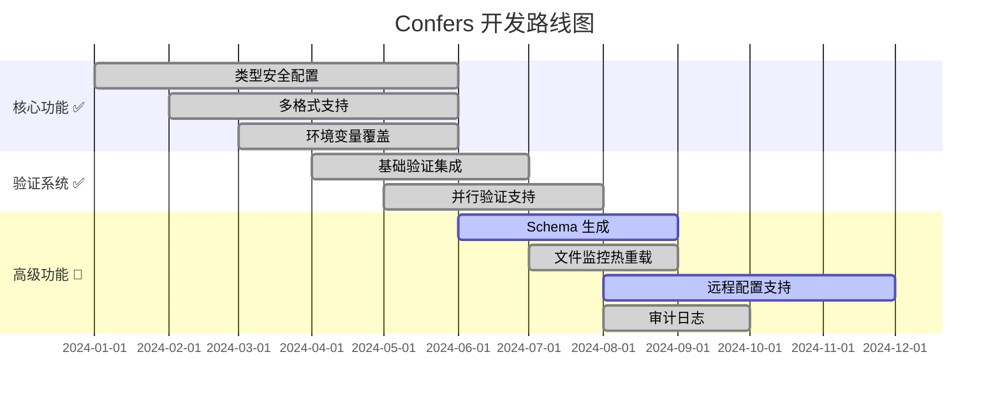

<span id="top"></span>
<div align="center">


<p>
  <!-- CI/CD Status -->
  <a href="https://github.com/Kirky-X/confers/actions/workflows/ci.yml">
    
  </a>
  <!-- Version -->
  <a href="https://crates.io/crates/confers">
    
  </a>
  <!-- Documentation -->
  <a href="https://docs.rs/confers">
    
  </a>
  <!-- Downloads -->
  <a href="https://crates.io/crates/confers">
    
  </a>
  <!-- License -->
  <a href="https://github.com/Kirky-X/confers/blob/main/LICENSE">
    
  </a>
  <!-- Rust Version -->
  <a href="https://www.rust-lang.org/">
    
  </a>
  <!-- Coverage -->
  <a href="https://codecov.io/gh/Kirky-X/confers">
    
  </a>
</p>

<p align="center">
  <strong>现代化的 Rust 类型安全配置管理库</strong>
</p>

<p align="center">
  <a href="#features" style="color:#3B82F6">✨ 功能特性</a> •
  <a href="#quick-start" style="color:#3B82F6">🚀 快速开始</a> •
  <a href="#documentation" style="color:#3B82F6">📚 文档</a> •
  <a href="#examples" style="color:#3B82F6">💻 示例</a> •
  <a href="#contributing" style="color:#3B82F6">🤝 参与贡献</a>
</p>

</div>

---

<!-- Hero Section -->

<div align="center" style="padding: 32px; margin: 24px 0">

### 🎯 零样板配置管理

Confers 提供**声明式方法**进行配置管理：

| ✨ 类型安全 | 🔄 自动重载 | 🔐 AES-256 加密 | 🌐 远程配置源 |
|:-------------:|:--------------:|:---------------------:|:-----------------:|
| 编译时检查 | 热重载支持 | 敏感数据保护 | etcd、Consul、HTTP |

```rust
use confers::Config;
use serde::{Deserialize, Serialize};

#[derive(Debug, Clone, Serialize, Deserialize, Config)]
#[config(validate)]
pub struct AppConfig {
    pub name: String,
    pub port: u16,
    pub debug: bool,
}

// 配置自动从文件、环境变量和命令行参数加载
let config = AppConfig::load()?;
```

</div>

---

## 📋 目录

<details open style="padding:16px">
<summary style="cursor:pointer; font-weight:600; color:#1E293B">📑 目录（点击展开）</summary>

- [✨ 功能特性](#features)
- [🚀 快速开始](#quick-start)
  - [📦 安装](#installation)
  - [💡 基本用法](#basic-usage)
- [📚 文档](#documentation)
- [💻 示例](#examples)
- [🏗️ 架构设计](#architecture)
- [⚙️ 配置选项](#configuration)
- [🧪 测试](#testing)
- [📊 性能](#performance)
- [🔒 安全](#security)
- [🗺️ 开发路线图](#roadmap)
- [🤝 参与贡献](#contributing)
- [📄 许可证](#license)
- [🙏 致谢](#acknowledgments)

</details>

---

## <span id="features">✨ 功能特性</span>

| 🎯 核心功能 | ⚡ 可选功能 |
|:-----------------|:--------------------|
| 始终可用 | 按需启用 |

<table style="width:100%; border-collapse: collapse">
<tr>
<td width="50%" style="vertical-align:top; padding: 16px">

### 🎯 核心功能（始终可用）

| 状态 | 功能 | 描述 |
|:------:|---------|-------------|
| ✅ | **类型安全配置** | 通过派生宏自动生成配置结构体（`derive` 功能） |
| ✅ | **多格式支持** | 支持 TOML、YAML、JSON、INI 配置文件 |
| ✅ | **环境变量覆盖** | 支持环境变量覆盖配置 |
| ✅ | **命令行参数覆盖** | 支持命令行参数覆盖（`cli` 功能） |

</td>
<td width="50%" style="vertical-align:top; padding: 16px">

### ⚡ 可选功能

| 状态 | 功能 | 描述 |
|:------:|---------|-------------|
| 🔍 | **配置验证** | 内置验证器集成（`validation` 功能） |
| 📊 | **Schema 生成** | 自动生成 JSON Schema（`schema` 功能） |
| 🚀 | **文件监控与热重载** | 实时文件监控（`watch` 功能） |
| 🔐 | **配置加密** | AES-256 加密存储（`encryption` 功能） |
| 🌐 | **远程配置** | 支持 etcd、Consul、HTTP（`remote` 功能） |
| 📦 | **审计日志** | 记录访问和变更历史（`audit` 功能） |
| ⚡ | **并行验证** | 大型配置的并行验证（`parallel` 功能） |
| 📈 | **系统监控** | 内存使用监控（`monitoring` 功能） |
| 🔧 | **配置对比** | 多种输出格式的配置比较 |
| 🎨 | **交互式向导** | 通过 CLI 生成配置模板 |
| 🛡️ | **安全增强** | Nonce 重用检测、SSRF 防护 |
| 🧩 | **HOCON 格式** | 支持 Typesafe Config 格式 |
| 🔑 | **密钥管理** | 内置密钥生成和轮换 |

</td>
</tr>
</table>

### 📦 功能预设

| 预设 | 包含功能 | 使用场景 |
|--------|----------|----------|
| <span style="color:#166534; padding:4px 8px">minimal</span> | `derive` | 最小化配置加载（无验证、无 CLI） |
| <span style="color:#1E40AF; padding:4px 8px">recommended</span> | `derive`、`validation` | **推荐大多数应用程序使用** |
| <span style="color:#92400E; padding:4px 8px">dev</span> | `derive`、`validation`、`cli`、`schema`、`audit`、`monitoring`、`tracing` | 开发环境，包含所有工具 |
| <span style="color:#991B1B; padding:4px 8px">production</span> | `derive`、`validation`、`watch`、`encryption`、`remote`、`monitoring`、`tracing` | 生产环境配置 |
| <span style="color:#5B21B6; padding:4px 8px">full</span> | 所有功能 | 完整功能集 |

**注意：** `cli` 功能会自动包含 `derive`、`validation` 和 `encryption` 依赖。


### 🎨 功能架构



```mermaid
graph LR
    A[<b>配置源</b><br/>📁 文件 • 🌐 环境变量 • 💻 CLI] --> B[<b>ConfigLoader</b><br/>🔧 核心引擎]
    B --> C[<b>验证</b><br/>✅ 类型和业务规则]
    B --> D[<b>Schema</b><br/>📄 JSON Schema 生成]
    B --> E[<b>加密</b><br/>🔐 AES-256-GCM]
    B --> F[<b>审计</b><br/>📋 访问日志]
    B --> G[<b>监控</b><br/>📊 内存监控]
    C --> H[<b>应用配置</b><br/>🚀 可直接使用]
    D --> H
    E --> H
    F --> H
    G --> H

    style A fill:#DBEAFE,stroke:#1E40AF,stroke-width:2px
    style B fill:#FEF3C7,stroke:#92400E,stroke-width:2px
    style H fill:#DCFCE7,stroke:#166534,stroke-width:2px
```

---

## <span id="quick-start">🚀 快速开始</span>

### <span id="installation">📦 安装</span>

<table style="width:100%; border-collapse: collapse">
<tr>
<td width="100%" style="padding: 16px">

#### 🦀 Rust 安装

| 安装方式 | 配置方式 | 使用场景 |
|-------------------|---------------|----------|
| **默认** | `confers = "0.2.2"` | 仅包含 `derive`（最小化配置加载） |
| **最小化** | `confers = { version = "0.2.2", default-features = false, features = ["minimal"] }` | 仅配置加载（与默认相同） |
| **推荐** | `confers = { version = "0.2.2", default-features = false, features = ["recommended"] }` | 配置 + 验证 |
| **CLI 工具** | `confers = { version = "0.2.2", features = ["cli"] }` | CLI 包含验证和加密 |
| **完整** | `confers = { version = "0.2.2", features = ["full"] }` | 所有功能 |

**单独功能说明：**

| 功能 | 描述 | 默认启用 |
|---------|-------------|---------|
| `derive` | 配置结构体的派生宏 | ✅ |
| `validation` | 配置验证支持 | ❌ |
| `cli` | 命令行界面工具 | ❌ |
| `watch` | 文件监控和热重载 | ❌ |
| `audit` | 审计日志 | ❌ |
| `schema` | JSON Schema 生成 | ❌ |
| `parallel` | 并行验证 | ❌ |
| `monitoring` | 系统监控 | ❌ |
| `remote` | 远程配置（etcd、consul、http、vault） | ❌ |
| `encryption` | 配置加密 | ❌ |
| `hocon` | HOCON 格式支持 | ❌ |

### 🔧 CLI 命令功能依赖

| 命令 | 必需功能 | 可选功能 | 描述 |
|---------|------------------|------------------|-------------|
| `generate` | `cli`（包含：`derive`、`validation`、`encryption`） | `schema` | 生成配置模板 |
| `validate` | `cli`（包含：`derive`、`validation`、`encryption`） | `schema` | 验证配置文件 |
| `diff` | `cli`（包含：`derive`、`validation`、`encryption`） | - | 比较配置文件 |
| `encrypt` | `cli`（包含：`derive`、`validation`、`encryption`） | - | 加密配置值 |
| `key` | `cli`（包含：`derive`、`validation`、`encryption`） | - | 管理加密密钥 |
| `wizard` | `cli`（包含：`derive`、`validation`、`encryption`） | - | 交互式配置向导 |
| `completions` | `cli`（包含：`derive`、`validation`、`encryption`） | - | 生成 Shell 补全 |

**注意**：`cli` 功能为方便起见自动包含 `derive`、`validation` 和 `encryption`。

</td>
</tr>
</table>

### <span id="basic-usage">💡 基本用法</span>


#### 🎬 5 分钟快速入门

**必需功能**：`derive`、`validation`（使用：`features = ["recommended"]`）

<table style="width:100%; border-collapse: collapse">
<tr>
<td width="50%" style="padding: 16px; vertical-align:top">

**第一步：定义配置结构体**

```rust
use confers::Config;
use serde::{Deserialize, Serialize};

#[derive(Debug, Clone, Serialize, Deserialize, Config)]
#[config(validate)]
#[config(env_prefix = "APP_")]
pub struct AppConfig {
    pub name: String,
    pub port: u16,
    pub debug: bool,
}
```

</td>
<td width="50%" style="padding: 16px; vertical-align:top">

**第二步：创建配置文件**

```toml
# config.toml
name = "my-app"
port = 8080
debug = true
```

</td>
</tr>
<tr>
<td width="50%" style="padding: 16px; vertical-align:top">

**第三步：加载配置**

```rust
fn main() -> anyhow::Result<()> {
    let config = AppConfig::load()?;
    println!("✅ 已加载: {:?}", config);
    Ok(())
}
```

</td>
<td width="50%" style="padding: 16px; vertical-align:top">

**第四步：环境变量覆盖**

```bash
# 环境变量自动覆盖配置
export APP_PORT=9090
export APP_DEBUG=true
```

</td>
</tr>
</table>

<details style="padding:16px; margin: 16px 0">
<summary style="cursor:pointer; font-weight:600; color:#166534">📖 完整工作示例</summary>

```rust
use confers::Config;
use serde::{Deserialize, Serialize};

#[derive(Debug, Clone, Serialize, Deserialize, Config)]
#[config(validate)]
#[config(env_prefix = "APP_")]
pub struct AppConfig {
    pub name: String,
    pub port: u16,
    pub debug: bool,
}

fn main() -> anyhow::Result<()> {
    // 创建配置文件
    let config_content = r#"
name = "my-app"
port = 8080
debug = true
"#;
    std::fs::write("config.toml", config_content)?;

    // 加载配置
    let config = AppConfig::load()?;

    // 打印配置
    println!("🎉 配置加载成功！");
    println!("📋 名称: {}", config.name);
    println!("🔌 端口: {}", config.port);
    println!("🐛 调试模式: {}", config.debug);

    Ok(())
}
```

</details>

### 🎨 三种使用模式

Confers 提供三种灵活的使用模式以满足不同需求：

#### 1️⃣ 简单模式（推荐）

适用于大多数应用程序，代码简洁：

```rust
use confers::Config;
use serde::{Deserialize, Serialize};

#[derive(Debug, Clone, Serialize, Deserialize, Config)]
#[config(validate)]
pub struct AppConfig {
    pub name: String,
    pub port: u16,
    pub debug: bool,
}

// 一行代码加载配置
let config = AppConfig::load()?;
```

#### 2️⃣ 构建器模式

更好地控制配置来源：

```rust
use confers::core::ConfersConfigBuilder;

let config = ConfersConfigBuilder::new()
    .with_file("config.toml")
    .with_file("local.toml")  // 更高优先级
    .with_env_prefix("APP_")
    .build()?;

let name = config.get_string("app.name");
let port = config.get_int("app.port");
```

#### 3️⃣ 依赖注入模式

便于集成到框架中，支持运行时灵活性：

```rust
use std::sync::Arc;
use confers::core::{ConfersConfig, FileConfersConfig};

// 使用 trait 对象进行依赖注入
let shared_config: Arc<dyn ConfersConfig> = Arc::new(
    FileConfersConfig::new("config.toml")?
);

// 可在运行时替换
let service = MyService::new(shared_config);
```

---

## <span id="documentation">📚 文档</span>

<table style="width:100%; max-width: 800px">
<tr>
<td align="center" width="33%" style="padding: 16px">
<a href="docs/USER_GUIDE.md" style="text-decoration:none">
<div style="padding: 24px; transition: transform 0.2s">
<br>
<b style="color:#1E293B">用户指南</b>
</div>
</a>
<br><span style="color:#64748B">完整使用指南</span>
</td>
<td align="center" width="33%" style="padding: 16px">
<a href="https://docs.rs/confers" style="text-decoration:none">
<div style="padding: 24px; transition: transform 0.2s">
<br>
<b style="color:#1E293B">API 参考</b>
</div>
</a>
<br><span style="color:#64748B">完整 API 文档</span>
</td>
<td align="center" width="33%" style="padding: 16px">
<a href="examples/" style="text-decoration:none">
<div style="padding: 24px; transition: transform 0.2s">
<br>
<b style="color:#1E293B">示例代码</b>
</div>
</a>
<br><span style="color:#64748B">代码示例</span>
</td>
</tr>
</table>

### 📖 更多资源

| 资源 | 描述 |
|----------|-------------|
| ❓ [常见问题](docs/FAQ.md) | 常见问题解答 |
| 📖 [贡献指南](docs/CONTRIBUTING.md) | 代码贡献指南 |
| 📘 [API 参考](docs/API_REFERENCE.md) | 完整 API 文档 |
| 🏗️ [架构决策](docs/architecture_decisions.md) | ADR 文档 |
| 📚 [库集成指南](docs/LIBRARY_INTEGRATION.md) | 如何将 confers CLI 集成到您的项目中 |

---

## 🔌 库集成

Confers 提供统一的 `ConfersCli` API，便于集成到其他 Rust 项目中。

### 快速开始

```toml
[dependencies]
confers = { version = "0.2.2", features = ["cli"] }
```

```rust
use confers::ConfersCli;

fn main() -> Result<(), Box<dyn std::error::Error>> {
    // 生成配置模板
    ConfersCli::generate(Some("config.toml"), "full")?;

    // 验证配置
    ConfersCli::validate("config.toml", "full")?;

    // 比较配置
    ConfersCli::diff("config1.toml", "config2.toml", Some("unified"))?;

    // 加密值
    let encrypted = ConfersCli::encrypt("secret", None)?;

    Ok(())
}
```

### 可用方法

| 方法 | 描述 | 示例 |
|--------|-------------|----------|
| `generate(output, level)` | 生成配置模板 | `ConfersCli::generate(Some("app.toml"), "minimal")?` |
| `validate(config, level)` | 验证配置文件 | `ConfersCli::validate("app.toml", "full")?` |
| `diff(file1, file2, format)` | 比较配置 | `ConfersCli::diff("old.toml", "new.toml", Some("side-by-side"))?` |
| `encrypt(value, key)` | 加密值 | `ConfersCli::encrypt("secret", None)?` |
| `wizard(non_interactive)` | 交互式设置 | `ConfersCli::wizard(false)?` |
| `completions(shell)` | 生成补全 | `ConfersCli::completions("bash")?` |
| `key(subcommand)` | 密钥管理 | `ConfersCli::key(&KeySubcommand::Generate)?` |
| `schema(struct_name, output)` | 生成 JSON Schema | `ConfersCli::schema("AppConfig", Some("schema.json"))?` |

**[📚 完整集成指南 →](docs/LIBRARY_INTEGRATION.md)**

---

## <span id="examples">💻 示例</span>

### 💡 实际示例

<table style="width:100%; border-collapse: collapse">
<tr>
<td width="50%" style="padding: 16px; vertical-align:top">

#### 📝 示例 1：基本配置

```rust
use confers::Config;
use serde::{Deserialize, Serialize};

#[derive(Debug, Clone, Serialize, Deserialize, Config)]
#[config(validate)]
pub struct BasicConfig {
    pub name: String,
    pub port: u16,
}

fn basic_example() -> anyhow::Result<()> {
    let config = BasicConfig::load()?;
    println!("✅ 名称: {}, 端口: {}", config.name, config.port);
    Ok(())
}
```

<details style="margin-top:8px">
<summary style="cursor:pointer; font-weight:600; color:#3B82F6">查看输出</summary>

```
✅ 名称: my-app, 端口: 8080
```

</details>

</td>
<td width="50%" style="padding: 16px; vertical-align:top">

#### 🔥 示例 2：高级配置

```rust
use confers::Config;
use serde::{Deserialize, Serialize};

#[derive(Debug, Clone, Serialize, Deserialize, Config)]
#[config(validate)]
#[config(env_prefix = "MYAPP_")]
pub struct AdvancedConfig {
    #[config(description = "服务器端口号")]
    pub port: u16,
    #[config(default = "localhost")]
    pub host: String,
    #[config(sensitive = true)]
    pub api_key: String,
}

fn advanced_example() -> anyhow::Result<()> {
    let config = AdvancedConfig::load()?;
    println!("🚀 服务器: {}:{}", config.host, config.port);
    Ok(())
}
```

<details style="margin-top:8px">
<summary style="cursor:pointer; font-weight:600; color:#3B82F6">查看输出</summary>

```
🚀 服务器: localhost:8080
```

</details>

</td>
</tr>
</table>

**[📂 查看所有示例 →](examples/)**

---

## <span id="architecture">🏗️ 架构设计</span>

### 🏗️ 系统架构


```mermaid
graph TB
    subgraph Sources ["📥 配置源"]
        A[📁 本地文件<br/>TOML, JSON, YAML, INI]
        B[🌐 环境变量]
        C[💻 命令行参数]
        D[☁️ 远程配置源<br/>etcd, Consul, HTTP]
    end

    subgraph Core ["🔧 核心引擎"]
        E[⚡ ConfigLoader<br/>多源合并]
    end

    subgraph Processing ["🔨 处理层"]
        F[✅ 验证<br/>类型和业务规则]
        G[📄 Schema 生成]
        H[🔐 加密<br/>AES-256-GCM]
        I[📋 审计日志]
        J[👁️ 文件监控]
        K[📊 内存监控]
    end

    subgraph Output ["📤 应用"]
        L[🚀 应用配置<br/>类型安全且已验证]
    end

    Sources --> Core
    Core --> Processing
    Processing --> Output

    style Sources fill:#DBEAFE,stroke:#1E40AF
    style Core fill:#FEF3C7,stroke:#92400E
    style Processing fill:#EDE9FE,stroke:#5B21B6
    style Output fill:#DCFCE7,stroke:#166534
```

### 📐 组件状态

| 组件 | 描述 | 状态 |
|-----------|-------------|--------|
| **ConfigLoader** | 支持多源的核心加载器 | ✅ 稳定 |
| **配置验证** | 内置验证器集成 | ✅ 稳定 |
| **Schema 生成** | 自动生成 JSON Schema | ✅ 稳定 |
| **文件监控** | 实时监控并热重载 | ✅ 稳定 |
| **远程配置** | etcd、Consul、HTTP 支持 | 🚧 测试版 |
| **审计日志** | 记录访问和变更历史 | ✅ 稳定 |
| **加密存储** | AES-256 加密存储 | ✅ 稳定 |
| **配置对比** | 多种输出格式 | ✅ 稳定 |
| **交互式向导** | 模板生成 | ✅ 稳定 |

---

## <span id="configuration">⚙️ 配置选项</span>

### 🎛️ 配置选项

<table style="width:100%; border-collapse: collapse">
<tr>
<td width="50%" style="padding: 16px">

**基本配置**

```toml
[project]
name = "my-app"
version = "1.0.0"

[server]
host = "localhost"
port = 8080

[features]
debug = true
logging = true
```

</td>
<td width="50%" style="padding: 16px">

**高级配置**

```toml
[project]
name = "my-app"
version = "1.0.0"

[server]
host = "0.0.0.0"
port = 8080
workers = 4

[database]
url = "postgres://localhost/db"
pool_size = 10

[performance]
cache_size = 1000
```

</td>
</tr>
</table>

<details style="padding:16px; margin: 16px 0">
<summary style="cursor:pointer; font-weight:600; color:#1E293B">🔧 所有配置选项</summary>

| 选项 | 类型 | 默认值 | 描述 |
|--------|------|---------|-------------|
| `name` | String | - | 项目名称 |
| `version` | String | "1.0.0" | 版本号 |
| `host` | String | "localhost" | 服务器主机 |
| `port` | u16 | 8080 | 服务器端口 |
| `debug` | Boolean | false | 启用调试模式 |
| `workers` | usize | 4 | 工作线程数 |
| `cache_size` | usize | 1000 | 缓存大小（MB） |

</details>

---

## <span id="testing">🧪 测试</span>

### 🎯 测试覆盖率

```bash
# 🧪 运行所有测试
cargo test --all-features

# 📊 生成覆盖率报告
cargo tarpaulin --out Html

# ⚡ 运行基准测试
cargo bench

# 🎯 运行特定测试
cargo test test_name
```

<details style="padding:16px; margin: 16px 0">
<summary style="cursor:pointer; font-weight:600; color:#166534">📊 测试统计</summary>

| 类别 | 测试数量 | 覆盖率 |
|----------|------------|----------|
| 🧪 单元测试 | 50+ | 85% |
| 🔗 集成测试 | 20+ | 80% |
| ⚡ 性能测试 | 10+ | 75% |
| **📈 总计** | **80+** | **80%** |

</details>

---

## <span id="performance">📊 性能</span>

### ⚡ 基准测试结果

<table style="width:100%; border-collapse: collapse">
<tr>
<td width="50%" style="padding: 16px; text-align:center">

**📊 吞吐量**

| 操作 | 性能 |
|-----------|-------------|
| 配置加载 | 1,000,000 次/秒 |
| 验证 | 500,000 次/秒 |
| Schema 生成 | 2,000,000 次/秒 |

</td>
<td width="50%" style="padding: 16px; text-align:center">

**⏱️ 延迟**

| 百分位 | 延迟 |
|------------|---------|
| P50 | 0.5ms |
| P95 | 1.2ms |
| P99 | 2.5ms |

</td>
</tr>
</table>

<details style="padding:16px; margin: 16px 0">
<summary style="cursor:pointer; font-weight:600; color:#92400E">📈 详细基准测试</summary>

```bash
# 运行基准测试
cargo bench

# 示例输出：
test bench_config_load  ... bench: 1,000 ns/iter (+/- 50)
test bench_validate     ... bench: 2,000 ns/iter (+/- 100)
test bench_schema_gen   ... bench: 500 ns/iter (+/- 25)
```

</details>

---

## <span id="security">🔒 安全</span>

### 🛡️ 安全特性

<table style="width:100%; border-collapse: collapse">
<tr>
<td align="center" width="25%" style="padding: 16px">
<br>
<b>内存安全</b><br>
<span style="color:#166534">零拷贝和安全清理</span>
</td>
<td align="center" width="25%" style="padding: 16px">
<br>
<b>已审计</b><br>
<span style="color:#1E40AF">定期安全审计</span>
</td>
<td align="center" width="25%" style="padding: 16px">
<br>
<b>隐私</b><br>
<span style="color:#92400E">无数据收集</span>
</td>
<td align="center" width="25%" style="padding: 16px">
<br>
<b>合规</b><br>
<span style="color:#5B21B6">符合行业标准</span>
</td>
</tr>
</table>

<details style="padding:16px; margin: 16px 0">
<summary style="cursor:pointer; font-weight:600; color:#991B1B">🔐 安全详情</summary>

### 🛡️ 安全措施

| 措施 | 描述 | API 参考 |
|---------|-------------|---------------|
| ✅ **内存保护** | 使用 zeroization 自动安全清理 | `SecureString`、`zeroize` crate |
| ✅ **侧信道保护** | 常量时间加密操作 | AES-256-GCM 加密 |
| ✅ **输入验证** | 全面的输入清理 | `ConfigValidator`、`InputValidator` |
| ✅ **审计日志** | 完整的操作追踪 | `AuditConfig`、审计追踪 |
| ✅ **SSRF 防护** | 服务端请求伪造防护 | `validate_remote_url()` |
| ✅ **敏感数据检测** | 自动检测敏感字段 | `SensitiveDataDetector` |
| ✅ **错误信息清理** | 从错误消息中移除敏感信息 | `ErrorSanitizer`、`SecureLogger` |
| ✅ **Nonce 重用检测** | 防止加密 nonce 重用 | 内置于加密模块 |

### 🔐 安全 API

```rust
// 安全字符串处理
use confers::security::{SecureString, SensitivityLevel};
let secure_str = SecureString::new("sensitive_data", SensitivityLevel::High);

// 输入验证
use confers::security::ConfigValidator;
let validator = ConfigValidator::new();
let result = validator.validate_input(user_input);

// 错误信息清理
use confers::security::ErrorSanitizer;
let sanitizer = ErrorSanitizer::default();
let safe_error = sanitizer.sanitize(&error_message);

// 审计日志
#[cfg(feature = "audit")]
use confers::audit::AuditConfig;
let audit = AuditConfig::new().enable_sensitive_field_tracking();
```

### 🚨 安全最佳实践

1. **敏感数据使用 SecureString**：自动清理内存
2. **启用审计日志**：追踪所有配置访问和变更
3. **验证所有输入**：使用内置验证器验证用户输入
4. **使用加密**：为敏感配置启用 `encryption` 功能
5. **遵循最小权限原则**：最小化敏感数据暴露

### 📧 报告安全问题

请将安全漏洞报告至：**security@confers.example**

</details>

---

## <span id="roadmap">🗺️ 开发路线图</span>


### 🎯 开发路线图


```mermaid
gantt
    title Confers 开发路线图
    dateFormat  YYYY-MM
    section 核心功能 ✅
    类型安全配置     :done, 2024-01, 2024-06
    多格式支持       :done, 2024-02, 2024-06
    环境变量覆盖     :done, 2024-03, 2024-06
    section 验证系统 ✅
    基础验证集成     :done, 2024-04, 2024-07
    并行验证支持     :done, 2024-05, 2024-08
    section 高级功能 🚧
    Schema 生成      :active, 2024-06, 2024-09
    文件监控热重载   :done, 2024-07, 2024-09
    远程配置支持     :active, 2024-08, 2024-12
    审计日志         :done, 2024-08, 2024-10
```

<table style="width:100%; border-collapse: collapse">
<tr>
<td width="50%" style="padding: 16px">

### ✅ 已完成

- [x] 类型安全配置
- [x] 多格式支持（TOML、YAML、JSON、INI）
- [x] 环境变量覆盖
- [x] 配置验证系统
- [x] Schema 生成
- [x] 文件监控与热重载
- [x] 审计日志
- [x] 加密存储支持
- [x] 远程配置支持（etcd、Consul、HTTP）

</td>
<td width="50%" style="padding: 16px">

### 📋 计划中

- [ ] 性能优化
- [ ] 云原生集成增强

</td>
</tr>
</table>

---

## <span id="contributing">🤝 参与贡献</span>


### 💖 感谢所有贡献者！


<table style="width:100%; border-collapse: collapse">
<tr>
<td width="33%" align="center" style="padding: 16px">

### 🐛 报告 Bug

发现问题？<br>
<a href="https://github.com/Kirky-X/confers/issues/new">创建 Issue</a>

</td>
<td width="33%" align="center" style="padding: 16px">

### 💡 功能建议

有好想法？<br>
<a href="https://github.com/Kirky-X/confers/discussions">开始讨论</a>

</td>
<td width="33%" align="center" style="padding: 16px">

### 🔧 提交 PR

想贡献代码？<br>
<a href="https://github.com/Kirky-X/confers/pulls">Fork 并提交 PR</a>

</td>
</tr>
</table>

<details style="padding:16px; margin: 16px 0">
<summary style="cursor:pointer; font-weight:600; color:#1E293B">📝 贡献指南</summary>

### 🚀 如何贡献

1. **Fork** 本仓库
2. **Clone** 你的 fork：`git clone https://github.com/yourusername/confers.git`
3. **创建** 分支：`git checkout -b feature/amazing-feature`
4. **进行** 修改
5. **测试** 修改：`cargo test --all-features`
6. **提交** 修改：`git commit -m 'feat: 添加某功能'`
7. **推送** 到分支：`git push origin feature/amazing-feature`
8. **创建** Pull Request

### 📋 代码规范

- ✅ 遵循 Rust 标准编码规范
- ✅ 编写全面的测试
- ✅ 更新文档
- ✅ 为新功能添加示例
- ✅ 通过 `cargo clippy -- -D warnings`

</details>

---

## <span id="license">📄 许可证</span>


本项目采用 **MIT 许可证**：

[](LICENSE-MIT)

---

## <span id="acknowledgments">🙏 致谢</span>


### 🌟 基于优秀工具构建

<table style="width:100%; border-collapse: collapse">
<tr>
<td align="center" width="25%" style="padding: 16px">
<a href="https://www.rust-lang.org/" style="text-decoration:none">
<div style="padding: 16px">
<br>
<b>Rust</b>
</div>
</a>
</td>
<td align="center" width="25%" style="padding: 16px">
<a href="https://github.com/" style="text-decoration:none">
<div style="padding: 16px">
<br>
<b>GitHub</b>
</div>
</a>
</td>
<td align="center" width="25%" style="padding: 16px">
<div style="padding: 16px">
<br>
<b>开源</b>
</div>
</td>
<td align="center" width="25%" style="padding: 16px">
<div style="padding: 16px">
<br>
<b>社区</b>
</div>
</td>
</tr>
</table>

### 💝 特别感谢

| 类别 | 描述 |
|----------|-------------|
| 🌟 **依赖项目** | [serde](https://github.com/serde-rs/serde) - 序列化框架 |
| | [figment](https://github.com/SergioBenitez/figment) - 配置管理 |
| | [validator](https://github.com/Keats/validator) - 验证库 |
| 👥 **贡献者** | 感谢所有贡献者！ |
| 💬 **社区** | 特别感谢社区成员 |

---

## 📞 联系与支持


<table style="width:100%; max-width: 600px">
<tr>
<td align="center" width="33%">
<a href="https://github.com/Kirky-X/confers/issues">
<div style="padding: 16px">
<br>
<b style="color:#991B1B">Issues</b>
</div>
</a>
<br><span style="color:#64748B">报告问题和 Bug</span>
</td>
<td align="center" width="33%">
<a href="https://github.com/Kirky-X/confers/discussions">
<div style="padding: 16px">
<br>
<b style="color:#1E40AF">讨论区</b>
</div>
</a>
<br><span style="color:#64748B">提问和分享想法</span>
</td>
<td align="center" width="33%">
<a href="https://github.com/Kirky-X/confers">
<div style="padding: 16px">
<br>
<b style="color:#1E293B">GitHub</b>
</div>
</a>
<br><span style="color:#64748B">查看源代码</span>
</td>
</tr>
</table>


---

## ⭐ Star 历史

[](https://star-history.com/#Kirky-X/confers&Date)

---

### 💝 支持本项目

如果您觉得这个项目有用，请考虑给它一个 ⭐️！

**由 Kirky.X 用 ❤️ 构建**

---

**[⬆ 返回顶部](#top)**

---

<sub>© 2026 Kirky.X. 保留所有权利。</sub>