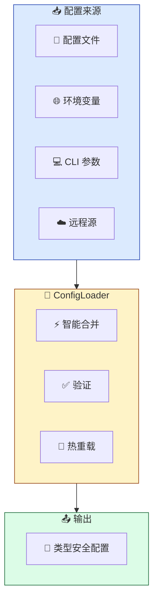
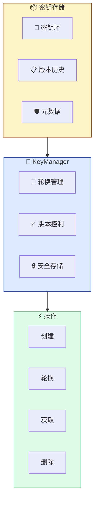

<div align="center">


# 📘 API 参考文档

### 完整的 API 文档

[🏠 首页](../README.md) • [📖 用户指南](USER_GUIDE.md) • [🏗️ 架构设计](ARCHITECTURE.md)

---

</div>

## 📋 目录

<details open style="background:#F8FAFC; border-radius:8px; padding:16px; border:1px solid #E2E8F0;">
<summary style="cursor:pointer; font-weight:600; color:#1E293B;">📑 目录（点击展开）</summary>

- [概述](#概述)
- [核心 API](#核心-api)
  - [配置加载器](#配置加载器)
  - [密钥管理](#密钥管理)
  - [加密功能](#加密功能)
  - [配置差异比较](#配置差异比较)
  - [架构生成](#架构生成)
- [错误处理](#错误处理)
- [类型定义](#类型定义)
- [示例](#示例)
- [最佳实践](#最佳实践)
- [高级功能](#高级功能)
- [性能优化](#性能优化)
- [故障排除](#故障排除)

</details>

---

## 概述

<div align="center" style="margin: 24px 0;">

### 🎯 API 设计原则

</div>

<table style="width:100%; border-collapse: collapse;">
<tr>
<td align="center" width="25%" style="padding: 16px; background:#DCFCE7; border-radius:8px;">
<br>
<b style="color:#166534;">简洁</b><br>
<span style="color:#166534;">直观易用</span>
</td>
<td align="center" width="25%" style="padding: 16px; background:#DBEAFE; border-radius:8px;">
<br>
<b style="color:#1E40AF;">安全</b><br>
<span style="color:#1E40AF;">默认类型安全</span>
</td>
<td align="center" width="25%" style="padding: 16px; background:#FEF3C7; border-radius:8px;">
<br>
<b style="color:#92400E;">可组合</b><br>
<span style="color:#92400E;">轻松构建复杂工作流</span>
</td>
<td align="center" width="25%" style="padding: 16px; background:#EDE9FE; border-radius:8px;">
<br>
<b style="color:#5B21B6;">完善文档</b><br>
<span style="color:#5B21B6;">全面的文档支持</span>
</td>
</tr>
</table>

### 📦 特性说明

<div style="background:#F8FAFC; border-radius:8px; padding:16px; border:1px solid #E2E8F0; margin: 16px 0;">

confers 提供了灵活的特性配置，允许用户根据需求选择需要的功能：

**特性预设：**

| 预设 | 特性 | 使用场景 |
|------|------|----------|
| <span style="background:#DCFCE7; color:#166534; padding:4px 8px; border-radius:4px;">minimal</span> | `derive` | 仅配置加载（最小依赖） |
| <span style="background:#DBEAFE; color:#1E40AF; padding:4px 8px; border-radius:4px;">recommended</span> | `derive`, `validation` | 配置加载 + 验证（推荐大多数应用） |
| <span style="background:#FEF3C7; color:#92400E; padding:4px 8px; border-radius:4px;">dev</span> | `derive`, `validation`, `cli`, `schema`, `audit`, `monitoring` | 开发配置 |
| <span style="background:#FEE2E2; color:#991B1B; padding:4px 8px; border-radius:4px;">production</span> | `derive`, `validation`, `watch`, `encryption`, `remote`, `monitoring> | 生产配置 |
| <span style="background:#EDE9FE; color:#5B21B6; padding:4px 8px; border-radius:4px;">full</span> | 所有特性 | 完整功能集 |

**单独特性：**

| 特性 | 描述 | 默认 |
|------|------|------|
| `derive` | 配置结构体的 derive 宏 | ✅ |
| `validation` | 配置验证支持 | ✅ |
| `cli` | 命令行工具 | ❌ |
| `watch` | 文件监控和热重载 | ❌ |
| `audit` | 审计日志 | ❌ |
| `schema` | JSON Schema 生成 | ❌ |
| `parallel` | 并行验证 | ❌ |
| `monitoring` | 系统监控 | ❌ |
| `remote` | 远程配置（etcd、consul、http） | ❌ |
| `encryption` | 配置加密 | ❌ |

</div>

> 💡 **提示**: 本 API 文档假设已启用 `full` 特性。如果使用其他特性组合，某些 API 可能不可用。

---

## 核心 API

### 配置加载器

`ConfigLoader<T>` 是从多个来源加载和合并配置的核心组件，支持文件、环境变量、远程源等多种配置来源的智能合并。

<div align="center" style="margin: 24px 0;">

#### 🏗️ ConfigLoader 架构

</div>



#### 创建与配置

##### `ConfigLoader::new()`

创建新的配置加载器实例。

```rust
pub fn new() -> Self
```

**示例：**

```rust
let loader = ConfigLoader::<AppConfig>::new();
```

##### `with_defaults(defaults: T)`

设置默认配置值，当其他来源未提供时会使用默认值。

```rust
pub fn with_defaults(mut self, defaults: T) -> Self
```

**示例：**

```rust
let loader = ConfigLoader::<AppConfig>::new()
    .with_defaults(AppConfig {
        port: 8080,
        host: "localhost".to_string(),
    });
```

##### `with_file(path: impl AsRef<Path>)`

添加显式配置文件，支持多个配置文件，优先级按添加顺序递增。

```rust
pub fn with_file(mut self, path: impl AsRef<Path>) -> Self
```

**示例：**

```rust
let loader = ConfigLoader::<AppConfig>::new()
    .with_file("config/base.toml")
    .with_file("config/development.toml");
```

##### `with_files(paths: Vec<impl AsRef<Path>>)`

批量添加多个配置文件。

```rust
pub fn with_files(mut self, paths: Vec<impl AsRef<Path>>) -> Self
```

##### `with_app_name(name: impl Into<String>)`

设置应用程序名称，用于标准配置文件位置（例如 `/etc/<app_name>/config.toml` 或 `~/.config/<app_name>/config.toml`）。

```rust
pub fn with_app_name(mut self, name: impl Into<String>) -> Self
```

**示例：**

```rust
let loader = ConfigLoader::<AppConfig>::new()
    .with_app_name("myapp");
```

##### `with_env(enabled: bool)`

启用或禁用从环境变量加载。

```rust
pub fn with_env(mut self, enabled: bool) -> Self
```

##### `with_env_prefix(prefix: impl Into<String>)`

设置环境变量前缀（例如 `APP_PORT` 对应配置字段 `port`）。

```rust
pub fn with_env_prefix(mut self, prefix: impl Into<String>) -> Self
```

**示例：**

```rust
let loader = ConfigLoader::<AppConfig>::new()
    .with_env(true)
    .with_env_prefix("APP");
```

##### `with_strict(strict: bool)`

启用或禁用严格模式，在严格模式下任何配置错误都会导致加载失败。

```rust
pub fn with_strict(mut self, strict: bool) -> Self
```

##### `with_watch(enabled: bool)`

启用或禁用文件监视以实现自动配置重新加载，当配置文件发生变化时自动重新加载。

```rust
pub fn with_watch(mut self, watch: bool) -> Self
```

**示例：**

```rust
let loader = ConfigLoader::<AppConfig>::new()
    .with_file("config.toml")
    .with_watch(true);
```

##### `with_format_detection(mode: impl Into<String>)`

设置格式检测模式，支持 `ByContent`（内容检测）和 `ByExtension`（扩展名检测）两种模式。

```rust
pub fn with_format_detection(mut self, mode: impl Into<String>) -> Self
```

**示例：**

```rust
let loader = ConfigLoader::<AppConfig>::new()
    .with_format_detection("ByContent");
```

##### `with_sanitizer(sanitizer: impl Fn(T) -> Result<T, ConfigError> + Send + Sync + 'static)`

设置自定义的清理函数，用于在配置加载后对配置值进行清理和验证。

```rust
pub fn with_sanitizer(
    mut self,
    sanitizer: impl Fn(T) -> Result<T, ConfigError> + Send + Sync + 'static,
) -> Self
```

##### `with_cli_provider(provider: CliConfigProvider)`

设置 CLI 配置提供者，允许通过命令行参数覆盖配置。

```rust
pub fn with_cli_provider(mut self, provider: CliConfigProvider) -> Self
```

##### `with_memory_limit(limit_mb: usize)`

设置内存限制（MB），当内存使用超过限制时会触发警告。

**默认值：** 10 MB

```rust
pub fn with_memory_limit(mut self, limit_mb: usize) -> Self
```

#### 远程配置

<div style="background:#FEF3C7; border-radius:8px; padding:16px; border:1px solid #FCD34D; margin: 16px 0;">

⚠️ **注意**: 以下方法需要启用 `remote` 特性。

</div>

##### `with_remote_config(url: impl Into<String>)`

启用远程配置源，设置远程配置服务器的 URL。

```rust
#[cfg(feature = "remote")]
pub fn with_remote_config(mut self, url: impl Into<String>) -> Self
```

##### `remote(url: impl Into<String>)`

`with_remote_config` 的别名方法。

```rust
#[cfg(feature = "remote")]
pub fn remote(self, url: impl Into<String>) -> Self
```

##### `with_remote_auth(username: impl Into<String>, password: impl Into<String>)`

配置远程认证的用户名和密码。

```rust
#[cfg(feature = "remote")]
pub fn with_remote_auth(
    mut self,
    username: impl Into<String>,
    password: impl Into<String>,
) -> Self
```

##### `with_remote_token(token: impl Into<String>)`

配置远程认证的 Bearer Token。

```rust
#[cfg(feature = "remote")]
pub fn with_remote_token(mut self, token: impl Into<String>) -> Self
```

##### `with_remote_tls(ca_cert: impl AsRef<Path>, client_cert: Option<impl AsRef<Path>>, client_key: Option<impl AsRef<Path>>)`

配置远程连接的 TLS 证书。

```rust
#[cfg(feature = "remote")]
pub fn with_remote_tls(
    mut self,
    ca_cert: impl AsRef<Path>,
    client_cert: Option<impl AsRef<Path>>,
    client_key: Option<impl AsRef<Path>>,
) -> Self
```

##### `with_remote_timeout(timeout: impl Into<String>)`

设置远程配置请求的超时时间。

```rust
#[cfg(feature = "remote")]
pub fn with_remote_timeout(mut self, timeout: impl Into<String>) -> Self
```

##### `with_remote_fallback(fallback: bool)`

设置是否允许在远程配置加载失败时回退到本地配置。

```rust
#[cfg(feature = "remote")]
pub fn with_remote_fallback(mut self, fallback: bool) -> Self
```

##### `with_etcd(provider: EtcdConfigProvider)`

设置 etcd 配置提供者。

```rust
#[cfg(feature = "remote")]
pub fn with_etcd(mut self, provider: EtcdConfigProvider) -> Self
```

##### `with_consul(provider: ConsulConfigProvider)`

设置 Consul 配置提供者。

```rust
#[cfg(feature = "remote")]
pub fn with_consul(mut self, provider: ConsulConfigProvider) -> Self
```

#### 审计功能

<div style="background:#DBEAFE; border-radius:8px; padding:16px; border:1px solid #93C5FD; margin: 16px 0;">

📝 **提示**: 以下方法需要启用 `audit` 特性。

</div>

##### `with_audit(enabled: bool)`

启用或禁用配置加载的审计日志记录。

```rust
#[cfg(feature = "audit")]
pub fn with_audit(mut self, enabled: bool) -> Self
```

##### `with_audit_file(path: impl Into<String>)`

配置审计日志文件的路径。

```rust
#[cfg(feature = "audit")]
pub fn with_audit_file(mut self, path: impl Into<String>) -> Self
```

#### 加载方法

##### `load()`

异步加载配置，合并所有已配置的配置源。

```rust
pub async fn load(&self) -> Result<T, ConfigError>
```

**示例：**

```rust
let config = loader.load().await?;
```

##### `load_sync_with_audit()`

同步加载配置并支持审计日志（需要 `audit` 特性）。

```rust
#[cfg(feature = "audit")]
pub fn load_sync_with_audit(&self) -> Result<T, ConfigError>
```

#### 格式检测

##### `detect_format(path: &Path) -> Option<String>`

根据文件内容智能检测配置格式。

```rust
pub fn detect_format(path: &Path) -> Option<String>
```

**支持检测的格式：** JSON、YAML、TOML、XML

##### `detect_format_by_extension(path: &Path) -> Option<String>`

根据文件扩展名检测配置格式。

```rust
pub fn detect_format_by_extension(path: &Path) -> Option<String>
```

---

### 密钥管理

`KeyManager` 提供加密密钥的综合管理，包括轮换、版本控制和密钥存储。

<div align="center" style="margin: 24px 0;">

#### 🔐 密钥管理架构

</div>



#### 创建与管理

##### `KeyManager::new(storage_path: PathBuf)`

使用指定存储路径创建新的密钥管理器。

```rust
pub fn new(storage_path: PathBuf) -> Result<Self, ConfigError>
```

**示例：**

```rust
use std::path::PathBuf;

let km = KeyManager::new(PathBuf::from("./keys"))?;
```

##### `initialize(master_key: &[u8; 32], key_id: String, created_by: String)`

使用主密钥初始化新的密钥环。

```rust
pub fn initialize(
    &mut self,
    master_key: &[u8; 32],
    key_id: String,
    created_by: String,
) -> Result<KeyVersion, ConfigError>
```

**参数说明：**

| 参数 | 描述 |
|------|------|
| `master_key` | 32字节的主密钥，用于加密密钥存储 |
| `key_id` | 密钥环的唯一标识符 |
| `created_by` | 创建者标识，用于审计追踪 |

**示例：**

```rust
let master_key = generate_secure_key();
let version = km.initialize(
    &master_key,
    "production".to_string(),
    "security-team".to_string(),
)?;
```

##### `rotate_key(master_key: &[u8; 32], key_id: Option<String>, created_by: String, description: Option<String>)`

将密钥环轮换到新版本，支持密钥轮换以满足安全合规要求。

```rust
pub fn rotate_key(
    &mut self,
    master_key: &[u8; 32],
    key_id: Option<String>,
    created_by: String,
    description: Option<String>,
) -> Result<RotationResult, ConfigError>
```

**返回值：** `RotationResult` 包含轮换前后的版本信息和是否需要重新加密。

**示例：**

```rust
let result = km.rotate_key(
    &master_key,
    Some("production".to_string()),
    "security-team".to_string(),
    Some("定期密钥轮换".to_string(),
)?;

println!("密钥版本从 {} 轮换到 {}", result.previous_version, result.new_version);
```

##### `get_key_info(key_id: &str)`

获取特定密钥的元数据和版本信息。

```rust
pub fn get_key_info(&self, key_id: &str) -> Result<KeyInfo, ConfigError>
```

##### `get_active_key_version(key_id: &str, version: u32) -> Result<Vec<u8>, ConfigError>`

获取指定密钥版本的原始密钥数据。

```rust
pub fn get_active_key_version(&self, key_id: &str, version: u32) -> Result<Vec<u8>, ConfigError>
```

##### `list_key_ids() -> Result<Vec<String>, ConfigError>`

列出所有已管理的密钥 ID。

```rust
pub fn list_key_ids(&self) -> Result<Vec<String>, ConfigError>
```

##### `delete_key_ring(key_id: &str, master_key: &[u8; 32]) -> Result<(), ConfigError>`

删除指定的密钥环。

```rust
pub fn delete_key_ring(&mut self, key_id: &str, master_key: &[u8; 32]) -> Result<(), ConfigError>
```

---

### 加密功能

`ConfigEncryption` 实现 AES-256-GCM 加密以保护敏感配置值，提供前向安全性的加密保护。

<div align="center" style="margin: 24px 0;">

#### 🔐 加密流程

</div>


#### 创建

##### `ConfigEncryption::new(key_bytes: [u8; 32])`

使用 32 字节密钥创建新的加密器。

```rust
pub fn new(key_bytes: [u8; 32]) -> Self
```

**示例：**

```rust
use confers::encryption::ConfigEncryption;

let key = [0u8; 32]; // 应使用安全的随机密钥
let encryption = ConfigEncryption::new(key);
```

##### `ConfigEncryption::from_env()`

使用 `CONFERS_ENCRYPTION_KEY` 环境变量创建加密器，密钥应为 Base64 编码。

```rust
pub fn from_env() -> Result<Self, ConfigError>
```

**示例：**

```rust
let encryption = ConfigEncryption::from_env()?;
```

#### 加解密操作

##### `encrypt(plaintext: &str) -> Result<String, ConfigError>`

加密字符串值。返回格式化字符串：`enc:AES256GCM:<nonce_base64>:<ciphertext_base64>`。

**特点：**

- 使用 AES-256-GCM 算法，提供加密和完整性验证
- 每次加密生成随机的 96 位 nonce
- 密文格式：前缀标识 + Base64 编码的 nonce + Base64 编码的密文

```rust
pub fn encrypt(&self, plaintext: &str) -> Result<String, ConfigError>
```

**示例：**

```rust
let encrypted = encryption.encrypt("my-secret-api-key")?;
println!("加密结果: {}", encrypted);
// 输出: enc:AES256GCM:abc123...:xyz789...
```

##### `decrypt(encrypted_value: &str) -> Result<String, ConfigError>`

解密格式化的加密字符串。

**特点：**

- 自动识别 `enc:AES256GCM:` 前缀
- 支持向后兼容未经加密的纯文本值
- 验证 GCM 认证标签，篡改检测会触发错误

```rust
pub fn decrypt(&self, encrypted_value: &str) -> Result<String, ConfigError>
```

**示例：**

```rust
let decrypted = encryption.decrypt(&encrypted)?;
assert_eq!(decrypted, "my-secret-api-key");
```

---

### 配置差异比较

`DiffCommand` 提供配置文件的差异比较功能，支持多种输出格式。

<div align="center" style="margin: 24px 0;">

#### 📊 差异比较格式

</div>

| 格式 | 说明 | 使用场景 |
|------|------|----------|
| `Unified` | 统一格式，Git diff 默认格式 | 代码审查、版本对比 |
| `Context` | 上下文格式，显示变更周围的上下文 | 详细分析变更影响 |
| `Normal` | 普通格式，简洁的变更列表 | 快速概览差异 |
| `SideBySide` | 并排格式，左右对照显示 | 对比复杂的配置结构 |
| `Strict` | 严格格式，无颜色和 ANSI 转义 | CI/CD 自动化脚本 |

#### `DiffCommand::execute`

执行配置差异比较。

```rust
pub fn execute(file1: &str, file2: &str, options: DiffOptions) -> Result<(), ConfigError>
```

**示例：**

```rust
use confers::commands::{DiffCommand, DiffOptions, DiffFormat};

let options = DiffOptions {
    format: DiffFormat::Unified,
    context_lines: 5,
    show_line_numbers: true,
    ..Default::default()
};

DiffCommand::execute("config/dev.toml", "config/prod.toml", options)?;
```

#### `DiffOptions`

差异比较的可配置选项：

```rust
pub struct DiffOptions {
    pub format: DiffFormat,              // 差异格式
    pub context_lines: usize,            // 上下文行数
    pub show_line_numbers: bool,         // 显示行号
    pub ignore_whitespace: bool,         // 忽略空白差异
    pub case_insensitive: bool,          // 忽略大小写
    pub strict: bool,                    // 严格模式（无颜色）
}
```

---

### 架构生成

#### `generate_schema(config: &T) -> Result<String, ConfigError>`

从配置结构体生成 JSON Schema。

```rust
pub fn generate_schema<T>(config: &T) -> Result<String, ConfigError>
where
    T: Serialize + ConfigType,
```

#### `generate_typescript(config: &T) -> Result<String, ConfigError>`

从配置结构体生成 TypeScript 类型定义。

```rust
pub fn generate_typescript<T>(config: &T) -> Result<String, ConfigError>
where
    T: Serialize + ConfigType,
```

---

## 错误处理

### `ConfigError`

操作过程中遇到的常见错误变体。

<div style="background:#FEF2F2; border-radius:8px; padding:16px; border:1px solid #FCA5A5; margin: 16px 0;">

| 变体 | 描述 | 处理建议 |
|-------------------------|--------------------------------------------------------------|----------|
| `FileNotFound { path: PathBuf }` | 在指定路径未找到配置文件 | 检查文件路径是否正确，确认文件存在 |
| `FormatDetectionFailed(String)` | 检测文件格式失败（TOML、JSON、YAML）| 检查文件内容格式是否正确 |
| `ParseError(String)` | 解析配置内容时出错 | 检查配置文件语法，确保格式正确 |
| `ValidationError(ValidationErrors)` | 配置未通过验证检查 | 查看详细验证错误，修正配置值 |
| `KeyNotFound { key_id: String }` | 未找到请求的密钥 ID | 检查密钥 ID 是否正确 |
| `KeyRotationFailed(String)` | 密钥轮换过程中发生错误 | 检查主密钥是否正确 |
| `MemoryLimitExceeded { current: f64, limit: usize }` | 当前内存使用量超过配置的限制 | 增加内存限制或优化配置结构 |
| `RemoteError(String)` | 从远程源加载配置时出错（etcd、http）| 检查远程服务可用性和网络连接 |
| `IoError(String)` | IO 操作错误 | 检查文件权限和磁盘空间 |
| `SerializationError(String)` | 序列化/反序列化错误 | 检查数据结构是否匹配 |

</div>

---

## 类型定义

### 密钥相关类型

#### `KeyVersion`

```rust
pub struct KeyVersion {
    pub id: String,           // 密钥版本唯一标识
    pub version: u32,         // 版本号
    pub created_at: u64,      // 创建时间戳
    pub status: KeyStatus,    // 密钥状态
    pub algorithm: String,    // 加密算法
}
```

#### `KeyStatus`

```rust
pub enum KeyStatus {
    Active,       // 活跃，可用于加解密
    Deprecated,   // 已废弃，仅用于解密历史数据
    Compromised,  // 已泄露，应立即轮换
}
```

#### `KeyInfo`

```rust
pub struct KeyInfo {
    pub key_id: String,           // 密钥环 ID
    pub current_version: u32,     // 当前活跃版本
    pub total_versions: usize,    // 总版本数
    pub active_versions: usize,   // 活跃版本数
    pub deprecated_versions: usize, // 已废弃版本数
    pub created_at: u64,          // 创建时间戳
    pub last_rotated_at: Option<u64>, // 最后轮换时间
}
```

#### `RotationResult`

```rust
pub struct RotationResult {
    pub key_id: String,           // 密钥环 ID
    pub previous_version: u32,    // 轮换前版本
    pub new_version: u32,         // 轮换后版本
    pub rotated_at: u64,          // 轮换时间戳
    pub reencryption_required: bool, // 是否需要重新加密
}
```

---

## 示例

### 基本配置加载

```rust
use confers::ConfigLoader;
use serde::{Deserialize, Serialize};

#[derive(Debug, Deserialize, Serialize, Default, Clone)]
struct AppConfig {
    database_url: String,
    port: u16,
    debug: bool,
}

#[tokio::main]
async fn main() -> Result<(), Box<dyn std::error::Error>> {
    let loader = ConfigLoader::<AppConfig>::new()
        .with_app_name("myapp")
        .with_file("config.toml")
        .with_env(true)
        .with_env_prefix("MYAPP");

    let config = loader.load().await?;
    println!("数据库: {}", config.database_url);
    println!("端口: {}", config.port);
    Ok(())
}
```

### 密钥轮换

```rust
use confers::key::manager::KeyManager;
use std::path::PathBuf;

fn rotate_keys() -> Result<(), Box<dyn std::error::Error>> {
    let mut km = KeyManager::new(PathBuf::from("./keys"))?;
    let master_key = load_master_key()?; // 从安全存储加载主密钥
    
    let result = km.rotate_key(
        &master_key,
        Some("production".to_string()),
        "security-team".to_string(),
        Some("计划轮换".to_string())
    )?;
    
    println!("密钥版本从 {} 轮换到 {}", result.previous_version, result.new_version);
    Ok(())
}
```

### 多源配置合并

```rust
use confers::ConfigLoader;
use serde::Deserialize;

#[derive(Deserialize)]
struct ServerConfig {
    host: String,
    port: i32,
    workers: usize,
}

#[tokio::main]
async fn main() -> Result<(), Box<dyn std::error::Error>> {
    let config = ConfigLoader::<ServerConfig>::new()
        .with_defaults(ServerConfig {
            host: "127.0.0.1".to_string(),
            port: 8080,
            workers: 4,
        })
        .with_file("server.toml")
        .with_env(true)
        .load()
        .await?;

    println!("服务器在 {}:{} 运行", config.host, config.port);
    Ok(())
}
```

### 配置加密

```rust
use confers::encryption::ConfigEncryption;

fn encrypt_sensitive_data() -> Result<(), Box<dyn std::error::Error>> {
    let encryption = ConfigEncryption::from_env()?;
    
    let secret = "my-super-secret-api-key";
    let encrypted = encryption.encrypt(secret)?;
    
    println!("加密后的值: {}", encrypted);
    println!("格式: {}", encrypted.split(':').next().unwrap());
    
    let decrypted = encryption.decrypt(&encrypted)?;
    assert_eq!(decrypted, secret);
    
    Ok(())
}
```

### 配置差异比较

```rust
use confers::commands::{DiffCommand, DiffOptions, DiffFormat};

fn compare_configs() -> Result<(), Box<dyn std::error::Error>> {
    let options = DiffOptions {
        format: DiffFormat::SideBySide,
        context_lines: 5,
        show_line_numbers: true,
        ignore_whitespace: false,
        case_insensitive: false,
        strict: false,
    };

    DiffCommand::execute(
        "config/development.toml",
        "config/production.toml",
        options,
    )?;

    Ok(())
}
```

---

## 最佳实践

### 配置验证

<div style="background:#F0FDF4; border-radius:8px; padding:16px; border:1px solid #86EFAC; margin: 16px 0;">

始终使用 serde 的验证特性来确保配置的有效性：

</div>

```rust
use serde::{Deserialize, Serialize};
use serde_with::serde_as;
use chrono::Duration;

#[serde_as]
#[derive(Deserialize, Serialize)]
struct DatabaseConfig {
    #[serde(default = "default_url")]
    url: String,
    
    #[serde(default = "default_pool_size")]
    #[serde(validate(range(min = 1, max = 100)))]
    pool_size: usize,
    
    #[serde_as(as = "serde_with::DurationSeconds<u64>")]
    #[serde(default = "default_timeout")]
    timeout: Duration,
}

fn default_url() -> String {
    "postgres://localhost:5432/app".to_string()
}

fn default_pool_size() -> usize {
    10
}

fn default_timeout() -> Duration {
    Duration::seconds(30)
}
```

### 密钥管理安全

<div style="background:#FEF2F2; border-radius:8px; padding:16px; border:1px solid #FCA5A5; margin: 16px 0;">

⚠️ 生产环境中务必安全地管理密钥：

</div>

```rust
use confers::key::manager::KeyManager;
use std::path::PathBuf;

fn setup_secure_key_management() -> Result<(), Box<dyn std::error::Error>> {
    let master_key = std::env::var("MASTER_KEY")
        .map(|s| {
            let mut key = [0u8; 32];
            let key_bytes = s.as_bytes();
            key.copy_from_slice(&key_bytes[..32.min(key_bytes.len())]);
            key
        })?;

    let mut km = KeyManager::new(PathBuf::from("/etc/confers/keys"))?;
    
    km.initialize(
        &master_key,
        "production".to_string(),
        "security-team".to_string(),
    )?;

    Ok(())
}
```

### 热重载配置

使用文件监视实现配置热重载：

```rust
use confers::ConfigLoader;
use std::time::Duration;

#[tokio::main]
async fn main() -> Result<(), Box<dyn std::error::Error>> {
    let loader = ConfigLoader::<AppConfig>::new()
        .with_file("config.toml")
        .with_watch(true);

    let config = loader.load().await?;
    
    println!("初始配置已加载: {:?}", config);

    loop {
        tokio::time::sleep(Duration::from_secs(60)).await;
        println!("配置仍在运行，配置版本已更新");
    }
}
```

### 敏感数据加密

对敏感配置值进行加密处理：

```rust
use confers::encryption::ConfigEncryption;
use serde::Deserialize;

#[derive(Deserialize)]
struct Secrets {
    #[config(sensitive = true)]
    api_key: String,
    
    #[config(sensitive = true)]
    database_password: String,
}

fn load_secrets() -> Result<Secrets, Box<dyn std::error::Error>> {
    let encryption = ConfigEncryption::from_env()?;
    
    let encrypted_key = load_encrypted_key()?;
    let api_key = encryption.decrypt(&encrypted_key)?;
    
    Ok(Secrets {
        api_key,
        database_password: "decrypted-password".to_string(),
    })
}
```

---

## 高级功能

### 自定义格式解析器

对于标准库不支持的配置格式，可以实现自定义解析器：

```rust
use confers::{ConfigLoader, ConfigError};
use serde::Deserialize;
use std::collections::HashMap;

#[derive(Deserialize)]
struct CustomConfig {
    settings: HashMap<String, String>,
}

fn load_custom_config() -> Result<CustomConfig, ConfigError> {
    let content = std::fs::read_to_string("config.custom")?;
    let config: CustomConfig = toml::from_str(&content)
        .map_err(ConfigError::ParseError)?;
    Ok(config)
}
```

### 配置回滚

使用版本历史实现配置回滚：

```rust
use confers::ConfigLoader;
use std::path::PathBuf;

async fn rollback_to_previous_version() -> Result<(), Box<dyn std::error::Error>> {
    let config_dir = PathBuf::from("/etc/myapp");
    
    let versions = std::fs::read_dir(config_dir.join("history"))?
        .filter_map(|entry| entry.ok())
        .map(|entry| entry.path())
        .filter(|p| p.extension().map(|e| e == "toml").unwrap_or(false))
        .collect::<Vec<_>>();

    if versions.len() >= 2 {
        let previous_version = &versions[versions.len() - 2];
        
        let config = ConfigLoader::<AppConfig>::new()
            .with_file(previous_version)
            .load()
            .await?;

        println!("已回滚到之前的配置版本");
        return Ok(());
    }

    Err("没有足够的版本历史用于回滚".into())
}
```

---

## 性能优化

### 异步加载

<div style="background:#DBEAFE; border-radius:8px; padding:16px; border:1px solid #93C5FD; margin: 16px 0;">

💡 **提示**: 对于大型配置或远程配置源，始终使用异步加载：

</div>

```rust
use confers::ConfigLoader;

async fn load_config_efficiently() -> Result<(), Box<dyn std::error::Error>> {
    let start = std::time::Instant::now();
    
    let config = ConfigLoader::<AppConfig>::new()
        .with_file("config.toml")
        .with_env(true)
        .load()
        .await?;
    
    let elapsed = start.elapsed();
    println!("配置加载耗时: {:?}", elapsed);
    
    Ok(())
}
```

### 配置缓存

对于频繁访问的配置，使用内存缓存：

```rust
use std::sync::Arc;
use tokio::sync::RwLock;

struct CachedConfig {
    cache: Arc<RwLock<Option<AppConfig>>>,
    loader: ConfigLoader<AppConfig>,
}

impl CachedConfig {
    fn new(loader: ConfigLoader<AppConfig>) -> Self {
        Self {
            cache: Arc::new(RwLock::new(None)),
            loader,
        }
    }

    async fn get(&self) -> Result<AppConfig, Box<dyn std::error::Error>> {
        {
            let cached = self.cache.read().await;
            if let Some(config) = &*cached {
                return Ok(config.clone());
            }
        }

        let config = self.loader.load().await?;
        
        {
            let mut writer = self.cache.write().await;
            *writer = Some(config.clone());
        }

        Ok(config)
    }
}
```

---

## 故障排除

### 常见问题

<div style="background:#F8FAFC; border-radius:8px; padding:16px; border:1px solid #E2E8F0; margin: 16px 0;">

| 问题 | 解决方案 |
|------|----------|
| **Q: 配置文件未找到？** | 检查文件路径是否正确，确保使用绝对路径或相对于工作目录的路径。建议使用 `with_app_name()` 让库自动查找标准位置。 |
| **Q: 环境变量未生效？** | 确认已调用 `with_env(true)`，并检查环境变量名称是否使用正确的前缀。例如，配置字段 `port` 对应的环境变量名为 `<PREFIX>_PORT`。 |
| **Q: 加密解密失败？** | 确保使用相同的密钥进行加密和解密，检查 `CONFERS_ENCRYPTION_KEY` 环境变量是否正确设置且格式为有效的 Base64 编码。 |
| **Q: 配置验证失败？** | 查看详细的验证错误信息，确保配置值满足所有验证约束。检查字段类型是否匹配。 |
| **Q: 远程配置加载超时？** | 检查网络连接和远程服务可用性，考虑增加超时时间 `with_remote_timeout("60s")`。 |
| **Q: 内存使用过高？** | 使用 `with_memory_limit()` 设置内存限制，优化配置文件大小，避免在配置中存储大型二进制数据。 |

</div>

### 日志调试

启用详细日志以进行调试：

```rust
use env_logger;

fn setup_logging() {
    env_logger::Builder::from_env(
        env_logger::Env::default()
            .default_filter_or("confers=debug")
    ).init();
}
```

运行程序时设置日志级别：

```bash
RUST_LOG=confers=debug ./myapp
```

---

## Cargo 特性

| 特性 | 描述 | 默认启用 |
|------|------|----------|
| `remote` | 启用远程配置支持（etcd、Consul、HTTP） | 否 |
| `audit` | 启用配置加载审计日志 | 否 |
| `watch` | 启用文件监视和热重载 | 是 |
| `encryption` | 启用配置加密功能 | 是 |
| `full` | 启用所有功能 | 否 |

---

<div align="center" style="margin: 32px 0; padding: 24px; background: linear-gradient(135deg, #DBEAFE 0%, #EDE9FE 100%); border-radius: 12px;">

### 💝 感谢使用 Confers！

如有问题或建议，请访问 [GitHub 仓库](https://github.com/Kirky-X/confers)。

**[🏠 返回首页](../README.md)** • **[📖 用户指南](USER_GUIDE.md)**

</div>