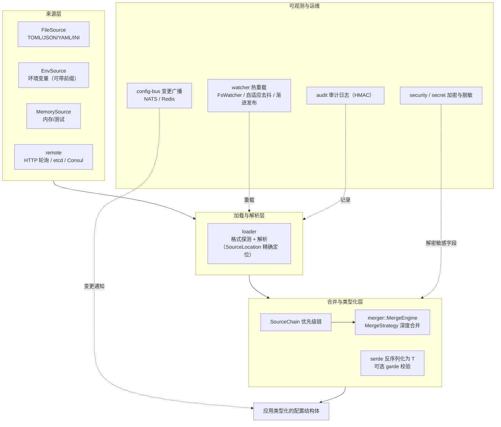

# 🏗️ Confers 架构文档

Confers 是一个生产就绪的 Rust 配置管理库，采用"零样板"设计：通过派生宏驱动配置加载，以来源链（Source Chain）组织多来源优先级，并围绕 BrickArchitecture 将配置阶段错误与运行时错误分离。本文档基于 `src/` 实际代码结构，介绍 Confers 的设计原则、模块划分、数据流以及安全与性能设计。

## 📋 目录

<details open>
<summary>📑 目录（点击展开）</summary>

- [概述](#-概述)
- [设计原则](#-设计原则)
- [系统架构](#️-系统架构)
- [模块划分](#-模块划分)
- [数据流](#-数据流)
- [安全设计](#-安全设计)
- [性能设计](#-性能设计)

</details>

---

## 🎯 概述

Confers 解决的核心问题是：如何让 Rust 应用以类型安全、可审计、可热更新的方式管理来自多处的配置。它的能力边界由 Cargo 特性（feature）精确控制——从最小的 `env` + `json`，到覆盖远程来源、消息总线与加密的 `full` 预设，编译产物只包含您启用的功能。

核心能力一览：

- **派生宏驱动**：`#[derive(Config)]` 自动生成配置加载代码（由 workspace 内的 `confers-macros` 过程宏 crate 提供，实现位于 `macros/src/` 的 `parse.rs` 与 `codegen.rs`）。
- **多来源优先级链**：文件、环境变量、内存、远程（HTTP/etcd/Consul）按声明顺序合并，后加入者覆盖先加入者。
- **热重载**：基于文件监听（`notify-debouncer-full`）与自适应去抖，配合渐进式发布（progressive deployment）与健康检查回滚。
- **敏感字段加密**：XChaCha20-Poly1305 认证加密 + HKDF-SHA256 字段级密钥派生。
- **类型安全配置键**：`TypedConfigKey<T>` 将路径与类型在编译期绑定。

## 📐 设计原则

1. **BrickArchitecture 错误分离**：配置阶段错误（`ConfigConfigError`，初始化期缺失字段、解析错误、校验失败，错误码 2001-2999）与运行时错误（`ConfersError`，超时、远程不可用、解密失败）是两个独立类型，调用方可以精确区分"启动就该失败"与"运行中需要重试"两类问题。
2. **门面 + 内部实现分离（facade / `impl_`）**：`src/` 下的公开模块（`config`、`loader`、`merger`、`format`、`audit`、`dynamic`、`schema`、`lifecycle` 等）只做转发动机（re-export），真正实现位于 `src/impl_/` 内部模块（如 `crate::impl_::config`、`crate::impl_::merger`），不对外暴露实现细节。
3. **接口隔离原则（ISP）**：`src/interface.rs` 将能力拆分为独立 trait——`ConfigReader` / `ConfigWriter` / `ConfigConnector`（按特性门控的异步/同步读写）、`ConfigProvider`（同步访问）、`ConfigProviderExt`（便捷方法的扩展 trait）、`KeyProvider`（加密密钥提供者）、`MetricsBackend`（指标接口）。
4. **一切皆注解值（AnnotatedValue）**：每个配置值都携带来源（`SourceId`）、精确文件位置（`SourceLocation`）与优先级元数据，支撑审计、错误定位与冲突报告（`ConflictReport`）。
5. **特性门控最小化**：所有可选能力（`validation`、`watch`、`encryption`、`remote`、`config-bus` 等）都是独立特性，未启用的代码不参与编译，最小化编译时间与二进制体积。
6. **组件生命周期统一**：具备后台行为的组件（如 ConfigBus）实现 `Lifecycle` trait，提供 `health_check()` 与优雅关闭（`shutdown()`）。

## 🏛️ 系统架构

整体分为四层：来源层 → 加载/解析层 → 合并与类型化层 → 可观测与运维层，另有派生宏在编译期为应用层生成胶水代码。



对应的仓库物理布局：

```
confers/
├── src/            # 库本体（门面模块 + impl_ 内部实现）
│   ├── lib.rs      # 模块声明与重导出（含特性门控）
│   ├── config.rs / loader.rs / merger.rs / format.rs / types.rs
│   ├── interface.rs / error.rs / lifecycle.rs
│   ├── impl_/      # 上述门面的内部实现
│   └── <特性模块>/ # validator、watcher、secret、remote、bus、cli……
├── macros/         # confers-macros 过程宏 crate（parse.rs + codegen.rs）
├── examples/       # 可运行示例
├── fuzz/           # 模糊测试
└── benches/        # Criterion 基准测试
```

## 🧩 模块划分

### 公开核心模块（无特性门控）

| 模块 | 职责 | 关键类型 |
|------|------|----------|
| `config` | 配置构建与来源链的公开门面 | `ConfigBuilder`、`SourceChain`/`SourceChainBuilder`、`FileSource`、`EnvSource`、`MemorySource`、`Source`、`SourceKind`、`ConfigLimits` |
| `loader` | 配置文件加载与解析，带精确错误位置 | `Format`、`LoaderConfig`、`load_file`、`parse_content`、`detect_format_from_content/path` |
| `merger` | 配置合并引擎与策略 | `MergeEngine`、`MergeStrategy`、`CustomMergeFn` |
| `format` | 格式探测与转换的门面转发动机 | 各格式转换器 |
| `types` | 配置值与元数据类型 | `ConfigValue`、`AnnotatedValue`、`SourceId`、`SourceLocation`、`ConflictReport`、`ZeroizingBytes`、`KeyCachePolicy` |
| `interface` | 核心 trait 定义（ISP） | `ConfigConnector`、`ConfigReader`、`ConfigWriter`、`ConfigProvider`、`ConfigProviderExt`、`KeyProvider`、`TypedConfigKey` |
| `error` | 双阶段错误体系 | `ConfigConfigError`（配置阶段）、`ConfigError`/`ConfersError`（运行时）、`ErrorCode`、`SourceWarning`、`ParseLocation` |
| `lifecycle` | 组件生命周期管理门面 | `Lifecycle` |

### 特性门控模块

| 模块 | 门控特性 | 职责与关键类型 |
|------|----------|----------------|
| `validator` | `validation` | 基于 `garde` 的配置校验 |
| `interpolation` | `interpolation` | `${VAR}` / `${VAR:-default}` 变量插值（深度感知嵌套，支持自引用默认值） |
| `watcher` | `watch` | 文件监听热重载：`FsWatcher`、`MultiFsWatcher`、`AdaptiveDebouncer`；`progressive` 子模块实现渐进式发布 |
| `secret` | `encryption` | 加密原语：`XChaCha20Crypto`、`derive_field_key`、`SecretBytes`、`KeyRegistry`、`EnvKeyProvider`/`FileKeyProvider` 等、`EncryptionPrefix`（`enc:` 前缀识别） |
| `key` | `key` | 密钥生命周期：`KeyManager`、`KeyStorage`（加密持久化）、`KeyRotationService`/`KeyRotationPolicy`、`KeyVersion`/`KeyInfo` |
| `security` | `security` / `security-rules` | `EnvSecurityValidator`（环境变量注入防护）、`ErrorSanitizer`（错误脱敏）、`rules` 子模块内置 JWT/CORS/SSRF/TLS 校验器与 `SecurityValidatorRegistry` |
| `audit` | `audit` | 审计日志（写入器、HMAC 完整性、敏感字段脱敏） |
| `dynamic` | `dynamic` | 运行时动态字段：`DynamicField`/`DynamicFieldBuilder`、`CallbackGuard`、`FieldWatcher`，基于 `arc-swap` 快照 |
| `snapshot` | `snapshot` | 配置快照与回滚（`SnapshotConfig`） |
| `migration` | `migration` | 配置版本迁移（配合 `#[config(version)]`） |
| `modules` | `modules` | 模块化配置分组：`ModuleConfig`、`ModuleRegistry`，按 profile 切换 |
| `remote` | `remote` / `etcd` / `consul` | HTTP 轮询来源（`HttpPolledSourceBuilder`、`PollInterval`）、etcd/Consul 集成、`circuit_breaker` 熔断器 |
| `bus` | `config-bus` / `nats-bus` / `redis-bus` | 多实例配置变更广播：`ConfigBus`、`BusEventLimiter`，基于 tokio broadcast，支持 NATS / Redis 后端 |
| `toggle` | `feature-toggle` | 运行时特性开关：`FeatureToggleRegistry`（基于 `dashmap`） |
| `context` | `context-aware` | 上下文感知配置 |
| `schema` | `schema` / `typescript-schema` | `TypeScriptGenerator`，从 Rust 类型生成 TS 定义 |
| `cli` | `cli` | `confers` 命令行工具（clap）：diff、generate、validate、encrypt、wizard、key；入口在 `src/cli/main.rs` |

### workspace 成员

| 成员 | 说明 |
|------|------|
| `macros/` | `confers-macros`：`#[derive(Config)]` 过程宏，`parse.rs` 解析 `#[config(...)]` 属性，`codegen.rs` 生成加载/校验/CLI 辅助代码 |
| `examples/` | 13 个可运行示例 |
| `fuzz/` | cargo-fuzz 模糊测试目标 |

## 🌊 数据流

### 配置加载主流程

```
配置声明                     加载                        合并                        输出
─────────                   ─────────                   ─────────                   ─────────
#[derive(Config)]    →   FileSource / EnvSource  →   SourceChain 优先级链   →   serde 反序列化为 T
#[config(...)] 属性       Format 探测 + parse          MergeEngine 逐键合并         可选 garde 校验
                          ConfigValue + SourceLocation MergeStrategy（覆盖/       可选敏感字段解密
                          （精确行列定位）              追加/深度合并/自定义）      输出类型安全配置
```

1. **来源注册**：应用通过 `ConfigBuilder`（或 `SourceChainBuilder`）声明来源，顺序即优先级（后加入者优先）。
2. **解析**：`loader` 对每个来源做格式探测（按内容或扩展名：TOML/JSON/YAML/INI），解析为 `ConfigValue` 树；解析错误携带 `SourceLocation`（精确到行列）。
3. **合并**：`MergeEngine` 沿来源链逐键合并，值被包装为 `AnnotatedValue`（保留来源与优先级）；冲突可产生 `ConflictReport` / `SourceWarning`；字段可声明 `merge_strategy`（`replace`/`append`/`prepend`/`join`/`deep_merge`）。
4. **类型化**：合并结果反序列化为用户结构体 `T`；启用 `validation` 时按 `garde` 规则校验；启用 `encryption` 时以 `enc:` 前缀识别加密值并解密。
5. **错误出口**：任一环节的初始化期失败以 `ConfigConfigError` 返回；运行期失败以 `ConfersError` 返回。`build_with_fallback` / `build_resilient` 提供降级构建。

### 热重载数据流（`watch` / `progressive-reload`）

```
文件变更 → notify-debouncer-full 事件 → AdaptiveDebouncer 去抖
        → FsWatcher/MultiFsWatcher 通知
        → 重新走"加载→合并"流程生成新配置
        → （progressive-reload）渐进式发布：分批切换实例
        → 健康检查失败 → 自动回滚（ReloadRolledBack）
```

动态字段（`dynamic`）提供更细粒度的运行时更新：`#[config(dynamic)]` 生成 `DynamicField` 句柄，内部用 `arc-swap` 保存配置快照，读者无锁读取，写者原子换入新快照，并可注册回调（`CallbackGuard`）与字段监听（`FieldWatcher`）。

### 多实例变更广播（`config-bus`）

单机热重载只覆盖本进程。跨实例场景下，`ConfigBus` 将变更事件发布到消息总线（NATS 或 Redis 后端），其他实例订阅后各自重载，`BusEventLimiter` 限制事件速率防止风暴。

## 🔒 安全设计

安全设计围绕"敏感数据全生命周期防护"展开：

1. **加密算法**：`secret::XChaCha20Crypto` 提供 XChaCha20-Poly1305 认证加密（AEAD），每次加密生成随机 nonce，密文附带 Poly1305 认证标签防篡改。
2. **字段级密钥派生**：`derive_field_key` 使用 HKDF-SHA256 从主密钥为每个字段路径 + 密钥版本派生独立子密钥，避免主密钥直接参与加密；`key::KeyStorage` 中的密钥材料本身也以 XChaCha20 加密持久化。
3. **内存安全**：`SecretBytes` / `ZeroizingBytes`（zeroize）确保敏感字节在丢弃时清零；`secrecy` crate 防止敏感值意外进入日志；`SecureString` 禁止 `Clone`（v0.4.0 起），防止敏感材料被无意复制。
4. **密钥治理**：`KeyManager` + `KeyRegistry` 提供密钥版本（`KeyVersion`）、状态（Active/Deprecated/Compromised）、轮换（`KeyRotationService` 按策略定时轮换）与熵值校验。
5. **输入防护**：`EnvSecurityValidator` 以 allow/block 模式校验环境变量名，防注入；`security::rules` 内置 JWT/CORS/SSRF/TLS 四类校验器（SSRF 覆盖 18 个封锁 CIDR 网段并做 URL 边界匹配防绕过），可在启动时经 `SecurityValidatorRegistry` 统一执行。
6. **输出脱敏**：`ErrorSanitizer` 对错误信息脱敏，防止敏感配置值经错误路径泄露；`#[config(sensitive = true)]` 字段在审计日志与 debug 输出中自动遮蔽。
7. **审计追踪**：`audit` 模块记录配置加载、密钥访问、解密等事件，日志带 HMAC 签名保护完整性，并支持轮转归档与查询。
8. **远程来源防护**：`remote` 模块内置 SSRF 校验与熔断器（`circuit_breaker`），避免内网地址探测与故障扩散。

## ⚡ 性能设计

性能设计目标：配置读取路径接近零开销，重载路径可控且可观测。

1. **无锁动态读取**：`dynamic` 模块基于 `arc-swap` 实现快照发布——读者无锁、写者原子换入，`DynamicField::get()` 无争用。
2. **并发安全容器**：`feature-toggle` 使用 `dashmap` 分片锁；加载器缓存策略由 `LoaderConfig` 暴露（依赖 `moka` 提供 future/sync 双模式缓存）。
3. **高效数据结构**：`ConfigValue` 树使用 `IndexMap` 保持键序（保证合并与输出的确定性）；短字符串经 `compact_str` 驻留以降低内存占用。
4. **解析性能**：TOML 解析启用 `preserve_order`；格式探测支持从内容直接判断，避免重复读盘（大文件建议一次读入后交给 `parse_content`）。
5. **热路径去抖**：`watcher::AdaptiveDebouncer` 自适应调节去抖窗口，避免编辑器连续写入触发的重载风暴。
6. **编译期裁剪**：全部可选能力特性门控，配合 `minimal`/`recommended`/`dev`/`production`/`full` 预设，按需控制编译时间与二进制体积。
7. **持续基准**：`benches/` 内置 8 组 Criterion 基准（load、merge、interpolation、value_path、dynamic_field、hot_path、concurrent_rw、concurrent_access），覆盖从冷加载到并发读写的完整热路径，可通过 `cargo bench` 复现（详见[性能指南](PERFORMANCE.md)）。
