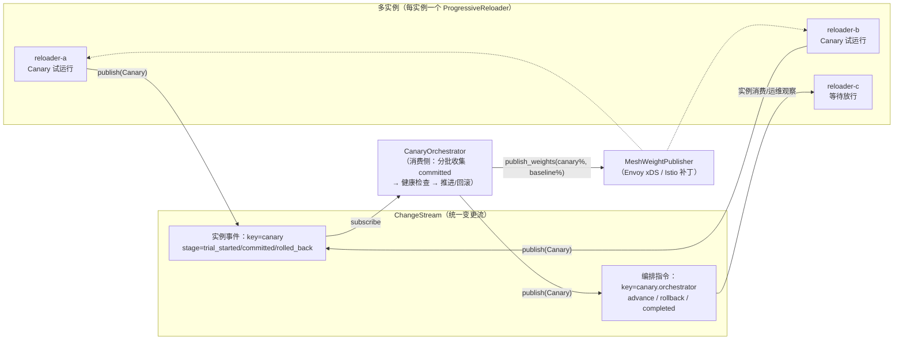

# 金丝雀发布编排器（Canary Rollout Orchestrator）

> 特性门控：`canary`（= `change-stream` + `progressive-reload`）。
> 组件：`confers::CanaryOrchestrator` / `RolloutPlan` / `RolloutHealthCheck` /
> `MeshWeightPublisher`（`src/canary.rs`）。

## 架构与事件流



职责切分（与单实例组件的复用关系）：

| 组件 | 职责 | 语义来源 |
|:-----|:-----|:---------|
| `ProgressiveReloader`（每实例） | 实例内 canary 试运行：健康轮询、提交/回滚，阶段转换发布为 `ChangeSource::Canary` 事件（`with_change_stream`） | `src/watcher/progressive.rs` |
| `CanaryOrchestrator`（消费侧） | 跨实例分批编排：按 `RolloutPlan` 收集各批 `committed` 事件、批次健康检查（复用 `HealthStatus` 三态语义）、发布推进/回滚指令 | `src/canary.rs` |
| `MeshWeightPublisher`（适配层） | 把 rollout 进度翻译为 baseline↔canary 流量权重（每批线性增长，回滚即全量回 baseline） | 本文 Envoy/Istio 样例 |

## 阶段策略（RolloutPlan）

```rust
use confers::canary::RolloutPlan;

let plan = RolloutPlan {
    batch_size: 2,                                  // 每批实例数
    batch_interval: std::time::Duration::from_secs(30), // 批观察窗（等 committed + 健康轮询）
    poll_interval: std::time::Duration::from_secs(5),   // 窗口内健康检查节奏
    failure_threshold: 0.0,                         // Critical 比例上限，超出即回滚（0.0 = 任一 Critical 即回滚）
};
```

Critical 判定逐轮评估：比例超阈值**立即**中止该批（不等观察窗耗尽）；窗口
先耗尽时按最后一次观察判定——最坏回滚延迟为一个 `batch_interval`，典型为
一个 `poll_interval`。

- `Degraded` 只记录不阻断（与单实例 `HealthStatus::requires_rollback` 语义一致，仅 `Critical` 计入回滚判定）。
- 批窗口内收齐 `batch_size` 个 `committed` 事件即进入健康检查；收到任何实例 `rolled_back` 事件立即回滚；窗口耗尽仍未收齐按超时回滚。
- 每批通过后发布 `advance` 指令并调用 `MeshWeightPublisher::publish_weights(canary_pct, 100 - canary_pct)`；`canary_pct` 随批次线性增长（1/3 批 ≈ 33%）。

## 事件契约

| 事件 | key | old_value | new_value | 生产者 |
|:-----|:----|:----------|:----------|:-------|
| 实例阶段转换 | `canary.<instance_id>` | `trial_started` / `committed` / `rolled_back` / `rejected` | 明细 | `ProgressiveReloader`（`with_instance_id`） |
| 编排指令 | `canary.orchestrator` | `advance` / `rollback` / `completed` | 批号/原因 | `CanaryOrchestrator` |

两者均为 `ChangeSource::Canary`；消费方按 key 前缀区分。`canary.orchestrator`
指令事件是建议性信号——实例侧可消费 `rollback` 触发本地
`ProgressiveReloader` 回滚（或由运维平台执行）。

**事件归属与批次确认**：编排器按 key 中的 `instance_id` 与当前批实例集合
做集合匹配——重复 `committed` 折叠、未知实例与跨批事件永不计数，单个高频
实例无法填补其他实例的配额。未设置 `with_instance_id` 的 reloader 以
`unknown` 发布，无法被归属（不计入任何批次）——多实例部署必须为每个
reloader 设置唯一实例 id。

**失败语义**：回滚路径的 mesh 权重下发与 rollback 指令发布若失败，
`RolloutOutcome::Aborted.mesh_rolled_back_failed = true` 且 reason 追加
失败说明（流量可能未真正回切，必须人工核查）；推进路径的 mesh 下发失败
使 `run()` 返回 `Err`（尽力回切 baseline 后 fail-loud），rollout 不会在
未生效的切流上继续推进。失败同时计入
`confers_canary_errors_total{reason=...}` 并在 `tracing` 特性下输出 warn。

### ⚠️ 操作限制

- 实例必须设置唯一 `with_instance_id`，且同一 rollout 内不得复用（归属去重依赖其唯一性）。
- 批次确认要求实例事件在批窗口内到达；实例自主推进（不等 directive）时，晚到事件计入其所属实例的下一批确认而非当前批——建议实例侧消费 `advance` 指令后再开始下一批，或在 `batch_interval` 内保证事件到达。
- 当前批**或已推进批次**实例的 `rolled_back` 事件都会立即中止整个 rollout——已推进实例的回滚意味着候选版本在已推广配置上回归，后续批次不得继续；请勿在无关 rollout 中共用同一 stream。
- 健康检查实现必须遵守 `poll_interval` 上界（单次 check 超过窗口剩余即按 Degraded 记录），避免拖死整个窗口。

## 本地多实例模拟（进程内多 reloader）

沙箱/CI 无真实集群时的等价验证：N 个 `ProgressiveReloader` attach 同一个
`InMemoryChangeStream`，各自 `begin_reload` 跑真实 canary 试运行；编排器
消费其事件驱动分批。完整可运行测试见 `src/canary.rs`
`orchestrates_in_process_reloaders_end_to_end`（两实例、单批、断言
advance→completed 指令序列）。

## 服务网格集成适配层

`MeshWeightPublisher` 把「批次通过」抽象为两组流量权重，网格侧实现只需
执行一次权重下发。Envoy 与 Istio 的等价配置如下（以 25% 切流为例）。

### Envoy（weighted clusters，xDS 动态下发）

适配层实现调 Envoy Admin/EDS 更新 cluster 权重；静态对照配置：

```yaml
# envoy.yaml（片段）：baseline 与 canary 两组 upstream cluster 按权重分流
static_resources:
  listeners:
    - name: app_listener
      address: { socket_address: { address: 0.0.0.0, port_value: 8080 } }
      filter_chains:
        - filters:
            - name: envoy.filters.network.http_connection_manager
              typed_config:
                "@type": type.googleapis.com/envoy.extensions.filters.network.http_connection_manager.v3.HttpConnectionManager
                stat_prefix: app
                route_config:
                  name: canary_routes
                  virtual_hosts:
                    - name: app
                      domains: ["*"]
                      routes:
                        - match: { prefix: "/" }
                          route:
                            weighted_clusters:
                              clusters:
                                - name: baseline_cluster
                                  weight: 75      # ← publish_weights(25, 75) 的 baseline 侧
                                - name: canary_cluster
                                  weight: 25      # ← canary 侧（随批次线性增长）
  clusters:
    - name: baseline_cluster
      connect_timeout: 1s
      type: STATIC
      load_assignment:
        cluster_name: baseline_cluster
        endpoints: [{ lb_endpoints: [{ endpoint: { address: { socket_address: { address: 10.0.0.10, port_value: 9000 } } } }] }]
    - name: canary_cluster
      connect_timeout: 1s
      type: STATIC
      load_assignment:
        cluster_name: canary_cluster
        endpoints: [{ lb_endpoints: [{ endpoint: { address: { socket_address: { address: 10.0.0.20, port_value: 9000 } } } }] }]
```

Rust 适配层骨架（生产实现替换 `publish_weights` 内部为 xDS RDS/CDS patch
或 Admin `POST /clusters` 调整）：

```rust
use async_trait::async_trait;
use confers::canary::MeshWeightPublisher;
use confers::error::ConfigResult;

struct EnvoyWeightPublisher {
    /// xDS 治理面/Admin 端点，例如 http://envoy-admin:9901
    admin_endpoint: String,
    http: reqwest::Client,
}

#[async_trait]
impl MeshWeightPublisher for EnvoyWeightPublisher {
    async fn publish_weights(&self, canary_pct: u8, baseline_pct: u8) -> ConfigResult<()> {
        // 生产实现：经 xDS（或 Admin API）把 weighted_clusters 权重更新为
        // (canary_pct, baseline_pct)。此处示意 Admin 路径。
        let url = format!("{}/clusters", self.admin_endpoint);
        self.http.post(url)
            .body(format!(
                "canary_cluster::weight={canary_pct}\nbaseline_cluster::weight={baseline_pct}\n"
            ))
            .send()
            .await
            .map_err(|e| confers::error::ConfigError::InvalidValue {
                key: "envoy".into(),
                expected_type: "weight update".into(),
                message: e.to_string(),
            })?;
        Ok(())
    }
}
```

### Istio（VirtualService weighted routing）

适配层实现调 Istio CRD Patch（`k8s-openapi`/`kube` 或 `istioctl`）；
目标 VirtualService：

```yaml
apiVersion: networking.istio.io/v1beta1
kind: VirtualService
metadata:
  name: app-canary
spec:
  hosts: ["app.example.com"]
  http:
    - route:
        - destination: { host: app, subset: baseline }
          weight: 75            # ← publish_weights(25, 75) 的 baseline 侧
        - destination: { host: app, subset: canary }
          weight: 25            # ← canary 侧（随批次线性增长）
---
apiVersion: networking.istio.io/v1beta1
kind: DestinationRule
metadata:
  name: app-canary
spec:
  host: app
  subsets:
    - name: baseline
      labels: { version: stable }
    - name: canary
      labels: { version: canary }
```

Rust 适配层骨架（生产实现为 `PATCH /apis/networking.istio.io/v1beta1/
namespaces/<ns>/virtualservices/app-canary`，替换两条 route 的 `weight`）：

```rust
struct IstioWeightPublisher {
    /// k8s API 端点与命名空间
    api: String,
    namespace: String,
    http: reqwest::Client,
}

#[async_trait]
impl MeshWeightPublisher for IstioWeightPublisher {
    async fn publish_weights(&self, canary_pct: u8, baseline_pct: u8) -> ConfigResult<()> {
        let url = format!(
            "{}/apis/networking.istio.io/v1beta1/namespaces/{}/virtualservices/app-canary",
            self.api, self.namespace
        );
        let patch = format!(
            r#"{{"spec":{{"http":[{{"route":[
                {{"destination":{{"host":"app","subset":"baseline"}},"weight":{baseline_pct}}},
                {{"destination":{{"host":"app","subset":"canary"}},"weight":{canary_pct}}}
            ]}}]}}}}"#
        );
        self.http.patch(url)
            .header("Content-Type", "application/merge-patch+json")
            .body(patch)
            .send()
            .await
            .map_err(|e| confers::error::ConfigError::InvalidValue {
                key: "istio".into(),
                expected_type: "virtualservice patch".into(),
                message: e.to_string(),
            })?;
        Ok(())
    }
}
```

组装（编排器 + 网格）：

```rust
use confers::canary::{CanaryOrchestrator, MeshWeightPublisher, RolloutPlan, RolloutHealthCheck};
use std::sync::Arc;

async fn rollout(
    stream: Arc<dyn confers::ChangeStream>,
    instances: Vec<String>,
    health: Arc<dyn RolloutHealthCheck>,
    mesh: Arc<dyn MeshWeightPublisher>,
) -> confers::error::ConfigResult<()> {
    let orchestrator = CanaryOrchestrator::new(
        stream,
        instances,
        RolloutPlan {
            batch_size: 2,
            ..Default::default()
        },
        health,
    )
    .with_mesh(mesh);
    orchestrator.run().await.map(|_| ())
}
```

## 测试矩阵

| 场景 | 测试 | 断言 |
|:-----|:-----|:-----|
| 分批推进 + 完成 | `advances_in_batches_and_completes` | `Completed{batches:2}` + advance/advance/completed 指令序 |
| 批健康 Critical → 回滚 | `rolls_back_when_batch_health_is_critical` | `Aborted` + rollback 指令 |
| committed 超时 → 回滚 | `aborts_when_committed_events_time_out` | `Aborted` + rollback |
| Degraded 不阻断 | `degraded_health_does_not_block` | `Completed` |
| 实例 rolled_back → 中止 | `instance_rollback_aborts_the_rollout` | `Aborted` |
| mesh 权重线性 + 回滚归零 | `mesh_weights_track_progress_and_snap_back` | `[(50,50),(0,100)]` |
| 进程内双 reloader 端到端 | `orchestrates_in_process_reloaders_end_to_end` | 真实 reloader 事件 → `Completed` |
