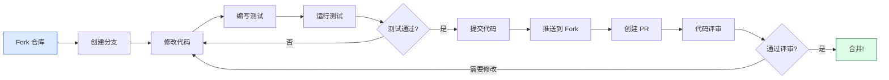
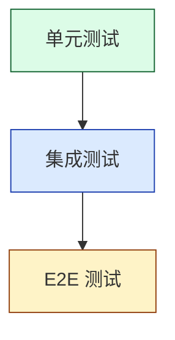

<span id="top"></span>
<div align="center">


### 加入我们，共同打造卓越项目！

[🏠 主页](../README.md) • [📖 用户指南](USER_GUIDE.md) • [❓ 常见问题](FAQ.md)

---

</div>

## 🎯 欢迎贡献者！

感谢您对 **confers** 的关注！我们非常期待您的加入。无论是修复 Bug、添加新功能、改进文档还是帮助他人，您的贡献都是无价的。

<div align="center" style="margin: 24px 0">

### 🌟 贡献方式

<table style="width:100%; border-collapse: collapse">
<tr>
<td align="center" width="25%" style="padding: 16px">
<br>
<b style="color:#166534">代码</b><br>
<span style="color:#166534">修复 Bug & 添加功能</span>
</td>
<td align="center" width="25%" style="padding: 16px">
<br>
<b style="color:#1E40AF">文档</b><br>
<span style="color:#1E40AF">完善文档 & 指南</span>
</td>
<td align="center" width="25%" style="padding: 16px">
<br>
<b style="color:#92400E">测试</b><br>
<span style="color:#92400E">编写测试 & 发现 Bug</span>
</td>
<td align="center" width="25%" style="padding: 16px">
<br>
<b style="color:#5B21B6">社区</b><br>
<span style="color:#5B21B6">提供帮助 & 支持</span>
</td>
</tr>
</table>

</div>

---

## 📋 目录

<details open style="padding:16px">
<summary style="cursor:pointer; font-weight:600; color:#1E293B">📑 目录（点击展开）</summary>

- [行为准则](#行为准则)
- [快速开始](#快速开始)
- [开发工作流](#开发工作流)
- [编码标准](#编码标准)
- [测试指南](#测试指南)
- [文档规范](#文档规范)
- [提交变更](#提交变更)
- [评审流程](#评审流程)

</details>

---

## 行为准则

<div align="center" style="margin: 24px 0">

### 🤗 友善与尊重

</div>

我们致力于提供一个包容和友好的环境。参与本项目即表示您同意：

<table style="width:100%; border-collapse: collapse">
<tr>
<td width="50%" style="padding: 16px">

**✅ 推荐行为**

- 保持尊重和体谅
- 欢迎新手
- 接受建设性批评
- 专注于对社区最有利的事情
- 对他人表现出同理心

</td>
<td width="50%" style="padding: 16px">

**❌ 禁止行为**

- 使用攻击性语言
- 骚扰或侮辱他人
- 公布私人信息
- 进行人身攻击
- 干扰讨论

</td>
</tr>
</table>

---

## 快速开始

### 前提条件

在开始之前，请确保您已安装：

- **Git** - 版本控制工具
- **Rust 1.75+** - 编程语言
- **Cargo** - Rust 包管理器
- **IDE** - VS Code (推荐安装 rust-analyzer 插件)、IntJ 或类似工具

<details style="padding:16px; margin: 16px 0">
<summary style="cursor:pointer; font-weight:600; color:#1E293B">🔧 环境搭建步骤</summary>

**1. 安装 Rust:**

```bash
curl --proto '=https' --tlsv1.2 -sSf https://sh.rustup.rs | sh
```

**2. 安装辅助工具:**

```bash
# 代码格式化工具
rustup component add rustfmt

# 静态分析工具
rustup component add clippy

# 代码覆盖率工具 (可选)
cargo install cargo-tarpaulin
```

**3. 验证安装:**

```bash
rustc --version
cargo --version
```

</details>

### Fork 与 Clone

<div style="padding:16px; margin: 16px 0">

| 步骤 | 操作 |
|:----:|:-----|
| **1. Fork 仓库** | 点击 GitHub 上的 "Fork" 按钮 |
| **2. Clone** | `git clone https://github.com/YOUR_USERNAME/confers` |
| **3. 添加上游** | `git remote add upstream https://github.com/Kirky-X/confers` |
| **4. 验证** | `git remote -v` |

</div>

### 构建与测试

```bash
# 构建项目
cargo build

# 运行所有测试
cargo test --all-features

# 运行示例
cargo run --example basic --features watch
```

---

## 开发工作流

<div align="center" style="margin: 24px 0">

### 🔄 标准贡献流程

</div>



### 详细步骤

#### 1️⃣ 创建分支

分支应基于 `develop` 分支创建。

```bash
# 同步上游 develop 分支
git fetch upstream
git checkout develop
git merge upstream/develop

# 创建功能分支
git checkout -b feature/TICKET-ID-description

# 或创建 Bug 修复分支
git checkout -b bugfix/TICKET-ID-description
```

**分支命名规范:**

| 类型 | 前缀 | 示例 |
|:-----|:-----|:-----|
| 新功能 | `feature/*` | `feature/add-encryption` |
| 缺陷修复 | `bugfix/*` | `bugfix/fix-memory-leak` |
| 紧急修复 | `hotfix/*` | `hotfix/critical-security` |
| 版本发布 | `release/*` | `release/v1.0.0` |
| 代码重构 | `refactor/*` | `refactor/improve-perf` |
| 文档更新 | `docs/*` | `docs/update-readme` |

#### 2️⃣ 运行静态检查与测试

在提交前，请确保代码通过所有本地检查。

```bash
# 格式化代码
cargo fmt

# 运行 Clippy 静态分析 (必须无警告)
cargo clippy -- -D warnings

# 运行所有测试
cargo test --all-features
```

#### 3️⃣ 提交代码

我们遵循 [Conventional Commits](https://www.conventionalcommits.org/) 规范。

**提交格式:**
`<type>(<scope>): <subject>`

**常见类型:**

| 类型 | 描述 | 示例 |
|:-----|:-----|:-----|
| `feat` | 新功能 | `feat(auth): add JWT token refresh` |
| `fix` | 修复 Bug | `fix(loader): resolve memory leak` |
| `docs` | 文档变更 | `docs: update README` |
| `style` | 代码格式 | `style: format code` |
| `refactor` | 代码重构 | `refactor: improve performance` |
| `perf` | 性能优化 | `perf: optimize hot path` |
| `test` | 测试相关 | `test: add unit tests` |
| `chore` | 构建工具 | `chore: update dependencies` |

**示例:**

```bash
git commit -m "feat(auth): add JWT token refresh mechanism"
```

---

## 编码标准

### Rust 最佳实践

<div style="padding:16px; margin: 16px 0">

| 类别 | 要求 |
|:-----|:-----|
| **所有权与借用** | 优先使用借用而非所有权转移，使用 `&` 进行不可变借用 |
| **类型系统** | 优先使用 `Option<T>` 而非空值，使用 `Result<T, E>` 进行错误处理 |
| **并发与异步** | 使用 `Arc<RwLock<T>>` 共享可变数据，优先使用通道进行线程间通信 |
| **性能优化** | 使用 `Vec::with_capacity()` 预分配内存，优先使用迭代器链 |

</div>

### 命名规范

| 类型 | 规范 | 示例 |
|:-----|:-----|:-----|
| 模块、函数、变量 | `snake_case` | `load_config()` |
| 类型、Trait | `PascalCase` | `ConfigLoader` |
| 常量、静态变量 | `SCREAMING_SNAKE_CASE` | `MAX_CACHE_SIZE` |

### 代码质量要求

| 要求 | 描述 |
|:-----|:-----|
| **零警告状态** | 严禁忽略编译器警告 |
| **Clippy** | 必须通过 `cargo clippy -- -D warnings` |
| **代码格式** | 使用 `cargo fmt` 确保格式统一 |
| **文档注释** | 所有公共 API (`pub`) 必须包含 `///` 文档 |

---

## 测试指南

### 测试金字塔

<div align="center" style="margin: 24px 0">



</div>

| 测试类型 | 描述 | 要求 |
|:---------|:-----|:-----|
| **单元测试** | 快速、独立，验证核心逻辑 | ≥ 80% 覆盖 |
| **集成测试** | 验证模块间交互 | 全部通过 |
| **E2E 测试** | 验证关键业务流程 | 核心路径 100% |

### 覆盖率要求

- **新代码覆盖率**: ≥ 80%
- **核心业务逻辑**: 100% 覆盖

```bash
# 运行所有测试
cargo test --all-features

# 生成覆盖率报告
cargo tarpaulin --out Html
```

---

## 文档规范

| 要求 | 描述 |
|:-----|:-----|
| **公共 API** | 所有 `pub` 项目必须包含 `///` 文档注释 |
| **示例代码** | 文档注释中应包含可运行的示例代码 |
| **更新同步** | 代码变更时必须同步更新相关的 README 和 API 文档 |

---

## 提交变更

### PR 提交标准

- **原子性**: 每个 commit/PR 应只包含一个逻辑变更
- **规模限制**: PR 变更行数建议控制在 400 行以内
- **关联 Issue**: 必须在 PR 描述中关联相关 Issue

### PR 模板

```markdown
## 变更类型
- [ ] 新功能
- [ ] 缺陷修复
- [ ] 重构
- [ ] 文档更新
- [ ] 其他

## 描述
简要说明本次变更的目的和内容。

## 测试情况
- [ ] 单元测试通过
- [ ] 集成测试通过
- [ ] 手动测试完成

## 检查清单
- [ ] 代码遵循项目编码规范
- [ ] 已添加必要的测试
- [ ] 文档已更新
- [ ] 未引入新的警告 (Zero Warning)

## 相关 Issue
Closes #123
```

---

## 评审流程

<div style="padding:16px; margin: 16px 0">

### 评审要点

| 维度 | 描述 |
|:-----|:-----|
| **功能性** | 满足需求，逻辑正确 |
| **代码质量** | 遵循 SOLID 原则，可读性好，无重复代码 |
| **安全性** | 无硬编码敏感信息，有输入验证 |
| **性能** | 无明显的性能隐患 |

</div>

---

<div align="center" style="margin: 32px 0; padding: 24px">

### 💝 感谢您为 Confers 贡献力量！

**[📖 用户指南](USER_GUIDE.md)** • **[❓ 常见问题](FAQ.md)** • **[🐛 报告问题](https://github.com/Kirky-X/confers/issues)**

由 Kirky.X 用 ❤️ 制作

**[⬆ 返回顶部](#top)**

</div>