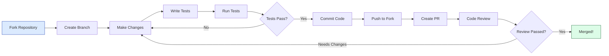
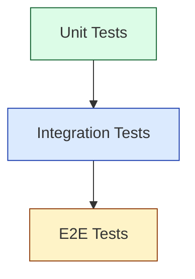

<span id="top"></span>
<div align="center">


### Join Us to Build Something Great!

[🏠 Home](../README.md) • [📖 User Guide](USER_GUIDE.md) • [❓ FAQ](FAQ.md)

---

</div>

## 🎯 Welcome Contributors!

Thank you for your interest in **confers**! We're excited to have you join us. Whether you're fixing bugs, adding new features, improving documentation, or helping others, your contributions are invaluable.

<div align="center" style="margin: 24px 0">

### 🌟 Ways to Contribute

<table style="width:100%; border-collapse: collapse">
<tr>
<td align="center" width="25%" style="padding: 16px">
<br>
<b style="color:#166534">Code</b><br>
<span style="color:#166534">Fix bugs & add features</span>
</td>
<td align="center" width="25%" style="padding: 16px">
<br>
<b style="color:#1E40AF">Documentation</b><br>
<span style="color:#1E40AF">Improve docs & guides</span>
</td>
<td align="center" width="25%" style="padding: 16px">
<br>
<b style="color:#92400E">Testing</b><br>
<span style="color:#92400E">Write tests & find bugs</span>
</td>
<td align="center" width="25%" style="padding: 16px">
<br>
<b style="color:#5B21B6">Community</b><br>
<span style="color:#5B21B6">Help & support others</span>
</td>
</tr>
</table>

</div>

---

## 📋 Table of Contents

<details open style="padding:16px">
<summary style="cursor:pointer; font-weight:600; color:#1E293B">📑 Table of Contents (click to expand)</summary>

- [Code of Conduct](#code-of-conduct)
- [Quick Start](#quick-start)
- [Development Workflow](#development-workflow)
- [Coding Standards](#coding-standards)
- [Testing Guidelines](#testing-guidelines)
- [Documentation Standards](#documentation-standards)
- [Submitting Changes](#submitting-changes)
- [Review Process](#review-process)

</details>

---

## Code of Conduct

<div align="center" style="margin: 24px 0">

### 🤗 Be Friendly and Respectful

</div>

We are committed to providing an inclusive and friendly environment. By participating in this project, you agree to:

<table style="width:100%; border-collapse: collapse">
<tr>
<td width="50%" style="padding: 16px">

**✅ Expected Behavior**

- Be respectful and considerate
- Welcome newcomers
- Accept constructive criticism
- Focus on what's best for the community
- Show empathy towards others

</td>
<td width="50%" style="padding: 16px">

**❌ Unacceptable Behavior**

- Using offensive language
- Harassing or insulting others
- Publishing private information
- Personal attacks
- Disrupting discussions

</td>
</tr>
</table>

---

## Quick Start

### Prerequisites

Before you begin, make sure you have installed:

- **Git** - Version control tool
- **Rust 1.81+** - Programming language
- **Cargo** - Rust package manager
- **IDE** - VS Code (rust-analyzer plugin recommended), IntelliJ IDEA or similar

<details style="padding:16px; margin: 16px 0">
<summary style="cursor:pointer; font-weight:600; color:#1E293B">🔧 Environment Setup Steps</summary>

**1. Install Rust:**

```bash
curl --proto '=https' --tlsv1.2 -sSf https://sh.rustup.rs | sh
```

**2. Install auxiliary tools:**

```bash
# Code formatter
rustup component add rustfmt

# Static analysis tool
rustup component add clippy

# Code coverage tool (optional)
cargo install cargo-llvm-cov
```

**3. Verify installation:**

```bash
rustc --version
cargo --version
```

</details>

### Fork and Clone

<div style="padding:16px; margin: 16px 0">

| Step | Action |
|:----:|:-------|
| **1. Fork repository** | Click the "Fork" button on GitHub |
| **2. Clone** | `git clone https://github.com/YOUR_USERNAME/confers` |
| **3. Add upstream** | `git remote add upstream https://github.com/Kirky-X/confers` |
| **4. Verify** | `git remote -v` |

</div>

### Environment Setup

Before starting development, make sure you have set up the development environment:

```bash
# Install Rust toolchain
curl --proto '=https' --tlsv1.2 -sSf https://sh.rustup.rs | sh

# Install necessary components
rustup component add rustfmt clippy

# Install project dependencies
cargo build
```

### Feature Flags

This project uses feature flags to enable different functionalities. During development, please note:

**Default features:** `toml`, `json`, `env`

**Format support:**
- `toml`: TOML format support (default)
- `json`: JSON format support (default)
- `yaml`: YAML format support
- `ini`: INI format support
- `env`: Environment variable support (default)

**Core features:**
- `validation`: Configuration validation (garde)
- `watch`: File monitoring and hot reload
- `encryption`: Configuration encryption (XChaCha20-Poly1305)
- `cli`: Command-line tool
- `schema`: JSON Schema generation
- `parallel`: Parallel validation

**Advanced features:**
- `audit`: Audit logging
- `metrics`: Metrics collection
- `dynamic`: Dynamic fields
- `progressive-reload`: Progressive reload
- `migration`: Configuration migration
- `snapshot`: Snapshot rollback
- `profile`: Environment configuration
- `interpolation`: Variable interpolation

**Remote sources:**
- `remote`: HTTP polling
- `etcd`: Etcd integration
- `consul`: Consul integration
- `cache-redis`: Redis cache

**Message bus:**
- `config-bus`: Configuration event bus
- `nats-bus`: NATS message bus
- `redis-bus`: Redis message bus

When running tests, you can use different feature combinations:

```bash
cargo test --all-features  # Run tests for all features
cargo test --features cli  # Run only CLI-related tests
cargo test --features remote  # Run only remote configuration-related tests
```

### Build and Test

```bash
# Build project
cargo build

# Run all tests
cargo test --all-features

# Run examples
cargo run --example basic --features watch
```

---

## Development Workflow

<div align="center" style="margin: 24px 0">

### 🔄 Standard Contribution Process

</div>


```mermaid
graph LR
    A[Fork Repository] --> B[Create Branch]
    B --> C[Make Changes]
    C --> D[Write Tests]
    D --> E[Run Tests]
    E --> F{Tests Pass?}
    F -->|No| C
    F -->|Yes| G[Commit Code]
    G --> H[Push to Fork]
    H --> I[Create PR]
    I --> J[Code Review]
    J --> K{Review Passed?}
    K -->|Needs Changes| C
    K -->|Yes| L[Merged!]

    style A fill:#DBEAFE,stroke:#1E40AF
    style L fill:#DCFCE7,stroke:#166534
```

### Detailed Steps

#### 1️⃣ Create Branch

Branches should be created based on the `main` branch.

```bash
# Sync upstream main branch
git fetch upstream
git checkout main
git merge upstream/main

# Create feature branch
git checkout -b feature/TICKET-ID-description

# Or create bug fix branch
git checkout -b bugfix/TICKET-ID-description
```

**Branch Naming Convention:**

| Type | Prefix | Example |
|:-----|:-------|:--------|
| New feature | `feature/*` | `feature/add-encryption` |
| Bug fix | `bugfix/*` | `bugfix/fix-memory-leak` |
| Hot fix | `hotfix/*` | `hotfix/critical-security` |
| Release | `release/*` | `release/v1.0.0` |
| Refactoring | `refactor/*` | `refactor/improve-perf` |
| Documentation | `docs/*` | `docs/update-readme` |

#### 2️⃣ Run Static Analysis and Tests

Before committing, make sure your code passes all local checks.

```bash
# Format code
cargo fmt

# Run Clippy static analysis (must have no warnings)
cargo clippy -- -D warnings

# Run all tests
cargo test --all-features
```

#### 3️⃣ Commit Code

We follow the [Conventional Commits](https://www.conventionalcommits.org/) specification.

**Commit Format:**
`<type>(<scope>): <subject>`

**Common Types:**

| Type | Description | Example |
|:-----|:------------|:--------|
| `feat` | New feature | `feat(auth): add JWT token refresh` |
| `fix` | Bug fix | `fix(loader): resolve memory leak` |
| `docs` | Documentation change | `docs: update README` |
| `style` | Code formatting | `style: format code` |
| `refactor` | Code refactoring | `refactor: improve performance` |
| `perf` | Performance optimization | `perf: optimize hot path` |
| `test` | Test related | `test: add unit tests` |
| `chore` | Build tools | `chore: update dependencies` |

**Example:**

```bash
git commit -m "feat(auth): add JWT token refresh mechanism"
```

#### 4️⃣ Merge and Cleanup (Mandatory)

After completing development or bug fixes, you **MUST** follow this mandatory process to merge back and clean up:

**Step 1: Pre-merge Quality Checks**

Before merging, ensure all quality checks pass:

```bash
# Ensure code formatting
cargo fmt

# Run Clippy static analysis (zero warnings required)
cargo clippy -- -D warnings

# Run all tests with all features enabled
cargo test --all-features
```

**All checks must pass before proceeding to merge.**

**Step 2: Merge to Main Branch**

```bash
# Switch to main branch
git checkout main

# Sync with upstream
git fetch upstream
git merge upstream/main

# Merge your feature/bugfix branch
git merge --no-ff feature/TICKET-ID-description

# Resolve any conflicts if necessary
# After resolving conflicts, run quality checks again
cargo fmt && cargo clippy -- -D warnings && cargo test --all-features

# Push merged changes
git push origin main
```

**Step 3: Clean Up Completed Branches**

After successful merge, **you MUST clean up**:

```bash
# Delete local branch
git branch -d feature/TICKET-ID-description

# Delete remote branch (if pushed)
git push origin --delete feature/TICKET-ID-description

# If using git worktree, remove it
git worktree remove /path/to/worktree
```

**Important Notes:**
- ✅ Always delete branches after successful merge to keep repository clean
- ✅ Never leave completed branches lingering in the repository
- ✅ If merge fails, fix issues and re-run quality checks before retrying
- ✅ For worktree-based development, always remove worktree after merge
- ❌ Do NOT skip cleanup - accumulated branches clutter the repository

---

## Coding Standards

### Rust Best Practices

<div style="padding:16px; margin: 16px 0">

| Category | Requirement |
|:---------|:------------|
| **Ownership and Borrowing** | Prefer borrowing over ownership transfer, use `&` for immutable borrowing |
| **Type System** | Prefer `Option<T>` over null values, use `Result<T, E>` for error handling |
| **Concurrency and Async** | Use `Arc<RwLock<T>>` for shared mutable data, prefer channels for inter-thread communication |
| **Performance Optimization** | Use `Vec::with_capacity()` for pre-allocation, prefer iterator chains |

</div>

### Naming Conventions

| Type | Convention | Example |
|:-----|:-----------|:--------|
| Modules, functions, variables | `snake_case` | `load_config()` |
| Types, Traits | `PascalCase` | `ConfigLoader` |
| Constants, static variables | `SCREAMING_SNAKE_CASE` | `MAX_CACHE_SIZE` |

### Code Quality Requirements

| Requirement | Description |
|:------------|:------------|
| **Zero Warning Status** | Never ignore compiler warnings |
| **Clippy** | Must pass `cargo clippy -- -D warnings` |
| **Code Format** | Use `cargo fmt` to ensure consistent formatting |
| **Documentation Comments** | All public APIs (`pub`) must include `///` documentation |

---

## Testing Guidelines

### Testing Pyramid

<div align="center" style="margin: 24px 0">


```mermaid
graph TD
    A[Unit Tests] --> B[Integration Tests]
    B --> C[E2E Tests]

    style A fill:#DCFCE7,stroke:#166534
    style B fill:#DBEAFE,stroke:#1E40AF
    style C fill:#FEF3C7,stroke:#92400E
```

</div>

| Test Type | Description | Requirement |
|:----------|:------------|:------------|
| **Unit Tests** | Fast, independent, verify core logic | ≥ 80% coverage |
| **Integration Tests** | Verify module interactions | All pass |
| **E2E Tests** | Verify critical business flows | Core paths 100% |

### Coverage Requirements

Per [ADR-044](adr/ADR-044-test-coverage-targets.md), the following coverage targets are enforced:

| Module | Target | Critical Requirements |
|:-------|:------:|:---------------------|
| Core (loader, merger, value) | >= 90% | Includes boundary conditions |
| Encryption | >= 90% | All attack paths must be tested |
| Validation | >= 85% | All rule types covered |
| Migration | >= 85% | Upgrade and downgrade paths |
| Snapshot | >= 85% | Consistency guarantees |
| Other modules | >= 80% | Overall average |
| **Overall target** | **>= 80%** | All code average |

**Coverage verification commands:**

```bash
# Generate coverage report (HTML)
cargo llvm-cov --all-features --open

# Generate LCOV format for CI integration
cargo llvm-cov --all-features --lcov --output-path lcov.info

# Run all tests
cargo test --all-features

# Quick coverage check
cargo llvm-cov --all-features --summary-only
```

**CI enforcement:**
- Codecov is integrated via GitHub Actions
- PRs failing below the 80% threshold will be blocked
- Coverage reports are generated on every PR

---

## Documentation Standards

| Requirement | Description |
|:------------|:------------|
| **Public API** | All `pub` items must include `///` documentation comments |
| **Example Code** | Documentation comments should include runnable example code |
| **Sync Updates** | Documentation in README and API docs must be updated when code changes |

---

## Submitting Changes

### PR Submission Standards

- **Atomic**: Each commit/PR should contain only one logical change
- **Size Limit**: PR change lines should ideally be under 400 lines
- **Linked Issue**: Must link related Issue in PR description

### PR Template

```markdown
## Change Type
- [ ] New feature
- [ ] Bug fix
- [ ] Refactoring
- [ ] Documentation update
- [ ] Other

## Description
Briefly describe the purpose and content of this change.

## Testing Status
- [ ] Unit tests pass
- [ ] Integration tests pass
- [ ] Manual testing complete

## Checklist
- [ ] Code follows project coding standards
- [ ] Necessary tests added
- [ ] Documentation updated
- [ ] No new warnings introduced (Zero Warning)

## Related Issue
Closes #123
```

---

## Review Process

<div style="padding:16px; margin: 16px 0">

### Review Criteria

| Dimension | Description |
|:----------|:------------|
| **Functionality** | Meets requirements, correct logic |
| **Code Quality** | Follows SOLID principles, good readability, no duplicate code |
| **Security** | No hardcoded sensitive information, input validation present |
| **Performance** | No obvious performance issues |

</div>

---

<div align="center" style="margin: 32px 0; padding: 24px">

### 💝 Thank You for Contributing to Confers!

**[📖 User Guide](USER_GUIDE.md)** • **[❓ FAQ](FAQ.md)** • **[🐛 Report Issue](https://github.com/Kirky-X/confers/issues)**

Made with ❤️ by Kirky.X

**[⬆ Back to Top](#top)**

</div>
