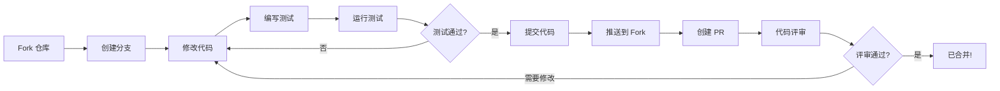
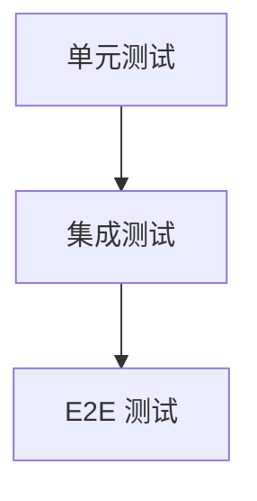

# 🤝 Confers 贡献指南


感谢您关注 **confers**！无论您是在修复缺陷、添加新特性、改进文档还是帮助他人，您的贡献都弥足珍贵。

## 📋 目录

<details open>
<summary>📑 目录（点击展开）</summary>

- [欢迎](#-欢迎)
- [环境准备](#-环境准备)
- [开发工作流（TDD）](#-开发工作流tdd)
- [代码规范](#-代码规范)
- [提交与 PR 流程](#-提交与-pr-流程)
- [行为准则](#-行为准则)

</details>

---

## 👋 欢迎

欢迎参与 **confers** 的建设！

**贡献方式：**

| 代码 | 文档 | 测试 | 社区 |
|:-----|:-----|:-----|:-----|
| 修复缺陷、添加特性 | 改进文档与指南 | 编写测试、发现问题 | 帮助与支持他人 |

---

## 🧰 环境准备

### 前置条件

开始之前，请确认已安装：

- **Git** - 版本控制工具
- **Rust 1.97.1+** - 编程语言
- **Cargo** - Rust 包管理器
- **IDE** - VS Code（推荐 rust-analyzer 插件）、IntelliJ IDEA 或同类工具

<details>
<summary>🔧 环境安装步骤</summary>

**1. 安装 Rust：**

```bash
curl --proto '=https' --tlsv1.2 -sSf https://sh.rustup.rs | sh
```

**2. 安装辅助工具：**

```bash
# 代码格式化工具
rustup component add rustfmt

# 静态分析工具
rustup component add clippy

# 代码覆盖率工具（可选）
cargo install cargo-llvm-cov
```

**3. 验证安装：**

```bash
rustc --version
cargo --version
```

</details>

### Fork 与 Clone

| 步骤 | 操作 |
|:----:|:-----|
| **1. Fork 仓库** | 在 GitHub 上点击 "Fork" 按钮 |
| **2. Clone** | `git clone https://github.com/YOUR_USERNAME/confers` |
| **3. 添加 upstream** | `git remote add upstream https://github.com/Kirky-X/confers` |
| **4. 验证** | `git remote -v` |

### 完成环境搭建

开始开发前，请确认开发环境就绪：

```bash
# 安装 Rust 工具链
curl --proto '=https' --tlsv1.2 -sSf https://sh.rustup.rs | sh

# 安装必要组件
rustup component add rustfmt clippy

# 安装项目依赖
cargo build
```

### 特性标志

本项目使用特性标志启用不同功能。开发时请注意：

**默认特性：** `toml`、`json`、`env`

**格式支持：**
- `toml`：TOML 格式支持（默认）
- `json`：JSON 格式支持（默认）
- `yaml`：YAML 格式支持
- `ini`：INI 格式支持
- `env`：环境变量支持（默认）

**核心特性：**
- `validation`：配置校验（garde）
- `watch`：文件监听与热重载
- `encryption`：配置加密（XChaCha20-Poly1305）
- `cli`：命令行工具
- `schema`：JSON Schema 生成

**进阶特性：**
- `audit`：审计日志
- `dynamic`：动态字段
- `progressive-reload`：渐进式重载
- `migration`：配置迁移
- `snapshot`：快照回滚
- `interpolation`：变量插值

**远程来源：**
- `remote`：HTTP 轮询
- `etcd`：Etcd 集成
- `consul`：Consul 集成

**消息总线：**
- `config-bus`：配置事件总线
- `nats-bus`：NATS 消息总线
- `redis-bus`：Redis 消息总线

运行测试时可以使用不同的特性组合：

```bash
cargo test --all-features  # 运行全部特性的测试
cargo test --features cli  # 仅运行 CLI 相关测试
cargo test --features remote  # 仅运行远程配置相关测试
```

### 构建与测试

```bash
# 构建项目
cargo build

# 运行全部测试
cargo test --all-features

# 运行示例
cargo run --example basic --features watch
```

---

## 🔄 开发工作流（TDD）

本项目采用测试驱动开发（TDD）：先写测试，再写实现，用测试驱动代码演进。


```mermaid
graph LR
    A[Fork 仓库] --> B[创建分支]
    B --> C[修改代码]
    C --> D[编写测试]
    D --> E[运行测试]
    E --> F{测试通过?}
    F -->|否| C
    F -->|是| G[提交代码]
    G --> H[推送到 Fork]
    H --> I[创建 PR]
    I --> J[代码评审]
    J --> K{评审通过?}
    K -->|需要修改| C
    K -->|是| L[已合并!]
```

### 详细步骤

#### 1️⃣ 创建分支

分支应基于 `main` 分支创建。

```bash
# 同步 upstream 的 main 分支
git fetch upstream
git checkout main
git merge upstream/main

# 创建特性分支
git checkout -b feature/TICKET-ID-description

# 或创建缺陷修复分支
git checkout -b bugfix/TICKET-ID-description
```

**分支命名规范：**

| 类型 | 前缀 | 示例 |
|:-----|:-----|:-----|
| 新特性 | `feature/*` | `feature/add-encryption` |
| 缺陷修复 | `bugfix/*` | `bugfix/fix-memory-leak` |
| 紧急修复 | `hotfix/*` | `hotfix/critical-security` |
| 发布 | `release/*` | `release/v1.0.0` |
| 重构 | `refactor/*` | `refactor/improve-perf` |
| 文档 | `docs/*` | `docs/update-readme` |

#### 2️⃣ 编写测试并运行静态检查

提交之前，确保代码通过全部本地检查。

```bash
# 格式化代码
cargo fmt

# 运行 Clippy 静态分析（必须零警告）
cargo clippy -- -D warnings

# 运行全部测试
cargo test --all-features
```

#### 3️⃣ 提交代码

我们遵循 [Conventional Commits](https://www.conventionalcommits.org/) 规范。

**提交格式：**
`<type>(<scope>): <subject>`

**常用类型：**

| 类型 | 说明 | 示例 |
|:-----|:-----|:-----|
| `feat` | 新特性 | `feat(auth): add JWT token refresh` |
| `fix` | 缺陷修复 | `fix(loader): resolve memory leak` |
| `docs` | 文档变更 | `docs: update README` |
| `style` | 代码格式 | `style: format code` |
| `refactor` | 代码重构 | `refactor: improve performance` |
| `perf` | 性能优化 | `perf: optimize hot path` |
| `test` | 测试相关 | `test: add unit tests` |
| `chore` | 构建工具 | `chore: update dependencies` |

**示例：**

```bash
git commit -m "feat(auth): add JWT token refresh mechanism"
```

#### 4️⃣ 合并与清理（强制）

完成开发或缺陷修复后，**必须**按以下强制流程合并回主分支并清理：

**第 1 步：合并前质量检查**

合并前确保全部质量检查通过：

```bash
# 确保代码格式化
cargo fmt

# 运行 Clippy 静态分析（要求零警告）
cargo clippy -- -D warnings

# 启用全部特性运行全部测试
cargo test --all-features
```

**全部检查通过后才能进行合并。**

**第 2 步：合并到 main 分支**

```bash
# 切换到 main 分支
git checkout main

# 与 upstream 同步
git fetch upstream
git merge upstream/main

# 合并你的 feature/bugfix 分支
git merge --no-ff feature/TICKET-ID-description

# 如有冲突则需要解决
# 解决冲突后重新运行质量检查
cargo fmt && cargo clippy -- -D warnings && cargo test --all-features

# 推送合并结果
git push origin main
```

**第 3 步：清理已完成分支**

合并成功后，**必须清理**：

```bash
# 删除本地分支
git branch -d feature/TICKET-ID-description

# 删除远程分支（如已推送）
git push origin --delete feature/TICKET-ID-description

# 如果使用了 git worktree，将其移除
git worktree remove /path/to/worktree
```

**重要提示：**
- ✅ 合并成功后务必删除分支，保持仓库整洁
- ✅ 不要让已完成的分支滞留在仓库中
- ✅ 如果合并失败，先修复问题并重跑质量检查后再重试
- ✅ 基于 worktree 的开发，合并后务必移除 worktree
- ❌ 不要跳过清理 —— 分支堆积会让仓库变得混乱

### 测试要求

#### 测试金字塔


```mermaid
graph TD
    A[单元测试] --> B[集成测试]
    B --> C[E2E 测试]
```

| 测试类型 | 说明 | 要求 |
|:---------|:-----|:-----|
| **单元测试** | 快速、独立、验证核心逻辑 | 覆盖率 ≥ 80% |
| **集成测试** | 验证模块间交互 | 全部通过 |
| **E2E 测试** | 验证关键业务流程 | 核心路径 100% |

#### 覆盖率要求

依据 ADR-044（测试覆盖率目标），执行以下覆盖率要求：

| 模块 | 目标 | 关键要求 |
|:-----|:----:|:---------|
| 核心（loader、merger、value） | >= 90% | 包含边界条件 |
| 加密 | >= 90% | 全部攻击路径必须覆盖 |
| 校验 | >= 85% | 覆盖全部规则类型 |
| 迁移 | >= 85% | 覆盖升级与降级路径 |
| 快照 | >= 85% | 一致性保证 |
| 其他模块 | >= 80% | 总体平均 |
| **总体目标** | **>= 80%** | 全部代码平均 |

**覆盖率验证命令：**

```bash
# 生成覆盖率报告（HTML）
cargo llvm-cov --all-features --open

# 生成 LCOV 格式供 CI 集成
cargo llvm-cov --all-features --lcov --output-path lcov.info

# 运行全部测试
cargo test --all-features

# 快速覆盖率检查
cargo llvm-cov --all-features --summary-only
```

**CI 强制执行：**
- 通过 GitHub Actions 集成 Codecov
- PR 覆盖率低于 80% 阈值将被阻止
- 每个 PR 都会生成覆盖率报告

---

## 📐 代码规范

### Rust 最佳实践

| 类别 | 要求 |
|:-----|:-----|
| **所有权与借用** | 优先借用而非转移所有权，使用 `&` 进行不可变借用 |
| **类型系统** | 用 `Option<T>` 取代空值，用 `Result<T, E>` 处理错误 |
| **并发与异步** | 共享可变数据使用 `Arc<RwLock<T>>`，线程间通信优先使用 channel |
| **性能优化** | 使用 `Vec::with_capacity()` 预分配，优先使用迭代器链 |

### 命名约定

| 类型 | 约定 | 示例 |
|:-----|:-----|:-----|
| 模块、函数、变量 | `snake_case` | `load_config()` |
| 类型、Trait | `PascalCase` | `ConfigLoader` |
| 常量、静态变量 | `SCREAMING_SNAKE_CASE` | `MAX_CACHE_SIZE` |

### 代码质量要求

| 要求 | 说明 |
|:-----|:-----|
| **零警告状态** | 永远不要忽略编译器警告 |
| **Clippy** | 必须通过 `cargo clippy -- -D warnings` |
| **代码格式** | 使用 `cargo fmt` 保证格式一致 |
| **文档注释** | 所有公开 API（`pub`）必须包含 `///` 文档 |

### 文档规范

| 要求 | 说明 |
|:-----|:-----|
| **公开 API** | 所有 `pub` 项必须包含 `///` 文档注释 |
| **示例代码** | 文档注释应包含可运行的示例代码 |
| **同步更新** | 代码变更时必须同步更新 README 与 API 文档 |

---

## 📤 提交与 PR 流程

### PR 提交标准

- **原子性**：每个 commit/PR 只包含一个逻辑变更
- **体量限制**：PR 变更行数尽量控制在 400 行以内
- **关联 Issue**：PR 描述中必须关联相关 Issue

### PR 模板

```markdown
## Change Type
- [ ] New feature
- [ ] Bug fix
- [ ] Refactoring
- [ ] Documentation update
- [ ] Other

## Description
Briefly describe the purpose and content of this change.

## Testing Status
- [ ] Unit tests pass
- [ ] Integration tests pass
- [ ] Manual testing complete

## Checklist
- [ ] Code follows project coding standards
- [ ] Necessary tests added
- [ ] Documentation updated
- [ ] No new warnings introduced (Zero Warning)

## Related Issue
Closes #123
```

### 评审标准

| 维度 | 说明 |
|:-----|:-----|
| **功能性** | 满足需求，逻辑正确 |
| **代码质量** | 遵循 SOLID 原则，可读性好，无重复代码 |
| **安全性** | 无硬编码敏感信息，具备输入校验 |
| **性能** | 无明显性能问题 |

---

## 🤗 行为准则

我们致力于提供包容友好的环境。参与本项目即表示您同意：

**✅ 期望的行为**

- 相互尊重、体贴待人
- 欢迎新人
- 接受建设性批评
- 以社区利益为重
- 对他人抱有同理心

**❌ 不可接受的行为**

- 使用攻击性语言
- 骚扰或侮辱他人
- 发布他人隐私信息
- 人身攻击
- 干扰讨论

---

### 💝 感谢您为 Confers 做出贡献！

**[📖 用户指南](USER_GUIDE.md)** • **[❓ FAQ](FAQ.md)** • **[🐛 报告问题](https://github.com/Kirky-X/confers/issues)**
