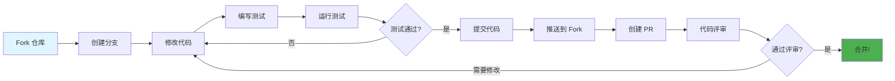

<div align="center">

# 🤝 贡献指南

### 加入我们，共同打造卓越项目！

[🏠 主页](../README.md) • [📖 用户指南](USER_GUIDE.md) • [❓ 常见问题](FAQ.md)

---

</div>

## 🎯 欢迎贡献者！

感谢您对 **confers** 的关注！我们非常期待您的加入。无论是修复 Bug、添加新功能、改进文档还是帮助他人，您的贡献都是无价的。

<div align="center">

### 🌟 贡献方式

<table>
<tr>
<td width="25%" align="center">
<br>
<b>代码</b><br>
修复 Bug & 添加功能
</td>
<td width="25%" align="center">
<br>
<b>文档</b><br>
完善文档 & 指南
</td>
<td width="25%" align="center">
<br>
<b>测试</b><br>
编写测试 & 发现 Bug
</td>
<td width="25%" align="center">
<br>
<b>社区</b><br>
提供帮助 & 支持
</td>
</tr>
</table>

</div>

---

## 📋 目录

- [行为准则](#行为准则)
- [快速开始](#快速开始)
- [开发工作流](#开发工作流)
- [编码标准](#编码标准)
- [测试指南](#测试指南)
- [文档规范](#文档规范)
- [提交变更](#提交变更)
- [评审流程](#评审流程)
- [社区互动](#社区互动)

---

## 行为准则

<div align="center">

### 🤗 友善与尊重

</div>

我们致力于提供一个包容和友好的环境。参与本项目即表示您同意：

<table>
<tr>
<td width="50%">

**✅ 推荐行为**

- 保持尊重和体谅
- 欢迎新手
- 接受建设性批评
- 专注于对社区最有利的事情
- 对他人表现出同理心

</td>
<td width="50%">

**❌ 禁止行为**

- 使用攻击性语言
- 骚扰或侮辱他人
- 公布私人信息
- 进行人身攻击
- 干扰讨论

</td>
</tr>
</table>

---

## 快速开始

### 前提条件

在开始之前，请确保您已安装：

- **Git** - 版本控制工具
- **Rust 1.75+** - 编程语言
- **Cargo** - Rust 包管理器
- **IDE** - VS Code (推荐安装 rust-analyzer 插件)、IntJ 或类似工具

<details>
<summary><b>🔧 环境搭建步骤</b></summary>

**1. 安装 Rust:**

```bash
curl --proto '=https' --tlsv1.2 -sSf https://sh.rustup.rs | sh
```

**2. 安装辅助工具:**

```bash
# 代码格式化工具
rustup component add rustfmt

# 静态分析工具
rustup component add clippy

# 代码覆盖率工具 (可选)
cargo install cargo-tarpaulin
```

**3. 验证安装:**

```bash
rustc --version
cargo --version
```

</details>

### Fork 与 Clone

<table>
<tr>
<td width="50%">

**1. Fork 仓库**

点击 GitHub 上的 "Fork" 按钮

</td>
<td width="50%">

**2. Clone 您的 Fork**

```bash
git clone https://github.com/YOUR_USERNAME/confers
cd confers
```

</td>
</tr>
<tr>
<td width="50%">

**3. 添加上游远程仓库**

```bash
git remote add upstream \
  https://github.com/Confers-Project/confers
```

</td>
<td width="50%">

**4. 验证远程仓库**

```bash
git remote -v
# origin    your-fork
# upstream  original-repo
```

</td>
</tr>
</table>

### 构建与测试

```bash
# 构建项目
cargo build

# 运行所有测试
cargo test --all-features

# 运行示例
cargo run --example basic --features watch
```

---

## 开发工作流

<div align="center">

### 🔄 标准贡献流程

</div>



### 详细步骤

#### 1️⃣ 创建分支

分支应基于 `develop` 分支创建。

```bash
# 同步上游 develop 分支
git fetch upstream
git checkout develop
git merge upstream/develop

# 创建功能分支
git checkout -b feature/TICKET-ID-description

# 或创建 Bug 修复分支
git checkout -b bugfix/TICKET-ID-description
```

**分支命名规范:**

- `feature/*` - 新功能开发
- `bugfix/*` - 缺陷修复
- `hotfix/*` - 紧急修复
- `release/*` - 版本发布
- `refactor/*` - 代码重构
- `docs/*` - 文档更新

#### 2️⃣ 修改代码

请遵循项目的编码标准和最佳实践。

#### 3️⃣ 运行静态检查与测试

在提交前，请确保代码通过所有本地检查。

```bash
# 格式化代码
cargo fmt

# 运行 Clippy 静态分析 (必须无警告)
cargo clippy -- -D warnings

# 运行所有测试
cargo test --all-features
```

#### 4️⃣ 提交代码

我们遵循 [Conventional Commits](https://www.conventionalcommits.org/) 规范。

**提交格式:**
`<type>(<scope>): <subject>`

**常见类型:**

- `feat`: 新功能
- `fix`: 修复 Bug
- `docs`: 文档变更
- `style`: 代码格式调整 (不影响功能)
- `refactor`: 代码重构
- `perf`: 性能优化
- `test`: 测试相关
- `chore`: 构建工具、依赖更新等

**示例:**

```bash
git commit -m "feat(auth): add JWT token refresh mechanism"
```

#### 5️⃣ 推送到 Fork 仓库

```bash
git push origin feature/TICKET-ID-description
```

#### 6️⃣ 创建 Pull Request (PR)

1. 前往 GitHub 上的 Fork 仓库
2. 点击 "Compare & pull request"
3. 按照 [PR 模板](#提交变更) 填写信息
4. 关联相关的 Issue
5. 提交 PR！

---

## 编码标准

### Rust 最佳实践

#### 所有权与借用

- 优先使用借用而非所有权转移
- 使用 `&` 进行不可变借用，`&mut` 进行可变借用
- 避免不必要的 `.clone()`；优先使用引用
- 保持生命周期标注尽可能简单，让编译器推断

#### 类型系统

- 利用类型系统表达业务约束 (NewType 模式)
- 优先使用 `Option<T>` 而非空值
- 使用 `Result<T, E>` 进行错误处理；库代码中严禁使用 `panic!`
- 为自定义错误实现 `std::error::Error` trait
- 库代码使用 `thiserror` 简化错误定义

#### 并发与异步

- 使用 `Arc<T>` 共享不可变数据，使用 `Arc<Mutex<T>>` 或 `Arc<RwLock<T>>` 共享可变数据
- 优先使用通道 (Channel) 进行线程间通信
- 异步代码使用 `async/await`，避免阻塞运行时
- 使用 `tokio::spawn` 执行独立任务

#### 性能优化

- 使用 `Vec::with_capacity()` 预分配内存
- 优先使用迭代器链而非显式循环
- 函数参数优先使用 `&str` 而非 `String`
- 避免不必要的堆分配，优先使用栈存储
- 对小型且性能关键函数使用 `#[inline]` 标注

### 命名规范

- 模块、函数、变量: `snake_case`
- 类型、Trait: `PascalCase`
- 常量、静态变量: `SCREAMING_SNAKE_CASE`

### 代码质量要求

- **零警告状态**: 严禁忽略编译器警告。所有警告必须在提交前修复。
- **Clippy**: 必须通过 `cargo clippy -- -D warnings` 检查，不引入新的 lint 警告。
- **代码格式**: 使用 `cargo fmt` 确保代码格式统一。
- **文档注释**: 所有公共 API (`pub`) 必须包含文档注释 `///`。

---

## 测试指南

### 测试原则

- **TDD**: 鼓励遵循 "红-绿-重构" 循环。
- **严禁禁用测试**: 测试失败时应修复代码或测试，严禁直接禁用。
- **真实性**: 除非涉及外部硬件或无法控制的服务，否则严禁使用 Mock/Stub，优先使用真实实现。

### 测试金字塔

1. **单元测试**: 快速、独立，验证核心逻辑。位于 `src/` 目录下，使用 `#[cfg(test)]` 标注。
2. **集成测试**: 验证模块间交互。位于 `tests/` 目录。
3. **E2E 测试**: 验证关键业务流程。

### 覆盖率要求

- **新代码覆盖率**: ≥ 80%。
- **核心业务逻辑**: 100% 覆盖。

```bash
# 运行所有测试（包括条件编译特性）
cargo test --all-features

# 生成覆盖率报告
cargo tarpaulin --out Html
```

### 注意事项

- 测试代码应与实现代码位于同一文件，使用 `#[cfg(test)]` 条件编译
- 使用 `assert!`、`assert_eq!`、`assert_ne!` 进行断言
- 测试私有函数时，在同一模块的 `tests` 子模块中进行测试

---

## 文档规范

- **公共 API**: 所有 `pub` 项目必须包含文档注释 `///`。
- **示例代码**: 文档注释中应包含可运行的示例代码。
- **更新同步**: 代码变更时必须同步更新相关的 README 和 API 文档。

---

## 提交变更

### PR 提交标准

- **原子性**: 每个 commit/PR 应只包含一个逻辑变更。
- **规模限制**: PR 变更行数建议控制在 400 行以内。
- **关联 Issue**: 必须在 PR 描述中关联相关 Issue。

### PR 模板

```markdown
## 变更类型
- [ ] 新功能
- [ ] 缺陷修复
- [ ] 重构
- [ ] 文档更新
- [ ] 其他

## 描述
简要说明本次变更的目的和内容。

## 测试情况
- [ ] 单元测试通过
- [ ] 集成测试通过
- [ ] 手动测试完成

## 检查清单
- [ ] 代码遵循项目编码规范
- [ ] 已添加必要的测试
- [ ] 文档已更新
- [ ] 未引入新的警告 (Zero Warning)

## 相关 Issue
Closes #123
```

---

## 评审流程

### 评审要点

- **功能性**: 满足需求，逻辑正确。
- **代码质量**: 遵循 SOLID 原则，可读性好，无重复代码。
- **安全性**: 无硬编码敏感信息，有输入验证。
- **性能**: 无明显的性能隐患。

### 响应评审反馈

- 及时回复评审者的评论。
- 根据反馈修改代码并推送，PR 会自动更新。

---

## 社区互动

- **GitHub Discussions**: 提问、分享想法。
- **Issue Tracker**: 报告 Bug、提交功能请求。

感谢您为 **confers** 贡献力量！🚀
