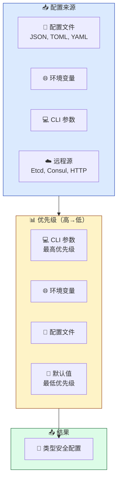

<span id="top"></span>
<div align="center">


# 📖 用户指南

[🏠 首页](../README.md) • [📚 文档](../README.md) • [🎯 示例](../examples/) • [❓ 常见问题](FAQ.md)

---

</div>

## 📋 目录

<details open style="padding:16px">
<summary style="cursor:pointer; font-weight:600; color:#1E293B">📑 目录（点击展开）</summary>

- [简介](#简介)
- [快速入门](#快速入门)
  - [先决条件](#先决条件)
  - [安装](#安装)
  - [第一步](#第一步)
- [核心概念](#核心概念)
- [命令行工具](#命令行工具)
- [基础用法](#基础用法)
- [高级用法](#高级用法)
- [最佳实践](#最佳实践)
- [故障排除](#故障排除)
- [后续步骤](#后续步骤)

</details>

---

## 简介

<div align="center" style="margin: 24px 0">

### 🎯 你将学到什么

</div>

<table style="width:100%; border-collapse: collapse">
<tr>
<td align="center" width="25%" style="padding: 16px">
<br>
<b style="color:#166534">快速入门</b><br>
<span style="color:#166534">5 分钟内完成环境搭建</span>
</td>
<td align="center" width="25%" style="padding: 16px">
<br>
<b style="color:#1E40AF">灵活配置</b><br>
<span style="color:#1E40AF">支持多种源与格式</span>
</td>
<td align="center" width="25%" style="padding: 16px">
<br>
<b style="color:#92400E">最佳实践</b><br>
<span style="color:#92400E">学习规范的配置管理</span>
</td>
<td align="center" width="25%" style="padding: 16px">
<br>
<b style="color:#5B21B6">高级特性</b><br>
<span style="color:#5B21B6">掌握热重载与远程配置</span>
</td>
</tr>
</table>

**confers** 是一个功能强大的 Rust 配置管理库，旨在简化应用程序的配置加载、验证和管理。它支持从文件（JSON, TOML, YAML）、环境变量、命令行参数以及远程源（Etcd, HTTP）加载配置。

<div style="padding:16px; margin: 16px 0">> 💡 **提示**: 本指南假设你具备基本的 Rust 知识。如果你是 Rust 新手，建议先阅读 [Rust 官方教程](https://doc.rust-lang.org/book/)。

</div>

---

## 快速入门

### 先决条件

在开始之前，请确保你已安装以下工具：

<table style="width:100%; border-collapse: collapse">
<tr>
<td width="50%" style="padding: 16px">

**必选**
- ✅ Rust 1.75+ (stable)
- ✅ Cargo (随 Rust 一起安装)
- ✅ Git

</td>
<td width="50%" style="padding: 16px">

**可选**
- 🔧 支持 Rust 的 IDE (如 VS Code + rust-analyzer)
- 🔧 Docker (用于容器化部署)
- 🔧 Etcd (用于远程配置测试)

</td>
</tr>
</table>

<details style="padding:16px; margin: 16px 0">
<summary style="cursor:pointer; font-weight:600; color:#1E293B">🔍 验证安装</summary>

```bash
# 检查 Rust 版本
rustc --version
# 预期: rustc 1.75.0 (或更高)

# 检查 Cargo 版本
cargo --version
# 预期: cargo 1.75.0 (或更高)
```

</details>

### 安装

在你的 `Cargo.toml` 中添加 `confers`：

<div style="padding:16px; margin: 16px 0">

| 安装类型 | 配置 | 使用场景 |
|----------|------|----------|
| **默认** | `confers = "0.2.0"` | 包含 derive、validation 和 CLI |
| **最小化** | `confers = { version = "0.2.0", default-features = false, features = ["minimal"] }` | 仅配置加载 |
| **推荐** | `confers = { version = "0.2.0", default-features = false, features = ["recommended"] }` | 配置 + 验证 |
| **完整** | `confers = { version = "0.2.0", features = ["full"] }` | 所有功能 |

**可用特性预设：**

| 预设 | 特性 | 使用场景 |
|------|------|----------|
| <span style="color:#166534; padding:4px 8px">minimal</span> | `derive` | 仅配置加载 |
| <span style="color:#1E40AF; padding:4px 8px">recommended</span> | `derive`, `validation` | 配置加载 + 验证 |
| <span style="color:#92400E; padding:4px 8px">dev</span> | `derive`, `validation`, `cli`, `schema`, `audit`, `monitoring` | 开发配置 |
| <span style="color:#991B1B; padding:4px 8px">production</span> | `derive`, `validation`, `watch`, `encryption`, `remote`, `monitoring` | 生产配置 |
| <span style="color:#5B21B6; padding:4px 8px">full</span> | 所有特性 | 完整功能集 |

**单独特性：**

| 特性 | 描述 | 默认 |
|------|------|------|
| `derive` | 配置结构体的 derive 宏 | ✅ |
| `validation` | 配置验证支持 | ✅ |
| `cli` | 命令行工具 | ❌ |
| `watch` | 文件监控和热重载 | ❌ |
| `audit` | 审计日志 | ❌ |
| `schema` | JSON Schema 生成 | ❌ |
| `parallel` | 并行验证 | ❌ |
| `monitoring` | 系统监控 | ❌ |
| `remote` | 远程配置（etcd、consul、http） | ❌ |
| `encryption` | 配置加密 | ❌ |

</div>

如果需要异步/远程支持，添加 tokio：
```toml
[dependencies]
tokio = { version = "1.0", features = ["full"] }
```

### 第一步

让我们通过一个简单的例子来验证安装。我们将定义一个包含默认值和环境变量映射的配置结构体：

```rust
use confers::Config;
use serde::{Deserialize, Serialize};

#[derive(Debug, Serialize, Deserialize, Config)]
#[config(env_prefix = "APP")]
struct AppConfig {
    #[config(default = "8080")]
    port: u16,
    
    #[config(default = "\"localhost\".to_string()")]
    host: String,
}

fn main() -> Result<(), Box<dyn std::error::Error>> {
    // 加载配置（同步方式，按顺序：默认值 -> 配置文件 -> 环境变量）
    let config = AppConfig::new_loader()
        .load_sync()?;
    
    println!("🚀 服务器运行在: {}:{}", config.host, config.port);
    Ok(())
}

// 或者使用异步方式（适用于远程配置）
#[tokio::main]
async fn async_main() -> Result<(), Box<dyn std::error::Error>> {
    let config = AppConfig::new_loader()
        .load()
        .await?;
    
    println!("🚀 服务器运行在: {}:{}", config.host, config.port);
    Ok(())
}
```

**注意：** `Config` trait 通过宏自动实现，实际的加载方法通过 `ConfigLoader` 提供：
- `load_sync()` - 同步加载
- `load()` - 异步加载（适用于远程配置）
- `load_sync_with_audit()` - 带审计日志的同步加载
- `load_sync_with_watcher()` - 带文件监控的同步加载

---

## 核心概念

理解这些核心概念将帮助你更有效地使用 `confers`。

<div align="center" style="margin: 24px 0">

### 🔑 核心概念

</div>



### 1️⃣ `Config` 派生宏

`confers` 的核心是 `Config` 派生宏。它会自动为你的结构体实现配置加载逻辑，包括处理默认值、环境变量前缀和验证规则。

### 2️⃣ 层次化加载

`confers` 遵循"最后定义的胜出"原则，按以下优先级合并配置：
1. **命令行参数** (最高优先级)
2. **环境变量**
3. **配置文件** (如 `config.toml`)
4. **默认值** (最低优先级)

### 3️⃣ 灵活的数据源

你可以轻松地从不同来源组合配置：
- **文件**: 支持自动检测 JSON, TOML, YAML 格式。
- **环境**: 通过 `env_prefix` 自动映射环境变量。
- **远程**: 支持 Etcd、Consul 和 HTTP 轮询/监听。

### 4️⃣ 配置文件搜索路径

`confers` 支持灵活的文件搜索策略，可以根据你的需求在不同位置查找配置文件。

#### 默认搜索路径

当你使用 `Config::load()` 或 `Config::create_loader()` 时，`confers` 会在以下位置按优先级搜索配置文件：

| 优先级 | 搜索路径 | 条件 | 文件格式 |
|--------|----------|------|----------|
| 1 | `./` | 总是 | `config.{toml,json,yaml,yml}` |
| 2 | `~/.config/<app_name>/` | 设置 `app_name` | `config.{toml,json,yaml,yml}` |
| 3 | `~/.config/` | 总是 | `config.{toml,json,yaml,yml}` |
| 4 | `~/` | 总是 | `config.{toml,json,yaml,yml}` |
| 5 | `/etc/<app_name>/` | Unix + 设置 `app_name` | `config.{toml,json,yaml,yml}` |

#### app_name 的作用

`app_name` 是一个可选的应用标识符，用于在标准系统目录中组织配置文件：

```rust
#[derive(Debug, Serialize, Deserialize, Config)]
#[config(app_name = "myapp")]  // ✅ 显式设置 app_name
pub struct AppConfig {
    pub host: String,
    pub port: u16,
}
```

**设置 app_name 后的搜索路径**：
```
./myapp/config.toml              ✅
~/.config/myapp/config.toml      ✅
~/.config/config.toml            ✅
~/config.toml                    ✅
/etc/myapp/config.toml           ✅ (Unix)
./config.toml                    ❌ (不再搜索)
```

**不设置 app_name 时的搜索路径**：
```
./config.toml                    ✅
~/.config/config.toml            ✅
~/config.toml                    ✅
```

#### 配置文件命名规则

`confers` 支持以下配置文件命名模式：

```bash
# 标准配置文件
config.toml
config.json
config.yaml
config.yml

# 环境特定配置文件 (当设置 RUN_ENV 环境变量时)
<app_name>.<env>.toml
# 例如: myapp.production.toml, myapp.development.json
```

#### 使用场景示例

**场景1：应用程序使用标准目录**
```rust
#[derive(Config)]
#[config(app_name = "my-awesome-app")]
pub struct ProductionConfig {
    pub database_url: String,
    pub max_connections: u32,
}
// 配置文件位于: ~/.config/my-awesome-app/config.toml
```

**场景2：简单应用使用当前目录**
```rust
#[derive(Config)]
pub struct SimpleConfig {
    pub debug: bool,
    pub workers: usize,
}
// 配置文件位于: ./config.toml (推荐简单应用使用)
```

**场景3：指定精确路径**
```rust
#[derive(Config)]
pub struct AppConfig {
    pub name: String,
}

// 使用 load_file() 指定精确路径
let config = AppConfig::load_file("/etc/myapp/production.toml")
    .load_sync()?;
```

**场景4：环境特定配置**
```bash
# 设置运行环境
export RUN_ENV=production

# confers 会自动搜索:
# ./myapp.production.toml
# ~/.config/myapp.production.toml
# /etc/myapp.production.toml (Unix)
```

#### 最佳实践建议

1. **应用程序**：推荐设置 `app_name` 以使用标准系统目录
   ```rust
   #[config(app_name = "your-app-name")]
   ```

2. **库/工具**：使用默认行为，在当前目录查找 `config.toml`

3. **测试/特殊需求**：使用 `load_file()` 指定精确路径

4. **跨平台应用**：设置 `app_name` 以获得最佳的跨平台兼容性

> 💡 **提示**：如果配置文件未找到，`confers` 会使用默认值并继续加载（除非启用严格模式）。使用 `Config::load_file()` 可以精确控制配置文件路径。

---

## 命令行工具

confers 提供了功能完整的命令行工具，支持配置文件的生成、验证、加密、差分等功能。

### 安装 CLI

```bash
# 从源码安装
cargo install confers

# 或从 crates.io 安装
cargo install confers-cli

# 查看版本
confers --version

# 查看帮助
confers --help
```

### 命令参考

```bash
confers 0.2.0
A powerful Rust configuration management library

USAGE:
    confers [OPTIONS] <SUBCOMMAND>

OPTIONS:
    -h, --help         打印帮助信息
    -V, --version      打印版本信息
    -v, --verbose      启用详细输出 (-vv 更详细)

SUBCOMMANDS:
    diff       比较两个配置文件的差异
    generate   生成配置模板
    validate   验证配置文件
    encrypt    加密敏感配置
    wizard     交互式配置生成向导
    key        生成和管理加密密钥
    help       打印帮助信息
```

### diff - 配置差分

<div style="padding:16px; margin: 16px 0">

比较两个配置文件的差异，支持多种输出格式：

</div>

```bash
# 基本用法 - 比较两个配置文件
confers diff config1.toml config2.toml

# 指定输出格式
confers diff config1.toml config2.toml --format unified    # 统一 diff 格式
confers diff config1.toml config2.toml --format context    # 上下文 diff 格式
confers diff config1.toml config2.toml --format normal     # 标准 diff 格式
confers diff config1.toml config2.toml --format side-by-side  # 并排对比格式
confers diff config1.toml config2.toml --format strict     # 严格模式

# 生成报告
confers diff config1.toml config2.toml -o diff_report.md

# 查看详细帮助
confers diff --help
```

**输出格式说明：**

| 格式 | 描述 | 适用场景 |
|------|------|----------|
| `unified` | 统一 diff 格式，含行号和上下文 | 代码审查、版本对比 |
| `context` | 上下文 diff 格式 | 查看变更上下文 |
| `normal` | 标准 diff 格式 | 简单差异对比 |
| `side-by-side` | 并排对比格式 | 可视化对比 |
| `strict` | 严格模式，仅显示实际差异 | 精确差异分析 |

### generate - 模板生成

```bash
# 基本用法
confers generate --struct "AppConfig" --output config_template.toml

# 指定输出格式
confers generate --struct "AppConfig" --format toml --output config.toml
confers generate --struct "AppConfig" --format yaml --output config.yaml
confers generate --struct "AppConfig" --format json --output config.json

# 指定输出级别
confers generate --struct "AppConfig" --level minimal    # 最小输出
confers generate --struct "AppConfig" --level full       # 完整输出
confers generate --struct "AppConfig" --level doc        # 文档化输出

# 查看详细帮助
confers generate --help
```

**输出级别说明：**

| 级别 | 描述 | 适用场景 |
|------|------|----------|
| `minimal` | 仅包含必需字段和注释 | 快速开始 |
| `full` | 包含所有字段、默认值和注释 | 完整配置 |
| `doc` | 包含字段说明文档 | 文档生成 |

### validate - 配置验证

```bash
# 基本用法 - 验证配置文件
confers validate config.toml

# 指定输出级别
confers validate config.toml --level minimal    # 最小输出
confers validate config.toml --level full       # 完整输出
confers validate config.toml --level doc        # 文档化输出

# 跳过严格模式
confers validate config.toml --no-strict

# 验证并生成报告
confers validate config.toml -o validation_report.md

# 查看详细帮助
confers validate --help
```

### encrypt - 配置加密

```bash
# 加密配置文件
confers encrypt input.toml --key-file secret.key --output encrypted.toml

# 加密单个值
confers encrypt "sensitive_value" --key-file secret.key

# 解密配置文件
confers encrypt encrypted.toml --key-file secret.key --decrypt --output decrypted.toml

# 查看详细帮助
confers encrypt --help
```

**使用示例：**

```bash
# 生成密钥并加密
confers key -o secret.key
confers encrypt config.toml --key-file secret.key -o config.encrypted.toml

# 解密使用
confers encrypt config.encrypted.toml --key-file secret.key --decrypt -o config.toml
```

### wizard - 交互式向导

```bash
# 启动交互式向导
confers wizard

# 指定配置文件类型
confers wizard --format toml
confers wizard --format yaml
confers wizard --format json

# 查看详细帮助
confers wizard --help
```

**向导流程：**

1. 输入配置名称
2. 设置服务器参数（host、port）
3. 配置数据库连接（url、pool）
4. 配置日志级别
5. 生成配置文件

### key - 密钥管理

```bash
# 生成新密钥
confers key -o encryption.key

# 生成 256 位密钥
confers key --length 256 -o encryption.key

# 从密码派生密钥
confers key --derive --password "your_password" -o derived.key

# 查看密钥信息
confers key --info encryption.key

# 查看详细帮助
confers key --help
```

---

## 基础用法

### 定义配置结构体

<div style="padding:16px; margin: 16px 0">

使用 `#[derive(Config)]` 和 `#[config(...)]` 属性来配置你的结构体。你还可以嵌套结构体：

</div>

```rust
use serde::Deserialize;
use confers::Config;

#[derive(Config, Deserialize)]
struct DatabaseConfig {
    #[config(default = "\"localhost\".to_string()")]
    host: String,
    #[config(default = "5432")]
    port: u16,
}

#[derive(Config, Deserialize)]
#[config(env_prefix = "MYAPP", strict = true)]
struct MyConfig {
    #[config(default = "100")]
    timeout_ms: u64,
    
    // 嵌套结构体
    db: DatabaseConfig,
    
    #[config(sensitive = true)] // 在审计日志中会被脱敏
    api_key: String,
}
```

### 加载配置

`confers` 通过 `ConfigLoader` 提供了多种同步和异步加载方法：

```rust
// 基本同步加载
let config = MyConfig::new_loader()
    .load_sync()?;

// 自定义文件路径和内存限制
let config = MyConfig::new_loader()
    .with_file("custom.yaml")
    .with_memory_limit(10) // 限制为 10MB
    .load_sync()?;

// 异步加载（适用于远程配置）
let config = MyConfig::new_loader()
    .load().await?;

// 带审计日志的加载
#[cfg(feature = "audit")]
let config = MyConfig::new_loader()
    .load_sync_with_audit()?;

// 带文件监控的加载
#[cfg(feature = "watch")]
let (config, watcher) = MyConfig::new_loader()
    .load_sync_with_watcher()?;
```

### 默认值与环境变量

- **默认值**: 使用 `#[config(default = "...")]`。注意字符串需要双引号转义。
- **环境变量**: 默认映射规则为 `PREFIX_FIELD_NAME`。例如 `MYAPP_TIMEOUT_MS` 映射到 `timeout_ms`。

---

## 高级用法

### 验证与清洗

`confers` 集成了 `validator` 库，允许你在加载配置时进行自动验证：

```rust
use validator::Validate;

#[derive(Config, Deserialize, Validate)]
#[config(validate)] // 启用自动验证
struct MyConfig {
    #[validate(range(min = 1, max = 65535))]
    port: u16,
    
    #[validate(email)]
    admin_email: String,
}
```

你还可以定义自定义的 `sanitizer` 来清洗数据（例如去除首尾空格）：

```rust
let config = MyConfig::new_loader()
    .with_sanitizer(|mut cfg| {
        cfg.admin_email = cfg.admin_email.trim().to_lowercase();
        Ok(cfg)
    })
    .load_sync()?;
```

### 远程配置 (Etcd/Consul/HTTP)

<div style="padding:16px; margin: 16px 0">

⚠️ **注意**: 以下功能需要启用 `remote` 特性。

</div>

通过启用 `remote` 特性，你可以从远程源加载配置。`confers` 支持身份验证和 TLS 加密：

```rust
// 从 Etcd 加载，带身份验证和 TLS
let config = MyConfig::new_loader()
    .with_remote_url("http://localhost:2379")
    .with_remote_auth("admin", "password")
    .with_remote_tls("ca.crt", "client.crt", "client.key")
    .load()
    .await?;

// 从 Consul 加载配置
let config = MyConfig::new_loader()
    .with_remote_url("consul://localhost:8500")
    .with_remote_token("your-consul-token")
    .load()
    .await?;

// 从 HTTP 接口加载，带 Bearer Token
let config = MyConfig::new_loader()
    .with_remote("https://api.example.com/config")
    .with_remote_token("your-token")
    .load()
    .await?;
```

### 审计日志与安全

<div style="padding:16px; margin: 16px 0">

📝 **提示**: 以下功能需要启用 `audit` 特性。

</div>

启用 `audit` 特性后，`confers` 可以记录配置加载的历史，并自动对敏感字段进行脱敏。你还可以限制加载过程中的内存占用：

```rust
#[derive(Config, Deserialize)]
#[config(audit)] // 启用审计
struct SecureConfig {
    #[config(sensitive = true)]
    db_password: String,
}

// 加载时会自动输出审计日志，并限制内存使用以防止 OOM
let config = SecureConfig::new_loader()
    .with_audit_log(true)
    .with_audit_log_path("audit.log")
    .with_memory_limit(50) // 限制为 50MB
    .load_sync()?;
```

### 文件监听与热重载

<div style="padding:16px; margin: 16px 0">

✨ **提示**: 以下功能需要启用 `watch` 特性。

</div>

`confers` 支持监听配置文件或远程源的变化。启用 `watch` 特性后，你可以手动检查配置文件的变化并重新加载：

```rust
use std::time::Duration;

// 启用监听功能
let config = MyConfig::new_loader()
    .with_file("config.toml")
    .with_watch(true)
    .load_sync()?;

println!("初始配置已加载，消息: {}", config.message);

// 监控变化循环
let mut last_message = config.message.clone();

for i in 1..=5 {
    println!("\n[迭代 {}] 请修改配置文件并等待...", i);

    // 模拟外部变更
    std::thread::sleep(Duration::from_millis(500));

    // 检查是否发生变化
    let current_config = MyConfig::new_loader()
        .with_file("config.toml")
        .load_sync()?;
    
    if current_config.message != last_message {
        println!(">>> 配置已变更！新消息: {}", current_config.message);
        last_message = current_config.message.clone();
    } else {
        println!("尚未检测到变更...");
    }
}
```

### 配置差分对比

使用 `confers` 的配置差分功能，可以比较不同环境或版本的配置文件差异：

```rust
use confers::commands::{DiffCommand, DiffOptions, DiffFormat};

// 比较两个配置文件
let options = DiffOptions {
    format: DiffFormat::Unified,
    context_lines: 5,
    show_line_numbers: true,
    ..Default::default()
};

DiffCommand::execute("development.toml", "production.toml", options)?;

// 或者使用并排格式
let side_by_side_options = DiffOptions {
    format: DiffFormat::SideBySide,
    context_lines: 3,
    show_line_numbers: false,
    ..Default::default()
};

DiffCommand::execute("development.toml", "production.toml", side_by_side_options)?;
```

**命令行方式：**

```bash
# 使用 CLI 进行配置差分
confers diff development.toml production.toml --format unified -o diff_report.md
```

### 敏感数据加密

`confers` 使用 AES-256 加密算法保护敏感配置信息：

```rust
use confers::encryption::ConfigEncryption;
use confers::key::KeyManager;
use std::path::PathBuf;

// 创建密钥管理器并生成密钥
let mut km = KeyManager::new(PathBuf::from("./keys"))?;
let key = km.generate_key()?;

// 创建加密器
let encryption = ConfigEncryption::new(key);

// 加密敏感配置
let encrypted = encryption.encrypt("super_secret_password")?;

// 解密配置
let decrypted = encryption.decrypt(&encrypted)?;
```

**命令行方式：**

```bash
# 生成密钥
confers key -o encryption.key

# 加密配置文件
confers encrypt config.toml --key-file encryption.key -o config.encrypted.toml

# 解密配置文件
confers encrypt config.encrypted.toml --key-file encryption.key --decrypt -o config.toml
```

---

## 最佳实践

<div align="center" style="margin: 24px 0">

### 🌟 推荐的设计模式

</div>

<table style="width:100%; border-collapse: collapse">
<tr>
<td width="50%" style="padding: 16px">

### ✅ 推荐做法

- **分层配置**: 将配置拆分为多个小结构体（如 `DatabaseConfig`, `ServerConfig`），然后组合进 `AppConfig`。
- **环境隔离**: 为不同环境使用 `env_prefix`（如 `DEV_`, `PROD_`）。
- **防御性加载**: 始终为可选字段使用 `Option<T>`，并为关键字段提供 `default` 值。
- **验证与清洗**: 始终启用 `validate` 属性，并使用 `with_sanitizer` 清理输入（如去除字符串首尾空格）。
- **安全性**: 敏感字段标记 `sensitive = true` 以防审计日志泄露。

</td>
<td width="50%" style="padding: 16px">

### ❌ 避免做法

- **全局静态变量**: 尽量避免使用全局 `static` 存储配置，推荐通过依赖注入或 `Arc` 传递配置。
- **忽略错误**: 生产环境应严格检查 `ConfigError`，特别是 `MemoryLimitExceeded` 和 `ValidationError`。
- **硬编码**: 任何可能随环境变化的参数都应通过配置管理，而非硬编码。
- **敏感信息明文存储**: 敏感配置应使用加密功能保护。

</td>
</tr>
</table>

---

## 安全配置最佳实践

<div align="center" style="margin: 24px 0">

### 🔒 安全配置指南

</div>

<div style="padding:16px; margin: 16px 0">

在生产环境中，正确配置安全选项至关重要。本节介绍如何安全地使用 `confers` 的各种安全功能。

</div>

### 1. 敏感数据处理

<div style="padding:16px; margin: 16px 0">

**⚠️ 重要**: 永远不要在配置文件中明文存储敏感信息（如密码、API 密钥、令牌等）。

</div>

```rust
use confers::Config;
use serde::Deserialize;

#[derive(Config, Deserialize)]
#[config(env_prefix = "APP")]
struct SecureConfig {
    // 标记敏感字段，审计日志会自动脱敏
    #[config(sensitive = true)]
    database_password: String,
    
    #[config(sensitive = true)]
    api_key: String,
    
    // 非敏感字段
    server_name: String,
}
```

**推荐做法：**

- 使用环境变量存储敏感信息
- 使用 `confers encrypt` 命令加密敏感配置
- 在密钥管理系统（如 AWS Secrets Manager、HashiCorp Vault）中存储密钥

### 2. 配置加密

<div style="padding:16px; margin: 16px 0">

使用 AES-256-GCM 加密算法保护敏感配置信息。

</div>

```rust
use confers::encryption::ConfigEncryption;

// 从环境变量加载加密密钥
let encryption = ConfigEncryption::from_env()?;

// 加密敏感值
let encrypted_password = encryption.encrypt("my_secret_password")?;

// 解密配置
let decrypted_password = encryption.decrypt(&encrypted_password)?;
```

**命令行方式：**

```bash
# 设置加密密钥环境变量 (支持 CONFERS_ENCRYPTION_KEY 或 CONFERS_KEY)
export CONFERS_ENCRYPTION_KEY=$(openssl rand -base64 32)
# 或者
export CONFERS_KEY=$(openssl rand -base64 32)

# 加密敏感配置值
confers encrypt "my-secret-value"

# 将加密结果保存到文件
confers encrypt "my-secret-value" --output encrypted.txt
```

### 3. 密钥管理

<div style="padding:16px; margin: 16px 0">

**⚠️ 重要**: 密钥必须安全存储，绝不能提交到版本控制系统。

</div>

```rust
use confers::key::KeyManager;
use std::path::PathBuf;

// 创建密钥管理器
let mut key_manager = KeyManager::new(PathBuf::from("./secure_keys"))?;

// 初始化密钥环（仅首次）
let master_key = [0u8; 32]; // 从安全位置获取
let version = key_manager.initialize(
    &master_key,
    "production".to_string(),
    "security-team".to_string()
)?;

// 定期轮换密钥（建议每 90 天）
let rotation_result = key_manager.rotate_key(
    &master_key,
    Some("production".to_string()),
    "security-team".to_string(),
    Some("Scheduled rotation".to_string())
)?;

println!("密钥已从版本 {} 轮换到 {}", 
    rotation_result.previous_version, 
    rotation_result.new_version);
```

**密钥管理最佳实践：**

- ✅ 使用硬件安全模块（HSM）或密钥管理服务
- ✅ 定期轮换密钥（建议每 90 天）
- ✅ 为不同环境使用不同的密钥
- ✅ 使用强随机数生成器创建密钥
- ❌ 不要在代码中硬编码密钥
- ❌ 不要将密钥提交到版本控制系统
- ❌ 不要在日志中记录密钥

### 4. 审计日志配置

<div style="padding:16px; margin: 16px 0">

配置审计日志以跟踪所有配置加载和修改操作。

</div>

```rust
use confers::audit::{AuditLogger, AuditConfig};
use std::path::PathBuf;

// 创建审计配置
let audit_config = AuditConfig {
    validation_error: Some("Invalid configuration".to_string()),
    config_source: Some("config.toml".to_string()),
    load_duration: Some(100),
    ..Default::default()
};

// 记录配置加载
AuditLogger::log_to_file_with_source(
    &config,
    &PathBuf::from("/var/log/confers/audit.log"),
    audit_config
)?;
```

**审计日志最佳实践：**

- ✅ 将审计日志存储在安全位置（如 `/var/log/confers/`）
- ✅ 配置日志轮转以防止磁盘空间耗尽
- ✅ 限制审计日志文件的访问权限（仅 root/administrator）
- ✅ 监控审计日志中的可疑活动
- ✅ 实现日志保留策略以满足合规性要求

### 5. 远程配置安全

<div style="padding:16px; margin: 16px 0">

从远程源加载配置时，必须确保连接安全。

</div>

```rust
use confers::Config;

// 使用 TLS 加密连接
let config = MyConfig::new_loader()
    .with_remote_url("https://config.example.com")
    .with_remote_tls(
        Some("/path/to/ca.crt".to_string()),
        Some("/path/to/client.crt".to_string()),
        Some("/path/to/client.key".to_string())
    )
    .with_remote_token("secure_token") // 使用 Bearer Token
    .load()
    .await?;

// 或者使用用户名/密码认证
let config = MyConfig::new_loader()
    .with_remote_url("https://config.example.com")
    .with_remote_auth_secure(
        "username".to_string(),
        std::sync::Arc::new(confers::security::SecureString::new(
            "password".to_string(),
            confers::security::SensitivityLevel::High
        ))
    )
    .load_sync()?;
```

**远程配置安全最佳实践：**

- ✅ 始终使用 HTTPS/TLS 加密连接
- ✅ 使用强密码和安全的认证令牌
- ✅ 定期轮换认证凭据
- ✅ 使用证书验证服务器身份
- ✅ 配置超时以防止长时间挂起
- ❌ 不要在 URL 中传递敏感信息
- ❌ 不要使用不安全的 HTTP 连接

### 6. 配置验证

<div style="padding:16px; margin: 16px 0">

使用验证器确保配置值在预期范围内。

</div>

```rust
use confers::validator::{ValidationEngine, RangeFieldValidator};
use serde_json::json;

// 创建验证引擎
let mut engine = ValidationEngine::new();

// 添加范围验证器
engine.add_validator(Box::new(RangeFieldValidator::new(
    "port", 
    Some(1024.0), 
    Some(65535.0)
)));

// 验证配置
let config = json!({"port": 8080});
match engine.validate(&config) {
    Ok(()) => println!("配置验证通过"),
    Err(errors) => {
        eprintln!("配置验证失败:");
        for error in errors {
            eprintln!("  - {}", error.message);
        }
    }
}
```

**配置验证最佳实践：**

- ✅ 验证所有用户输入
- ✅ 确保数值在预期范围内
- ✅ 验证字符串格式（如 URL、邮箱）
- ✅ 记录所有验证失败
- ✅ 将验证失败视为潜在安全事件
- ❌ 不要为了便利而绕过验证

### 7. 生产环境安全清单

<div style="padding:16px; margin: 16px 0">

在部署到生产环境之前，请检查以下安全项目：

</div>

<table style="width:100%; border-collapse: collapse">
<tr>
<th style="padding: 12px; text-align: left; background-color: #F3F4F6">安全项目</th>
<th style="padding: 12px; text-align: left; background-color: #F3F4F6">状态</th>
<th style="padding: 12px; text-align: left; background-color: #F3F4F6">说明</th>
</tr>
<tr>
<td style="padding: 12px">敏感数据加密</td>
<td style="padding: 12px">☐</td>
<td style="padding: 12px">所有敏感信息都已加密</td>
</tr>
<tr>
<td style="padding: 12px">密钥管理</td>
<td style="padding: 12px">☐</td>
<td style="padding: 12px">密钥安全存储，定期轮换</td>
</tr>
<tr>
<td style="padding: 12px">审计日志</td>
<td style="padding: 12px">☐</td>
<td style="padding: 12px">审计日志已启用，安全存储</td>
</tr>
<tr>
<td style="padding: 12px">配置验证</td>
<td style="padding: 12px">☐</td>
<td style="padding: 12px">所有配置都经过验证</td>
</tr>
<tr>
<td style="padding: 12px">TLS 加密</td>
<td style="padding: 12px">☐</td>
<td style="padding: 12px">远程连接使用 TLS</td>
</tr>
<tr>
<td style="padding: 12px">访问控制</td>
<td style="padding: 12px">☐</td>
<td style="padding: 12px">配置文件访问权限受限</td>
</tr>
<tr>
<td style="padding: 12px">错误处理</td>
<td style="padding: 12px">☐</td>
<td style="padding: 12px">错误信息不泄露敏感数据</td>
</tr>
<tr>
<td style="padding: 12px">日志脱敏</td>
<td style="padding: 12px">☐</td>
<td style="padding: 12px">敏感字段标记为 sensitive</td>
</tr>
</table>

---

## 故障排除

<div style="padding:16px; margin: 16px 0">

| 问题 | 解决方案 |
|------|----------|
| **❓ 环境变量没有生效** | 1. 检查 `#[config(env_prefix = "APP")]` 是否正确设置。<br>2. 环境变量名应为 `PREFIX_FIELD_NAME`（全大写）。<br>3. 对于嵌套结构体，使用双下划线，例如 `APP_DB__HOST` 映射到 `db.host`。 |
| **❓ 加载时报 MemoryLimitExceeded 错误** | 1. 检查配置文件是否过大，或者是否存在循环引用的配置。<br>2. 调大 `with_memory_limit(mb)` 的阈值（默认不限制）。 |
| **❓ 验证失败 ValidationError** | 1. 检查 `validator` 的约束逻辑。`confers` 会在加载后立即运行验证。<br>2. 查看错误输出，它会指明哪个字段未满足哪个约束。 |
| **❓ 远程配置加载失败 RemoteError** | 1. 检查网络连接及 URL 是否正确。<br>2. 如果启用了 TLS，确保证书路径正确且有效。<br>3. 检查身份验证令牌或用户名密码是否过期。 |

</div>

<div align="center" style="margin: 24px 0">

**💬 仍然需要帮助？** [提交 Issue](https://github.com/Kirky-X/confers/issues) 或 [访问文档中心](https://github.com/project/confers)

</div>

---

## 后续步骤

<div align="center" style="margin: 24px 0">

### 🎯 继续探索

</div>

<table style="width:100%; border-collapse: collapse">
<tr>
<td align="center" width="33%" style="padding: 16px">
<a href="API_REFERENCE.md">
<div style="padding: 24px; transition: transform 0.2s">
<br>
<b style="color:#1E293B">📚 API 参考</b>
</div>
</a>
<br><span style="color:#64748B">详细的接口说明</span>
</td>
<td align="center" width="33%" style="padding: 16px">
<a href="ARCHITECTURE.md">
<div style="padding: 24px; transition: transform 0.2s">
<br>
<b style="color:#1E293B">🔧 架构设计</b>
</div>
</a>
<br><span style="color:#64748B">深入了解内部机制</span>
</td>
<td align="center" width="33%" style="padding: 16px">
<a href="../examples/">
<div style="padding: 24px; transition: transform 0.2s">
<br>
<b style="color:#1E293B">💻 示例代码</b>
</div>
</a>
<br><span style="color:#64748B">真实场景的代码样例</span>
</td>
</tr>
</table>

---

<div align="center" style="margin: 32px 0; padding: 24px">

**[📖 API 文档](https://docs.rs/confers)** • **[❓ 常见问题](FAQ.md)** • **[🐛 报告问题](https://github.com/Kirky-X/confers/issues)**

**由 Kirky.X 用 ❤️ 制作**

**[⬆ 返回顶部](#top)**

</div>
