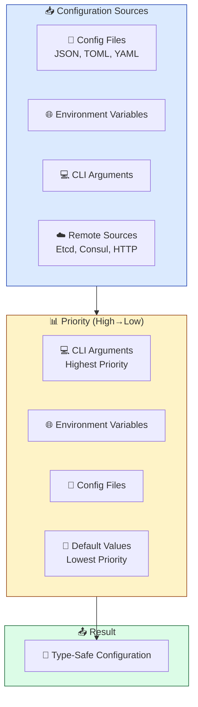

<span id="top"></span>
<div align="center">


# 📖 User Guide

[🏠 Home](../README.md) • [📚 Documentation](../README.md) • [🎯 Examples](../examples/) • [❓ FAQ](FAQ.md)

---

</div>

## 📋 Table of Contents

<details open style="padding:16px">
<summary style="cursor:pointer; font-weight:600; color:#1E293B">📑 Table of Contents (click to expand)</summary>

- [Introduction](#introduction)
- [Quick Start](#quick-start)
  - [Prerequisites](#prerequisites)
  - [Installation](#installation)
  - [First Steps](#first-steps)
- [Core Concepts](#core-concepts)
- [Command Line Tool](#command-line-tool)
- [Basic Usage](#basic-usage)
- [Advanced Usage](#advanced-usage)
- [Best Practices](#best-practices)
- [Troubleshooting](#troubleshooting)
- [Next Steps](#next-steps)

</details>

---

## Introduction

<div align="center" style="margin: 24px 0">

### 🎯 What You Will Learn

</div>

<table style="width:100%; border-collapse: collapse">
<tr>
<td align="center" width="25%" style="padding: 16px">
<br>
<b style="color:#166534">Quick Start</b><br>
<span style="color:#166534">Setup environment in 5 minutes</span>
</td>
<td align="center" width="25%" style="padding: 16px">
<br>
<b style="color:#1E40AF">Flexible Configuration</b><br>
<span style="color:#1E40AF">Support multiple sources and formats</span>
</td>
<td align="center" width="25%" style="padding: 16px">
<br>
<b style="color:#92400E">Best Practices</b><br>
<span style="color:#92400E">Learn proper configuration management</span>
</td>
<td align="center" width="25%" style="padding: 16px">
<br>
<b style="color:#5B21B6">Advanced Features</b><br>
<span style="color:#5B21B6">Master hot reload and remote config</span>
</td>
</tr>
</table>

**confers** is a powerful Rust configuration management library designed to simplify application configuration loading, validation, and management. It supports loading configuration from files (JSON, TOML, YAML), environment variables, command-line arguments, and remote sources (Etcd, HTTP).

<div style="padding:16px; margin: 16px 0">

> 💡 **Tip**: This guide assumes you have basic Rust knowledge. If you're new to Rust, we recommend reading the [Rust Official Tutorial](https://doc.rust-lang.org/book/) first.

</div>

---

## Quick Start

### Prerequisites

Before you begin, make sure you have the following tools installed:

<table style="width:100%; border-collapse: collapse">
<tr>
<td width="50%" style="padding: 16px">

**Required**
- ✅ Rust 1.81+ (stable)
- ✅ Cargo (installed with Rust)
- ✅ Git

</td>
<td width="50%" style="padding: 16px">

**Optional**
- 🔧 Rust-compatible IDE (e.g., VS Code + rust-analyzer)
- 🔧 Docker (for containerized deployment)
- 🔧 Etcd (for remote configuration testing)

</td>
</tr>
</table>

<details style="padding:16px; margin: 16px 0">
<summary style="cursor:pointer; font-weight:600; color:#1E293B">🔍 Verify Installation</summary>

```bash
# Check Rust version
rustc --version
# Expected: rustc 1.81.0 (or higher)

# Check Cargo version
cargo --version
# Expected: cargo 1.81.0 (or higher)
```

</details>

### Installation

Add `confers` to your `Cargo.toml`:

<div style="padding:16px; margin: 16px 0">

| Installation Type | Configuration | Use Case |
|-------------------|---------------|----------|
| **Default** | `confers = "0.3.0"` | Includes toml, json, env |
| **Minimal** | `confers = { version = "0.3.0", default-features = false, features = ["minimal"] }` | Environment variables only |
| **Recommended** | `confers = { version = "0.3.0", default-features = false, features = ["recommended"] }` | TOML + JSON + Env + validation |
| **Full** | `confers = { version = "0.3.0", features = ["full"] }` | All features |

**Available Feature Presets:**

| Preset | Features | Use Case |
|--------|----------|----------|
| <span style="color:#166534; padding:4px 8px">minimal</span> | `env` | Environment variables only |
| <span style="color:#1E40AF; padding:4px 8px">recommended</span> | `toml`, `env`, `validation` | Config loading + validation |
| <span style="color:#92400E; padding:4px 8px">dev</span> | `toml`, `json`, `yaml`, `env`, `cli`, `validation`, `schema`, `audit`, `profile`, `watch`, `migration`, `snapshot`, `dynamic` | Development with all tools |
| <span style="color:#991B1B; padding:4px 8px">production</span> | `toml`, `env`, `watch`, `encryption`, `validation`, `audit`, `profile`, `metrics`, `schema`, `cli`, `migration`, `dynamic`, `progressive-reload`, `snapshot` | Production-ready configuration |
| <span style="color:#7C3AED; padding:4px 8px">distributed</span> | `toml`, `env`, `watch`, `validation`, `config-bus`, `progressive-reload`, `metrics`, `audit` | Distributed systems |
| <span style="color:#166534; padding:4px 8px">full</span> | All features | Complete feature set |

**Individual Features:**

| Feature | Description | Default |
|---------|-------------|---------|
| `toml` | TOML format support | ✅ |
| `json` | JSON format support | ✅ |
| `env` | Environment variable support | ✅ |
| `yaml` | YAML format support | ❌ |
| `validation` | Configuration validation (garde) | ❌ |
| `cli` | Command-line tool | ❌ |
| `watch` | File monitoring and hot reload | ❌ |
| `audit` | Audit logging | ❌ |
| `schema` | JSON Schema generation | ❌ |
| `remote` | Remote configuration (etcd, consul, http) | ❌ |
| `encryption` | Configuration encryption | ❌ |

</div>

If you need async/remote support, add tokio:
```toml
[dependencies]
tokio = { version = "1.0", features = ["full"] }
```

### First Steps

Let's verify the installation with a simple example. We'll define a configuration struct with default values and environment variable mapping:

```rust
use confers::{Config, ConfigBuilder};
use serde::{Deserialize, Serialize};

#[derive(Debug, Serialize, Deserialize, Config)]
#[config(env_prefix = "APP")]
struct AppConfig {
    #[config(default = 8080)]
    port: u16,

    #[config(default = "\"localhost\".to_string()")]
    host: String,
}

fn main() -> Result<(), Box<dyn std::error::Error>> {
    // Load configuration using ConfigBuilder
    let config = ConfigBuilder::<AppConfig>::new()
        .file("config.toml")
        .env_prefix("APP_")
        .build()?;

    println!("🚀 Server running at: {}:{}", config.host, config.port);
    Ok(())
}

// Or use async method with watcher (for hot reload)
#[tokio::main]
async fn async_main() -> Result<(), Box<dyn std::error::Error>> {
    let (rx, guard) = ConfigBuilder::<AppConfig>::new()
        .file("config.toml")
        .watch(true)
        .build_with_watcher()
        .await?;

    // Get initial config from the watch receiver
    let config = rx.borrow().clone();
    println!("🚀 Server running at: {}:{}", config.host, config.port);
    Ok(())
}
```

**Note:** The `Config` derive macro enables type-safe configuration. Use `ConfigBuilder` for loading:
- `ConfigBuilder::<T>::new().build()` - Synchronous loading
- `ConfigBuilder::<T>::new().build_with_watcher().await` - Async with hot reload
- `ConfigBuilder::<T>::new().build_with_fallback(fallback)` - With fallback config

---

## Core Concepts

Understanding these core concepts will help you use `confers` more effectively.

<div align="center" style="margin: 24px 0">

### 🔑 Core Concepts

</div>


```mermaid
graph TB
    subgraph Sources ["📥 Configuration Sources"]
        A[📁 Config Files<br/>JSON, TOML, YAML]
        B[🌐 Environment Variables]
        C[💻 CLI Arguments]
        D[☁️ Remote Sources<br/>Etcd, Consul, HTTP]
    end

    subgraph Priority ["📊 Priority (High→Low)"]
        P1["💻 CLI Arguments<br/>Highest Priority"]
        P2["🌐 Environment Variables"]
        P3["📁 Config Files"]
        P4["🔧 Default Values<br/>Lowest Priority"]
    end

    subgraph Result ["📤 Result"]
        R[🚀 Type-Safe Configuration]
    end

    Sources --> Priority
    Priority --> R

    style Sources fill:#DBEAFE,stroke:#1E40AF
    style Priority fill:#FEF3C7,stroke:#92400E
    style Result fill:#DCFCE7,stroke:#166534
```

### 1️⃣ `Config` Derive Macro

The core of `confers` is the `Config` derive macro. It automatically implements configuration loading logic for your structs, including handling default values, environment variable prefixes, and validation rules.

### 2️⃣ Hierarchical Loading

`confers` follows the "last definition wins" principle, merging configuration in the following priority order:
1. **Command-line arguments** (highest priority)
2. **Environment variables**
3. **Configuration files** (e.g., `config.toml`)
4. **Default values** (lowest priority)

### 3️⃣ Flexible Data Sources

You can easily combine configuration from different sources:
- **Files**: Supports auto-detection of JSON, TOML, YAML formats.
- **Environment**: Automatically maps environment variables via `env_prefix`.
- **Remote**: Supports Etcd, Consul, and HTTP polling/listening.

### 4️⃣ Configuration File Search Paths

`confers` supports flexible file search strategies that can look for configuration files in different locations based on your needs.

#### Default Search Paths

When you use `Config::load_sync()` or `Config::create_loader()`, `confers` searches for configuration files in the following locations by priority:

| Priority | Search Path | Condition | File Format |
|----------|-------------|-----------|-------------|
| 1 | `./` | Always | `config.{toml,json,yaml,yml}` |
| 2 | `~/.config/<app_name>/` | `app_name` set | `config.{toml,json,yaml,yml}` |
| 3 | `~/.config/` | Always | `config.{toml,json,yaml,yml}` |
| 4 | `~/` | Always | `config.{toml,json,yaml,yml}` |
| 5 | `/etc/<app_name>/` | Unix + `app_name` set | `config.{toml,json,yaml,yml}` |

#### Role of app_name

`app_name` is an optional application identifier used to organize configuration files in standard system directories:

```rust
#[derive(Debug, Serialize, Deserialize, Config)]
#[config(app_name = "myapp")]  // ✅ Explicitly set app_name
pub struct AppConfig {
    pub host: String,
    pub port: u16,
}
```

**Search paths with app_name set**:
```
./myapp/config.toml              ✅
~/.config/myapp/config.toml      ✅
~/.config/config.toml            ✅
~/config.toml                    ✅
/etc/myapp/config.toml           ✅ (Unix)
./config.toml                    ❌ (no longer searched)
```

**Search paths without app_name**:
```
./config.toml                    ✅
~/.config/config.toml            ✅
~/config.toml                    ✅
```

#### Configuration File Naming Rules

`confers` supports the following configuration file naming patterns:

```bash
# Standard configuration files
config.toml
config.json
config.yaml
config.yml

# Environment-specific configuration files (when RUN_ENV environment variable is set)
<app_name>.<env>.toml
# Example: myapp.production.toml, myapp.development.json
```

#### Usage Scenario Examples

**Scenario 1: Application using standard directories**
```rust
#[derive(Config)]
#[config(app_name = "my-awesome-app")]
pub struct ProductionConfig {
    pub database_url: String,
    pub max_connections: u32,
}
// Configuration file located at: ~/.config/my-awesome-app/config.toml
```

**Scenario 2: Simple application using current directory**
```rust
#[derive(Config)]
pub struct SimpleConfig {
    pub debug: bool,
    pub workers: usize,
}
// Configuration file located at: ./config.toml (recommended for simple apps)
```

**Scenario 3: Specify exact path**
```rust
#[derive(Config)]
pub struct AppConfig {
    pub name: String,
}

// Use ConfigBuilder to specify exact path
let config = ConfigBuilder::<AppConfig>::new()
    .file("/etc/myapp/production.toml")
    .build()?;
```

**Scenario 4: Environment-specific configuration**
```bash
# Set runtime environment
export RUN_ENV=production

# confers will automatically search:
# ./myapp.production.toml
# ~/.config/myapp.production.toml
# /etc/myapp.production.toml (Unix)
```

#### Best Practice Recommendations

1. **Applications**: Recommended to set `app_name` to use standard system directories
   ```rust
   #[config(app_name = "your-app-name")]
   ```

2. **Libraries/Tools**: Use default behavior, look for `config.toml` in current directory

3. **Testing/Special Needs**: Use `load_file()` to specify exact path

4. **Cross-platform Applications**: Set `app_name` for best cross-platform compatibility

> 💡 **Tip**: If no configuration file is found, `confers` will use default values and continue loading (unless strict mode is enabled). Use `Config::load_file()` for precise control over the configuration file path.

---

## Command Line Tool

confers provides a fully-featured command-line tool that supports configuration file generation, validation, encryption, diffing, and more.

### Installing the CLI

```bash
# Install from source
cargo install confers

# Or install from crates.io
cargo install confers-cli

# Check version
confers --version

# View help
confers --help
```

### Command Reference

```bash
confers 0.3.0
A powerful Rust configuration management library

USAGE:
    confers [OPTIONS] <SUBCOMMAND>

OPTIONS:
    -h, --help         Print help information
    -V, --version      Print version information
    -v, --verbose      Enable verbose output (-vv for more detail)

SUBCOMMANDS:
    diff       Compare differences between two configuration files
    generate   Generate configuration template
    validate   Validate configuration file
    encrypt    Encrypt sensitive configuration
    wizard     Interactive configuration generation wizard
    key        Generate and manage encryption keys
    help       Print help information
```

### diff - Configuration Diff

<div style="padding:16px; margin: 16px 0">

Compare differences between two configuration files with multiple output formats:

</div>

```bash
# Basic usage - compare two configuration files
confers diff config1.toml config2.toml

# Specify output format
confers diff config1.toml config2.toml --format unified    # Unified diff format
confers diff config1.toml config2.toml --format context    # Context diff format
confers diff config1.toml config2.toml --format normal     # Standard diff format
confers diff config1.toml config2.toml --format side-by-side  # Side-by-side format
confers diff config1.toml config2.toml --format strict     # Strict mode

# Generate report
confers diff config1.toml config2.toml -o diff_report.md

# View detailed help
confers diff --help
```

**Output Format Description:**

| Format | Description | Use Case |
|--------|-------------|----------|
| `unified` | Unified diff format with line numbers and context | Code review, version comparison |
| `context` | Context diff format | View change context |
| `normal` | Standard diff format | Simple difference comparison |
| `side-by-side` | Side-by-side comparison format | Visual comparison |
| `strict` | Strict mode, only show actual differences | Precise difference analysis |

### generate - Template Generation

```bash
# Basic usage
confers generate --struct "AppConfig" --output config_template.toml

# Specify output format
confers generate --struct "AppConfig" --format toml --output config.toml
confers generate --struct "AppConfig" --format yaml --output config.yaml
confers generate --struct "AppConfig" --format json --output config.json

# Specify output level
confers generate --struct "AppConfig" --level minimal    # Minimal output
confers generate --struct "AppConfig" --level full       # Full output
confers generate --struct "AppConfig" --level doc        # Documented output

# View detailed help
confers generate --help
```

**Output Level Description:**

| Level | Description | Use Case |
|-------|-------------|----------|
| `minimal` | Only required fields and comments | Quick start |
| `full` | All fields, default values, and comments | Complete configuration |
| `doc` | Includes field descriptions | Documentation generation |

### validate - Configuration Validation

```bash
# Basic usage - validate configuration file
confers validate config.toml

# Specify output level
confers validate config.toml --level minimal    # Minimal output
confers validate config.toml --level full       # Full output
confers validate config.toml --level doc        # Documented output

# Skip strict mode
confers validate config.toml --no-strict

# Validate and generate report
confers validate config.toml -o validation_report.md

# View detailed help
confers validate --help
```

### encrypt - Configuration Encryption

```bash
# Encrypt configuration file
confers encrypt input.toml --key-file secret.key --output encrypted.toml

# Encrypt single value
confers encrypt "sensitive_value" --key-file secret.key

# Decrypt configuration file
confers encrypt encrypted.toml --key-file secret.key --decrypt --output decrypted.toml

# View detailed help
confers encrypt --help
```

**Usage Example:**

```bash
# Generate key and encrypt
confers key -o secret.key
confers encrypt config.toml --key-file secret.key -o config.encrypted.toml

# Decrypt for use
confers encrypt config.encrypted.toml --key-file secret.key --decrypt -o config.toml
```

### wizard - Interactive Wizard

```bash
# Start interactive wizard
confers wizard

# Specify configuration file type
confers wizard --format toml
confers wizard --format yaml
confers wizard --format json

# View detailed help
confers wizard --help
```

**Wizard Flow:**

1. Enter configuration name
2. Set server parameters (host, port)
3. Configure database connection (url, pool)
4. Configure log level
5. Generate configuration file

### key - Key Management

```bash
# Generate new key
confers key -o encryption.key

# Generate 256-bit key
confers key --length 256 -o encryption.key

# Derive key from password
confers key --derive --password "your_password" -o derived.key

# View key information
confers key --info encryption.key

# View detailed help
confers key --help
```

---

## Basic Usage

### Defining Configuration Structs

<div style="padding:16px; margin: 16px 0">

Use `#[derive(Config)]` and `#[config(...)]` attributes to configure your structs. You can also nest structs:

</div>

```rust
use serde::Deserialize;
use confers::Config;

#[derive(Config, Deserialize)]
struct DatabaseConfig {
    #[config(default = "\"localhost\".to_string()")]
    host: String,
    #[config(default = "5432")]
    port: u16,
}

#[derive(Config, Deserialize)]
#[config(env_prefix = "MYAPP", strict = true)]
struct MyConfig {
    #[config(default = "100")]
    timeout_ms: u64,

    // Nested struct
    db: DatabaseConfig,

    #[config(sensitive = true)] // Will be masked in audit logs
    api_key: String,
}
```

### Loading Configuration

`confers` provides `ConfigBuilder` for flexible configuration loading:

```rust
use confers::ConfigBuilder;

// Basic synchronous loading
let config = ConfigBuilder::<MyConfig>::new()
    .file("config.toml")
    .build()?;

// With environment variables and prefix
let config = ConfigBuilder::<MyConfig>::new()
    .file("config.toml")
    .env_prefix("MYAPP_")
    .build()?;

// With validation enabled
let config = ConfigBuilder::<MyConfig>::new()
    .file("config.toml")
    .validate(true)
    .build()?;

// With hot reload support (async)
#[cfg(feature = "watch")]
let (rx, guard) = ConfigBuilder::<MyConfig>::new()
    .file("config.toml")
    .watch(true)
    .build_with_watcher()
    .await?;
```

### Default Values and Environment Variables

- **Default Values**: Use `#[config(default = ...)]` attribute. For numeric types, use direct values; for strings, use expression syntax.
- **Environment Variables**: Default mapping rule is `PREFIX_FIELD_NAME`. For example, `MYAPP_TIMEOUT_MS` maps to `timeout_ms`.

---

## Advanced Usage

### Validation and Sanitization

`confers` integrates with the `garde` validation library:

```rust
use garde::Validate;

#[derive(Config, Deserialize, Validate)]
#[config(validate)] // Enable automatic validation
struct MyConfig {
    #[garde(range(min = 1, max = 65535))]
    port: u16,

    #[garde(email)]
    admin_email: String,
}
```

**Note:** Add `garde = { version = "0.22", features = ["derive"] }` to your dependencies.

### Remote Configuration (Etcd/Consul/HTTP)

<div style="padding:16px; margin: 16px 0">

⚠️ **Note**: The following features require enabling the `remote` feature.

</div>

By enabling the `remote` feature, you can load configuration from remote sources:

```rust
// Note: Remote configuration requires implementing a custom Source
// See the examples directory for complete implementations

// Use HTTP polled source (built-in)
#[cfg(feature = "remote")]
use confers::remote::HttpPolledSourceBuilder;

#[cfg(feature = "remote")]
let http_source = HttpPolledSourceBuilder::new()
    .url("https://api.example.com/config")
    .bearer_token("your-token")
    .build()?;

#[cfg(feature = "remote")]
let config = ConfigBuilder::<MyConfig>::new()
    .source(Box::new(http_source))
    .build()?;
    .await?;
```

### Audit Logging and Security

<div style="padding:16px; margin: 16px 0">

📝 **Tip**: The following features require enabling the `audit` feature.

</div>

With the `audit` feature enabled, `confers` can record configuration loading history and automatically mask sensitive fields:

```rust
#[derive(Config, Deserialize)]
struct SecureConfig {
    #[config(sensitive = true)]
    db_password: String,
}

// Sensitive fields are automatically masked in logs and debug output
```

### File Watching and Hot Reload

<div style="padding:16px; margin: 16px 0">

✨ **Tip**: The following features require enabling the `watch` feature.

</div>

`confers` supports hot reload with file watching:

```rust
use confers::ConfigBuilder;

#[tokio::main]
async fn main() -> Result<(), Box<dyn std::error::Error>> {
    // Build with watcher - returns a receiver and guard
    let (rx, guard) = ConfigBuilder::<MyConfig>::new()
        .file("config.toml")
        .watch(true)
        .build_with_watcher()
        .await?;

    // Get initial config
    let config = rx.borrow().clone();
    println!("Initial configuration loaded: {:?}", config);

    // The receiver will be updated when config file changes
    // Use rx.changed() to wait for updates

    Ok(())
}
```

### Sensitive Data Encryption

`confers` uses XChaCha20-Poly1305 encryption algorithm to protect sensitive configuration information:

```rust
use confers::XChaCha20Crypto;

// Create crypto instance
let crypto = XChaCha20Crypto::new();

// Generate a 32-byte key (store securely!)
let key = [0u8; 32]; // Use a secure random key in production

// Encrypt sensitive data - returns (nonce, ciphertext)
let (nonce, ciphertext) = crypto.encrypt(b"super_secret_password", &key)?;

// Decrypt configuration
let decrypted = crypto.decrypt(&nonce, &ciphertext, &key)?;
```

**Using with config struct:**

```rust
#[derive(Config, Deserialize)]
struct SecureConfig {
    #[config(encrypt = "xchacha20")]
    db_password: String,
}
```

---

## Best Practices

<div align="center" style="margin: 24px 0">

### 🌟 Recommended Design Patterns

</div>

<table style="width:100%; border-collapse: collapse">
<tr>
<td width="50%" style="padding: 16px">

### ✅ Recommended Practices

- **Layered Configuration**: Split configuration into multiple small structs (e.g., `DatabaseConfig`, `ServerConfig`), then compose into `AppConfig`.
- **Environment Isolation**: Use different `env_prefix` for different environments (e.g., `DEV_`, `PROD_`).
- **Defensive Loading**: Always use `Option<T>` for optional fields and provide `default` values for critical fields.
- **Validation and Sanitization**: Always enable the `validate` attribute and use `with_sanitizer` to clean inputs (e.g., trim string whitespace).
- **Security**: Mark sensitive fields with `sensitive = true` to prevent audit log leaks.

</td>
<td width="50%" style="padding: 16px">

### ❌ Practices to Avoid

- **Global Static Variables**: Avoid using global `static` to store configuration. Recommend passing configuration through dependency injection or `Arc`.
- **Ignoring Errors**: Production environments should strictly check `ConfigError`, especially `MemoryLimitExceeded` and `ValidationError`.
- **Hardcoding**: Any parameter that might vary by environment should be managed through configuration, not hardcoded.
- **Storing Sensitive Information in Plain Text**: Sensitive configuration should be protected using encryption features.

</td>
</tr>
</table>

---

## Secure Configuration Best Practices

<div align="center" style="margin: 24px 0">

### 🔒 Security Configuration Guide

</div>

<div style="padding:16px; margin: 16px 0">

In production environments, correctly configuring security options is critical. This section describes how to safely use `confers` various security features.

</div>

### 1. Sensitive Data Handling

<div style="padding:16px; margin: 16px 0">

**⚠️ Important**: Never store sensitive information (such as passwords, API keys, tokens, etc.) in plain text in configuration files.

</div>

```rust
use confers::Config;
use serde::Deserialize;

#[derive(Config, Deserialize)]
#[config(env_prefix = "APP")]
struct SecureConfig {
    // Mark sensitive fields, audit logs will automatically mask them
    #[config(sensitive = true)]
    database_password: String,

    #[config(sensitive = true)]
    api_key: String,

    // Non-sensitive field
    server_name: String,
}
```

**Recommended Practices:**

- Use environment variables to store sensitive information
- Use the `confers encrypt` command to encrypt sensitive configuration
- Store keys in key management systems (e.g., AWS Secrets Manager, HashiCorp Vault)

### 2. Configuration Encryption

<div style="padding:16px; margin: 16px 0">

Use XChaCha20-Poly1305 encryption algorithm to protect sensitive configuration information.

</div>

```rust
use confers::XChaCha20Crypto;

// Create crypto instance
let crypto = XChaCha20Crypto::new();

// Generate a 32-byte key (store securely!)
let key = [0u8; 32]; // Use a secure random key in production

// Encrypt sensitive value - returns (nonce, ciphertext)
let (nonce, encrypted_password) = crypto.encrypt(b"my_secret_password", &key)?;

// Decrypt configuration
let decrypted_password = crypto.decrypt(&nonce, &encrypted_password, &key)?;
```

### 3. Key Management

<div style="padding:16px; margin: 16px 0">

**⚠️ Important**: Keys must be stored securely and never committed to version control systems.

</div>

```rust
use confers::key::KeyManager;
use std::path::PathBuf;

// Create key manager
let mut key_manager = KeyManager::new(PathBuf::from("./secure_keys"))?;

// Initialize keyring (first time only)
let master_key = [0u8; 32]; // Get from secure location
let version = key_manager.initialize(
    &master_key,
    "production".to_string(),
    "security-team".to_string()
)?;

// Rotate keys regularly (recommended every 90 days)
let rotation_result = key_manager.rotate_key(
    &master_key,
    Some("production".to_string()),
    "security-team".to_string(),
    Some("Scheduled rotation".to_string())
)?;

println!("Key rotated from version {} to {}",
    rotation_result.previous_version,
    rotation_result.new_version);
```

**Key Management Best Practices:**

- ✅ Use Hardware Security Modules (HSM) or Key Management Services
- ✅ Rotate keys regularly (recommended every 90 days)
- ✅ Use different keys for different environments
- ✅ Use strong random number generators to create keys
- ❌ Don't hardcode keys in code
- ❌ Don't commit keys to version control systems
- ❌ Don't log keys

### 4. Audit Logging Configuration

<div style="padding:16px; margin: 16px 0">

Configure audit logging to track all configuration loading and modification operations.

</div>

```rust
use confers::audit::{AuditWriter, AuditConfig};
use std::path::PathBuf;

// Create audit writer with builder pattern
let audit_writer = AuditWriter::builder()
    .log_dir(PathBuf::from("/var/log/confers"))
    .enabled(true)
    .build();

// Log configuration loading events
audit_writer.log_load("config.toml");

// Log sensitive operations
audit_writer.log_key_access("database_password");
audit_writer.log_decrypt("api_key", true);
```

**Audit Logging Best Practices:**

- ✅ Store audit logs in secure locations (e.g., `/var/log/confers/`)
- ✅ Configure log rotation to prevent disk space exhaustion
- ✅ Restrict access to audit log files (root/administrator only)
- ✅ Monitor audit logs for suspicious activity
- ✅ Implement log retention policies to meet compliance requirements

### 5. Remote Configuration Security

<div style="padding:16px; margin: 16px 0">

When loading configuration from remote sources, you must ensure connection security.

</div>

```rust
use confers::ConfigBuilder;

// Use TLS encrypted connection (requires remote feature)
let config = ConfigBuilder::<MyConfig>::new()
    .file("config.toml")
    .env()
    .build()?;

// For remote configuration, use remote feature with HttpPolledSource
// See examples/remote_consul.rs for complete examples
```

**Remote Configuration Security Best Practices:**

- ✅ Always use HTTPS/TLS encrypted connections
- ✅ Use strong passwords and secure authentication tokens
- ✅ Rotate authentication credentials regularly
- ✅ Use certificates to verify server identity
- ✅ Configure timeouts to prevent long hangs
- ❌ Don't pass sensitive information in URLs
- ❌ Don't use insecure HTTP connections

### 6. Configuration Validation

<div style="padding:16px; margin: 16px 0">

Use validators to ensure configuration values are within expected ranges.

</div>

```rust
use confers::{Config, Validate};
use serde::Deserialize;
use garde::Validate;

// Define validation rules using garde derive macro
#[derive(Config, Deserialize, Validate)]
#[config(validate)]  // Enable automatic validation during config loading
struct ValidatedConfig {
    #[garde(range(min = 1, max = 65535))]
    port: u16,

    #[garde(length(min = 1, max = 253))]
    host: String,

    #[garde(email)]
    admin_email: Option<String>,
}

// Validation is automatically performed during config loading
// If validation fails, ConfigError::ValidationError is returned
let config = ConfigBuilder::<ValidatedConfig>::new()
    .file("config.toml")
    .validate(true)
    .build()?;
```

**Note:** Add `garde = { version = "0.22", features = ["derive", "email", "url", "regex"] }` to your dependencies.
```

**Configuration Validation Best Practices:**

- ✅ Validate all user input
- ✅ Ensure numeric values are within expected ranges
- ✅ Validate string formats (e.g., URL, email)
- ✅ Log all validation failures
- ✅ Treat validation failures as potential security incidents
- ❌ Don't bypass validation for convenience

### 7. Production Security Checklist

<div style="padding:16px; margin: 16px 0">

Before deploying to production, check the following security items:

</div>

<table style="width:100%; border-collapse: collapse">
<tr>
<th style="padding: 12px; text-align: left; background-color: #F3F4F6">Security Item</th>
<th style="padding: 12px; text-align: left; background-color: #F3F4F6">Status</th>
<th style="padding: 12px; text-align: left; background-color: #F3F4F6">Description</th>
</tr>
<tr>
<td style="padding: 12px">Sensitive Data Encryption</td>
<td style="padding: 12px">☐</td>
<td style="padding: 12px">All sensitive information is encrypted</td>
</tr>
<tr>
<td style="padding: 12px">Key Management</td>
<td style="padding: 12px">☐</td>
<td style="padding: 12px">Keys stored securely, rotated regularly</td>
</tr>
<tr>
<td style="padding: 12px">Audit Logging</td>
<td style="padding: 12px">☐</td>
<td style="padding: 12px">Audit logging enabled, stored securely</td>
</tr>
<tr>
<td style="padding: 12px">Configuration Validation</td>
<td style="padding: 12px">☐</td>
<td style="padding: 12px">All configuration is validated</td>
</tr>
<tr>
<td style="padding: 12px">TLS Encryption</td>
<td style="padding: 12px">☐</td>
<td style="padding: 12px">Remote connections use TLS</td>
</tr>
<tr>
<td style="padding: 12px">Access Control</td>
<td style="padding: 12px">☐</td>
<td style="padding: 12px">Configuration file access permissions restricted</td>
</tr>
<tr>
<td style="padding: 12px">Error Handling</td>
<td style="padding: 12px">☐</td>
<td style="padding: 12px">Error messages don't leak sensitive data</td>
</tr>
<tr>
<td style="padding: 12px">Log Masking</td>
<td style="padding: 12px">☐</td>
<td style="padding: 12px">Sensitive fields marked as sensitive</td>
</tr>
</table>

---

## Troubleshooting

<div style="padding:16px; margin: 16px 0">

| Issue | Solution |
|-------|----------|
| **❓ Environment variables not working** | 1. Check if `#[config(env_prefix = "APP")]` is set correctly.<br>2. Environment variable name should be `PREFIX_FIELD_NAME` (all uppercase).<br>3. For nested structs, use double underscores, e.g., `APP_DB__HOST` maps to `db.host`. |
| **❓ MemoryLimitExceeded error on load** | 1. Check if configuration file is too large or has circular references.<br>2. Increase the `with_memory_limit(mb)` threshold (default is unlimited). |
| **❓ Validation failed ValidationError** | 1. Check `validator` constraint logic. `confers` runs validation immediately after loading.<br>2. View error output, it will indicate which field failed which constraint. |
| **❓ Remote configuration loading failed RemoteError** | 1. Check network connection and URL correctness.<br>2. If TLS is enabled, ensure certificate paths are correct and valid.<br>3. Check if authentication token or username/password has expired. |

</div>

<div align="center" style="margin: 24px 0">

**💬 Still need help?** [Submit an Issue](https://github.com/Kirky-X/confers/issues) or [Visit Documentation Center](https://github.com/project/confers)

</div>

---

## Next Steps

<div align="center" style="margin: 24px 0">

### 🎯 Continue Exploring

</div>

<table style="width:100%; border-collapse: collapse">
<tr>
<td align="center" width="33%" style="padding: 16px">
<a href="API_REFERENCE.md">
<div style="padding: 24px; transition: transform 0.2s">
<br>
<b style="color:#1E293B">📚 API Reference</b>
</div>
</a>
<br><span style="color:#64748B">Detailed interface documentation</span>
</td>
<td align="center" width="33%" style="padding: 16px">
<a href="ARCHITECTURE.md">
<div style="padding: 24px; transition: transform 0.2s">
<br>
<b style="color:#1E293B">🔧 Architecture Design</b>
</div>
</a>
<br><span style="color:#64748B">Understand internal mechanisms</span>
</td>
<td align="center" width="33%" style="padding: 16px">
<a href="../examples/">
<div style="padding: 24px; transition: transform 0.2s">
<br>
<b style="color:#1E293B">💻 Example Code</b>
</div>
</a>
<br><span style="color:#64748B">Real-world code samples</span>
</td>
</tr>
</table>

---

<div align="center" style="margin: 32px 0; padding: 24px">

**[📖 API Documentation](https://docs.rs/confers)** • **[❓ FAQ](FAQ.md)** • **[🐛 Report Issue](https://github.com/Kirky-X/confers/issues)**

**Made with ❤️ by Kirky.X**

**[⬆ Back to Top](#top)**

</div>
