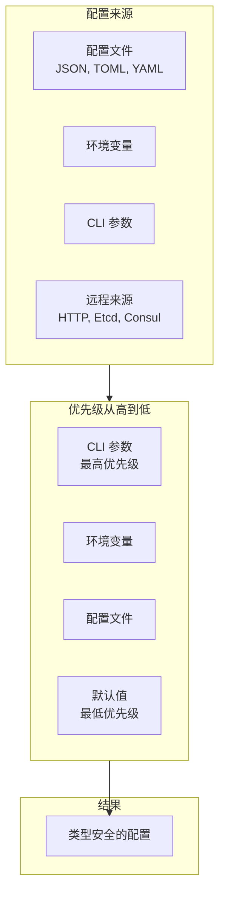

# 📖 Confers 用户指南

**confers** 是一个功能强大的 Rust 配置管理库，旨在简化应用的配置加载、校验与管理。它支持从文件（JSON、TOML、YAML、INI）、环境变量、命令行参数以及远程来源（HTTP、Etcd、Consul）加载配置。本指南将带您从安装入门一路走到进阶用法与最佳实践。

## 📋 目录

- [简介](#-简介)
- [快速开始](#-快速开始)
  - [前置条件](#-前置条件)
  - [安装](#-安装)
  - [第一步](#-第一步)
- [核心概念](#-核心概念)
  - [Config 派生宏](#config-派生宏)
  - [分层加载](#分层加载)
  - [灵活的数据来源](#灵活的数据来源)
  - [配置文件加载方式](#配置文件加载方式)
- [配置](#️-配置)
  - [定义配置结构体](#-定义配置结构体)
  - [加载配置](#-加载配置)
  - [默认值与环境变量](#-默认值与环境变量)
  - [命令行工具](#-命令行工具)
- [进阶用法](#-进阶用法)
  - [校验与清洗](#-校验与清洗)
  - [远程配置（Etcd/Consul/HTTP）](#️-远程配置etcdconsulhttp)
  - [审计日志与安全](#-审计日志与安全)
  - [文件监听与热重载](#-文件监听与热重载)
  - [敏感数据加密](#-敏感数据加密)
  - [分布式追踪（tracing）](#-分布式追踪tracing)
- [最佳实践](#-最佳实践)
  - [推荐的设计模式](#-推荐的设计模式)
  - [安全配置实践](#-安全配置实践)
- [故障排查](#-故障排查)
- [延伸阅读](#-延伸阅读)

---

## 🎯 简介

本指南将带您掌握：

| 内容 | 说明 |
|:-----|:-----|
| **快速开始** | 5 分钟完成环境搭建 |
| **灵活配置** | 支持多种来源与格式 |
| **最佳实践** | 学习规范的配置管理方式 |
| **进阶特性** | 掌握热重载与远程配置 |

> 💡 **提示**：本指南假设您具备基础的 Rust 知识。如果您是 Rust 新手，建议先阅读 [Rust 官方教程](https://doc.rust-lang.org/book/)。

---

## 🚀 快速开始

### 📌 前置条件

开始之前，请确认已安装以下工具：

**必装**

- ✅ Rust 1.97.1+（stable）
- ✅ Cargo（随 Rust 一起安装）
- ✅ Git

**可选**

- 🔧 支持 Rust 的 IDE（如 VS Code + rust-analyzer）
- 🔧 Docker（用于容器化部署）
- 🔧 Etcd（用于远程配置测试）

<details>
<summary>🔍 验证安装</summary>

```bash
# 检查 Rust 版本
rustc --version
# 期望输出：rustc 1.97.1（或更高）

# 检查 Cargo 版本
cargo --version
# 期望输出：cargo 1.97.1（或更高）
```

</details>

### 📦 安装

将 `confers` 加入您的 `Cargo.toml`：

| 安装方式 | 配置 | 适用场景 |
|----------|------|----------|
| **默认** | `confers = "0.6.0-rc.6"` | 包含 toml、json、dotenv |
| **最小化** | `confers = { version = "0.6.0-rc.6", default-features = false, features = ["minimal"] }` | dotenv + JSON（对应 Cargo.toml 的 `minimal = ["dotenv", "json"]`） |
| **推荐** | `confers = { version = "0.6.0-rc.6", default-features = false, features = ["recommended"] }` | TOML + JSON + Dotenv + 校验 + 安全规则 |
| **全量** | `confers = { version = "0.6.0-rc.6", features = ["full"] }` | 全部特性 |

**可用的特性预设：**

`minimal` / `recommended` / `dev` / `production` / `distributed` / `full` 六个预设各自包含的特性清单与适用场景，统一见 [README · 功能预设](../README.md#-特性标志)。

**单项特性：**

每个可选能力均为独立特性标志；完整的单项特性矩阵（含默认启用状态与说明，逐项对应 `Cargo.toml` 的 `[features]` 定义）见 [README · 功能矩阵](../README.md#-功能矩阵)。

如果需要异步/远程支持，请添加 tokio：

```toml
[dependencies]
tokio = { version = "1.0", features = ["full"] }
```

### 💡 第一步

让我们用一个简单示例验证安装。定义一个带默认值和环境变量映射的配置结构体：

```rust
use confers::{Config, ConfigBuilder};
use serde::{Deserialize, Serialize};

#[derive(Debug, Serialize, Deserialize, Config)]
#[config(env_prefix = "APP")]
struct ConfersConfig {
    #[config(default = 8080)]
    port: u16,

    #[config(default = "\"localhost\".to_string()")]
    host: String,
}

fn main() -> Result<(), Box<dyn std::error::Error>> {
    // 使用 ConfigBuilder 加载配置
    let config = ConfigBuilder::<ConfersConfig>::new()
        .file("config.toml")
        .env_prefix("APP_")
        .build()?;

    println!("🚀 Server running at: {}:{}", config.host, config.port);
    Ok(())
}
```

需要热重载能力时，使用 `FsWatcher` 监听文件变更并重建配置（推荐），完整用法见 [👀 文件监听与热重载](#-文件监听与热重载)。

**说明**：`Config` 派生宏提供类型安全的配置。使用 `ConfigBuilder` 进行加载：
- `ConfigBuilder::<T>::new().build()` ：同步加载
- `ConfigBuilder::<T>::new().build_with_fallback(fallback)` ：带回退配置
- `ConfigBuilder::<T>::new().build_with_watcher().await` ：**⚠️ 自 0.3.0 起已弃用**（不再随文件变更重新加载；热重载请直接使用 `FsWatcher`/`MultiFsWatcher`）

---

## 🔑 核心概念

理解以下核心概念能帮助您更高效地使用 `confers`。


```mermaid
graph TB
    subgraph Sources ["配置来源"]
        A["配置文件<br/>JSON, TOML, YAML"]
        B["环境变量"]
        C["CLI 参数"]
        D["远程来源<br/>HTTP, Etcd, Consul"]
    end

    subgraph Priority ["优先级从高到低"]
        P1["CLI 参数<br/>最高优先级"]
        P2["环境变量"]
        P3["配置文件"]
        P4["默认值<br/>最低优先级"]
    end

    subgraph Result ["结果"]
        R["类型安全的配置"]
    end

    Sources --> Priority
    Priority --> R
```

### Config 派生宏

`confers` 的核心是 `Config` 派生宏。它会为您的结构体自动实现配置加载逻辑，包括处理默认值、环境变量前缀和校验规则。

### 分层加载

`confers` 遵循"最后定义者生效"原则，按以下优先级顺序合并配置：

1. **命令行参数**（最高优先级）
2. **环境变量**
3. **配置文件**（如 `config.toml`）
4. **默认值**（最低优先级）

### 灵活的数据来源

您可以轻松组合来自不同来源的配置：

- **文件**：支持自动探测 JSON、TOML、YAML、INI 格式。
- **环境变量**：通过 `env_prefix` 自动映射环境变量。
- **远程**：支持 HTTP 轮询、Etcd 与 Consul。

### 配置文件加载方式

`confers` **不会自动搜索任何配置文件路径**。派生宏生成的 `Config::load_sync()` 只读取字段默认值与声明的环境变量；配置文件必须显式指定路径加载。

#### `load_sync()` 只读环境变量与默认值

`#[derive(Config)]` 生成的 `load()` / `load_sync()` 不读取任何配置文件（包括当前目录的 `config.toml`）。它只按「默认值最低、环境变量最高」的优先级装配字段：

```rust
#[derive(Debug, Serialize, Deserialize, Config)]
#[config(env_prefix = "APP")]
pub struct ConfersConfig {
    #[config(default = "\"127.0.0.1\".to_string()")]
    pub host: String,
    #[config(default = "8080")]
    pub port: u16,
}

// 只消费 APP_HOST / APP_PORT 等环境变量与字段默认值，
// 当前目录即使存在 config.toml 也不会被读取。
let config = ConfersConfig::load_sync()?;
```

#### 显式指定配置文件路径

需要配置文件时，通过 `ConfigBuilder::file()` 或 `Config::load_file()` 给出确切路径：

```rust
use confers::ConfigBuilder;

let config = ConfigBuilder::<ConfersConfig>::new()
    .file("/etc/myapp/production.toml")
    .env()                      // 可选：叠加环境变量
    .build()?;
```

> ⚠️ **注意**：`file()` 指定的文件不存在时返回 `ConfigFileNotFound` 错误，不会静默回退到默认值。路径必须确切，`confers` 不做多目录搜索。

#### 环境专属叠加文件（profile overlay）

启用 `#[config(profile)]` 后，当 `RUN_ENV`（或 `profile_env` 指定的变量）设置为非空值时，`confers` 会在**基础文件同目录**下查找 `<文件名>.<env>.<扩展名>` 叠加文件并按声明顺序合并；叠加文件缺失时静默跳过：

```rust
#[derive(Debug, Serialize, Deserialize, Config)]
#[config(profile)]  // profile_env 默认为 RUN_ENV
pub struct AppConfig {
    pub log_level: String,
}

// RUN_ENV=production 时，file("config.toml") 会在同目录追加加载
// config.production.toml（后者覆盖前者的同名键）。
```

#### `app_name` 的实际作用

`app_name` 是可选的应用标识符，宏只对它做长度与非空校验；在生成的 CLI 辅助代码中它被用作应用的显示名。它**不参与**任何配置文件目录搜索或路径推导：

```rust
#[derive(Debug, Serialize, Deserialize, Config)]
#[config(app_name = "myapp")]  // 仅作校验与 CLI 显示名
pub struct ConfersConfig {
    pub host: String,
    pub port: u16,
}
```

#### 最佳实践建议

1. **应用程序**：用 `ConfigBuilder::file()` 指定配置文件的确切路径（可用 `std::env::var("HOME")` 等自行拼装系统标准目录）

2. **库/工具**：优先依赖环境变量与字段默认值（`load_sync()`），保持零文件依赖

3. **测试/特殊需求**：使用 `load_file()` 指定确切路径

4. **多环境部署**：启用 `#[config(profile)]`，用 `RUN_ENV` 切换 `<stem>.<env>.<ext>` 叠加文件

> 💡 **提示**：`load_sync()` 找不到环境变量时使用字段默认值；`file()`/`load_file()` 指定的文件缺失则直接报错。如需多文件叠加，可在 `ConfigBuilder` 上按声明顺序链式调用多次 `file()`（后声明者覆盖先声明者）。

---

## ⚙️ 配置

本节介绍如何定义配置结构体、加载配置以及使用配套的命令行工具。

### 🧱 定义配置结构体

使用 `#[derive(Config)]` 与 `#[config(...)]` 属性来配置您的结构体。也支持嵌套结构体：

```rust
use serde::Deserialize;
use confers::Config;

#[derive(Config, Deserialize)]
struct DatabaseConfig {
    #[config(default = "\"localhost\".to_string()")]
    host: String,
    #[config(default = "5432")]
    port: u16,
}

#[derive(Config, Deserialize)]
#[config(env_prefix = "MYAPP")]
struct MyConfig {
    #[config(default = "100")]
    timeout_ms: u64,

    // 嵌套结构体
    db: DatabaseConfig,

    // 敏感字段必须使用 SecretString / SecretBytes 类型（需 encryption 特性），
    // 审计日志与 debug 输出中自动脱敏
    #[config(sensitive = true)]
    api_key: SecretString,
}
```

### 📥 加载配置

`confers` 提供 `ConfigBuilder` 实现灵活的配置加载：

```rust
use confers::ConfigBuilder;

// 基础同步加载
let config = ConfigBuilder::<MyConfig>::new()
    .file("config.toml")
    .build()?;

// 带环境变量与前缀
let config = ConfigBuilder::<MyConfig>::new()
    .file("config.toml")
    .env_prefix("MYAPP_")
    .build()?;

// 设置资源上限（文件大小、嵌套深度、键数量等）
use confers::ConfigLimits;
let config = ConfigBuilder::<MyConfig>::new()
    .file("config.toml")
    .limits(ConfigLimits::default())
    .build()?;
```

> 💡 **提示**：校验由 `validation` 特性与 `#[config(validate)]` 属性控制，在构建阶段自动执行（见[校验与清洗](#-校验与清洗)一节）。热重载（异步，需 `watch` 特性）经 `FsWatcher` 实现，见[文件监听与热重载](#-文件监听与热重载)一节。

### 🔢 默认值与环境变量

- **默认值**：使用 `#[config(default = ...)]` 属性。数值类型直接写数值；字符串使用表达式语法。
- **环境变量**：默认映射规则为 `PREFIX_FIELD_NAME`。例如 `MYAPP_TIMEOUT_MS` 映射到 `timeout_ms`。

### 💻 命令行工具

confers 内置一个基于配置类型生成代码的诊断 CLI（`cli` 特性），支持配置检查、导出、差异对比、快照管理与健康诊断。

#### 安装 CLI

```bash
# 从源码安装（启用 cli 特性）
cargo install confers --features cli

# 查看帮助与版本
confers --help
confers --version
```

#### 命令参考

```text
Configuration diagnostics tool for confers

Usage: confers [OPTIONS] <COMMAND>

Commands:
  inspect   Inspect configuration - list all keys with their sources
  validate  Validate configuration against schema
  export    Export merged configuration (sanitized)
  diff      Diff two configurations
  snapshot  Manage configuration snapshots
  schema    Output JSON Schema, or generate Rust scaffolding from a schema draft (--from-schema)
  get       Get a specific configuration value by key path (dot-separated)
  docs      Documentation output（--agent 输出机器可读知识包）
  doctor    Diagnose configuration health and print a single-line JSON report
  help      Print this message or the help of the given subcommand(s)

Options:
  -c, --config <CONFIG>      Configuration file(s) to load
      --env-file <ENV_FILE>  Additional environment file
      --allow-absolute-paths Allow absolute paths for config files
      --fields <FIELDS>      Filter output to specified fields (comma-separated dot-paths)
  -h, --help                 Print help
  -V, --version              Print version
```

#### inspect - 配置检视

```bash
# 以文本表格列出全部键及其来源（KEY/VALUE/SOURCE/LOCATION）
confers -c app.toml inspect

# 输出可解析 JSON（溯源树）
confers -c app.toml inspect --format json

# 只看指定键；不存在的键输出 [NOT FOUND]
confers -c app.toml inspect -k server.port

# 显示被覆盖键的冲突标记
confers -c app.toml inspect --show-conflicts
```

#### validate - 配置校验

```bash
# 校验配置（合法时输出 "All validation checks passed"）
confers -c app.toml validate

# 严格模式：把警告按错误处理，issue 存在时非零退出
confers -c app.toml validate --strict

# JSON 输出：{"valid":...,"issues":[...]}
confers -c app.toml validate --format json
```

#### export - 配置导出

```bash
# 导出合并后的配置（默认 json，自动脱敏敏感值）
confers -c app.toml export --format toml

# 写入文件；-o 指向目录时自动生成时间戳文件名
confers -c app.toml export -o merged.json

# 附带来源信息（source/location 溯源树）
confers -c app.toml export --with-provenance
```

#### diff - 配置差异对比

```bash
# 对比两份配置，输出 unified diff
confers diff --base base.toml --overlay overlay.toml

# 结构化 JSON 输出；--sanitize 控制是否脱敏（默认开启）
confers diff --base a.toml --overlay b.toml --format json
```

#### snapshot - 快照管理

```bash
# 列出快照目录中的快照
confers snapshot list --directory ./snapshots

# 对比最近 N 份快照
confers snapshot diff --latest 2

# 清理过期快照（如 7 天前）
confers snapshot prune --older-than 7d
```

#### schema - Schema 生成与反向脚手架

```bash
# 正向：为派生配置类型输出 JSON Schema（2020-12）
confers schema

# 反向（实例 → Schema 草稿）：从配置实例反推 schema-first 起点
confers -c app.toml schema --from-instance

# 反向（Schema 草稿 → Rust 脚手架）：schema-first 落地的起点代码
confers schema --from-schema config-schema.json
```

`--from-schema` 的映射规则（完整规则见 `RustScaffoldGenerator` rustdoc）：

| Schema 形态 | 生成的 Rust |
|:------------|:------------|
| `object` + `properties` | `struct`（标题缺省为 `Config`） |
| `required` 之外的字段 | `Option<T>` + `#[serde(default)]` |
| 标量 `default` | 具体类型 + `#[serde(default = "_default_*")]` 与生成的默认值函数 |
| `type: string` + `enum` | Rust 枚举（变体 `#[serde(rename)]` 保原值） |
| 内联嵌套 `object` | 提升为具名 `struct`（`<父><字段>` 命名） |
| `$defs` / 内部 `$ref` | 独立类型 + 类型引用 |
| 无 `properties` 的 `object` | `serde_json::Value`（自由形态） |
| `additionalProperties` 子模式 | `HashMap<String, T>` |
| `format` 提示 | 保持 `String`，以注释标注 |

不支持的结构（`oneOf`/`anyOf`/`allOf`/`not`（属性层与 `$defs` 命名层一致）、外部 `$ref`、解析不到 `$defs` 条目的内部 `$ref`、`patternProperties`、元组数组）显性报错并指明字段路径，绝不静默生成错误代码；复合 `default` 以 `TODO` 注释标注并保持 fail-loud。

生成安全与标识符契约：

- 进入生成代码的全部 schema 字符串（rename 值、枚举原值、字符串 `default`）均做字面量转义——对下载的第三方 schema 运行本命令不会被注入可编译代码；文档注释与错误消息中的控制字符可见化为 `\u{...}` 文本
- 规范化后非法的属性名（空、数字开头、归一化为全下划线——含单 CJK 字符等仅落入分隔符分支的名称→`_`，Rust 保留标识符无法逃逸）与不可 raw 化的关键字（`self`/`super`/`crate`）显性报错；归一化碰撞（如 `userName` 与 `user-name`、枚举变体 `a-b` 与 `a_b`）自动加数字后缀并保留原值 `#[serde(rename)]`
- 字符串枚举 + 标量 `default` 生成匹配变体路径（`Enum::Variant`）；default 不在枚举变体内则报错
- 复合 `default` 的非 required 字段保持 `Option<T>` + `#[serde(default)]`（与 schema 可选语义一致）；nullable 类型数组的非 required 字段为单层 `Option`

#### doctor - 健康诊断

```bash
# 五项检查：schema 结构 / 来源优先级链 / 加密字段可解密 / env 覆盖冲突 / 加载
# 输出单行 JSON 报告；退出码 0 健康 / 1 警告 / 2 错误
confers -c app.toml doctor
```

#### 退出码契约

| 退出码 | 含义 |
|:------:|:-----|
| 0 | 成功（doctor：全部健康） |
| 1 | 配置错误（doctor：存在警告） |
| 2 | I/O 错误（doctor：存在错误） |

---

## 🚧 进阶用法

### ✅ 校验与清洗

`confers` 与 `garde` 校验库集成：

```rust
use garde::Validate;

#[derive(Config, Deserialize, Validate)]
#[config(validate)] // 启用自动校验
struct MyConfig {
    #[garde(range(min = 1, max = 65535))]
    port: u16,

    #[garde(email)]
    admin_email: String,
}
```

**注意**：请在依赖中添加 `garde = { version = "0.23", features = ["derive"] }`。

### ☁️ 远程配置（Etcd/Consul/HTTP）

> ⚠️ **注意**：以下功能需要启用 `remote` 特性。

启用 `remote` 特性后，可以从远程来源加载配置：

```rust
// 使用 HTTP 轮询来源（内置）；自定义 Source 完整实现参见 examples 目录
#[cfg(feature = "remote")]
use confers::remote::HttpPolledSourceBuilder;

#[cfg(feature = "remote")]
let http_source = HttpPolledSourceBuilder::new()
    .url("https://api.example.com/config")
    .interval(std::time::Duration::from_secs(30))
    .build()?;

#[cfg(feature = "remote")]
let config = ConfigBuilder::<MyConfig>::new()
    .source(Box::new(http_source))
    .build()?;
```

etcd 与 Consul 后端分别由 `etcd`、`consul` 特性提供，使用 `EtcdSourceBuilder`（`build()` 为异步方法）与 `ConsulSourceBuilder`。远程来源（`remote`/`etcd`/`consul`/`etcd-watch`）公开接口已冻结：1.0 前仅增量演进、不做破坏性变更，可放心投入生产使用。

### 📝 审计日志与安全

> 📝 **提示**：以下功能需要启用 `audit` 特性。

启用 `audit` 特性后，`confers` 可以记录配置加载历史并自动脱敏敏感字段：

```rust
use confers::secret::SecretString;

#[derive(Config, Deserialize)]
struct SecureConfig {
    // sensitive 字段必须为 SecretString / SecretBytes 类型（需 encryption 特性）
    #[config(sensitive = true)]
    db_password: SecretString,
}

// 敏感字段在日志与 debug 输出中自动脱敏
```

### 👀 文件监听与热重载

> ✨ **提示**：以下功能需要启用 `watch` 特性。

`confers` 支持基于文件监听的热重载：

```rust
use confers::ConfigBuilder;
use confers::watcher::FsWatcher;

#[tokio::main]
async fn main() -> Result<(), Box<dyn std::error::Error>> {
    // 同步构建初始配置
    let config = ConfigBuilder::<MyConfig>::new()
        .file("config.toml")
        .build()?;

    // 设置 FsWatcher 实现热重载（0.3.0+ 推荐）
    let mut watcher = FsWatcher::new("config.toml", 200).await?;

    // 监听文件变更并重建配置
    while let Some(changed_path) = watcher.recv().await {
        println!("Config file changed: {:?}", changed_path);
        let new_config = ConfigBuilder::<MyConfig>::new()
            .file("config.toml")
            .build()?;
        // 将 new_config 应用到你的应用状态
    }

    Ok(())
}
```

> **注意**：旧版 `ConfigBuilder::build_with_watcher()` 方法自 v0.3.0 起已弃用。它只构建初始配置，并会静默丢弃文件变更事件。如需真正的热重载支持，请如上所示直接使用 `FsWatcher` / `MultiFsWatcher`。

#### 🐦 金丝雀发布编排（canary 特性）

跨多实例的分批 rollout 编排（`canary` = `change-stream` + `progressive-reload`）：每实例的 `ProgressiveReloader` 把 canary 阶段转换发布到 `ChangeStream`，`CanaryOrchestrator` 在消费侧按 `RolloutPlan` 分批收集 `committed` 事件、批次健康检查（复用 `HealthStatus` 三态，仅 Critical 触发回滚），以 `canary.orchestrator` 指令事件（advance/rollback/completed）发布决策，并经 `MeshWeightPublisher` 把流量切分比例下发给服务网格（Envoy/Istio 配置样例见 docs/CANARY_ORCHESTRATION.md）。

> **必配项**：每个实例构造 `ProgressiveReloader` 后必须 `.with_instance_id(...)`，且 id 须与 `CanaryOrchestrator::new` 的实例列表一致——实例事件以 `canary.<instance_id>` 为 key 发布，编排器按该 id 归组批次；缺省为 `unknown`（无法归组，rollout 将超时回滚）。已推进批次的实例发生 `rolled_back` 同样会立即中止整个 rollout。

```rust
use confers::canary::{CanaryOrchestrator, RolloutPlan, RolloutHealthCheck};
use std::time::Duration;

# async fn demo(
#     stream: std::sync::Arc<dyn confers::ChangeStream>,
#     health: std::sync::Arc<dyn RolloutHealthCheck>,
# ) -> confers::error::ConfigResult<()> {
let orchestrator = CanaryOrchestrator::new(
    stream,
    vec!["instance-a".into(), "instance-b".into(), "instance-c".into()],
    RolloutPlan {
        batch_size: 1,
        batch_interval: Duration::from_secs(30),
        poll_interval: Duration::from_secs(5),
        failure_threshold: 0.0, // 任一批实例 Critical 即全局回滚
    },
    health,
);
let outcome = orchestrator.run().await?;
// RolloutOutcome::Completed { batches, instances } 或 Aborted { batch, reason, directive }
# Ok(())
# }
```

### 🔐 敏感数据加密

`confers` 使用 XChaCha20-Poly1305 加密算法保护敏感配置信息：

```rust
use confers::XChaCha20Crypto;

// 创建加密器实例
let crypto = XChaCha20Crypto::new();

// 生成 32 字节密钥（务必妥善保存！）
let key = [0u8; 32]; // 生产环境请使用安全的随机密钥

// 加密敏感数据 - 返回 (nonce, ciphertext)
let (nonce, ciphertext) = crypto.encrypt(b"super_secret_password", &key)?;

// 解密配置
let decrypted = crypto.decrypt(&nonce, &ciphertext, &key)?;
```

**在配置结构体中使用：**

```rust
#[derive(Config, Deserialize)]
struct SecureConfig {
    #[config(encrypt = "xchacha20")]
    db_password: String,
}
```

---

### 🔭 分布式追踪（tracing）

`tracing` 特性启用内部追踪门面：关键路径（加载 / 热重载 / 解密 / 远程拉取）以
span 与结构化事件接入应用程序安装的任意 `tracing` subscriber。未启用该特性时
门面编译为 no-op，默认特性集零开销、零依赖。

启用的 span 一览：

| Span | 关键路径 |
| --- | --- |
| `confers.load` | 配置加载（builder 主流程） |
| `confers.reload` | 文件监听触发的热重载 |
| `confers.decrypt` | 敏感字段解密 |
| `confers.remote_fetch` | 远程来源拉取（`source` 字段标注来源名） |

事件统一以 `confers.` 前缀命名（如 `confers.load.completed`、
`confers.reload.triggered`、`confers.encryption.feature_missing`），字段为
`key=value` 对。门面与 metrics 观测面并行工作而非互斥。

接入方式：在应用侧安装 subscriber 即可，confers 不引入任何 subscriber 依赖。

```toml
[dependencies]
confers = { version = "0.6", features = ["watch", "tracing"] }
tracing-subscriber = "0.3"
```

```rust
tracing_subscriber::fmt()
    .with_env_filter(tracing_subscriber::EnvFilter::from_default_env())
    .init();
```

完整可运行示例见 examples 的 `hot_reload` / `full_stack`（`tracing-subscriber`
+ `RUST_LOG` 控制级别）。

---

## 🌟 最佳实践

### ✅ 推荐的设计模式

**推荐做法**

- **分层配置**：将配置拆分为多个小结构体（如 `DatabaseConfig`、`ServerConfig`），再组合成 `ConfersConfig`。
- **环境隔离**：为不同环境使用不同的 `env_prefix`（如 `DEV_`、`PROD_`）。
- **防御式加载**：可选字段始终使用 `Option<T>`，关键字段提供 `default` 默认值。
- **校验约束**：始终派生 `garde::Validate` 并启用 `#[config(validate)]`，把非法配置挡在启动阶段。
- **安全**：用 `sensitive = true` 标记敏感字段，防止审计日志泄露。

**应避免的做法**

- **全局静态变量**：避免用全局 `static` 存储配置。建议通过依赖注入或 `Arc` 传递配置。
- **忽略错误**：生产环境应严格检查 `ConfigError`，尤其是 `SizeLimitExceeded` 与 `ValidationFailed`。
- **硬编码**：任何可能随环境变化的参数都应通过配置管理，而不是硬编码。
- **明文存储敏感信息**：敏感配置应使用加密特性保护。

### 🔒 安全配置实践

在生产环境中，正确配置安全选项至关重要。本节介绍如何安全地使用 `confers` 的各项安全特性。

#### 1. 敏感数据处理

> ⚠️ **重要**：切勿在配置文件中明文存储敏感信息（如密码、API 密钥、令牌等）。

```rust
use confers::Config;
use confers::secret::SecretString;
use serde::Deserialize;

#[derive(Config, Deserialize)]
#[config(env_prefix = "APP")]
struct SecureConfig {
    // 标记敏感字段，审计日志会自动脱敏；
    // sensitive 字段必须使用 SecretString / SecretBytes 类型（需 encryption 特性）
    #[config(sensitive = true)]
    database_password: SecretString,

    #[config(sensitive = true)]
    api_key: SecretString,

    // 非敏感字段
    server_name: String,
}
```

**推荐做法：**

- 使用环境变量存储敏感信息
- 使用 `#[config(encrypt = "xchacha20")]` 加密敏感配置字段
- 将密钥存放在密钥管理系统（如 AWS Secrets Manager、HashiCorp Vault）

#### 2. 配置加密

使用 XChaCha20-Poly1305 加密敏感配置信息，并在结构体字段上声明 `#[config(encrypt = "xchacha20")]`，加载时自动解密。`XChaCha20Crypto` 的加密/解密用法与配置结构体写法见 [🔐 敏感数据加密](#-敏感数据加密) 一节；密钥务必妥善保存，不得提交到版本控制系统。

#### 3. 密钥管理

> ⚠️ **重要**：密钥必须安全存放，绝不提交到版本控制系统。

```rust
use confers::key::KeyManager;

// 创建密钥管理器
let mut key_manager = KeyManager::new()?;

// 初始化密钥环（仅首次需要）
let master_key = [0u8; 32]; // 从安全位置获取
let version = key_manager.initialize(
    &master_key,
    "production".to_string(),
    "security-team".to_string()
)?;

// 定期轮换密钥（建议每 90 天）
let rotation_result = key_manager.rotate_key(
    &master_key,
    Some("production".to_string()),
    "security-team".to_string(),
    Some("Scheduled rotation".to_string())
)?;

println!("Key rotated from version {} to {}",
    rotation_result.previous_version,
    rotation_result.new_version);
```

**密钥管理最佳实践：**

- ✅ 使用硬件安全模块（HSM）或密钥管理服务
- ✅ 定期轮换密钥（建议每 90 天）
- ✅ 为不同环境使用不同密钥
- ✅ 使用强随机数生成器创建密钥
- ❌ 不要在代码中硬编码密钥
- ❌ 不要将密钥提交到版本控制系统
- ❌ 不要在日志中输出密钥

#### 4. 审计日志配置

配置审计日志以追踪所有配置的加载与修改操作。`AuditWriter` 的构建与事件记录示例见 [🔒 安全文档 · 审计日志](SECURITY.md#审计日志)，完整 API 签名见 [API 参考 · 审计日志配置](API_REFERENCE.md#审计日志配置)。

除默认的本地 HMAC 链文件外，`AuditWriter` 还支持经 `AuditSink` 端口注入外部落盘管道；该端口的 inklog 实现由同工作区 inklog 的 `integrations` 模块提供（`ConfersAuditSink`，`confers-audit` 特性）：审计事件在本地 HMAC 链文件照旧的同时同步转发 inklog 结构化 sink。可编译实跑的集成示例见 inklog 仓库 `examples/src/bin/config/confers_audit.rs`（`cargo run --package inklog-examples --features confers-audit --bin confers_audit`）。

**审计日志最佳实践：**

- ✅ 将审计日志存储在安全位置（如 `/var/log/confers/`）
- ✅ 配置日志轮转，防止磁盘空间耗尽
- ✅ 限制审计日志文件的访问权限（仅 root/管理员）
- ✅ 监控审计日志以发现可疑活动
- ✅ 实施满足合规要求的日志保留策略

#### 5. 远程配置安全

从远程来源加载配置时，必须确保连接安全。

```rust
use confers::remote::HttpPolledSourceBuilder;

// HttpPolledSourceBuilder 在构建期强制 HTTPS 并拒绝封锁网段目标
let source = HttpPolledSourceBuilder::new()
    .url("https://config.example.com/app.toml")
    .build()?;

// 远程配置完整示例参见 examples/remote_consul.rs
```

**远程配置安全最佳实践：**

- ✅ 始终使用 HTTPS/TLS 加密连接
- ✅ 使用强口令与安全的认证令牌
- ✅ 定期轮换认证凭据
- ✅ 使用证书验证服务器身份
- ✅ 配置超时以避免长时间挂起
- ❌ 不要在 URL 中传递敏感信息
- ❌ 不要使用不安全的 HTTP 连接

#### 6. 配置校验

使用校验器确保配置值处于预期范围内。

```rust
use confers::{Config, ConfigBuilder};
use serde::Deserialize;
use garde::Validate;

// 使用 garde 派生宏定义校验规则
#[derive(Config, Deserialize, Validate)]
#[config(validate)]  // 配置加载时启用自动校验
struct ValidatedConfig {
    #[garde(range(min = 1, max = 65535))]
    port: u16,

    #[garde(length(min = 1, max = 253))]
    host: String,

    #[garde(email)]
    admin_email: Option<String>,
}

// 配置加载过程中会自动执行校验
// 校验失败时返回 ConfigError::ValidationFailed
let config = ConfigBuilder::<ValidatedConfig>::new()
    .file("config.toml")
    .build()?;
```

**注意**：请在依赖中添加 `garde = { version = "0.23", features = ["derive", "email", "url", "regex"] }`。

**配置校验最佳实践：**

- ✅ 校验所有用户输入
- ✅ 确保数值处于预期范围内
- ✅ 校验字符串格式（如 URL、邮箱）
- ✅ 记录所有校验失败事件
- ✅ 将校验失败视为潜在安全事件
- ❌ 不要为图方便绕过校验

#### 7. 安全校验规则

`security-rules` 特性提供一套标准化的安全校验规则库。内置校验器覆盖 JWT 密钥强度、CORS 配置、SSRF 防护与 TLS 设置 ：全部在启动时自动执行。

```toml
# Cargo.toml
[dependencies]
confers = { version = "0.6.0-rc.6", features = ["security-rules"] }
```

```rust
use confers::interface::ConfigProvider;
use confers::security::rules::SecurityValidatorRegistry;
use confers::types::{AnnotatedValue, ConfigValue, SourceId};
use std::collections::HashMap;

// confers 公开面没有内置的 ConfigProvider 实现，
// 需为承载配置键值的类型自行实现该 trait
struct ConfigMap(HashMap<String, AnnotatedValue>);

impl ConfigProvider for ConfigMap {
    fn get_raw(&self, key: &str) -> Option<&AnnotatedValue> {
        self.0.get(key)
    }
    fn keys(&self) -> Vec<String> {
        self.0.keys().cloned().collect()
    }
}

// 创建包含全部内置校验器的注册表
let registry = SecurityValidatorRegistry::with_defaults();

// 对任意 ConfigProvider 实现执行全部校验器
let config = ConfigMap(HashMap::new());
let report = registry.validate_all(&config);

// 检查结果
if !report.is_ok(false) {
    for v in &report.violations {
        eprintln!("[{:?}] {}: {}", v.severity, v.validator, v.message);
    }
    // 出现严重问题时快速失败
    if report.critical_count() > 0 {
        std::process::exit(1);
    }
}
```

**内置校验器：**

| 校验器 | 检查内容 | 严重级别 |
|--------|----------|----------|
| JWT Secret | 长度 ≥ 32 字节、弱口令检测 | Critical |
| CORS | 通配符 `*`、空 methods、max_age > 86400s | Critical/Warning |
| SSRF | 19 个封锁 CIDR 网段、白名单支持 | Critical |
| TLS | min_version ≥ 1.2、弱加密套件 | Critical/Warning |

**自定义校验器**：实现 `SecurityValidator` trait 并通过 `SecurityValidatorRegistry::register()` 注册。

#### 8. 运行时特性开关

`feature-toggle` 特性提供运行时特性开关，与编译期 `cfg(feature = ...)` 标志互补，支持灰度发布与无需重新编译的热切换。

```toml
# Cargo.toml
[dependencies]
confers = { version = "0.6.0-rc.6", features = ["feature-toggle"] }
```

```rust
use confers::toggle::FeatureToggleRegistry;

let registry = FeatureToggleRegistry::new();

// 以默认状态注册特性
registry.register("new_dashboard", "New Dashboard UI", false);
registry.register("beta_api", "Beta API Endpoint", false);

// 从配置加载覆盖值（config 为任何自行实现 ConfigProvider 的类型，
// 例如上文的 ConfigMap）
registry.load_from_config(&config, "features");

// 在应用代码中检查
if registry.is_enabled("new_dashboard") {
    // 使用新面板逻辑
} else {
    // 使用旧逻辑
}
```

配置来源（例如 `config.toml` 的 `[features]` 表，键值经你的 `ConfigProvider` 实现暴露）：

```toml
[features]
new_dashboard = true
beta_api = false
```

> **提示**：代码裁剪/包含请使用编译期特性（如 `encryption`），行为切换（如 A/B 测试、灰度发布）请使用运行时开关。

#### 9. 生产环境安全检查清单

部署到生产环境前，请逐项检查以下安全条目：

| 安全条目 | 状态 | 说明 |
|----------|------|------|
| 敏感数据加密 | ☐ | 所有敏感信息已加密 |
| 密钥管理 | ☐ | 密钥安全存放并定期轮换 |
| 审计日志 | ☐ | 已启用审计日志并安全存储 |
| 配置校验 | ☐ | 所有配置均经过校验 |
| TLS 加密 | ☐ | 远程连接使用 TLS |
| 访问控制 | ☐ | 配置文件访问权限已收紧 |
| 错误处理 | ☐ | 错误信息不泄露敏感数据 |
| 日志脱敏 | ☐ | 敏感字段已标记为 sensitive |
| 安全校验规则 | ☐ | 启动时安全规则校验通过 |
| 特性开关 | ☐ | 运行时特性开关已审查并配置 |

---

## 🔧 故障排查

| 问题 | 解决方案 |
|------|----------|
| **❓ 环境变量不生效** | 1. 检查 `#[config(env_prefix = "APP")]` 是否设置正确。<br>2. 环境变量名应为 `PREFIX_FIELD_NAME`（全大写）。<br>3. 嵌套结构体可用双下划线：先调用 `.env_separator("__")`（必须在 `env_prefix`/`env` 之前），随后 `APP_DB__HOST` 映射到 `db.host`；默认分隔符是单下划线。 |
| **❓ 加载时报 SizeLimitExceeded 错误** | 1. 检查配置文件是否过大或存在循环引用。<br>2. 通过 `.limits(ConfigLimits { .. })` 调整文件大小、嵌套深度、键数量等上限。 |
| **❓ 校验失败 ValidationFailed** | 1. 检查 `garde` 约束逻辑。`confers` 在构建阶段立即执行校验。<br>2. 查看错误输出，其中会指出哪个字段未通过哪条约束。 |
| **❓ 远程配置加载失败 RemoteUnavailable** | 1. 检查网络连接与 URL 正确性。<br>2. 若启用了 TLS，确保证书路径正确且有效。<br>3. 检查认证令牌或用户名/口令是否过期。 |

**💬 还需要帮助？** [提交 Issue](https://github.com/Kirky-X/confers/issues) 或访问 [在线 API 文档](https://docs.rs/confers)。

---

## 🎯 延伸阅读

| 文档 | 说明 |
|:-----|:-----|
| [📚 API 参考](API_REFERENCE.md) | 详细的接口文档 |
| [🏗️ 架构文档](ARCHITECTURE.md) | 了解内部机制 |
| [🧩 宏指南](CONFIG_MACRO_GUIDE.md) | `#[derive(Config)]` 全部属性详解 |
| [🔒 安全文档](SECURITY.md) | 安全策略与漏洞报告流程 |
| [⚡ 性能指南](PERFORMANCE.md) | 性能优化与基准数据 |
| [❓ FAQ](FAQ.md) | 常见问题解答 |
| [💻 示例代码](../examples/) | 真实场景代码示例 |
